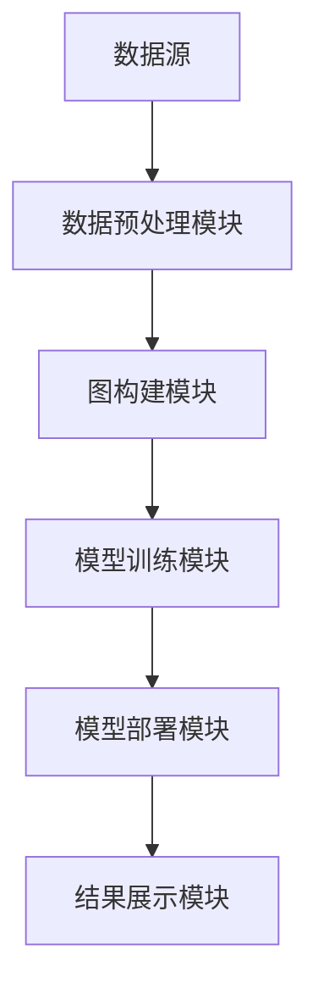

                 


# 《金融领域的图神经网络应用研究》

---

## 关键词：图神经网络，金融应用，风险评估，欺诈检测，信用评分，深度学习，图数据

---

## 摘要：  
随着人工智能和深度学习技术的快速发展，图神经网络（Graph Neural Network, GNN）在金融领域的应用逐渐成为研究热点。本文旨在探讨图神经网络在金融领域的核心问题、算法原理及其实际应用场景。通过分析图数据的特性和图神经网络的优势，本文详细介绍了图神经网络在金融风险评估、欺诈检测和信用评分等领域的具体应用，并结合实际案例深入探讨了图神经网络的系统架构设计和项目实现过程。本文还总结了图神经网络在金融领域的优势与挑战，并展望了未来的研究方向。

---

## 第1章：图神经网络与金融领域的概述

### 1.1 图神经网络的基本概念

#### 1.1.1 图论基础  
图论是研究图（Graph）的数学理论，图由节点（Vertex）和边（Edge）组成。在金融领域，图可以表示为：  
- 节点：代表客户、交易、资产等实体。  
- 边：代表节点之间的关系，如交易关系、资金流动关系等。  

#### 1.1.2 图神经网络的定义与特点  
图神经网络是一种处理图数据的深度学习模型，它通过在图结构上定义传播机制，将节点的特征信息传播到整个图中。其特点包括：  
1. **全局性**：能够捕捉图中节点的全局关系。  
2. **可解释性**：通过图结构可以直观理解节点之间的关系。  
3. **实时性**：适用于实时金融数据的处理与分析。  

#### 1.1.3 金融领域中的图数据特性  
金融领域的图数据具有以下特性：  
- **异构性**：节点和边的类型多样，如客户、交易、资产等。  
- **动态性**：金融数据随时间变化，图结构也会动态更新。  
- **稀疏性**：金融图中边的数量通常远小于节点数量的平方。  

---

### 1.2 金融领域的核心问题

#### 1.2.1 金融风险评估  
金融风险评估是衡量某一笔交易或资产的风险程度，通常涉及违约概率、信用风险等指标。图神经网络可以通过建模节点之间的关系，捕捉风险传播的路径和程度。  

#### 1.2.2 金融欺诈检测  
金融欺诈检测是识别异常交易行为，常见的欺诈手段包括信用卡欺诈、洗钱等。图神经网络可以通过分析图中的异常节点或边来检测欺诈行为。  

#### 1.2.3 信用评分与客户画像  
信用评分是根据客户的信用历史和行为特征，评估其信用风险。图神经网络可以通过客户之间的关系网络，构建客户画像并预测信用评分。  

---

### 1.3 图神经网络在金融领域的优势

#### 1.3.1 图结构数据的天然匹配  
金融数据中的客户关系、交易网络等本质上是图结构，图神经网络能够天然匹配这些数据。  

#### 1.3.2 非线性关系的建模能力  
金融数据中的关系往往是非线性的，图神经网络通过非线性激活函数能够很好地捕捉这些复杂关系。  

#### 1.3.3 实时性与可解释性的提升  
图神经网络可以实时更新图结构，适用于金融领域的实时数据分析，并且通过图结构可以直观解释结果。  

---

## 第2章：图神经网络的核心概念与原理

### 2.1 图论基础

#### 2.1.1 图的表示方法  
图可以用邻接矩阵（Adjacency Matrix）或邻接列表（Adjacency List）表示。例如，邻接矩阵$A$的元素$A_{i,j}$表示节点$i$和节点$j$之间是否有边。  

#### 2.1.2 常见的图类型  
- **无向图**：边无方向，如客户关系网络。  
- **有向图**：边有方向，如交易关系网络。  
- **加权图**：边有权重，表示关系的强弱。  

#### 2.1.3 图的遍历算法  
常用的图遍历算法包括深度优先搜索（DFS）和广度优先搜索（BFS）。  

---

### 2.2 图神经网络的基本原理

#### 2.2.1 图的特征表示  
图神经网络通过聚合邻域节点的特征，生成节点的表示向量。例如，节点$i$的表示向量可以表示为：  
$$x_i^{(l+1)} = \sigma\left(\sum_{j} A_{i,j} x_j^{(l)} W\right)$$  
其中，$x_i^{(l)}$表示节点$i$在第$l$层的特征向量，$W$是权重矩阵，$\sigma$是非线性激活函数。  

#### 2.2.2 图的传播机制  
图神经网络通过传播机制将节点的特征信息传播到整个图中。例如，在图卷积网络（GCN）中，特征信息通过图的邻接矩阵进行传播。  

#### 2.2.3 图的聚合操作  
聚合操作是图神经网络的核心步骤，常见的聚合操作包括求和、平均和最大值等。  

---

### 2.3 图神经网络的核心算法

#### 2.3.1 图卷积网络（GCN）  
图卷积网络（Graph Convolutional Network, GCN）是一种经典的图神经网络模型，其数学表达式为：  
$$y = \sum_{j} A_{ij} x_j W$$  
其中，$A$是邻接矩阵，$x_j$是节点$j$的特征向量，$W$是权重矩阵。  

#### 2.3.2 图注意力网络（GAT）  
图注意力网络（Graph Attention Network, GAT）通过引入注意力机制，捕捉节点之间的重要关系。其注意力权重计算公式为：  
$$\alpha_{i,j} = \frac{\exp(\text{score}(x_i, x_j))}{\sum_{k} \exp(\text{score}(x_i, x_k))}$$  

#### 2.3.3 图嵌入方法（如Node2Vec）  
Node2Vec是一种基于随机游走的图嵌入方法，通过训练模型生成节点的低维表示。  

---

## 第3章：图神经网络在金融领域的应用分析

### 3.1 金融风险评估中的图神经网络应用

#### 3.1.1 风险传播的建模  
金融风险可以通过图结构建模，例如将客户之间的关联关系表示为图，分析风险传播路径。  

#### 3.1.2 风险传染的路径分析  
通过图神经网络可以识别风险传染的关键路径，帮助金融机构制定风险控制策略。  

#### 3.1.3 风险评估的案例分析  
以某银行的客户信用风险评估为例，使用图神经网络建模客户之间的关联关系，预测客户违约概率。  

---

### 3.2 金融欺诈检测中的图神经网络应用

#### 3.2.1 欺诈网络的构建  
通过图结构构建欺诈网络，识别异常交易行为。  

#### 3.2.2 欺诈行为的特征提取  
提取交易金额、时间间隔等特征，结合图结构进行欺诈检测。  

#### 3.2.3 欺诈检测的模型优化  
通过调整模型参数和优化算法，提升欺诈检测的准确率和召回率。  

---

### 3.3 信用评分与客户画像中的图神经网络应用

#### 3.3.1 客户关系图的构建  
通过图结构构建客户关系图，分析客户之间的关联关系。  

#### 3.3.2 信用评分的模型设计  
使用图神经网络建模客户特征和关系，预测客户的信用评分。  

#### 3.3.3 客户画像的可视化分析  
通过图结构可视化客户画像，帮助金融机构更好地理解客户行为。  

---

## 第4章：图神经网络的系统架构与设计

### 4.1 问题场景介绍  
以某银行的信用评分系统为例，设计一个基于图神经网络的信用评分系统。  

### 4.2 系统功能设计  
系统功能包括：  
- 数据采集：采集客户信息、交易数据等。  
- 数据预处理：清洗、特征提取和图构建。  
- 模型训练：训练图神经网络模型。  
- 模型部署：将模型部署到生产环境。  

---

### 4.3 系统架构设计

#### 4.3.1 系统架构图  
以下是系统的架构图：  


#### 4.3.2 接口设计  
系统接口包括：  
- 数据接口：用于数据的导入和导出。  
- 模型接口：用于模型的训练和部署。  
- 结果接口：用于结果的展示和分析。  

---

### 4.4 本章小结  
本章详细介绍了图神经网络系统的架构设计，包括功能设计、架构图和接口设计，为后续的项目实现奠定了基础。  

---

## 第5章：图神经网络的项目实战

### 5.1 环境安装  
安装必要的库和工具，如Python、TensorFlow、Keras等。  

### 5.2 核心实现源代码  

#### 5.2.1 数据预处理代码  
```python
import pandas as pd
import numpy as np

# 读取数据
data = pd.read_csv('data.csv')
# 数据清洗
data.dropna(inplace=True)
# 特征提取
features = data[['age', 'income', 'credit_score']]
```

#### 5.2.2 图构建代码  
```python
from sklearn.manifold import TSNE

# 图构建
model = TSNE(n_components=2, random_state=42)
embedding = model.fit_transform(features)
```

#### 5.2.3 模型训练代码  
```python
import tensorflow as tf
from tensorflow.keras import layers

# 图卷积层
def graph_conv_layer(input, A, W):
    return tf.matmul(tf.matmul(A, input), W)

# 模型构建
model = tf.keras.Sequential([
    layers.InputLayer(input_shape=(n_features,)),
    layers.Dense(128, activation='relu'),
    layers.Dropout(0.5),
    layers.Dense(1, activation='sigmoid')
])
```

---

### 5.3 项目小结  
本章通过一个具体的项目案例，详细介绍了图神经网络的环境安装、数据预处理、模型训练和部署过程，帮助读者更好地理解和应用图神经网络技术。  

---

## 第6章：总结与展望

### 6.1 本章总结  
本文详细探讨了图神经网络在金融领域的应用，包括核心概念、算法原理和实际案例分析。  

### 6.2 最佳实践 Tips  
- 在金融领域中，图神经网络的应用需要结合具体的业务场景。  
- 数据预处理和特征提取是图神经网络成功的关键。  
- 模型的可解释性和实时性是金融应用的重要考量因素。  

### 6.3 未来展望  
未来，随着图神经网络技术的不断发展，其在金融领域的应用将更加广泛，例如在智能投顾、金融舆情分析等领域。  

---

## 作者：AI天才研究院/AI Genius Institute & 禅与计算机程序设计艺术 /Zen And The Art of Computer Programming  

---

**感谢您的阅读！**

