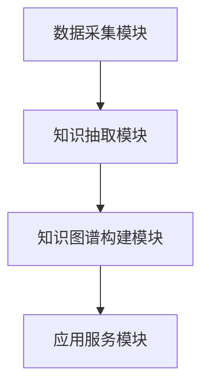
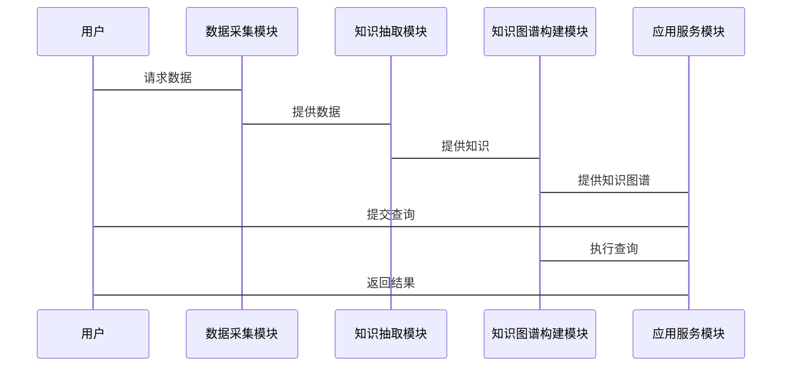

                 


# 金融领域知识图谱的构建与应用

> 关键词：知识图谱、金融、数据挖掘、机器学习、图数据库、风险管理

> 摘要：本文系统地探讨了金融领域知识图谱的构建方法及其在金融领域的应用。首先介绍了知识图谱的基本概念和核心原理，分析了金融领域构建知识图谱的背景和意义。接着详细阐述了知识图谱的构建流程，包括数据采集、预处理、知识抽取与建模、知识融合与存储等关键技术。然后，通过具体案例展示了知识图谱在金融领域的应用，如风险控制、智能投顾、监管合规等。最后，本文总结了知识图谱在金融领域的优势，并展望了未来的发展方向。

---

## 第1章 知识图谱的背景与概念

### 1.1 知识图谱的起源与发展

#### 1.1.1 知识图谱的定义与核心概念
知识图谱是一种以图结构形式表示知识的技术，通过实体（节点）和关系（边）构建语义网络。它能够将分散的数据连接起来，形成一个统一的知识网络，帮助机器理解和推理。

**核心概念：**
- **实体（Entity）**：知识图谱中的基本单元，可以是人、组织、概念等。
- **关系（Relation）**：描述实体之间的联系，如“购买”、“属于”等。
- **属性（Attribute）**：描述实体的特征，如“年龄”、“职位”等。

知识图谱的核心目标是将结构化数据和非结构化数据进行整合，构建一个可计算的、可扩展的知识网络。

#### 1.1.2 知识图谱与金融领域的结合
金融领域的数据具有高度的关联性和复杂性。传统的数据处理方式难以捕捉数据之间的隐含关系。知识图谱通过构建语义网络，能够揭示数据之间的深层联系。

**金融领域中的典型应用场景：**
1. **风险控制**：通过分析企业之间的关联关系，识别潜在的金融风险。
2. **智能投顾**：根据投资者的偏好和市场趋势，提供个性化的投资建议。
3. **监管合规**：帮助监管机构发现市场操纵、关联交易等违规行为。

#### 1.1.3 知识图谱在金融领域的应用价值
- **提升数据分析能力**：通过知识图谱，可以发现传统方法难以察觉的关联关系。
- **增强决策能力**：基于知识图谱的推理能力，提供更精准的决策支持。
- **提高效率**：通过自动化处理和智能分析，降低人工成本。

### 1.2 金融领域的知识图谱构建背景

#### 1.2.1 传统金融数据处理的局限性
传统金融数据处理主要依赖关系型数据库，难以处理复杂的关联关系和非结构化数据。例如：
- **孤立的数据孤岛**：不同部门的数据无法有效整合。
- **缺乏语义理解**：难以从文本数据中提取有用信息。
- **实时性不足**：难以应对高频交易和实时风险监控的需求。

#### 1.2.2 知识图谱在金融领域的应用需求
- **风险控制**：需要实时监控企业之间的关联关系，及时发现潜在风险。
- **智能投顾**：需要分析大量非结构化数据，提供个性化投资建议。
- **监管合规**：需要快速识别市场操纵等违法行为。

#### 1.2.3 知识图谱的技术优势与挑战
**技术优势：**
- **语义表示能力强**：能够捕捉数据之间的语义关系。
- **可扩展性高**：支持大规模数据的整合和分析。
- **支持复杂查询**：能够处理复杂的关联查询。

**技术挑战：**
- **数据质量**：金融数据的清洗和预处理成本较高。
- **知识抽取难度大**：从非结构化数据中提取知识的难度较高。
- **计算效率**：大规模知识图谱的查询效率需要优化。

### 1.3 知识图谱构建的意义与目标

#### 1.3.1 知识图谱的核心目标
知识图谱的核心目标是构建一个统一的知识网络，将分散的数据连接起来，形成一个可计算的、可扩展的知识系统。

#### 1.3.2 知识图谱在金融领域的具体应用目标
- **构建金融知识网络**：整合企业、市场、产品等信息，形成金融领域的知识网络。
- **支持智能应用**：通过知识图谱提供智能投顾、风险控制等服务。
- **提升数据分析能力**：通过知识图谱的语义理解能力，提高数据分析的深度和广度。

#### 1.3.3 知识图谱构建的边界与外延
- **边界**：知识图谱的构建需要明确数据范围和应用目标，避免过于复杂。
- **外延**：知识图谱可以通过不断扩展数据和关系，形成更大的知识网络。

---

## 第2章 知识图谱的核心概念与技术

### 2.1 知识图谱的结构与组成

#### 2.1.1 实体与属性
**实体（Entity）**是知识图谱的基本单元，可以是人、组织、概念等。**属性（Attribute）**描述实体的特征，如“年龄”、“职位”等。

**示例：**
- 实体：阿里巴巴集团
- 属性：成立时间=1999年，总部地点=杭州

#### 2.1.2 关系与语义
**关系（Relation）**描述实体之间的联系，如“购买”、“属于”等。

**示例：**
- 实体1：阿里巴巴集团
- 关系：投资
- 实体2：蚂蚁金服

#### 2.1.3 知识图谱的层次结构
知识图谱的层次结构可以分为以下三个层次：
1. **数据层**：存储原始数据。
2. **模式层**：定义数据的结构和关系。
3. **应用层**：基于知识图谱提供各种应用服务。

### 2.2 知识图谱与传统数据库的对比

#### 2.2.1 数据模型的对比
| 特性       | 知识图谱                | 传统数据库          |
|------------|------------------------|---------------------|
| 数据结构   | 图结构（节点和边）     | 行和列             |
| 关系表示   | 显式表示关系           | 隐含在表结构中       |
| 查询能力   | 支持复杂关联查询       | 不支持复杂关联查询   |

#### 2.2.2 存储方式的对比
- **知识图谱**：使用图数据库（如Neo4j）存储，支持复杂的关联关系。
- **传统数据库**：使用关系型数据库，难以处理复杂的关联关系。

#### 2.2.3 查询方式的对比
- **知识图谱**：支持语义查询，可以通过自然语言处理技术进行查询。
- **传统数据库**：只能通过SQL查询，无法处理语义关系。

### 2.3 知识图谱的构建与推理

#### 2.3.1 知识抽取与融合
**知识抽取**：从文本中提取实体、关系和属性。
**知识融合**：将多个数据源中的知识进行整合，消除冗余和冲突。

#### 2.3.2 知识推理的基本原理
知识推理是基于知识图谱中的已有知识，推导出新的知识。常见的推理方法包括：
1. **单步推理**：直接根据已有的关系进行推理。
2. **多步推理**：通过多次推理得到最终结果。

#### 2.3.3 知识图谱的动态更新
知识图谱需要根据实时数据进行动态更新，以保持知识的准确性和及时性。

### 2.4 本章小结

---

## 第3章 知识图谱的构建方法论

### 3.1 知识图谱构建的基本流程

#### 3.1.1 数据采集与预处理
**数据采集**：从多种数据源（如公开数据、爬取数据等）获取金融数据。
**数据预处理**：清洗数据，去除噪声，提取有用信息。

#### 3.1.2 知识抽取与建模
**知识抽取**：从文本中提取实体、关系和属性。
**知识建模**：将抽取的知识转化为知识图谱的结构化形式。

#### 3.1.3 知识融合与存储
**知识融合**：将多个数据源中的知识进行整合，消除冗余和冲突。
**知识存储**：将知识图谱存储到图数据库中。

### 3.2 知识抽取的技术与工具

#### 3.2.1 实体识别与链接
**实体识别**：通过自然语言处理技术识别文本中的实体。
**实体链接**：将识别出的实体映射到知识图谱中的实体。

#### 3.2.2 关系抽取与推理
**关系抽取**：从文本中抽取实体之间的关系。
**关系推理**：通过已有关系推导新的关系。

#### 3.2.3 属性抽取与扩展
**属性抽取**：从文本中抽取实体的属性。
**属性扩展**：通过知识图谱推理扩展实体的属性。

### 3.3 知识图谱的存储与管理

#### 3.3.1 图数据库的选择与使用
常见的图数据库包括Neo4j、GraphDB等。选择图数据库时需要考虑数据规模、查询效率等因素。

#### 3.3.2 知识图谱的索引与查询优化
**索引优化**：通过建立索引提高查询效率。
**查询优化**：通过优化查询语句提高查询效率。

#### 3.3.3 知识图谱的版本控制与更新
**版本控制**：记录知识图谱的变化历史，方便回滚。
**动态更新**：实时更新知识图谱，保持知识的准确性和及时性。

### 3.4 本章小结

---

## 第4章 金融领域知识图谱的构建实践

### 4.1 金融领域的数据特点

#### 4.1.1 金融数据的多样性与复杂性
金融数据包括股票、债券、基金等多种类型，数据来源多样，结构复杂。

#### 4.1.2 金融数据的关联性与依赖性
金融数据之间存在复杂的关联关系，如企业之间的投资关系、市场趋势对企业的影响等。

#### 4.1.3 金融数据的实时性与动态性
金融数据需要实时更新，以反映市场的最新动态。

### 4.2 金融知识图谱的构建流程

#### 4.2.1 数据源的选择与整合
**数据源**：包括公开数据（如公司财报）、爬取数据（如新闻、社交媒体）等。
**数据整合**：将多个数据源中的数据整合到一个统一的数据集中。

#### 4.2.2 知识抽取与实体识别
**实体识别**：从文本中识别出公司名称、人物等实体。
**关系抽取**：识别出实体之间的关系，如“投资”、“控股”等。

#### 4.2.3 知识图谱的构建与优化
**知识构建**：将抽取的知识转化为知识图谱的结构化形式。
**知识优化**：通过去重、合并等方式优化知识图谱的质量。

### 4.3 金融知识图谱的案例分析

#### 4.3.1 风险控制领域的知识图谱构建
**案例背景**：通过构建企业之间的投资关系图，识别潜在的关联风险。
**实现步骤**：
1. 收集企业财报数据和新闻数据。
2. 从文本中抽取企业之间的投资关系。
3. 构建企业关系图，分析企业的关联风险。

#### 4.3.2 智能投顾领域的知识图谱构建
**案例背景**：通过分析市场趋势和企业基本面，为投资者提供个性化投资建议。
**实现步骤**：
1. 收集市场数据和企业数据。
2. 构建企业基本面知识图谱。
3. 基于知识图谱提供智能投顾服务。

---

## 第5章 知识图谱的系统设计与架构方案

### 5.1 系统架构设计

#### 5.1.1 系统功能设计
**功能模块**：
1. 数据采集模块：负责数据的采集和预处理。
2. 知识抽取模块：负责从文本中抽取实体、关系和属性。
3. 知识图谱构建模块：负责知识图谱的构建和优化。
4. 应用服务模块：基于知识图谱提供各种应用服务。

#### 5.1.2 系统架构图


### 5.2 系统接口设计

#### 5.2.1 数据接口
**输入接口**：接收外部数据源的数据。
**输出接口**：将处理后的数据输出到知识图谱构建模块。

#### 5.2.2 查询接口
**查询接口**：提供基于知识图谱的查询服务，支持复杂关联查询。

### 5.3 系统交互流程

#### 5.3.1 系统交互序列图


---

## 第6章 项目实战：金融知识图谱的构建与应用

### 6.1 环境搭建

#### 6.1.1 系统环境
- 操作系统：Linux/Windows/MacOS
- 开发工具：Python、Jupyter Notebook
- 数据库：Neo4j图数据库

#### 6.1.2 安装依赖
```bash
pip install neo4j requests networkx
```

### 6.2 系统核心实现

#### 6.2.1 数据采集与预处理
```python
import requests

url = "https://api.example.com/financial_data"
response = requests.get(url)
data = response.json()
```

#### 6.2.2 知识抽取与建模
```python
from networkx import DiGraph

# 创建图结构
graph = DiGraph()

# 添加节点
graph.add_node("公司A")
graph.add_node("公司B")

# 添加边
graph.add_edge("公司A", "公司B", label="投资")
```

#### 6.2.3 知识图谱的存储与管理
```python
from neo4j import GraphDatabase

# 连接到Neo4j数据库
driver = GraphDatabase.driver("bolt://localhost:7687", auth=("user", "password"))

# 插入数据
with driver.session() as session:
    session.run("CREATE (a:Company {name: '公司A'})")
    session.run("CREATE (b:Company {name: '公司B'})")
    session.run("MATCH (a {name: '公司A'}), (b {name: '公司B'}) CREATE (a)-[r:INVEST]->(b)")
```

### 6.3 项目小结

---

## 第7章 未来展望与最佳实践

### 7.1 知识图谱在金融领域的未来趋势

#### 7.1.1 数据隐私与安全
随着数据隐私法规的日益严格，知识图谱需要更加注重数据隐私和安全。

#### 7.1.2 计算效率的提升
随着数据规模的不断扩大，知识图谱的构建和查询效率需要进一步提升。

#### 7.1.3 新兴技术的融合
知识图谱将与人工智能、大数据等新兴技术深度融合，推动金融领域的智能化发展。

### 7.2 最佳实践 Tips

#### 7.2.1 数据质量管理
- 确保数据的准确性和完整性。
- 定期更新数据，保持知识图谱的时效性。

#### 7.2.2 知识图谱的可视化
- 使用图数据库自带的可视化工具（如Neo4j的Cypher-shell）进行图谱的可视化。
- 使用第三方工具（如Gephi）进行更复杂的图谱分析和展示。

#### 7.2.3 知识图谱的持续优化
- 定期评估知识图谱的质量，发现并修复问题。
- 根据业务需求，动态调整知识图谱的结构和内容。

### 7.3 本章小结

---

## 作者

**作者：** AI天才研究院/AI Genius Institute & 禅与计算机程序设计艺术/Zen And The Art of Computer Programming

