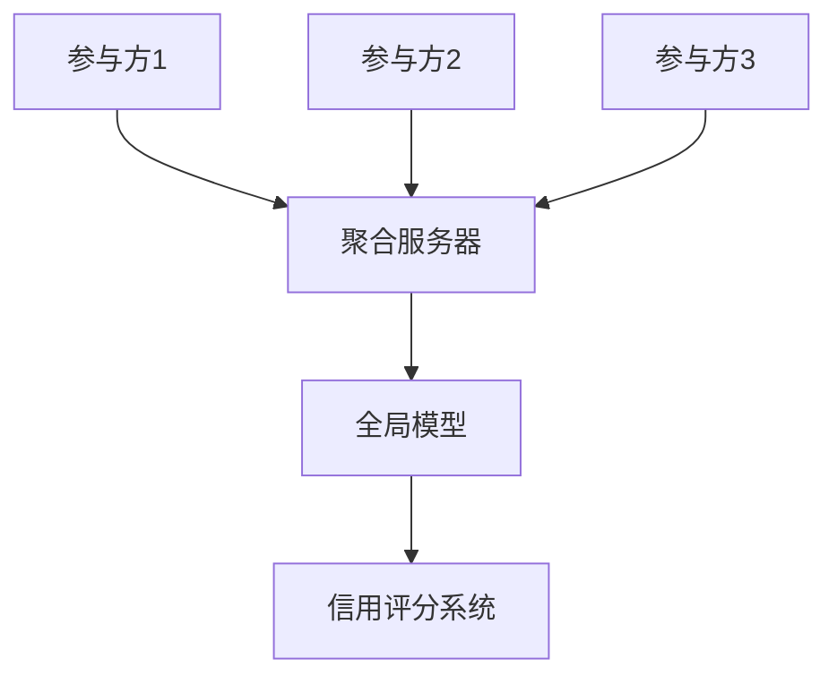
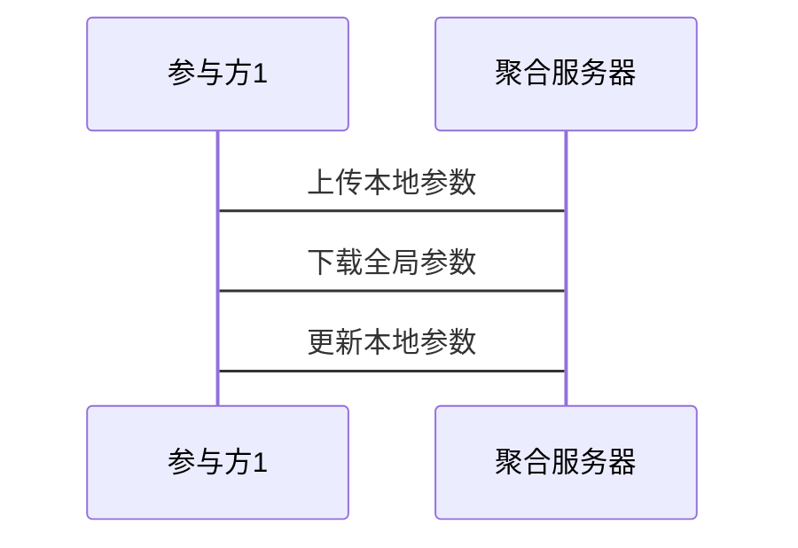

                 


# 《金融领域联邦学习在跨机构信用评分与风险管理中的应用》

## 关键词：联邦学习, 金融, 信用评分, 风险管理, 数据隐私, 机器学习, 跨机构合作

## 摘要：  
本文深入探讨了联邦学习在金融领域中的应用，特别是在跨机构信用评分与风险管理中的创新实践。文章从联邦学习的基本概念出发，分析其在信用评分和风险管理中的独特优势，结合实际案例，详细阐述了联邦学习在金融领域的技术实现、系统架构及最佳实践。通过本文，读者可以全面了解联邦学习在金融领域的潜力与挑战，掌握其在信用评分与风险管理中的具体应用场景。

---

# 第1章: 联邦学习与金融应用概述

## 1.1 联邦学习的基本概念

### 1.1.1 联邦学习的定义

联邦学习（Federated Learning）是一种分布式机器学习技术，允许多个参与方在不共享原始数据的情况下， collaboratively training a shared model。其核心思想是通过在各个参与方之间交换模型参数，而不是交换原始数据，从而实现模型的联合训练。

### 1.1.2 联邦学习的特点

- **数据隐私性**：参与方无需共享原始数据，仅需交换模型参数。
- **分布式计算**：模型训练可以在多个分布式节点上进行，无需集中数据。
- **可扩展性**：适用于大规模数据和多机构合作的场景。
- **灵活性**：支持多种机器学习算法和模型架构。

### 1.1.3 联邦学习在金融中的应用价值

- **数据隐私保护**：在金融领域，数据隐私是重中之重，联邦学习能够有效保护各机构的数据安全。
- **跨机构合作**：通过联邦学习，不同金融机构可以联合训练模型，提升信用评分和风险管理的准确性。
- **模型性能提升**：联邦学习可以利用多机构的数据优势，提升模型的泛化能力和预测精度。

## 1.2 信用评分与风险管理的背景

### 1.2.1 信用评分的基本概念

信用评分是金融机构评估客户信用风险的重要工具，通常基于客户的财务状况、信用历史和行为数据等因素进行评分。

### 1.2.2 风险管理的重要性

风险管理是金融机构的核心任务之一，旨在通过识别、评估和控制风险，确保机构的稳健运行。

### 1.2.3 跨机构信用评分的挑战

- **数据孤岛问题**：不同金融机构的数据通常分散在各自的系统中，难以形成合力。
- **数据隐私保护**：各机构的客户数据属于敏感信息，不能随意共享。
- **模型泛化能力**：单一机构的数据量有限，模型的泛化能力可能不足。

## 1.3 联邦学习在信用评分中的应用前景

### 1.3.1 联邦学习的优势

- **数据隐私保护**：联邦学习通过局部建模和参数聚合，避免了原始数据的共享。
- **数据多样性**：跨机构合作可以利用多样化的数据源，提升模型的泛化能力。
- **实时性**：联邦学习支持在线模型更新，能够实时捕捉信用评分的变化。

### 1.3.2 联邦学习在信用评分中的潜在应用

- **联合建模**：各机构联合训练信用评分模型，提升模型的预测精度。
- **实时风险评估**：通过联邦学习，金融机构可以实时更新模型，及时识别风险。
- **个性化服务**：基于联邦学习的信用评分模型，金融机构可以为客户提供个性化的金融服务。

### 1.3.3 联邦学习面临的挑战

- **通信成本**：联邦学习需要频繁的通信，可能导致较高的计算和通信成本。
- **模型收敛性**：不同机构的数据分布可能不一致，导致模型收敛困难。
- **安全性与隐私保护**：需要确保联邦学习过程中的数据安全和隐私保护。

## 1.4 本章小结

本章从联邦学习的基本概念出发，分析了其在金融领域中的应用价值，特别是信用评分和风险管理中的潜力。同时，也探讨了联邦学习在跨机构合作中面临的挑战，为后续章节的深入分析奠定了基础。

---

# 第2章: 联邦学习的核心概念与原理

## 2.1 联邦学习的原理

### 2.1.1 联邦学习的基本流程

1. **初始化**：各参与方初始化本地模型参数。
2. **局部训练**：各参与方在本地数据上训练模型，更新本地参数。
3. **参数聚合**：各参与方将本地模型参数上传到聚合服务器，聚合服务器对各参与方的参数进行加权平均，生成全局模型参数。
4. **模型更新**：各参与方下载全局模型参数，更新本地模型。
5. **循环迭代**：重复局部训练和参数聚合，直到模型收敛或达到预设的训练次数。

### 2.1.2 联邦学习的通信机制

- **同步通信**：所有参与方同时进行训练，并定期交换模型参数。
- **异步通信**：参与方可以异步更新模型参数，减少通信开销。

### 2.1.3 联邦学习的隐私保护机制

- **差分隐私**：通过在模型参数中添加噪声，保护参与方的原始数据不被推断。
- **加密计算**：利用加密技术保护模型参数的传输安全。

## 2.2 联邦学习的关键技术

### 2.2.1 加密计算

- **同态加密**：允许在加密数据上进行计算，确保数据隐私。
- **多方计算**：通过秘密共享技术，使多个参与方能够在不泄露各自数据的情况下进行计算。

### 2.2.2 模型聚合

- **加权平均**：根据各参与方的数据量或模型性能，对模型参数进行加权平均。
- **联邦平均**：一种基于加权平均的模型聚合方法，适用于异构数据分布的场景。

### 2.2.3 数据安全与隐私保护

- **数据脱敏**：对敏感数据进行匿名化处理，降低数据泄露风险。
- **访问控制**：通过权限管理，限制数据的访问范围。

## 2.3 联邦学习与传统机器学习的对比

### 2.3.1 数据使用方式的对比

- **传统机器学习**：需要集中所有数据进行训练。
- **联邦学习**：通过模型参数的交换，实现分布式训练。

### 2.3.2 模型训练方式的对比

- **传统机器学习**：单机构或集中式训练。
- **联邦学习**：多机构联合训练，保护数据隐私。

### 2.3.3 隐私保护机制的对比

- **传统机器学习**：数据隐私保护依赖于数据存储的安全性。
- **联邦学习**：通过加密和差分隐私等技术，保护数据隐私。

## 2.4 本章小结

本章详细介绍了联邦学习的核心概念和原理，包括其基本流程、通信机制、隐私保护技术以及与传统机器学习的对比。这些内容为后续章节在金融领域的具体应用奠定了理论基础。

---

# 第3章: 联邦学习的算法原理

## 3.1 联邦学习的数学模型

### 3.1.1 模型表示

假设我们有一个分类任务，目标是通过客户特征 \(x\) 预测其信用评分 \(y\)。联邦学习的目标是通过多个参与方联合训练一个全局模型 \(f(x; \theta)\)，其中 \(\theta\) 是模型参数。

### 3.1.2 模型聚合

假设我们有 \(K\) 个参与方，每个参与方 \(k\) 有一个本地模型参数 \(\theta_k\)。全局模型参数 \(\theta\) 是通过将所有参与方的参数进行加权平均得到：

$$
\theta = \sum_{k=1}^{K} w_k \theta_k
$$

其中 \(w_k\) 是参与方 \(k\) 的权重，通常与数据量或模型性能相关。

### 3.1.3 模型更新

每个参与方在本地数据上训练模型，更新本地参数：

$$
\theta_k^{(t+1)} = \theta_k^{(t)} - \eta \nabla L_k(\theta_k^{(t)})
$$

其中 \(\eta\) 是学习率，\(L_k(\theta_k)\) 是参与方 \(k\) 的损失函数。

## 3.2 联邦学习的通信协议

### 3.2.1 基于加密的通信协议

参与方之间的通信可以通过加密技术（如同态加密）进行保护，确保模型参数的安全传输。

### 3.2.2 基于差分隐私的通信协议

在模型聚合过程中，可以通过添加噪声来保护参与方的原始数据不被推断。

### 3.2.3 基于多方计算的通信协议

通过秘密共享技术，使多个参与方能够在不泄露各自数据的情况下进行计算。

## 3.3 联邦学习的算法实现

### 3.3.1 算法流程

1. **初始化**：各参与方初始化本地模型参数 \(\theta_k\)。
2. **局部训练**：各参与方在本地数据上训练模型，更新本地参数。
3. **参数聚合**：将所有参与方的参数上传到聚合服务器，进行加权平均，生成全局模型参数 \(\theta\)。
4. **模型更新**：各参与方下载全局模型参数，更新本地模型。
5. **循环迭代**：重复局部训练和参数聚合，直到模型收敛或达到预设的训练次数。

### 3.3.2 算法实现代码

```python
import numpy as np
from sklearn.linear_model import LogisticRegression

# 初始化模型参数
theta = np.zeros((1, 10))

# 局部训练
for _ in range(10):
    # 生成本地数据
    X, y = generate_data()
    # 训练模型
    model = LogisticRegression()
    model.fit(X, y)
    # 更新本地参数
    theta = model.coef_
    # 聚合模型参数
    global_theta = aggregate(theta)
    # 更新全局模型
    global_model = LogisticRegression()
    global_model.fit(X, y)

# 返回最终模型
return global_model
```

## 3.4 本章小结

本章详细介绍了联邦学习的数学模型和算法原理，包括模型表示、通信协议和算法实现。这些内容为后续章节在信用评分中的应用提供了技术基础。

---

# 第4章: 联邦学习在信用评分中的应用

## 4.1 跨机构信用评分的挑战

### 4.1.1 数据孤岛问题

不同金融机构的数据通常分散在各自的系统中，难以形成合力。

### 4.1.2 数据隐私保护

客户数据属于敏感信息，不能随意共享。

### 4.1.3 模型泛化能力

单一机构的数据量有限，模型的泛化能力可能不足。

## 4.2 联邦学习在信用评分中的解决方案

### 4.2.1 联邦学习的优势

- **数据隐私保护**：通过局部建模和参数聚合，避免了原始数据的共享。
- **数据多样性**：跨机构合作可以利用多样化的数据源，提升模型的泛化能力。
- **实时性**：联邦学习支持在线模型更新，能够实时捕捉信用评分的变化。

### 4.2.2 联邦学习的具体应用

- **联合建模**：各机构联合训练信用评分模型，提升模型的预测精度。
- **实时风险评估**：通过联邦学习，金融机构可以实时更新模型，及时识别风险。
- **个性化服务**：基于联邦学习的信用评分模型，金融机构可以为客户提供个性化的金融服务。

## 4.3 联邦学习在信用评分中的实际案例

### 4.3.1 案例背景

假设我们有三家金融机构，分别拥有各自的客户数据，希望联合训练一个信用评分模型。

### 4.3.2 案例分析

1. **数据准备**：三家机构分别准备客户数据，包括财务状况、信用历史和行为数据等因素。
2. **模型训练**：各机构在本地数据上训练信用评分模型，更新本地参数。
3. **参数聚合**：将所有参与方的参数上传到聚合服务器，进行加权平均，生成全局模型参数。
4. **模型更新**：各参与方下载全局模型参数，更新本地模型。
5. **循环迭代**：重复局部训练和参数聚合，直到模型收敛或达到预设的训练次数。

### 4.3.3 案例结果

通过联邦学习，三家机构联合训练了一个高性能的信用评分模型，准确率显著提高，同时有效保护了数据隐私。

## 4.4 本章小结

本章详细介绍了联邦学习在信用评分中的具体应用，包括其优势、解决方案和实际案例。通过这些内容，读者可以更好地理解联邦学习在金融领域的实际价值。

---

# 第5章: 联邦学习的系统架构与实现

## 5.1 系统架构设计

### 5.1.1 系统功能设计

- **数据准备**：各参与方准备本地数据，进行数据清洗和预处理。
- **模型训练**：各参与方在本地数据上训练模型，更新本地参数。
- **参数聚合**：将所有参与方的参数上传到聚合服务器，进行加权平均，生成全局模型参数。
- **模型更新**：各参与方下载全局模型参数，更新本地模型。

### 5.1.2 系统架构图



### 5.1.3 系统接口设计

- **数据接口**：提供数据导入、数据清洗和预处理的功能。
- **模型接口**：提供模型训练、参数聚合和模型更新的功能。
- **通信接口**：提供参与方之间的通信功能，包括参数上传和下载。

### 5.1.4 系统交互流程图



## 5.2 系统实现细节

### 5.2.1 数据准备

```python
import pandas as pd

# 读取本地数据
data = pd.read_csv('local_data.csv')
# 数据清洗
data = data.dropna()
# 数据预处理
data = pd.get_dummies(data)
```

### 5.2.2 模型训练

```python
from sklearn.linear_model import LogisticRegression

# 初始化模型
model = LogisticRegression()
# 训练模型
model.fit(data[['特征1', '特征2', '特征3']], data['信用评分'])
# 获取模型参数
theta = model.coef_
```

### 5.2.3 参数聚合

```python
import numpy as np

# 假设有两个参与方
theta1 = np.array([0.1, 0.2, 0.3])
theta2 = np.array([0.4, 0.5, 0.6])

# 加权平均
weight1 = 0.5
weight2 = 0.5

global_theta = weight1 * theta1 + weight2 * theta2
```

### 5.2.4 模型更新

```python
# 更新本地模型
model.theta = global_theta
# 重新训练模型
model.fit(data[['特征1', '特征2', '特征3']], data['信用评分'])
```

## 5.3 系统实现小结

本章详细介绍了联邦学习系统的架构设计和实现细节，包括数据准备、模型训练、参数聚合和模型更新的具体步骤。这些内容为后续章节的项目实战奠定了基础。

---

# 第6章: 联邦学习的项目实战

## 6.1 项目背景

### 6.1.1 项目目标

通过联邦学习技术，联合多家金融机构训练一个高性能的信用评分模型。

### 6.1.2 项目需求

- **数据隐私保护**：确保各机构的数据不被泄露。
- **模型性能提升**：通过联合训练，提升信用评分模型的准确率。

## 6.2 项目实施

### 6.2.1 环境安装

```bash
pip install numpy pandas scikit-learn
```

### 6.2.2 核心代码实现

```python
import numpy as np
from sklearn.linear_model import LogisticRegression

def train_model(X, y):
    model = LogisticRegression()
    model.fit(X, y)
    return model.coef_

def aggregate_local_weights(weights, global_weights, alpha=0.1):
    global_weights = global_weights + alpha * (weights - global_weights)
    return global_weights

# 初始化全局模型参数
global_weights = np.zeros((1, 10))

# 循环迭代训练
for _ in range(10):
    # 各参与方本地训练
    local_weights = [train_model(X_i, y_i) for X_i, y_i in zip(local_Xs, local_ys)]
    # 参数聚合
    global_weights = aggregate_local_weights(local_weights, global_weights)
    # 更新本地模型
    for i in range(len(local_Xs)):
        train_model(local_Xs[i], local_ys[i])
```

### 6.2.3 代码解读与分析

- **train_model**：在本地数据上训练模型，返回模型参数。
- **aggregate_local_weights**：对各参与方的参数进行加权平均，生成全局模型参数。
- **主训练循环**：重复局部训练和参数聚合，直到模型收敛或达到预设的训练次数。

## 6.3 项目小结

本章通过一个实际的项目案例，详细介绍了联邦学习的实施过程，包括环境安装、核心代码实现和项目小结。这些内容为读者提供了宝贵的实战经验。

---

# 第7章: 联邦学习的最佳实践与未来展望

## 7.1 本章小结

- **联邦学习的优势**：数据隐私保护、跨机构合作、模型性能提升。
- **联邦学习的挑战**：通信成本、模型收敛性、安全性与隐私保护。

## 7.2 注意事项

- **数据质量**：确保各参与方的数据质量，避免噪声数据影响模型性能。
- **模型评估**：在实际应用中，需要对模型的性能进行持续监控和评估。
- **隐私保护**：在联邦学习过程中，必须严格遵守数据隐私保护的相关法律法规。

## 7.3 拓展阅读

- **推荐书籍**：《Federated Learning: Challenges, Methods, and Future Directions》
- **推荐论文**：《Communication-Efficient Learning of Linear Models with Differential Privacy》
- **推荐博客**：[链接](#)

---

# 作者信息

作者：AI天才研究院/AI Genius Institute & 禅与计算机程序设计艺术 /Zen And The Art of Computer Programming

---

# 附录

## 附录A: 联邦学习相关术语表

- **联邦学习（Federated Learning）**：分布式机器学习技术，允许多个参与方在不共享原始数据的情况下联合训练模型。
- **差分隐私（Differential Privacy）**：一种数据隐私保护技术，通过在数据中添加噪声，防止数据被推断。
- **多方计算（Multi-Party Computation）**：一种加密计算技术，使多个参与方能够在不泄露各自数据的情况下进行计算。

## 附录B: 联邦学习相关工具与库

- **TensorFlow Federated**：Google开源的联邦学习框架，支持多种联邦学习算法和通信协议。
- **PyTorch Federated**：基于PyTorch的联邦学习框架，提供灵活的定制化选项。
- **OpenMined**：一个开源的隐私保护机器学习框架，支持联邦学习和多方计算。

---

# 结束语

感谢您的阅读！希望本文能为您提供关于联邦学习在金融领域应用的深刻见解，并为您的信用评分与风险管理实践提供有价值的参考。如需进一步探讨或获取更多资料，请随时与我联系。

