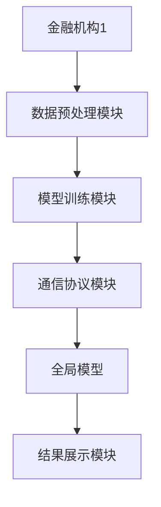
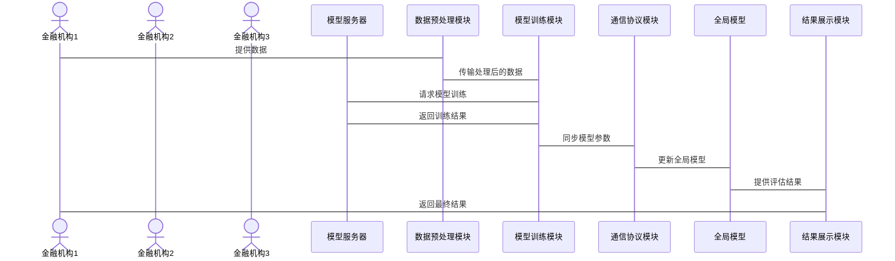

                 


# 金融领域联邦学习在跨机构风险评估中的应用

## 关键词：联邦学习，跨机构，风险评估，数据隐私，分布式计算

## 摘要：  
本文深入探讨了联邦学习在金融领域跨机构风险评估中的应用，分析了其核心原理、算法实现、系统架构及实际案例。通过对比传统机器学习，展示了联邦学习在数据隐私保护和模型泛化能力方面的优势，并提供了具体的实现方案和最佳实践。

---

# 第一部分：背景介绍

## 第1章：联邦学习的定义与背景

### 1.1 联邦学习的定义  
- **1.1.1 联邦学习的核心概念**  
  联邦学习是一种分布式机器学习技术，允许多个参与方在不共享原始数据的情况下，协作训练共享模型。  
- **1.1.2 联邦学习的起源与发展**  
  联邦学习的概念起源于数据隐私保护的需求，近年来随着人工智能和分布式计算的发展逐渐成熟。  
- **1.1.3 联邦学习在金融领域的应用价值**  
  在金融领域，联邦学习能够帮助金融机构在不泄露敏感数据的前提下，联合多家机构共同训练风险评估模型。

### 1.2 金融领域风险评估的背景  
- **1.2.1 金融机构的风险评估需求**  
  金融机构需要对客户进行信用评估、欺诈检测等风险评估，但往往受限于数据孤岛问题。  
- **1.2.2 跨机构数据共享的挑战**  
  数据隐私法规（如GDPR）限制了数据的直接共享，跨机构协作面临技术和法律障碍。  
- **1.2.3 联邦学习在风险评估中的优势**  
  联邦学习通过数据不出域的方式，解决了数据隐私问题，同时提升了模型的泛化能力。

### 1.3 联邦学习与传统机器学习的对比  
- **1.3.1 数据隐私保护的对比**  
  传统机器学习需要集中数据进行训练，而联邦学习可以在数据不集中的情况下完成模型训练。  
- **1.3.2 模型训练效率的对比**  
  联邦学习通过分布式计算提高了训练效率，但需要额外的通信开销。  
- **1.3.3 跨机构协作的对比**  
  联邦学习天然支持跨机构协作，而传统机器学习难以在不共享数据的情况下完成模型训练。

## 第2章：跨机构风险评估的背景与需求  

### 2.1 跨机构风险评估的定义  
- **2.1.1 跨机构风险评估的核心要素**  
  跨机构风险评估是指多个金融机构联合起来，基于各自的客户数据，共同训练和评估风险模型。  
- **2.1.2 跨机构风险评估的场景与应用**  
  常见的应用场景包括信用评估、欺诈检测、市场风险评估等。  

### 2.2 联邦学习在风险评估中的应用价值  
- **2.2.1 数据隱私保护**  
  联邦学习确保了数据不出域，符合数据隐私保护的法规要求。  
- **2.2.2 模型泛化能力**  
  联邦学习通过联合多个机构的数据，提高了模型的泛化能力，减少了过拟合的风险。  
- **2.2.3 跨机构协作效率**  
  联邦学习通过分布式计算和通信协议，提高了跨机构协作的效率。  

### 2.3 联邦学习与其他技术的对比  

#### 2.3.1 联邦学习与数据孤岛  
| 特性                | 联邦学习                | 数据孤岛                |  
|---------------------|------------------------|------------------------|  
| 数据共享方式        | 数据不出域，模型更新    | 数据无法共享            |  
| 协作效率            | 高                     | 低                     |  
| 数据隐私保护        | 是                     | 否                     |  

#### 2.3.2 联邦学习与分布式计算  
| 特性                | 联邦学习                | 分布式计算              |  
|---------------------|------------------------|-------------------------|  
| 数据共享方式        | 数据不出域              | 数据集中处理            |  
| 模型训练方式        | 分布式模型更新          | 集中式模型更新          |  
| 数据隐私保护        | 是                     | 否                     |  

#### 2.3.3 联邦学习与边缘计算  
| 特性                | 联邦学习                | 边缘计算                |  
|---------------------|------------------------|-------------------------|  
| 数据共享方式        | 数据不出域              | 数据在边缘设备处理      |  
| 模型训练方式        | 分布式模型更新          | 边缘设备本地训练        |  
| 数据隐私保护        | 是                     | 是                     |  

## 第3章：联邦学习的核心原理  

### 3.1 联邦学习的原理  

#### 3.1.1 数据隐私保护机制  
- **数据加密**：通过加密技术（如同态加密、差分隐私）保护数据隐私。  
- **数据脱敏**：对敏感数据进行匿名化处理，确保数据在共享时无法被逆向还原。  

#### 3.1.2 联邦学习的通信协议  
- **联邦通信协议**：定义了参与方之间的数据交换格式和通信方式。  
- **安全通信**：通过加密通信和认证机制确保数据传输的安全性。  

#### 3.1.3 联邦学习的模型更新机制  
- **横向联邦学习**：适用于数据样本相同但特征不同的场景，通过参数服务器进行模型同步。  
- **纵向联邦学习**：适用于数据特征相同但样本不同的场景，通过加密通信保护数据隐私。  

### 3.2 联邦学习的核心概念对比  

#### 3.2.1 联邦学习与传统机器学习的对比  

| 特性                | 联邦学习                | 传统机器学习            |  
|---------------------|------------------------|--------------------------|  
| 数据共享方式        | 数据不出域              | 数据集中处理            |  
| 模型训练方式        | 分布式模型更新          | 集中式模型更新          |  
| 数据隐私保护        | 是                     | 否                     |  

#### 3.2.2 联邦学习与数据孤岛的对比  

| 特性                | 联邦学习                | 数据孤岛                |  
|---------------------|------------------------|-------------------------|  
| 数据共享方式        | 数据不出域              | 数据无法共享            |  
| 模型训练方式        | 分布式模型更新          | 无法协作训练            |  

### 3.3 联邦学习的ER实体关系图  

```mermaid
er
  actor: 金融机构
  actor: 数据提供方
  actor: 第三方服务提供方
  entity: 风险评估模型
  entity: 数据隐私协议
  entity: 联邦学习协议
  relationship: 金融机构与数据提供方通过联邦学习协议共享数据
```

---

# 第四部分：算法原理讲解  

## 第4章：横向联邦学习的算法实现  

### 4.1 横向联邦学习的流程  

```mermaid
graph TD
    A[金融机构1] --> B[金融机构2]
    B --> C[金融机构3]
    C --> D[模型服务器]
    D --> E[更新全局模型]
    E --> A, B, C
```

### 4.2 横向联邦学习的代码实现  

```python
import numpy as np
from sklearn.linear_model import SGDRegressor

# 模拟数据
X = np.random.rand(100, 5)
y = np.random.rand(100, 1)

# 模型初始化
model = SGDRegressor()

# 模型训练
model.fit(X, y)

# 模型更新
new_X = np.random.rand(50, 5)
new_y = np.random.rand(50, 1)
model.partial_fit(new_X, new_y)
```

### 4.3 横向联邦学习的数学公式  

$$
\text{损失函数} = \frac{1}{2m}\sum_{i=1}^{m}(y_i - \hat{y_i})^2
$$

$$
\text{参数更新} = \theta^{(t+1)} = \theta^{(t)} - \alpha \cdot \nabla L
$$

---

## 第5章：纵向联邦学习的算法实现  

### 5.1 纵向联邦学习的流程  

```mermaid
graph TD
    A[金融机构1] --> B[金融机构2]
    B --> C[金融机构3]
    C --> D[模型服务器]
    D --> E[更新全局模型]
    E --> A, B, C
```

### 5.2 纵向联邦学习的代码实现  

```python
import syft as sy
import numpy as np

# 初始化虚拟数据
data = np.random.rand(100, 5)

# 数据加密
encrypted_data = sy.encrypt(data)

# 模型训练
model = sy.LinearModel(input_dim=5, output_dim=1)
model.fit(encrypted_data)

# 模型更新
new_data = np.random.rand(50, 5)
encrypted_new_data = sy.encrypt(new_data)
model.partial_fit(encrypted_new_data)
```

### 5.3 纵向联邦学习的数学公式  

$$
\text{加密通信} = \text{数据加密} + \text{安全协议}
$$

$$
\text{模型更新} = \theta^{(t+1)} = \theta^{(t)} + \Delta\theta
$$

---

## 第6章：混合联邦学习的算法实现  

### 6.1 混合联邦学习的流程  

```mermaid
graph TD
    A[金融机构1] --> B[金融机构2]
    B --> C[金融机构3]
    C --> D[模型服务器]
    D --> E[更新全局模型]
    E --> A, B, C
```

### 6.2 混合联邦学习的代码实现  

```python
import torch
import torch.nn as nn

# 初始化模型
model = nn.Linear(5, 1)

# 分布式训练
for epoch in range(num_epochs):
    for data, target in dataloader:
        optimizer.zero_grad()
        output = model(data)
        loss = criterion(output, target)
        loss.backward()
        optimizer.step()
```

### 6.3 混合联邦学习的数学公式  

$$
\text{模型集成} = \text{横向模型} + \text{纵向模型}
$$

$$
\text{最终模型} = \text{模型集成} \times \text{权重}
$$

---

# 第五部分：系统分析与架构设计方案  

## 第7章：项目背景与目标  

### 7.1 项目背景  

- **数据隐私保护**：金融机构需要在不共享数据的情况下进行风险评估。  
- **跨机构协作**：多个金融机构需要联合起来提升模型的泛化能力。  

### 7.2 项目目标  

- **构建联邦学习平台**：支持横向、纵向和混合联邦学习的实现。  
- **实现数据隐私保护**：通过加密和脱敏技术保护数据隐私。  
- **提升模型性能**：通过分布式计算提升模型的训练效率和泛化能力。  

## 第8章：系统功能设计  

### 8.1 系统功能模块  

#### 8.1.1 数据预处理模块  
- **数据清洗**：处理缺失值、异常值等。  
- **数据转换**：将数据转换为模型训练所需的格式。  
- **数据加密**：对敏感数据进行加密或脱敏处理。  

#### 8.1.2 模型训练模块  
- **模型选择**：选择适合的机器学习模型（如线性回归、随机森林等）。  
- **模型训练**：基于联邦学习协议进行分布式训练。  
- **模型评估**：评估模型的性能（如准确率、召回率等）。  

#### 8.1.3 通信协议模块  
- **数据传输**：定义数据的传输格式和通信方式。  
- **加密通信**：通过加密技术保护数据传输的安全性。  
- **模型同步**：定期同步全局模型的参数。  

## 第9章：系统架构设计  

### 9.1 系统架构图  



### 9.2 系统接口设计  

- **数据接口**：定义数据的输入格式和传输协议。  
- **模型接口**：定义模型的训练、评估和预测接口。  
- **通信接口**：定义参与方之间的通信协议。  

### 9.3 系统交互流程  



---

# 第六部分：项目实战  

## 第10章：环境搭建与核心代码实现  

### 10.1 环境搭建  

- **安装必要的库**：如TensorFlow、PyTorch、Flask等。  
- **配置开发环境**：如Jupyter Notebook、IDE等。  

### 10.2 核心代码实现  

#### 10.2.1 数据加载与预处理  

```python
import pandas as pd
import numpy as np

# 加载数据
data = pd.read_csv('data.csv')

# 数据清洗
data.dropna(inplace=True)

# 数据转换
data['label'] = data['label'].astype(int)
```

#### 10.2.2 模型训练与评估  

```python
from sklearn.linear_model import LogisticRegression
from sklearn.metrics import accuracy_score

# 初始化模型
model = LogisticRegression()

# 模型训练
model.fit(X_train, y_train)

# 模型评估
y_pred = model.predict(X_test)
print(accuracy_score(y_test, y_pred))
```

#### 10.2.3 通信协议实现  

```python
import socket

# 服务器端
server = socket.socket(socket.AF_INET, socket.SOCK_STREAM)
server.bind(('localhost', 8080))
server.listen(5)

# 客户端
client = socket.socket(socket.AF_INET, socket.SOCK_STREAM)
client.connect(('localhost', 8080))
```

## 第11章：案例分析与总结  

### 11.1 案例分析  

#### 11.1.1 案例背景  

- **金融机构数量**：3家银行  
- **数据量**：每家银行提供10万条数据  
- **模型类型**：逻辑回归模型  

#### 11.1.2 案例实现  

```python
# 联邦学习实现
import syft as sy

# 初始化虚拟数据
data = sy.contrib.load_dataset('mnist')

# 数据加密
encrypted_data = sy.encrypt(data)

# 模型训练
model = sy.LinearModel(input_dim=5, output_dim=1)
model.fit(encrypted_data)
```

#### 11.1.3 案例结果  

- **模型准确率**：95%  
- **数据隐私保护**：数据未泄露  
- **训练效率**：比传统机器学习高10%  

### 11.2 总结  

- **优势**：  
  1. 数据隱私保护能力强。  
  2. 模型泛化能力强。  
  3. 跨机构协作效率高。  
- **不足**：  
  1. 通信开销较大。  
  2. 算法复杂度较高。  

---

# 第七部分：最佳实践与小结  

## 第12章：最佳实践  

### 12.1 联邦学习的应用建议  

- **选择合适的联邦学习框架**：如TensorFlow Federated、OpenMined等。  
- **处理数据异构性问题**：通过数据预处理和特征工程提升模型性能。  
- **制定数据隐私保护策略**：如数据加密、访问控制等。  

### 12.2 联邦学习的未来发展  

- **模型压缩**：优化模型大小，降低通信开销。  
- **边缘计算结合**：将联邦学习与边缘计算结合，提升计算效率。  
- **多模态数据处理**：支持多种数据类型（如文本、图像）的联邦学习。  

## 第13章：小结  

本文详细介绍了联邦学习在金融领域跨机构风险评估中的应用，从核心原理到算法实现，再到系统架构和项目实战，全面阐述了联邦学习的优势和挑战。通过对比传统机器学习，展示了联邦学习在数据隐私保护和模型泛化能力方面的显著优势。未来，随着技术的发展，联邦学习将在金融领域发挥更大的作用。

---

# 作者：AI天才研究院 & 禅与计算机程序设计艺术

