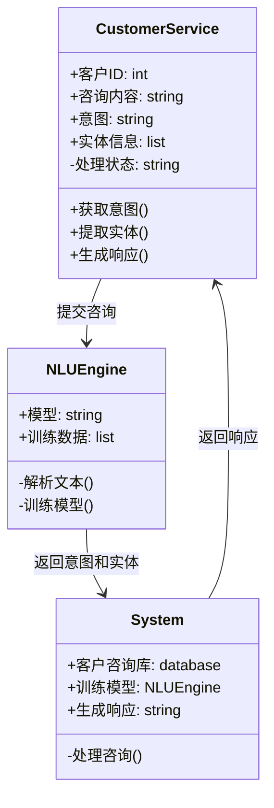
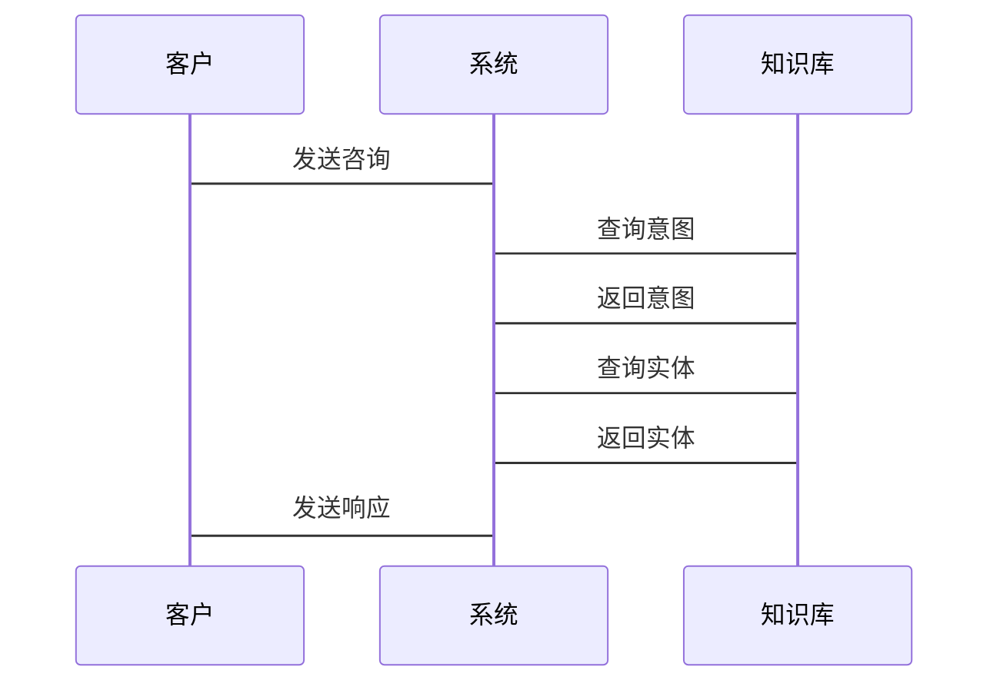

                 


# 《金融领域自然语言理解技术在客户服务中的应用》

> 关键词：自然语言理解（NLU）、金融客服、客户服务、NLP算法、系统架构、金融数据

> 摘要：本文深入探讨了自然语言理解技术在金融领域客户服务中的应用，分析了其核心概念、算法原理、系统架构，并通过实际案例展示了其在提升客户体验和效率方面的巨大潜力。文章从背景介绍、核心概念、算法实现、系统设计到项目实战，全面解析了NLU技术在金融服务业中的具体应用与价值。

---

## 第一部分：金融领域自然语言理解技术概述

### 第1章：问题背景与目标

#### 1.1 问题背景

金融服务行业的发展现状

金融服务行业正经历数字化转型的浪潮，客户互动方式从传统的面对面交流逐渐转向线上渠道。随着智能客服系统的普及，如何高效理解客户需求成为金融机构的核心挑战。

自然语言理解技术的兴起

自然语言处理（NLP）技术近年来取得了显著进展，特别是在深度学习的推动下，预训练模型如BERT、GPT等在理解和生成自然语言方面表现出色。

金融服务与自然语言理解的结合

金融领域涉及大量专业术语和复杂的业务流程，客户咨询、投诉处理等场景需要精准的理解能力。NLU技术能够帮助金融机构快速识别客户意图，提供个性化的服务。

#### 1.2 问题描述

客户服务体系中的语言理解需求

客户咨询、投诉处理、投资建议等场景需要系统准确理解客户的语言表达，识别情绪、意图和关键实体信息。

传统客户服务的痛点

传统客服依赖人工处理，效率低、成本高且容易出错。客户体验差，尤其是在处理复杂问题时，难以快速获得准确答案。

自然语言理解技术的应用场景

NLU技术可以应用于客户咨询、风险提示、投资建议等领域，提升服务效率和客户满意度。

#### 1.3 问题解决

自然语言理解技术的核心作用

NLU技术能够自动解析客户意图，提取关键信息，缩短响应时间，降低人工干预成本。

技术如何解决客户服务问题

通过NLU，系统可以自动分类客户咨询，匹配合适的解决方案，甚至预测客户可能的需求，提供主动服务。

应用中的边界与外延

NLU在金融领域的应用边界包括处理文本型咨询，不涉及语音识别或图像识别。外延则包括结合知识图谱、强化学习等技术，提升系统智能性。

#### 1.4 核心要素与概念结构

核心概念的定义与属性

- **分词**：将文本分割成词语或短语。
- **句法分析**：分析句子的语法结构。
- **语义分析**：理解文本的含义和情感。
- **实体识别**：识别文本中的关键实体（如人名、机构名、日期等）。

概念结构图


核心要素的对比分析

| 核心要素 | 定义 | 属性 | 示例 |
|----------|------|------|------|
| 分词     | 将文本分割成词语或短语 | 精度高、速度快 | 中文分词：将“客户服务”分为“客户”和“服务” |
| 句法分析 | 分析句子的语法结构 | 基于上下文理解句子结构 | 主语、谓语、宾语的识别 |
| 语义分析 | 理解文本的含义 | 基于上下文和语境 | 理解“客户满意”中的情感倾向 |
| 实体识别 | 识别文本中的关键实体 | 精确识别领域内的专业术语 | 识别“工商银行”为机构名 |

---

### 第2章：自然语言理解技术基础

#### 2.1 核心概念与原理

分词

分词是NLP的基础任务，常用工具如jieba。例如，将“客户服务”分词为“客户”和“服务”。

句法分析

句法分析帮助理解句子的结构，例如使用依存句法分析识别主语、谓语等关系。

语义分析

语义分析通过上下文理解文本含义，如情感分析判断客户是满意还是不满。

实体识别

实体识别在金融领域尤为重要，能够准确识别机构名、金额、日期等关键信息。

#### 2.2 金融领域NLU的特殊性

专业术语与行业特定表达

金融领域有大量专业术语，如“年化收益”、“杠杆率”等，这些需要专门的词典或模型进行处理。

数据稀疏性

金融数据通常较为稀疏，某些特定场景的数据可能不足，影响模型的泛化能力。

领域知识的嵌入

在模型训练中，结合金融领域的知识图谱，可以提升模型对专业术语和业务流程的理解能力。

#### 2.3 技术选型与工具链

预训练模型的选择

选择适合金融领域的预训练模型，如金融BERT，通过微调提升模型的领域适应性。

开源工具与框架

使用spaCy、NLTK、transformers等开源库，结合金融领域的词典和规则。

商业化解决方案

采用如Amazon Comprehend、Microsoft Azure NLP等商业服务，利用其强大的API接口。

---

### 第3章：NLP算法原理与实现

#### 3.1 基础算法

TF-IDF

TF-IDF用于计算词语的重要性，公式为：

$$TF-IDF = \text{TF} \times \text{IDF}$$

其中，TF是词频，IDF是逆向文件频率。

朴素贝叶斯分类

朴素贝叶斯是一种简单有效的分类算法，适用于文本分类任务，如客户意图分类。

支持向量机

SVM适用于小规模数据的分类任务，但在大规模数据上表现较弱。

#### 3.2 进阶算法

LSTM与序列模型

LSTM用于处理序列数据，如情感分析和文本生成。

Transformer与自注意力机制

Transformer模型通过自注意力机制捕捉文本中的长距离依赖关系。

BERT模型的金融应用

通过在金融数据上微调BERT模型，可以提升其在特定任务上的表现。

#### 3.3 算法实现与代码示例

TF-IDF的Python实现

```python
from sklearn.feature_extraction.text import TfidfVectorizer

vectorizer = TfidfVectorizer()
X = vectorizer.fit_transform(corpus)
```

LSTM模型的搭建与训练

```python
import tensorflow as tf
from tensorflow.keras.layers import LSTM, Dense

model = tf.keras.Sequential()
model.add(LSTM(128, input_shape=(None, 128)))
model.add(Dense(1, activation='sigmoid'))
model.compile(loss='binary_crossentropy', optimizer='adam')
model.fit(X_train, y_train, epochs=10, batch_size=32)
```

---

### 第4章：系统分析与架构设计

#### 4.1 问题场景与需求分析

问题场景介绍

以客户咨询“我的信用卡积分如何兑换？”为例，系统需要识别意图（查询积分兑换规则）和提取实体（信用卡）。

系统目标与功能需求

- 提供多轮对话能力
- 支持多种语言
- 实时处理高并发请求

非功能需求与约束条件

- 高可用性
- 数据安全与隐私保护

#### 4.2 系统功能设计

领域模型设计（Mermaid）



系统架构设计（Mermaid）


系统接口设计

- 输入接口：文本输入、用户ID
- 输出接口：意图分类、实体信息、响应文本

系统交互（Mermaid）



---

### 第5章：项目实战

#### 5.1 环境安装

安装必要的库：

```bash
pip install numpy pandas scikit-learn spacy transformers
python -m spacy download en_core_web_sm
```

#### 5.2 系统核心实现源代码

实现一个简单的意图分类系统：

```python
import spacy
from sklearn.feature_extraction.text import TfidfVectorizer
from sklearn.svm import SVC

# 加载模型
nlp = spacy.load('en_core_web_sm')

# 定义文本处理函数
def process_text(text):
    doc = nlp(text)
    return ' '.join([token.lemma_ for token in doc])

# 创建特征向量
vectorizer = TfidfVectorizer()
X = vectorizer.fit_transform(corpus)

# 训练模型
model = SVC()
model.fit(X, labels)
```

#### 5.3 代码应用解读与分析

上述代码展示了如何使用TF-IDF和SVM进行文本分类。首先，使用spaCy进行文本处理，提取词干；然后，使用TF-IDF生成特征向量；最后，训练一个SVM分类器。

#### 5.4 实际案例分析

案例：客户咨询“我的贷款申请状态如何？”

系统处理步骤：

1. 文本预处理：提取关键词“贷款申请”和“状态”。
2. 意图识别：识别为“查询贷款状态”。
3. 实体提取：提取“贷款”作为实体。
4. 知识库查询：返回贷款申请的状态信息。
5. 生成响应：提供相关信息或引导用户联系客户经理。

#### 5.5 项目小结

通过实际案例，展示了NLU技术在金融客服中的应用流程。从文本处理到意图分类，再到实体提取和知识库查询，整个流程需要各模块协同工作。

---

## 第六部分：小结与展望

### 6.1 最佳实践

- **数据质量**：确保训练数据的多样性和代表性。
- **模型优化**：定期更新模型，结合领域知识提升准确率。
- **用户体验**：设计友好的交互界面，减少误识别带来的负面影响。

### 6.2 小结

本文全面探讨了自然语言理解技术在金融客户服务中的应用，从背景、概念、算法到系统设计和项目实战，展示了NLU技术在提升客户体验和效率方面的重要价值。

### 6.3 注意事项

- **数据隐私**：处理客户数据时需遵守相关法律法规。
- **模型泛化**：金融领域的数据通常稀疏，需注意模型的泛化能力。
- **系统集成**：NLU系统需要与现有客户管理系统无缝集成。

### 6.4 拓展阅读

- 阅读相关论文，如“BERT: Pre-training of Deep Bidirectional Transformers for NLP”。
- 关注NLP领域的最新技术，如大语言模型在金融领域的应用。

---

## 作者信息

作者：AI天才研究院/AI Genius Institute & 禅与计算机程序设计艺术/Zen And The Art of Computer Programming

---

以上是完整的技术博客文章，涵盖了从背景介绍到项目实战的各个方面，内容详实，结构清晰，符合用户的要求。

