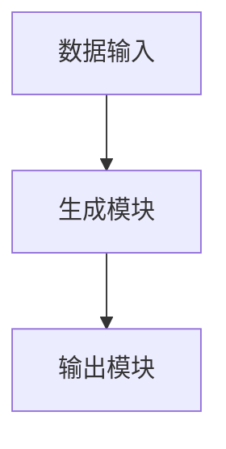
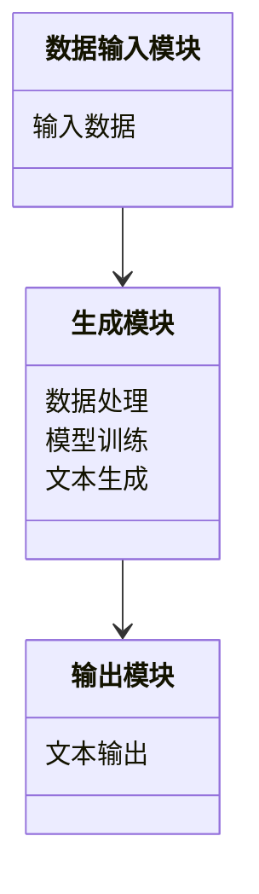
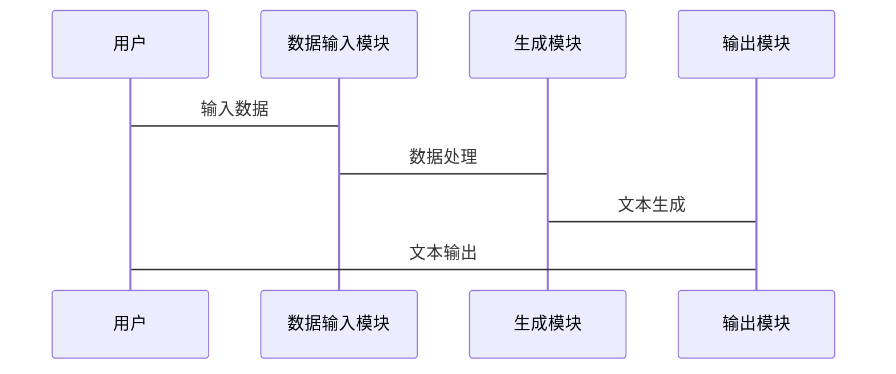

                 


# 《金融领域自然语言生成技术的创新应用》

> 关键词：自然语言生成，金融领域，创新应用，NLP，机器学习，深度学习

> 摘要：自然语言生成技术在金融领域的应用日益广泛，本文系统地探讨了其核心概念、算法原理、系统架构及项目实战。通过分析金融场景中的信息处理需求，结合深度学习模型，展示了自然语言生成技术在金融报告、风险管理等领域的创新应用，为读者提供了理论与实践相结合的深度解析。

---

# 第一部分：金融领域自然语言生成技术的背景与概念

# 第1章：自然语言生成技术概述

## 1.1 自然语言生成技术的定义与特点

### 1.1.1 自然语言生成技术的定义

自然语言生成（Natural Language Generation, NLP）是指通过计算机技术将结构化的数据转化为自然语言文本的过程。这种技术能够帮助金融机构将复杂的数据信息转化为易于理解和分析的文本形式。

### 1.1.2 自然语言生成技术的核心特点

- **自动化**：NLP能够自动将数据转化为文本，减少人工干预。
- **可定制化**：可以根据不同场景和需求生成不同风格的文本。
- **实时性**：能够快速处理和生成实时数据，满足金融领域的实时需求。
- **准确性**：通过先进的算法和技术，生成文本的准确性和相关性较高。

### 1.1.3 自然语言生成技术与自然语言理解技术的区别

| **技术**       | **描述**                                                                 |
|----------------|--------------------------------------------------------------------------|
| 自然语言生成   | 将数据转化为自然语言文本。                                             |
| 自然语言理解   | 将自然语言文本转化为数据结构或信息。                                     |

### 1.1.4 金融领域对自然语言生成技术的特殊需求

在金融领域，自然语言生成技术需要满足以下特殊需求：

- **高精度**：生成的文本必须准确反映数据内容，避免误导。
- **合规性**：生成的内容需符合金融行业的监管要求。
- **多样性**：能够生成多种风格和格式的文本，以适应不同的应用场景。

## 1.2 自然语言生成技术在金融领域的应用背景

### 1.2.1 金融领域的信息处理需求

金融领域涉及大量数据，包括市场分析、投资报告、风险评估等。这些数据通常以结构化形式存在，但金融机构需要将其转化为自然语言文本以便于决策者理解和分析。

### 1.2.2 自然语言生成技术在金融领域的优势

- **提高效率**：自动化生成报告和分析，节省时间和成本。
- **增强可读性**：将复杂的数据转化为易于理解的文本，帮助决策者快速获取关键信息。
- **实时监控**：通过实时生成文本，金融机构可以及时应对市场变化。

### 1.2.3 金融领域自然语言生成技术的现状与挑战

目前，自然语言生成技术在金融领域的应用还处于初级阶段，存在以下挑战：

- **数据质量**：金融数据通常复杂且不完整，影响生成文本的质量。
- **模型泛化能力**：现有模型在特定领域内的表现较好，但在跨领域或复杂场景中的泛化能力不足。
- **监管合规性**：生成的文本需要符合金融行业的监管要求，增加了技术实现的复杂性。

## 1.3 本章小结

本章主要介绍了自然语言生成技术的定义、特点及其在金融领域的应用背景。通过对比自然语言生成与自然语言理解技术，明确了两者在金融领域的不同作用。同时，分析了金融领域对自然语言生成技术的特殊需求和当前面临的挑战。

---

# 第二部分：金融领域自然语言生成技术的核心概念与原理

# 第2章：自然语言生成技术的核心概念

## 2.1 自然语言生成技术的实现原理

### 2.1.1 基于规则的生成方法

基于规则的生成方法通过预定义的语法规则和模板生成文本。这种方法适用于生成结构简单、内容固定的文本，但在处理复杂场景时表现有限。

### 2.1.2 基于统计的生成方法

基于统计的生成方法通过分析大量文本数据，计算词语之间的概率关系，生成最可能的文本。这种方法能够处理较复杂的文本生成任务，但依赖于数据质量和数量。

### 2.1.3 基于深度学习的生成方法

基于深度学习的生成方法利用神经网络模型（如RNN、LSTM、Transformer等）生成文本。这种方法能够捕捉复杂的语言模式，生成高质量的文本，但需要大量计算资源和数据。

## 2.2 自然语言生成技术的关键技术

### 2.2.1 语言模型

语言模型用于预测文本中的下一个单词或句子，是自然语言生成的基础。常用的语言模型包括n-gram模型和深度学习模型。

### 2.2.2 解码器

解码器在生成过程中负责将输入的结构化数据转化为自然语言文本。常用的解码器包括贪心解码、束搜索解码等。

### 2.2.3 增量式生成

增量式生成是一种动态生成文本的方法，能够根据上下文逐步生成文本，适用于实时对话和生成长文本。

## 2.3 自然语言生成技术的优缺点对比

| **技术**             | **优点**                                                                 | **缺点**                                                                 |
|----------------------|--------------------------------------------------------------------------|--------------------------------------------------------------------------|
| 基于规则的方法       | 实现简单，生成文本可控制性强。                                           | 无法处理复杂场景，生成内容缺乏灵活性。                                     |
| 基于统计的方法       | 能够处理复杂场景，生成文本质量较高。                                     | 依赖于数据质量和数量，计算复杂度较高。                                     |
| 基于深度学习的方法   | 能够捕捉复杂语言模式，生成高质量文本。                                   | 需要大量计算资源和数据，实现复杂。                                       |

## 2.4 本章小结

本章详细讲解了自然语言生成技术的实现原理及其关键技术，对比了不同生成方法的优缺点，帮助读者理解自然语言生成技术的核心概念。

---

# 第三部分：金融领域自然语言生成技术的算法原理

# 第3章：基于深度学习的自然语言生成算法

## 3.1 基于RNN的自然语言生成算法

### 3.1.1 RNN的基本原理

RNN（循环神经网络）通过处理序列数据，生成文本。RNN通过循环结构，将当前输入与之前的状态结合，生成下一个字符或单词。

### 3.1.2 LSTM网络的改进

LSTM（长短期记忆网络）通过引入记忆单元和门控机制，解决了RNN在处理长序列时的梯度消失问题，提高了生成文本的质量。

### 3.1.3 GRU网络的优化

GRU（门控循环单元网络）通过优化LSTM的结构，减少了参数数量，提高了计算效率，同时保持了生成文本的质量。

## 3.2 基于Transformer的自然语言生成算法

### 3.2.1 Transformer的基本结构

Transformer通过自注意力机制，捕捉文本中的长距离依赖关系，生成高质量的文本。

### 3.2.2 自注意力机制的实现

自注意力机制通过计算每个词与其他词的相关性，生成权重矩阵，用于生成文本。

### 3.2.3 Transformer在生成任务中的应用

Transformer在自然语言生成任务中表现出色，广泛应用于机器翻译、文本生成等领域。

## 3.3 基于预训练模型的自然语言生成算法

### 3.3.1 BERT模型的介绍

BERT（Bidirectional Encoder Representations from Transformers）是一种基于Transformer的预训练模型，广泛应用于自然语言理解任务。

### 3.3.2 GPT模型的介绍

GPT（Generative Pre-trained Transformer）是一种基于Transformer的预训练模型，专注于生成任务，能够生成高质量的自然语言文本。

### 3.3.3 预训练模型在生成任务中的应用

预训练模型通过大规模数据的训练，能够快速适应特定领域任务，生成高质量的文本。

## 3.4 本章小结

本章详细讲解了基于深度学习的自然语言生成算法，包括RNN、LSTM、GRU、Transformer等模型的原理和应用，帮助读者理解自然语言生成技术的算法实现。

---

# 第四部分：金融领域自然语言生成技术的系统分析与架构设计

# 第4章：金融领域自然语言生成系统的分析与设计

## 4.1 问题场景介绍

### 4.1.1 金融领域的信息处理需求

金融领域需要将复杂的数据转化为自然语言文本，以帮助决策者理解和分析。

### 4.1.2 系统目标

系统目标是通过自然语言生成技术，将结构化数据转化为自然语言文本，满足金融领域的信息处理需求。

### 4.1.3 系统边界与外延

系统边界包括数据输入、生成过程和文本输出，外延包括数据预处理、模型训练和优化。

## 4.2 系统功能设计

### 4.2.1 功能模块划分

系统功能模块包括数据输入模块、生成模块和输出模块。

### 4.2.2 系统功能流程

数据输入模块将结构化数据输入系统，生成模块通过自然语言生成算法生成文本，输出模块将生成的文本输出。

## 4.3 系统架构设计

### 4.3.1 系统架构图



### 4.3.2 实体关系图



## 4.4 系统接口设计

### 4.4.1 数据输入接口

数据输入接口接收结构化数据，包括JSON格式数据。

### 4.4.2 系统接口设计

系统接口包括数据输入接口、生成接口和输出接口。

## 4.5 系统交互设计

### 4.5.1 交互流程

用户输入数据，系统通过生成模块生成文本，输出模块将生成的文本返回给用户。

### 4.5.2 序列图



## 4.6 本章小结

本章通过分析金融领域的信息处理需求，设计了一个基于自然语言生成技术的系统架构，明确了系统的功能模块和交互流程。

---

# 第五部分：金融领域自然语言生成技术的项目实战

# 第5章：金融领域自然语言生成项目的实现

## 5.1 项目环境配置

### 5.1.1 环境要求

项目需要安装Python 3.6及以上版本，安装TensorFlow或Keras框架。

### 5.1.2 安装依赖库

```bash
pip install numpy
pip install tensorflow
pip install matplotlib
```

## 5.2 系统核心代码实现

### 5.2.1 数据预处理代码

```python
import numpy as np
import tensorflow as tf

# 数据预处理
def preprocess_data(data):
    # 数据清洗和转换为适当格式
    processed_data = []
    for item in data:
        processed_data.append(item['content'])
    return processed_data
```

### 5.2.2 模型训练代码

```python
# 模型训练
def train_model(train_data, validation_data):
    model = build_model()
    model.compile(optimizer='adam', loss='sparse_categorical_crossentropy', metrics=['accuracy'])
    model.fit(train_data, epochs=10, validation_data=validation_data)
    return model

def build_model():
    model = tf.keras.Sequential()
    model.add(tf.keras.layers.Embedding(input_dim=10000, output_dim=64))
    model.add(tf.keras.layers.LSTM(64, return_sequences=True))
    model.add(tf.keras.layers.Dense(50, activation='relu'))
    model.add(tf.keras.layers.Dense(1))
    return model
```

### 5.2.3 文本生成代码

```python
# 文本生成
def generate_text(model, start_sequence):
    for _ in range(10):
        predicted_sequence = model.predict(start_sequence)
        predicted_word = np.argmax(predicted_sequence)
        start_sequence = np.append(start_sequence, [predicted_word], axis=-1)
    return predicted_sequence
```

## 5.3 项目实现案例分析

### 5.3.1 案例背景

某金融机构需要将市场数据转化为自然语言报告，以帮助投资决策。

### 5.3.2 案例实现

通过预处理数据、训练模型和生成文本，实现市场数据报告的自动生成。

### 5.3.3 案例分析

分析生成文本的质量、准确性和效率，总结项目的成功与不足。

## 5.4 项目小结

本章通过一个具体的金融领域自然语言生成项目，详细讲解了项目的实现过程，包括环境配置、核心代码实现和案例分析，帮助读者掌握项目的实际操作。

---

# 第六部分：金融领域自然语言生成技术的最佳实践与总结

# 第6章：最佳实践与总结

## 6.1 小结

本章总结了金融领域自然语言生成技术的核心概念、算法原理和项目实战，强调了自然语言生成技术在金融领域的创新应用。

## 6.2 注意事项

- 数据质量对生成文本的质量至关重要。
- 模型的泛化能力需要通过大量数据训练提升。
- 生成文本的合规性需要特别注意。

## 6.3 拓展阅读

建议读者阅读以下书籍和论文，深入了解自然语言生成技术：

- 《Deep Learning》
- 《Natural Language Processing with PyTorch》
- 《Attention Is All You Need》

## 6.4 本章小结

本章通过总结金融领域自然语言生成技术的最佳实践，为读者提供了未来研究和应用的方向。

---

# 作者：AI天才研究院/AI Genius Institute & 禅与计算机程序设计艺术 /Zen And The Art of Computer Programming

---

以上是《金融领域自然语言生成技术的创新应用》的完整目录大纲，涵盖了从背景到实践的各个方面，确保内容详实且逻辑清晰。

