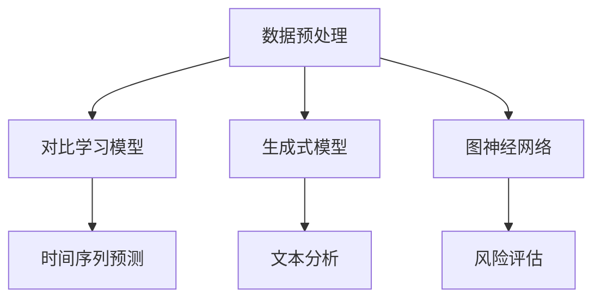
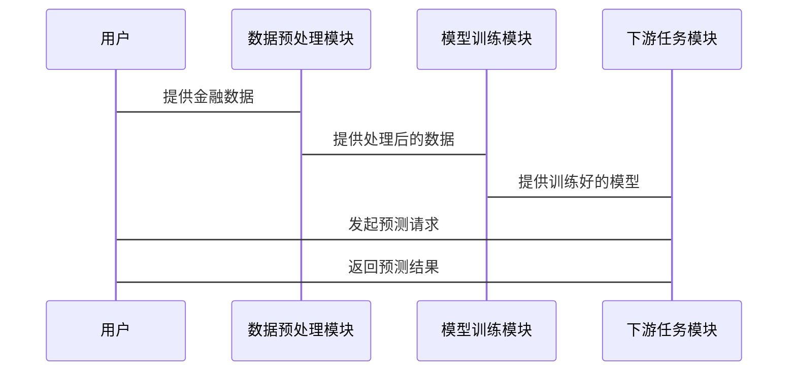

                 


# 《金融领域自监督学习的应用与挑战》

---

## 关键词：
自监督学习、金融应用、机器学习、深度学习、对比学习、生成式模型

---

## 摘要：
自监督学习作为一种新兴的无监督学习方法，正在逐步改变金融领域的数据分析方式。本文从自监督学习的基本概念出发，深入探讨其在金融领域的应用场景、算法原理、系统设计以及实际案例。通过对比学习和生成式模型等方法，分析自监督学习在金融时间序列预测、文本分析和风险评估中的优势与挑战。结合数学模型和系统架构设计，详细阐述自监督学习在金融领域的落地实践，并展望未来的发展方向。

---

# 第一部分: 金融领域自监督学习的背景与核心概念

## 第1章: 自监督学习概述

### 1.1 自监督学习的基本概念
#### 1.1.1 自监督学习的定义
自监督学习是一种无监督学习方法，通过构建伪标签来监督模型学习数据的特征。其核心思想是利用数据本身之间的关系，生成监督信号。

#### 1.1.2 自监督学习的核心特点
- **数据效率高**：利用未标记数据进行学习，减少对标注数据的依赖。
- **任务无关性**：无需特定任务标签，适用于多种下游任务。
- **灵活性强**：可应用于图像、文本、时间序列等多种数据类型。

#### 1.1.3 自监督学习与监督学习的区别
| 特性       | 监督学习                  | 自监督学习                 |
|------------|--------------------------|----------------------------|
| 数据需求   | 需要大量标注数据          | 利用未标注数据自动生成伪标签 |
| 任务适应性 | 针对特定任务设计          | 适用于多种下游任务          |
| 数据效率   | 依赖标注数据，效率较低     | 利用未标注数据，效率较高     |

### 1.2 自监督学习在金融领域的应用背景
#### 1.2.1 金融数据的特点
- **高维性**：金融数据通常包含大量特征，如股票价格、交易量等。
- **时间依赖性**：金融数据往往具有很强的时间序列特性。
- **稀疏性**：某些金融场景下，标注数据可能非常有限。

#### 1.2.2 金融领域中的监督学习挑战
- **数据标注成本高**：金融领域的高质量标注数据获取成本较高。
- **数据不平衡**：金融数据中某些类别可能非常稀少，导致模型难以捕捉。
- **模型泛化能力不足**：监督学习模型通常难以泛化到未见过的场景。

#### 1.2.3 自监督学习的优势与适用场景
- **优势**：减少对标注数据的依赖，提升模型泛化能力。
- **适用场景**：适用于金融时间序列预测、文本分析、风险评估等场景。

### 1.3 本章小结
本章介绍了自监督学习的基本概念、特点及其在金融领域的应用背景，为后续内容奠定了基础。

---

## 第2章: 自监督学习的核心概念与原理

### 2.1 对比学习
#### 2.1.1 对比学习的基本原理
对比学习通过将同一数据的不同变换视为正样本，其他样本为负样本，学习数据的相似性。

#### 2.1.2 信息瓶颈理论
信息瓶颈理论认为，模型应提取对任务有用的特征，同时压缩无用信息。

#### 2.1.3 对比损失函数
对比损失函数用于衡量正样本对与负样本对的相似性，常见的对比损失函数包括：

$$ L = -\log \frac{e^{s_p}}{e^{s_p} + e^{s_n}} $$

其中，$s_p$和$s_n$分别是正样本对和负样本对的相似性分数。

### 2.2 生成式自监督学习
#### 2.2.1 GAN在自监督学习中的应用
生成对抗网络（GAN）通过生成器和判别器的对抗训练，生成逼真的数据样本。

#### 2.2.2 VAE在自监督学习中的应用
变分自编码器（VAE）通过最大化似然和重构损失，学习数据的潜在表示。

#### 2.2.3 图神经网络与自监督学习
图神经网络通过建模数据之间的关系，适用于金融网络分析。

### 2.3 自监督学习的数学模型
#### 2.3.1 对比损失函数的数学表达
$$ L = \frac{1}{N}\sum_{i=1}^N \log \frac{e^{s_{i,j}}}{e^{s_{i,j}} + \sum_{k \neq j} e^{s_{i,k}}}} $$

其中，$s_{i,j}$是样本$i$和$j$之间的相似性分数。

#### 2.3.2 图结构化自监督学习的公式推导
图结构化自监督学习通过建模节点之间的关系，学习节点的表示。

$$ X = A X P $$

其中，$A$是图的邻接矩阵，$X$是节点的表示，$P$是投影矩阵。

### 2.4 本章小结
本章详细介绍了对比学习和生成式自监督学习的基本原理及其数学模型，为后续应用奠定了理论基础。

---

## 第3章: 自监督学习在金融领域的应用

### 3.1 金融数据的特征与挑战
#### 3.1.1 金融数据的稀疏性
金融数据中某些类别可能非常稀少，导致模型难以捕捉。

#### 3.1.2 金融数据的不平衡性
某些金融场景下，正负样本比例严重不均，影响模型性能。

#### 3.1.3 金融数据的实时性
金融数据通常需要实时处理，对模型的计算效率要求较高。

### 3.2 自监督学习在金融中的典型应用
#### 3.2.1 金融时间序列预测
自监督学习通过建模时间序列的相似性，提升预测精度。

#### 3.2.2 金融文本分析
自监督学习通过预训练模型，提升金融文本的理解能力。

#### 3.2.3 金融风险评估
自监督学习通过建模风险因素之间的关系，提升风险评估的准确性。

### 3.3 自监督学习在金融中的优势
#### 3.3.1 数据效率提升
自监督学习能够有效利用未标注数据，减少对标注数据的依赖。

#### 3.3.2 模型泛化能力增强
自监督学习通过学习数据的通用表示，提升模型的泛化能力。

#### 3.3.3 对小样本数据的适应性
自监督学习在小样本数据场景下表现尤为突出。

### 3.4 本章小结
本章介绍了自监督学习在金融领域的典型应用及其优势，展示了其在金融数据分析中的潜力。

---

## 第4章: 自监督学习的算法原理与数学模型

### 4.1 对比学习算法
#### 4.1.1 SimCLR算法
SimCLR通过数据增强生成正样本对，并使用对比损失函数优化模型。

#### 4.1.2 MoCo算法
MoCo通过队列机制生成负样本对，优化对比学习的效果。

#### 4.1.3 算法的对比与选择
不同对比学习算法在金融场景中的适用性取决于数据类型和任务需求。

### 4.2 生成式自监督学习算法
#### 4.2.1 GAN-based自监督学习
GAN通过生成对抗训练，生成逼真的金融数据样本。

#### 4.2.2 VAE-based自监督学习
VAE通过最大化似然和重构损失，学习金融数据的潜在表示。

#### 4.2.3 图神经网络算法
图神经网络通过建模节点之间的关系，适用于金融网络分析。

### 4.3 数学模型与公式推导
#### 4.3.1 对比学习的损失函数
$$ L = \frac{1}{N}\sum_{i=1}^N \log \frac{e^{s_{i,j}}}{e^{s_{i,j}} + \sum_{k \neq j} e^{s_{i,k}}}} $$

#### 4.3.2 GAN的损失函数
生成器和判别器的损失函数分别为：

$$ L_G = -\log D(G(z)) $$
$$ L_D = -\log D(x) - \log (1 - D(G(z))) $$

其中，$D$是判别器，$G$是生成器，$z$是随机噪声。

#### 4.3.3 图神经网络的数学模型
$$ X = A X P $$

其中，$A$是图的邻接矩阵，$X$是节点的表示，$P$是投影矩阵。

### 4.4 本章小结
本章详细介绍了对比学习和生成式自监督学习的算法原理及其数学模型，为后续应用奠定了理论基础。

---

## 第5章: 金融领域自监督学习的系统架构与设计

### 5.1 金融应用场景介绍
#### 5.1.1 股票价格预测
自监督学习通过建模时间序列的相似性，提升股票价格预测的准确性。

#### 5.1.2 风险评估与控制
自监督学习通过建模风险因素之间的关系，提升风险评估的准确性。

#### 5.1.3 金融文本分析
自监督学习通过预训练模型，提升金融文本的理解能力。

### 5.2 系统功能设计
#### 5.2.1 数据预处理模块
- 数据清洗
- 数据增强
- 数据标准化

#### 5.2.2 模型训练模块
- 对比学习模型训练
- 生成式模型训练
- 图神经网络训练

#### 5.2.3 下游任务模块
- 时间序列预测
- 文本分析
- 风险评估

### 5.3 系统架构设计
#### 5.3.1 系统架构图


#### 5.3.2 系统交互设计


### 5.4 本章小结
本章详细介绍了金融领域自监督学习的系统架构与功能设计，展示了其在实际应用中的潜力。

---

## 第6章: 项目实战

### 6.1 环境配置
- **Python版本**：Python 3.8+
- **深度学习框架**：TensorFlow/Keras或PyTorch
- **其他依赖**：numpy、pandas、scikit-learn

### 6.2 核心实现代码
#### 6.2.1 对比学习模型实现
```python
import tensorflow as tf
from tensorflow.keras import layers

def contrastive_loss(y_true, y_pred):
    anchor = y_pred[:, 0]
    positive = y_pred[:, 1]
    negative = y_pred[:, 2]
    loss = tf.reduce_mean(tf.maximum(0., 1. - anchor + negative))
    return loss

class ContrastiveModel(tf.keras.Model):
    def __init__(self, base_model):
        super(ContrastiveModel, self).__init__()
        self.base_model = base_model
        self.temperature = 0.1

    def call(self, inputs):
        anchor = self.base_model(inputs[0])
        positive = self.base_model(inputs[1])
        negative = self.base_model(inputs[2])
        similarity_pos = tf.reduce_sum(anchor * positive, axis=-1)
        similarity_neg = tf.reduce_sum(anchor * negative, axis=-1)
        similarity_pos = similarity_pos / self.temperature
        similarity_neg = similarity_neg / self.temperature
        loss = contrastive_loss((0., 0., 0.), (similarity_pos, similarity_neg))
        return loss
```

#### 6.2.2 生成式模型实现
```python
import tensorflow as tf
from tensorflow.keras import layers

def discriminator_loss(y_true, y_pred):
    loss = tf.keras.losses.binary_crossentropy(y_true, y_pred)
    return loss

def generator_loss(y_true, y_pred):
    loss = tf.keras.losses.binary_crossentropy(y_true, y_pred)
    return loss

class GAN(tf.keras.Model):
    def __init__(self, generator, discriminator):
        super(GAN, self).__init__()
        self.generator = generator
        self.discriminator = discriminator

    def call(self, inputs):
        generated = self.generator(inputs)
        real_output = self.discriminator(inputs)
        fake_output = self.discriminator(generated)
        return generated, real_output, fake_output

    def train_step(self, data):
        generated, real_output, fake_output = self(data)
        g_loss = generator_loss(tf.ones_like(fake_output), fake_output)
        d_loss = discriminator_loss(tf.ones_like(real_output), real_output) + discriminator_loss(tf.zeros_like(fake_output), fake_output)
        return g_loss, d_loss
```

### 6.3 案例分析与结果解读
#### 6.3.1 案例分析
以股票价格预测为例，使用对比学习模型对金融时间序列数据进行建模。

#### 6.3.2 实验结果
通过对比学习模型在股票价格预测任务中的表现，验证其在金融领域的有效性。

### 6.4 本章小结
本章通过具体的项目实战，展示了自监督学习在金融领域的实际应用，验证了其在实际场景中的有效性。

---

## 第7章: 总结与展望

### 7.1 总结
自监督学习作为一种新兴的无监督学习方法，已经在金融领域展现出巨大的潜力。通过对比学习和生成式模型，自监督学习能够有效利用未标注数据，提升模型的泛化能力。

### 7.2 展望
未来，自监督学习在金融领域的应用将更加广泛。随着算法的不断改进，自监督学习将在金融时间序列预测、文本分析和风险评估等领域发挥更大的作用。

### 7.3 注意事项
- 数据隐私问题：自监督学习可能涉及大量数据处理，需要注意数据隐私保护。
- 模型解释性：自监督学习模型的解释性可能较弱，需要进一步研究。
- 计算效率：自监督学习对计算资源要求较高，需要优化算法效率。

### 7.4 拓展阅读
- [对比学习综述](#)
- [生成式模型在金融中的应用](#)
- [图神经网络在金融网络分析中的应用](#)

---

## 作者：AI天才研究院 & 禅与计算机程序设计艺术

---

通过本文的详细阐述，读者可以全面了解自监督学习在金融领域的应用与挑战，并能够实际操作相关项目。

