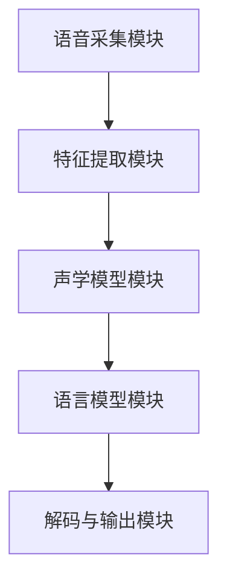

                 

# 《金融领域语音识别技术的优化与应用》

> 关键词：语音识别，金融应用，数据增强，模型优化，系统架构

> 摘要：本文详细探讨了语音识别技术在金融领域的应用，分析了其优化方法与实际应用场景。通过理论与实践相结合，揭示了如何提升语音识别在金融场景中的准确性和实用性，为相关领域的研究和应用提供了有价值的参考。

---

## 第1章: 语音识别技术概述

### 1.1 语音识别的基本概念

#### 1.1.1 语音识别的定义
语音识别是一种通过计算机技术将人类语音转换为文本的技术。它利用语音信号处理、模式识别和自然语言处理等技术，实现对语音的识别和理解。

#### 1.1.2 语音识别的核心技术
- **语音信号处理**：包括语音的采集、预处理和特征提取。
- **模式识别**：通过训练模型识别语音中的模式。
- **自然语言处理**：对识别出的文本进行语义理解和分析。

#### 1.1.3 语音识别的应用领域
语音识别技术广泛应用于多个领域，包括：
- **智能家居**：通过语音指令控制设备。
- **移动应用**：如语音输入、语音搜索。
- **金融领域**：用于客户咨询、交易记录等场景。

### 1.2 金融领域语音识别的背景与需求

#### 1.2.1 金融领域的数据特点
金融领域的语音数据通常具有以下特点：
- **专业术语多**：涉及金融术语如“股票”、“基金”等。
- **语速较快**：金融交易中的对话通常较为简短且语速快。
- **背景噪音多**：客户在嘈杂环境中使用语音服务时，信号质量较差。

#### 1.2.2 语音识别在金融中的应用场景
- **客户咨询**：通过语音识别快速理解客户需求。
- **交易记录**：将客户的语音指令转化为交易记录。
- **风险控制**：通过分析语音特征识别欺诈行为。

#### 1.2.3 金融领域对语音识别技术的特殊要求
- **高准确性**：金融交易对准确性的要求极高。
- **快速响应**：需要在短时间内完成识别和处理。
- **多语言支持**：金融业务涉及多种语言和方言。

### 1.3 语音识别技术的挑战与优化方向

#### 1.3.1 语音识别的主要挑战
- **噪音干扰**：环境噪音会影响识别的准确性。
- **语速差异**：不同人的语速不同，影响模型的适应性。
- **专业术语处理**：金融领域的专业术语需要特殊处理。

#### 1.3.2 金融领域语音识别的优化方向
- **数据增强技术**：通过数据增强提高模型的鲁棒性。
- **模型优化策略**：改进模型结构以提高识别准确率。
- **后处理优化方法**：优化识别结果的输出，减少错误率。

#### 1.3.3 未来发展趋势
- **深度学习的进一步应用**：如Transformer模型的应用。
- **多模态技术结合**：结合视觉、文本等信息提高识别准确性。
- **实时性优化**：提升语音识别的实时处理能力。

### 1.4 本章小结
本章介绍了语音识别的基本概念及其在金融领域的应用背景，分析了金融领域语音识别的特殊要求和面临的主要挑战，并提出了优化方向和未来发展趋势。

---

## 第2章: 语音识别的核心概念与原理

### 2.1 语音信号处理基础

#### 2.1.1 语音信号的特性
- **时变性**：语音信号随时间变化。
- **频域特性**：语音信号在频域中有明显的特征。
- **非线性特性**：语音信号受到环境和发音者的影响。

#### 2.1.2 语音信号的预处理
- **降噪处理**：去除环境噪音。
- **标准化处理**：统一信号的幅度和频率。

#### 2.1.3 常见的语音特征提取方法
- **梅尔频率倒谱系数（MFCC）**：常用特征提取方法。
- **线性预测编码（LPC）**：通过线性预测模型提取特征。
- **倒谱分析**：通过倒谱分析提取语音特征。

### 2.2 声学模型与语言模型

#### 2.2.1 声学模型的定义与作用
- **声学模型**：将语音信号转换为概率分布的模型。
- **作用**：将语音信号映射到音节或单词的概率分布。

#### 2.2.2 语言模型的定义与作用
- **语言模型**：描述语言的语法和语义结构。
- **作用**：根据上下文信息选择最可能的词或句子。

#### 2.2.3 声学模型与语言模型的关系
- **协同作用**：声学模型提供语音信息，语言模型提供上下文信息，两者结合实现语音识别。

### 2.3 语音识别的优化方法

#### 2.3.1 数据增强技术
- **噪音注入**：通过添加不同类型的噪音提高模型的鲁棒性。
- **速度变换**：通过改变语音的速度扩展训练数据。
- **声音合成**：通过语音合成技术生成多样化的语音数据。

#### 2.3.2 模型优化策略
- **模型结构优化**：通过调整模型结构提高识别准确率。
- **参数优化**：通过优化算法调整模型参数。
- **模型压缩**：通过模型压缩技术减少模型的计算量。

#### 2.3.3 后处理优化方法
- **错误修正**：通过上下文信息修正识别错误。
- **结果优化**：通过优化算法提高识别结果的质量。

### 2.4 本章小结
本章详细讲解了语音识别的核心概念，包括语音信号处理、声学模型和语言模型的基本原理，并介绍了数据增强和模型优化等关键技术。

---

## 第3章: 语音识别的算法原理与数学模型

### 3.1 语音识别的算法流程

#### 3.1.1 语音信号的预处理
- **降噪处理**：去除背景噪音。
- **标准化处理**：统一信号的幅度和频率。

#### 3.1.2 特征提取
- **梅尔频率倒谱系数（MFCC）**：提取语音特征。
- **线性预测编码（LPC）**：通过线性预测模型提取特征。

#### 3.1.3 声学模型的训练
- **训练数据准备**：准备训练数据并进行标注。
- **模型训练**：通过训练数据训练声学模型。

#### 3.1.4 语言模型的构建
- **语料库构建**：收集和整理语料库。
- **语言模型训练**：通过语料库训练语言模型。

#### 3.1.5 解码与结果输出
- **解码过程**：通过声学模型和语言模型联合解码得到最终的识别结果。

### 3.2 声学模型的数学表达

#### 3.2.1 基于HMM的声学模型
- **隐马尔可夫模型（HMM）**：通过状态转移和观测概率描述语音信号。
- **公式表示**：
  - 状态转移概率：$$a_{i,j} = P(q_{t}=j | q_{t-1}=i)$$
  - 观测概率：$$b_j(k) = P(o_k | q_{t}=j)$$

#### 3.2.2 基于DNN的声学模型
- **深度神经网络（DNN）**：通过多层神经网络提取特征并进行分类。
- **公式表示**：
  - 输入层：$$x = \text{输入特征}$$
  - 输出层：$$y = \text{输出概率}$$
  - 损失函数：$$L = \text{交叉熵损失}$$

#### 3.2.3 基于Transformer的声学模型
- **Transformer模型**：通过自注意力机制和前馈网络进行特征提取。
- **公式表示**：
  - 自注意力机制：$$\text{Attention}(Q, K, V) = \text{softmax}(\frac{QK^T}{\sqrt{d}})V$$

### 3.3 语言模型的数学表达

#### 3.3.1 基于n-gram的语言模型
- **n-gram模型**：通过统计n元组的概率进行预测。
- **公式表示**：
  - 单个n-gram概率：$$P(w_i | w_{i-n+1}, ..., w_{i-1})$$

#### 3.3.2 基于神经网络的语言模型
- **循环神经网络（RNN）**：通过序列建模生成语言。
- **公式表示**：
  - 隐藏层：$$h_t = \text{激活函数}(W_h h_{t-1} + W_x x_t)$$
  - 输出概率：$$P(w_t | h_t)$$

#### 3.3.3 基于注意力机制的语言模型
- **注意力机制**：通过注意力权重计算上下文信息。
- **公式表示**：
  - 注意力权重：$$\alpha_i = \text{softmax}(q^T k_i)$$
  - 上下文表示：$$c_i = \sum_{j=1}^{n} \alpha_j v_j$$

### 3.4 本章小结
本章详细讲解了语音识别的算法流程，分析了基于HMM、DNN和Transformer的声学模型以及基于n-gram、RNN和注意力机制的语言模型的数学表达。

---

## 第4章: 金融领域语音识别的系统架构与设计

### 4.1 系统架构概述

#### 4.1.1 系统功能模块划分
- **语音采集模块**：负责采集语音信号。
- **特征提取模块**：提取语音特征。
- **声学模型模块**：进行声学模型的训练和推理。
- **语言模型模块**：构建和优化语言模型。
- **解码与输出模块**：输出最终的识别结果。

#### 4.1.2 系统架构设计
- **分层架构**：将系统划分为数据层、特征层、模型层和应用层。
- **模块化设计**：每个功能模块相对独立，便于维护和扩展。

#### 4.1.3 系统接口设计
- **模块间接口**：定义模块之间的接口，确保模块之间的通信。
- **外部接口**：定义与外部系统的接口，确保系统与外部系统的集成。

### 4.2 系统功能设计

#### 4.2.1 语音采集模块
- **功能描述**：采集客户的声音信号。
- **实现方式**：通过麦克风或录音设备采集语音信号。
- **注意事项**：确保采集的信号质量，减少噪音干扰。

#### 4.2.2 特征提取模块
- **功能描述**：提取语音信号的特征。
- **实现方式**：使用MFCC等特征提取方法。
- **注意事项**：选择合适的特征提取方法，提高特征的区分度。

#### 4.2.3 声学模型模块
- **功能描述**：训练和推理声学模型。
- **实现方式**：基于深度学习模型进行训练和推理。
- **注意事项**：确保训练数据的多样性和代表性。

#### 4.2.4 语言模型模块
- **功能描述**：构建和优化语言模型。
- **实现方式**：使用n-gram或神经网络语言模型。
- **注意事项**：优化语言模型的准确性和响应速度。

#### 4.2.5 解码与输出模块
- **功能描述**：输出最终的识别结果。
- **实现方式**：结合声学模型和语言模型进行解码。
- **注意事项**：优化解码算法，提高识别速度和准确率。

### 4.3 系统架构设计图

#### 4.3.1 系统架构图（使用Mermaid语法）

### 4.4 本章小结
本章详细介绍了金融领域语音识别系统的架构设计，包括功能模块划分、系统架构设计和系统接口设计。

---

## 第5章: 金融领域语音识别的优化与应用

### 5.1 数据增强技术在金融领域的应用

#### 5.1.1 数据增强的定义与作用
- **数据增强**：通过变换和扩展训练数据提高模型的泛化能力。
- **作用**：增加训练数据的多样性和数量，提高模型的鲁棒性。

#### 5.1.2 金融领域数据增强的特殊性
- **多语言支持**：需要处理多种语言和方言。
- **专业术语处理**：需要特殊处理金融领域的专业术语。

### 5.2 模型优化策略

#### 5.2.1 模型结构优化
- **模型剪枝**：通过剪枝减少不必要的参数，降低计算量。
- **模型压缩**：通过压缩技术减少模型的存储空间。

#### 5.2.2 参数优化策略
- **随机梯度下降（SGD）**：常用的优化算法。
- **Adam优化器**：结合动量和自适应学习率的优化算法。

### 5.3 后处理优化方法

#### 5.3.1 错误修正
- **基于上下文的错误修正**：通过上下文信息修正识别错误。
- **语法检查**：通过语法检查工具进一步修正识别结果。

#### 5.3.2 结果优化
- **语言模型优化**：通过优化语言模型提高识别准确率。
- **结果排序**：通过排序算法优化识别结果的顺序。

### 5.4 项目实战

#### 5.4.1 环境安装
- **安装Python**：安装Python编程环境。
- **安装依赖库**：安装TensorFlow、Keras等深度学习库。

#### 5.4.2 核心代码实现
- **特征提取代码**：使用MFCC提取语音特征。
- **模型训练代码**：训练声学模型和语言模型。
- **识别代码**：实现语音识别功能。

#### 5.4.3 案例分析
- **案例一**：客户咨询场景下的语音识别。
- **案例二**：金融交易记录的语音识别。

### 5.5 本章小结
本章详细讲解了数据增强技术在金融领域的应用，分析了模型优化策略和后处理优化方法，并通过项目实战展示了如何实现金融领域的语音识别。

---

## 第6章: 总结、最佳实践与未来展望

### 6.1 总结
本章对全文进行了总结，回顾了语音识别技术在金融领域的应用，分析了其优化方法和实际应用场景。

### 6.2 最佳实践

#### 6.2.1 数据处理
- **数据清洗**：确保数据的准确性和完整性。
- **数据增强**：通过数据增强提高模型的鲁棒性。

#### 6.2.2 模型优化
- **模型选择**：选择合适的模型结构。
- **参数优化**：通过优化算法调整模型参数。

#### 6.2.3 系统设计
- **模块化设计**：确保系统模块的独立性和可扩展性。
- **接口设计**：确保系统与外部系统的良好集成。

### 6.3 未来展望

#### 6.3.1 技术发展
- **深度学习的进一步应用**：如Transformer模型的应用。
- **多模态技术结合**：结合视觉、文本等信息提高识别准确性。

#### 6.3.2 应用场景扩展
- **智能客服**：通过语音识别实现智能客服。
- **金融分析**：通过语音识别分析客户情绪和需求。

### 6.4 本章小结
本章总结了全文的主要内容，提出了最佳实践建议，并展望了语音识别技术在金融领域的未来发展方向。

---

## 作者：AI天才研究院/AI Genius Institute & 禅与计算机程序设计艺术/Zen And The Art of Computer Programming

---

以上是《金融领域语音识别技术的优化与应用》的技术博客文章的详细目录大纲和内容概要。根据需要，可以进一步扩展每一章节的内容，添加具体的代码实现、案例分析和详细的技术细节。

