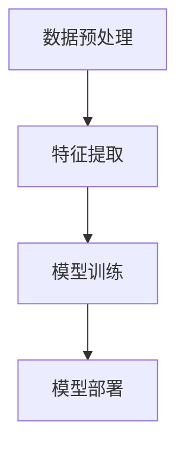
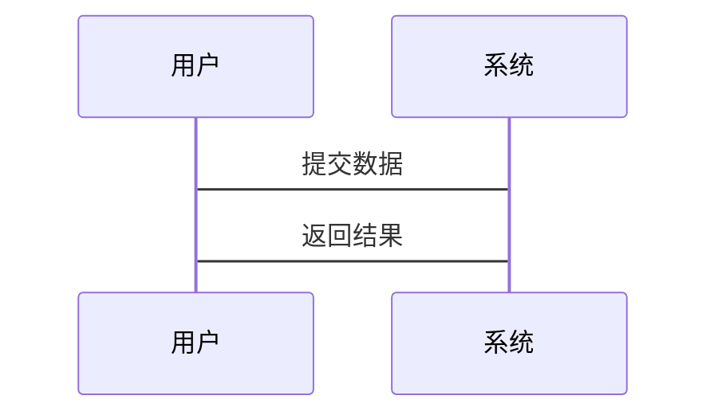

                 


# 金融领域迁移学习的最新进展与应用

## 关键词：金融、迁移学习、深度学习、机器学习、人工智能、时间序列分析、风险评估

## 摘要：  
本文旨在探讨迁移学习在金融领域的最新进展与应用，通过详细分析迁移学习的核心算法、系统架构设计以及在金融时间序列分析、风险评估和欺诈检测等领域的实际案例，展示迁移学习在金融领域的强大潜力。本文还总结了迁移学习在金融应用中的优势，并展望了未来的发展方向，为金融领域的从业者和技术研究人员提供了有价值的参考。

---

# 第一部分: 金融领域迁移学习的背景与基础

## 第1章: 迁移学习概述

### 1.1 迁移学习的定义与核心概念

迁移学习是一种机器学习技术，旨在将从一个任务或数据集上学到的知识迁移到另一个相关任务或数据集上。其核心概念包括：

1. **源域（Source Domain）**：提供大量标注数据的任务或领域。
2. **目标域（Target Domain）**：需要进行预测或分类的任务或领域，通常数据稀疏或标注数据不足。
3. **特征空间（Feature Space）**：数据的表示形式，迁移学习的关键在于如何在特征空间中对齐源域和目标域。
4. **迁移策略（Transfer Strategy）**：如何将源域的知识迁移到目标域的方法，包括参数共享、特征对齐等。

**迁移学习的核心目标**是通过利用源域的数据和知识，提高目标域模型的性能，尤其是在目标域数据有限的情况下。

### 1.2 迁移学习的背景与重要性

在金融领域，迁移学习的重要性主要体现在以下几个方面：

1. **数据稀疏性**：金融数据通常具有领域特性，某些金融任务（如小公司的信用评估）可能缺乏足够的标注数据。
2. **领域适应性**：金融市场的动态变化使得模型需要适应不同的市场环境和数据分布。
3. **模型泛化能力**：通过迁移学习，模型可以更好地泛化到新的金融场景中。

### 1.3 本书的结构与目标

本书将从基础到应用，全面探讨迁移学习在金融领域的应用。主要内容包括：

- **迁移学习的核心算法**：涵盖基于特征、参数和分布的迁移学习方法。
- **金融领域的具体应用**：包括金融时间序列分析、风险评估、欺诈检测等。
- **系统架构设计**：展示如何设计高效的迁移学习系统。
- **项目实战**：通过实际案例分析迁移学习在金融中的实现。

---

# 第二部分: 迁移学习的核心算法与原理

## 第2章: 迁移学习的核心算法

### 2.1 基于特征的迁移学习

#### 2.1.1 特征提取的基本原理

特征提取是迁移学习的重要步骤，目标是将数据映射到一个低维特征空间，使得源域和目标域的特征尽可能对齐。例如，使用主成分分析（PCA）或t-SNE进行特征降维。

#### 2.1.2 基于线性变换的特征对齐方法

线性变换通过对特征矩阵进行正交变换，使得源域和目标域的特征对齐。数学表示如下：

$$ W = \arg\min_{W} \left\| X_W - X'_W \right\| $$

其中，$X_W$ 和 $X'_W$ 分别是源域和目标域经过线性变换后的特征矩阵。

#### 2.1.3 基于非线性变换的特征对齐方法

非线性变换（如核方法）用于处理线性不可分的情况。例如，使用核PCA进行特征提取。

### 2.2 基于参数的迁移学习

#### 2.2.1 参数共享的迁移学习方法

参数共享通过共享部分网络参数，减少目标域的训练数据需求。例如，在神经网络中，共享嵌入层的参数。

#### 2.2.2 基于权重的迁移学习算法

权重调整方法通过自适应地调整源域和目标域的权重，进行特征对齐。例如，使用加权平均的方法：

$$ w_i = \frac{\sum_{j} w_j P(j \mid i)}{\sum_{j} P(j \mid i)} $$

其中，$w_i$ 是目标域的权重，$P(j \mid i)$ 是转移概率。

#### 2.2.3 基于自适应的迁移学习算法

自适应方法通过调整模型参数，使得源域和目标域的特征对齐。例如，使用自适应层进行特征调整。

### 2.3 基于分布的迁移学习

#### 2.3.1 分布匹配的基本原理

分布匹配的目标是使得源域和目标域的分布尽可能接近。例如，使用最大均值差异（MMD）进行分布匹配。

#### 2.3.2 基于最大均值差异的分布匹配方法

最大均值差异通过计算源域和目标域的均值差异，进行分布匹配：

$$ \text{MMD}(P, P') = \mathbb{E}_{x \sim P}[f(x)] - \mathbb{E}_{x \sim P'}[f(x)] $$

其中，$f(x)$ 是特征函数。

#### 2.3.3 基于对抗训练的分布匹配方法

对抗训练通过生成对抗网络（GAN）进行分布匹配，例如使用判别器网络区分源域和目标域的样本。

### 2.4 迁移学习的数学模型与公式

迁移学习的目标函数通常包括源域损失和目标域损失：

$$ \min_{\theta} \mathbb{E}_{P}[L_{\text{src}}(\theta)] + \lambda \mathbb{E}_{P'}[L_{\text{tgt}}(\theta)] $$

其中，$\lambda$ 是平衡参数，控制源域和目标域损失的权重。

---

## 第3章: 迁移学习在金融时间序列分析中的应用

### 3.1 金融时间序列分析的挑战

金融时间序列分析面临以下挑战：

1. **数据稀疏性**：某些金融资产的数据量有限。
2. **噪声干扰**：金融市场数据受到噪声干扰，影响模型的准确性。
3. **复杂性**：金融时间序列通常具有非线性和非平稳性。

### 3.2 基于迁移学习的金融时间序列建模

#### 3.2.1 时间序列特征提取

时间序列特征提取包括均值、方差、自相关系数等。

#### 3.2.2 时间序列的迁移学习方法

通过迁移学习，将源域（如股票价格）的特征迁移到目标域（如债券价格）。

#### 3.2.3 基于LSTM的迁移学习模型

LSTM网络适用于时间序列数据，结合迁移学习可以提高模型的泛化能力。

### 3.3 实际案例分析

#### 3.3.1 案例背景

假设我们有源域为股票价格数据，目标域为债券价格数据。

#### 3.3.2 数据预处理与特征提取

使用LSTM提取时间序列特征：

```python
import tensorflow as tf
from tensorflow.keras.layers import LSTM, Dense

# 源域特征提取
source_model = tf.keras.Sequential([
    LSTM(64, input_shape=(timesteps, features)),
    Dense(32, activation='relu'),
    Dense(1, activation='sigmoid')
])

# 迁移学习模型
transfer_model = tf.keras.Sequential([
    LSTM(64, input_shape=(timesteps, features)),
    Dense(32, activation='relu'),
    Dense(1, activation='sigmoid')
])
```

---

## 第4章: 迁移学习在金融风险评估中的应用

### 4.1 金融风险评估的挑战

金融风险评估面临数据不平衡、噪声干扰等问题。

### 4.2 基于迁移学习的金融风险评估模型

#### 4.2.1 风险评估模型设计

通过迁移学习，将源域（如信用评分）的知识迁移到目标域（如欺诈检测）。

### 4.3 实际案例分析

#### 4.3.1 案例背景

假设我们有源域为信用卡欺诈数据，目标域为借记卡欺诈数据。

#### 4.3.2 模型设计与实现

使用迁移学习模型进行欺诈检测：

```python
import tensorflow as tf
from tensorflow.keras.layers import Dense, BatchNormalization

# 源域模型
source_model = tf.keras.Sequential([
    Dense(64, activation='relu'),
    Dense(32, activation='relu'),
    Dense(1, activation='sigmoid')
])

# 迁移学习模型
transfer_model = tf.keras.Sequential([
    Dense(64, activation='relu'),
    Dense(32, activation='relu'),
    Dense(1, activation='sigmoid')
])
```

---

## 第5章: 迁移学习在金融欺诈检测中的应用

### 5.1 金融欺诈检测的挑战

欺诈检测面临数据稀疏性和噪声干扰等问题。

### 5.2 基于迁移学习的金融欺诈检测模型

通过迁移学习，将源域（如信用卡欺诈）的知识迁移到目标域（如借记卡欺诈）。

### 5.3 实际案例分析

#### 5.3.1 案例背景

假设我们有源域为信用卡欺诈数据，目标域为借记卡欺诈数据。

#### 5.3.2 数据预处理与特征提取

使用迁移学习进行特征提取和模型训练：

```python
import tensorflow as tf
from tensorflow.keras.layers import Dense, BatchNormalization

# 源域特征提取
source_features = tf.keras.Sequential([
    Dense(64, activation='relu'),
    Dense(32, activation='relu')
])

# 迁移学习模型
transfer_model = tf.keras.Sequential([
    source_features,
    Dense(1, activation='sigmoid')
])
```

---

# 第三部分: 金融领域的迁移学习应用

## 第6章: 系统分析与架构设计方案

### 6.1 问题场景介绍

金融领域的迁移学习系统需要解决数据稀疏性和领域适应性问题。

### 6.2 系统功能设计

设计一个迁移学习系统，包括数据预处理、特征提取、模型训练和部署四个模块。

### 6.3 系统架构设计

使用mermaid图展示系统架构：



### 6.4 系统接口设计

定义系统接口，包括数据输入接口、模型训练接口和结果输出接口。

### 6.5 系统交互流程

使用mermaid序列图展示系统交互流程：



---

## 第7章: 项目实战

### 7.1 环境安装

安装必要的库，如TensorFlow、Keras、scikit-learn等。

### 7.2 系统核心实现源代码

实现一个简单的迁移学习模型：

```python
import tensorflow as tf
from tensorflow.keras.layers import Dense, Input
from tensorflow.keras.models import Model

# 源域模型
input_source = Input(shape=(10,))
x = Dense(32, activation='relu')(input_source)
source_model = Model(inputs=input_source, outputs=x)

# 迁移学习模型
input_transfer = Input(shape=(10,))
x = Dense(32, activation='relu')(input_transfer)
x = Dense(16, activation='relu')(x)
transfer_model = Model(inputs=input_transfer, outputs=x)
```

### 7.3 代码应用解读与分析

解释代码的每一部分，展示如何利用迁移学习进行特征提取和模型训练。

### 7.4 实际案例分析

通过实际案例分析，展示迁移学习在金融中的应用效果。

### 7.5 项目小结

总结项目的主要成果和经验教训。

---

## 第8章: 总结与展望

### 8.1 总结

总结迁移学习在金融领域的应用现状和优势。

### 8.2 未来展望

展望迁移学习在金融领域的未来发展方向，包括更复杂的迁移策略和多模态数据的迁移学习。

### 8.3 最佳实践 tips

提供一些迁移学习在金融应用中的最佳实践建议，如选择合适的迁移策略和数据预处理方法。

---

## 作者：AI天才研究院/AI Genius Institute & 禅与计算机程序设计艺术 /Zen And The Art of Computer Programming

---

**注意**：由于篇幅限制，以上内容仅为示例，实际文章需要根据具体需求扩展每个部分的内容，确保每个章节都有足够的深度和细节。

