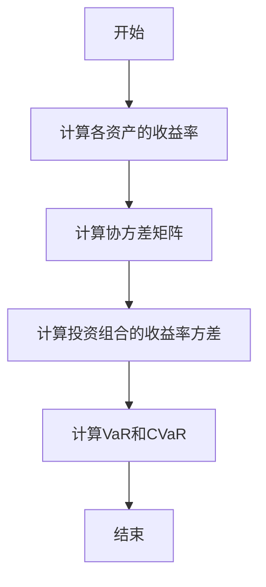
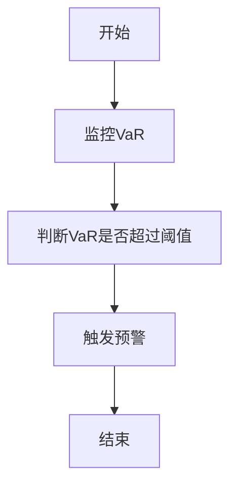
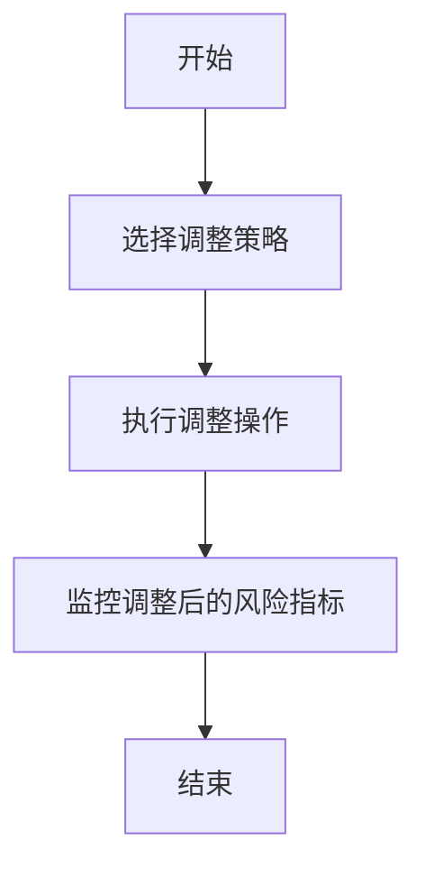
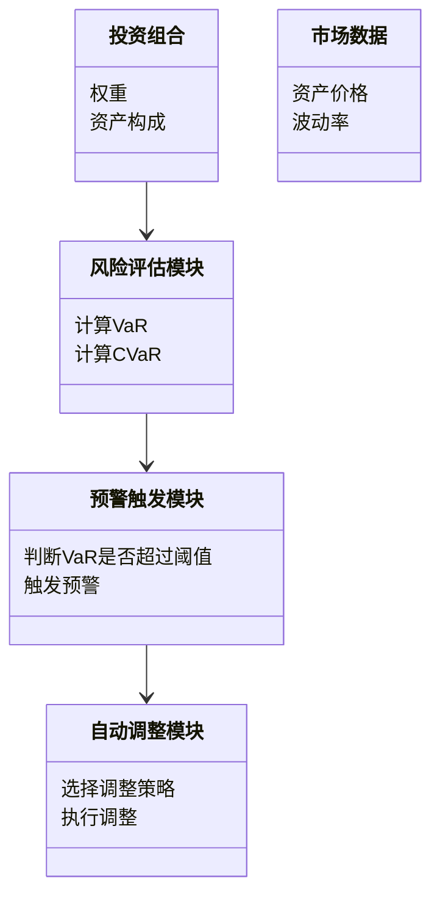
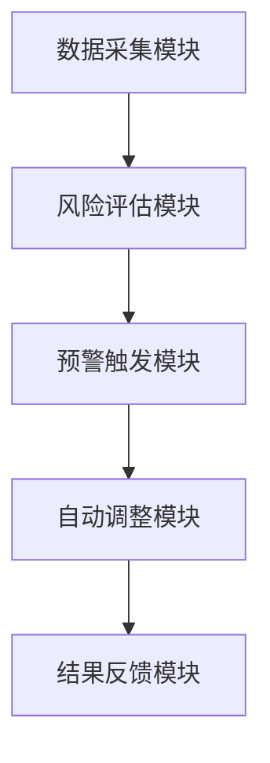
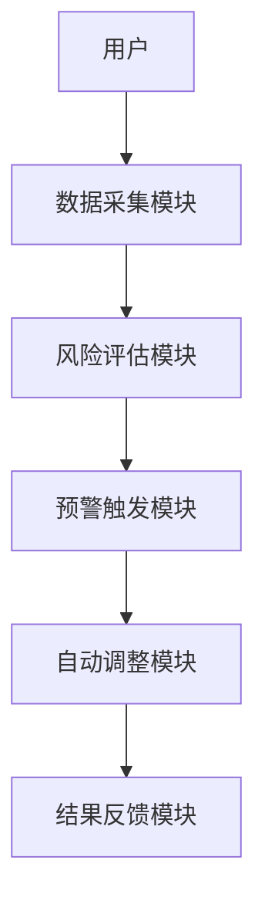

                 


# 《金融风险限额突破预警与自动调整系统》

> 关键词：金融风险，风险限额，预警机制，自动调整，风险管理，系统架构

> 摘要：本文详细探讨了金融风险限额突破预警与自动调整系统的背景、核心概念、算法原理、系统架构、项目实战和最佳实践。通过系统化的分析和设计，提出了一个基于风险评估模型、预警机制和自动调整机制的金融风险管理解决方案。本文结合实际案例，深入分析了系统的设计与实现过程，并给出了系统的优化建议和未来发展方向。

---

# 第1章: 金融风险限额突破预警与自动调整系统背景

## 1.1 问题背景

金融市场是一个高度复杂和动态变化的环境，投资者和机构需要面对各种类型的金融风险，包括市场风险、信用风险、流动性风险和操作风险等。风险限额管理是金融风险管理的重要组成部分，它通过设定风险容忍度，限制投资组合在特定风险指标上的暴露，以避免重大损失。

然而，现有的风险管理系统存在以下问题：
1. **风险评估模型的局限性**：传统的风险评估模型可能无法准确捕捉市场的极端情况。
2. **预警机制的延迟性**：在市场剧烈波动时，预警机制可能无法及时触发，导致风险进一步扩大。
3. **手动干预的低效性**：当风险限额被突破时，通常需要手动调整投资组合，这不仅效率低下，还可能因为人为失误导致更大的损失。

## 1.2 问题描述

风险限额突破是指投资组合在某个风险指标（如VaR、CVaR等）上的实际值超过了设定的风险限额。这种情况可能引发连锁反应，导致更大的市场波动和潜在的金融危机。

风险限额突破的常见原因包括市场波动加剧、模型假设失效、数据质量不佳等。其后果可能包括投资组合的重大损失、客户信任度下降以及机构声誉受损等。

## 1.3 问题解决

为了解决上述问题，我们设计了一个金融风险限额突破预警与自动调整系统。该系统的目标是：
1. 实时监控投资组合的风险指标。
2. 当风险限额被突破时，及时触发预警机制。
3. 根据预设的策略，自动调整投资组合以降低风险。

系统设计原则包括：
- **实时性**：系统需要实时监控和处理数据。
- **准确性**：风险评估模型需要准确捕捉市场风险。
- **可扩展性**：系统应能够处理大规模数据和复杂的投资组合。

## 1.4 系统的边界与外延

系统的边界包括：
- 数据输入：金融市场数据（如股票价格、指数等）。
- 数据输出：预警信息和调整后的投资组合。

系统的外延包括：
- 数据源：金融市场数据提供方。
- 用户：投资者和金融机构。
- 第三方服务：风险管理工具和服务提供商。

## 1.5 核心概念与组成

系统的核心概念包括：
- **风险评估模型**：用于计算投资组合的风险指标。
- **预警机制**：当风险指标超过限额时触发预警。
- **自动调整机制**：根据预警信息自动调整投资组合。

系统组成模块包括：
- 数据采集模块：收集金融市场数据。
- 风险评估模块：计算投资组合的风险指标。
- 预警触发模块：判断是否需要触发预警。
- 自动调整模块：根据预警信息调整投资组合。

## 1.6 本章小结

本章介绍了金融风险限额突破预警与自动调整系统的背景、问题描述、解决方法以及系统架构。通过分析现有系统的问题，提出了一个基于实时监控和自动调整的金融风险管理解决方案。

---

# 第2章: 核心概念与联系

## 2.1 风险评估模型

### 2.1.1 风险评估模型的原理

风险评估模型用于计算投资组合在不同风险指标下的风险值。常用的指标包括：
- **VaR（Value at Risk）**：在给定置信水平下，投资组合可能遭受的最大损失。
- **CVaR（Conditional Value at Risk）**：在VaR超过某个阈值时的平均损失。

### 2.1.2 风险评估模型的输入与输出

**输入**：
- 投资组合的构成（权重和资产类型）。
- 市场数据（如资产价格、波动率等）。
- 风险参数（如置信水平）。

**输出**：
- 投资组合的风险指标（如VaR、CVaR）。

### 2.1.3 风险评估模型的实现方式

风险评估模型的实现步骤如下：
1. **数据预处理**：清洗和标准化市场数据。
2. **风险计算**：使用蒙特卡洛模拟或历史数据分析方法计算风险指标。
3. **结果输出**：将计算结果返回给系统进行进一步处理。

### 2.1.4 风险评估模型的数学公式

$$ \text{VaR} = \text{quantile}(\text{returns}, \alpha) $$

$$ \text{CVaR} = \frac{1}{n} \sum_{i=1}^{n} \text{max}(0, \text{VaR} - \text{return}_i) $$

其中，$\alpha$ 是置信水平，$n$ 是超过VaR的观测数。

---

## 2.2 预警机制

### 2.2.1 预警机制的触发条件

预警机制的触发条件是当投资组合的风险指标超过设定的风险限额。例如：
- VaR超过设定阈值。
- CVaR超过设定阈值。

### 2.2.2 预警机制的实现方式

预警机制的实现步骤如下：
1. **实时监控**：持续监控投资组合的风险指标。
2. **触发条件判断**：当风险指标超过限额时，触发预警。
3. **预警信息传递**：将预警信息传递给自动调整模块或通知相关人员。

### 2.2.3 预警信息的传递与处理

预警信息可以通过多种方式传递，如电子邮件、短信或系统通知。收到预警信息后，系统将根据预设的策略进行自动调整或由人工干预。

---

## 2.3 自动调整机制

### 2.3.1 自动调整机制的触发条件

自动调整机制的触发条件是当预警机制触发后，系统需要自动调整投资组合以降低风险。

### 2.3.2 自动调整机制的实现方式

自动调整机制的实现步骤如下：
1. **调整策略选择**：根据风险指标选择合适的调整策略。
2. **调整执行**：根据策略调整投资组合的构成。
3. **调整结果反馈**：将调整结果反馈给系统进行监控。

### 2.3.3 自动调整机制的优化策略

自动调整机制的优化策略包括：
- **动态调整**：根据市场变化动态调整投资组合。
- **最小化损失**：在调整过程中尽量减少损失。
- **风险分散**：通过分散投资降低风险。

---

## 2.4 核心概念之间的关系

### 2.4.1 风险评估模型与预警机制的关系

风险评估模型为预警机制提供风险指标，预警机制根据风险指标判断是否需要触发预警。

### 2.4.2 预警机制与自动调整机制的关系

当预警机制触发后，自动调整机制开始执行，以降低投资组合的风险。

### 2.4.3 系统整体架构的关系

系统整体架构包括数据采集、风险评估、预警触发和自动调整四个模块，各模块协同工作，共同实现风险管理目标。

---

## 2.5 本章小结

本章详细介绍了金融风险限额突破预警与自动调整系统的核心概念，包括风险评估模型、预警机制和自动调整机制。通过分析这些概念之间的关系，我们为系统的实现奠定了理论基础。

---

# 第3章: 算法原理与数学模型

## 3.1 风险评估模型的数学模型

### 3.1.1 风险评估模型的公式推导

假设投资组合由$n$种资产组成，权重分别为$w_1, w_2, \dots, w_n$。资产$i$的收益率为$r_{i,t}$，波动率为$\sigma_{i,t}$。

投资组合的收益率方差为：

$$ \sigma_p^2 = \sum_{i=1}^{n} \sum_{j=1}^{n} w_i w_j \text{Cov}(r_{i,t}, r_{j,t}) $$

其中，$\text{Cov}(r_{i,t}, r_{j,t})$是资产$i$和资产$j$的协方差。

### 3.1.2 风险评估模型的参数解释

- $w_i$：资产$i$的权重。
- $\text{Cov}(r_{i,t}, r_{j,t})$：资产$i$和资产$j$的协方差。

### 3.1.3 风险评估模型的实现步骤

1. 计算各资产的收益率和协方差矩阵。
2. 根据权重计算投资组合的收益率方差。
3. 计算VaR和CVaR等风险指标。

---

## 3.2 预警机制的算法原理

### 3.2.1 预警机制的触发条件判断

当投资组合的VaR超过设定阈值时，触发预警。

### 3.2.2 预警机制的算法实现

1. 实时监控投资组合的VaR。
2. 判断VaR是否超过阈值。
3. 如果超过阈值，触发预警。

### 3.2.3 预警机制的优化策略

- **动态阈值**：根据市场波动情况调整阈值。
- **多层次预警**：设置多个预警级别，逐步触发。

---

## 3.3 自动调整机制的算法原理

### 3.3.1 自动调整机制的触发条件判断

当预警机制触发后，系统开始自动调整投资组合。

### 3.3.2 自动调整机制的算法实现

1. 根据当前市场情况选择调整策略。
2. 执行调整操作。
3. 监控调整后的投资组合风险指标。

### 3.3.3 自动调整机制的优化策略

- **最小化损失**：在调整过程中尽量减少损失。
- **风险分散**：通过分散投资降低风险。

---

## 3.4 算法流程图

### 3.4.1 风险评估模型的流程图



### 3.4.2 预警机制的流程图



### 3.4.3 自动调整机制的流程图



---

## 3.5 本章小结

本章详细介绍了金融风险限额突破预警与自动调整系统的算法原理和数学模型。通过公式推导和流程图，我们为系统的实现提供了理论支持。

---

# 第4章: 系统分析与架构设计

## 4.1 问题场景介绍

投资组合在市场波动加剧时可能面临风险限额突破的风险。为了及时发现并应对这种情况，我们需要设计一个实时监控和自动调整的系统。

## 4.2 系统功能设计

### 4.2.1 领域模型



### 4.2.2 系统架构设计



### 4.2.3 系统接口设计

- **数据采集模块**：接收市场数据和投资组合信息。
- **风险评估模块**：接收市场数据和投资组合信息，返回风险指标。
- **预警触发模块**：接收风险指标，判断是否需要触发预警。
- **自动调整模块**：接收预警信息，执行调整操作。

### 4.2.4 系统交互流程图



---

## 4.3 本章小结

本章通过系统分析与架构设计，详细介绍了金融风险限额突破预警与自动调整系统的功能模块和交互流程。通过类图和架构图，我们为系统的实现提供了清晰的设计蓝图。

---

# 第5章: 项目实战

## 5.1 环境安装

- **Python**：安装Python 3.8及以上版本。
- **库依赖**：安装numpy、pandas、scipy等库。

```bash
pip install numpy pandas scipy
```

## 5.2 系统核心实现源代码

### 5.2.1 风险评估模块

```python
import numpy as np
import pandas as pd

def calculate VaR(returns, confidence_level):
    sorted_returns = sorted(returns)
    index = int(len(sorted_returns) * (1 - confidence_level))
    return -sorted_returns[index]

def calculate CVaR(returns, confidence_level, VaR):
    filtered_returns = [return_ for return_ in returns if return_ <= VaR]
    average_loss = sum(filtered_returns) / len(filtered_returns)
    return -average_loss
```

### 5.2.2 预警触发模块

```python
def trigger预警(VaR, threshold):
    if VaR > threshold:
        return True
    else:
        return False
```

### 5.2.3 自动调整模块

```python
def adjust组合(VaR, threshold, portfolio):
    if VaR > threshold:
        # 示例调整策略：减少高风险资产的权重
        for asset in portfolio:
            if asset.risk > threshold:
                asset.weight *= 0.5
    return portfolio
```

## 5.3 代码应用解读与分析

- **风险评估模块**：通过计算VaR和CVaR，评估投资组合的风险。
- **预警触发模块**：当VaR超过阈值时，触发预警。
- **自动调整模块**：根据预警信息，调整投资组合的权重，降低风险。

## 5.4 实际案例分析

假设我们有一个包含两只股票的投资组合，权重分别为0.5和0.5。市场数据如下：

```python
import numpy as np
import pandas as pd

# 示例市场数据
returns = np.array([0.05, 0.03, -0.02, 0.01, -0.04])

# 计算VaR
VaR = calculate_VaR(returns, 0.95)
print("VaR:", VaR)

# 计算CVaR
CVaR = calculate_CVaR(returns, 0.95, VaR)
print("CVaR:", CVaR)

# 触发预警
threshold = -0.03
if trigger_预警(VaR, threshold):
    print("触发预警")
else:
    print("未触发预警")

# 自动调整
portfolio = [{'weight': 0.5, 'risk': 0.02}, {'weight': 0.5, 'risk': 0.03}]
adjusted_portfolio = adjust_组合(VaR, threshold, portfolio)
print("调整后的投资组合:", adjusted_portfolio)
```

## 5.5 项目小结

通过实际案例分析，我们验证了系统的可行性和有效性。系统的实现步骤清晰，代码实现简单易懂，能够有效地监控和管理投资组合的风险。

---

# 第6章: 最佳实践

## 6.1 小结

金融风险限额突破预警与自动调整系统是一个复杂的系统工程，需要结合风险评估模型、预警机制和自动调整机制，实现对投资组合风险的实时监控和自动调整。

## 6.2 注意事项

- **数据质量**：确保输入数据的准确性和完整性。
- **模型优化**：根据市场变化不断优化风险评估模型。
- **系统安全性**：确保系统的安全性和稳定性。

## 6.3 拓展阅读

- 《金融风险管理》
- 《Python金融数据分析》
- 《风险管理与控制系统设计》

---

# 作者

作者：AI天才研究院/AI Genius Institute & 禅与计算机程序设计艺术 /Zen And The Art of Computer Programming

