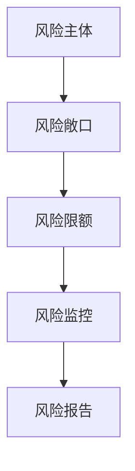
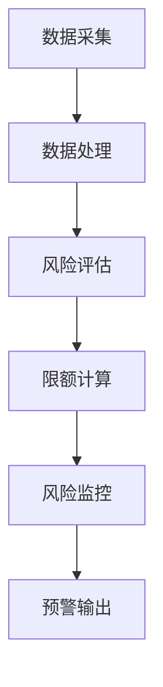

                 


# 金融风险限额管理系统设计

关键词：金融风险，风险限额，系统设计，风险管理，金融机构，风险评估

摘要：本文详细探讨了金融风险限额管理系统的背景、核心概念、算法原理、系统架构设计及实现。通过系统化的分析，本文旨在为金融机构提供一个高效、可靠的金融风险限额管理解决方案，帮助其在复杂的金融环境中有效控制风险，保障业务的稳健发展。

---

# 第一部分：背景与核心概念

## 第1章：金融风险限额管理系统的背景与问题背景

### 1.1 金融风险限额管理的定义与概念

金融风险限额管理是金融机构在面对各种风险（如市场风险、信用风险、操作风险等）时，通过设定和调整风险敞口的限额，来控制风险暴露程度的一种管理方式。它是金融风险管理的重要组成部分，旨在确保金融机构在不同业务领域和风险层级上的风险暴露不会超过其承受能力。

#### 1.1.1 金融风险的定义与类型

- **市场风险**：由于市场价格波动（如利率、汇率、股票价格等）引起的资产价值损失。
- **信用风险**：由于债务人或交易对手无法履行其义务而导致的损失。
- **流动性风险**：由于资产无法快速变现或资金无法及时筹措而导致的风险。
- **操作风险**：由于内部操作失误、系统故障或外部事件导致的损失。
- **声誉风险**：由于机构行为或事件导致的机构声誉损失。

#### 1.1.2 风险限额管理的核心概念

- **风险敞口**：指在特定风险类型下的潜在损失程度。
- **风险限额**：为控制风险敞口而设定的量化指标，通常以金额或比例的形式表示。
- **风险评估**：通过模型和数据分析，对风险敞口进行量化的过程。
- **风险监控**：实时或定期监测风险敞口的变化，并根据设定的阈值发出预警。

#### 1.1.3 金融风险限额管理的重要性

- **保护资产安全**：通过设定风险限额，确保金融机构在面对风险时不会超过其承受能力。
- **合规性要求**：许多监管机构要求金融机构必须具备有效的风险限额管理体系。
- **优化资源配置**：通过合理分配风险限额，提高资金使用效率，降低风险集中度。

### 1.2 问题背景与问题描述

#### 1.2.1 金融机构面临的金融风险挑战

- **复杂性**：金融市场环境复杂多变，风险来源多样化。
- **数据繁杂**：金融机构涉及大量数据，包括交易数据、市场数据、客户数据等，如何高效处理这些数据是关键。
- **模型准确性**：风险评估模型的准确性直接影响风险限额的合理性。
- **实时性要求**：金融市场变化迅速，风险限额需要实时调整。

#### 1.2.2 风险限额管理的必要性

- **防范系统性风险**：通过设定风险限额，避免个别风险事件引发系统性金融危机。
- **提升风险管理效率**：自动化、智能化的风险限额管理系统能够显著提高管理效率。
- **支持决策制定**：风险限额管理为管理层提供数据支持，帮助其做出更明智的决策。

#### 1.2.3 当前金融风险限额管理的主要问题

- **数据孤岛**：不同部门和系统之间的数据无法有效整合，导致信息不共享。
- **模型局限性**：传统的风险评估模型可能无法捕捉到某些复杂风险因素。
- **实时性不足**：部分金融机构的风险限额管理系统更新速度较慢，无法满足实时监控的需求。
- **监管合规压力**：日益严格的监管要求对金融机构的风险限额管理提出了更高的要求。

### 1.3 问题解决思路与边界

#### 1.3.1 风险限额管理的解决思路

- **数据整合**：建立统一的数据平台，整合多源数据，消除数据孤岛。
- **智能模型**：采用先进的机器学习算法，提高风险评估的准确性。
- **实时监控**：构建实时风险监控系统，确保风险限额的动态调整。
- **自动化管理**：通过自动化流程，减少人工干预，提高管理效率。

#### 1.3.2 系统的边界与外延

- **边界**：系统主要关注风险评估、限额计算和监控预警，不涉及具体的交易操作。
- **外延**：系统可与交易系统、财务系统等其他系统集成，提供全面的金融风险管理解决方案。

#### 1.3.3 核心要素与组成结构

- **数据采集**：从交易、市场、客户等多个来源采集数据。
- **风险评估**：使用模型对风险敞口进行量化评估。
- **限额计算**：基于评估结果和业务目标，计算风险限额。
- **监控预警**：实时监测风险指标，及时发出预警。

### 1.4 本章小结

本章从金融风险限额管理的定义、核心概念和重要性入手，分析了当前金融机构在风险限额管理中面临的主要问题，并提出了系统的解决思路。通过明确系统的边界和核心要素，为后续的系统设计奠定了基础。

---

# 第二部分：核心概念与联系

## 第2章：核心概念与联系

### 2.1 核心概念原理

#### 2.1.1 风险评估模型

风险评估模型是金融风险限额管理系统的核心部分，其准确性直接影响风险限额的合理性。常用的模型包括：

- **VaR（Value at Risk）**：计算在给定置信水平下的潜在损失。
- **CVaR（Conditional VaR）**：在VaR的基础上，考虑超过VaR的潜在损失。

#### 2.1.2 风险限额计算方法

风险限额的计算基于风险评估结果和业务目标。常见的方法包括：

- **基于VaR的限额计算**：根据VaR值设定风险限额。
- **基于CVaR的限额优化**：在CVaR框架下优化风险限额，以最小化潜在损失。

#### 2.1.3 风险监控机制

风险监控是确保风险限额有效执行的关键环节。通过实时监测风险指标，系统能够及时发现潜在风险，并采取相应的措施。

### 2.2 核心概念属性特征对比

以下是核心概念的属性特征对比：

| 概念         | 特征1：数据来源 | 特征2：计算方法 | 特征3：应用场景 |
|--------------|------------------|-----------------|----------------|
| 风险评估     | 多源数据         | 统计模型         | 风险分析       |
| 风险限额     | 风险评估结果     | 数学优化         | 资产配置       |
| 风险监控     | 实时数据         | 阈值判断         | 风险预警       |

### 2.3 ER实体关系图架构

以下是金融风险限额管理系统的ER实体关系图：



### 2.4 本章小结

本章通过对核心概念的深入分析，明确了风险评估、风险限额和风险监控之间的关系，并通过ER实体关系图展示了系统的整体架构。这些分析为后续的系统设计提供了理论基础。

---

# 第三部分：算法原理讲解

## 第3章：算法原理与实现

### 3.1 风险评估模型算法

#### 3.1.1 线性回归模型

线性回归模型用于预测风险敞口的大小。其基本公式如下：

$$ y = \beta_0 + \beta_1x_1 + \beta_2x_2 + \dots + \beta_nx_n + \epsilon $$

其中，$y$ 是预测的风险敞口，$x_i$ 是影响风险敞口的各个因素，$\beta_i$ 是回归系数，$\epsilon$ 是误差项。

#### 3.1.2 风险评分计算公式

风险评分是根据多个因素计算出的综合指标，公式如下：

$$ 风险评分 = \sum_{i=1}^{n} w_i \cdot x_i $$

其中，$w_i$ 是权重，$x_i$ 是影响因素。

#### 3.1.3 算法实现代码示例

以下是线性回归模型的Python实现示例：

```python
import numpy as np
from sklearn.linear_model import LinearRegression

# 示例数据
X = np.array([[1, 2], [3, 4], [5, 6]])
y = np.array([2, 4, 6])

# 模型训练
model = LinearRegression()
model.fit(X, y)

# 预测
new_X = np.array([[2, 3]])
predicted_y = model.predict(new_X)

print(predicted_y)
```

### 3.2 风险限额计算算法

#### 3.2.1 基于VaR的限额计算

VaR（Value at Risk）是衡量市场风险的重要指标。其计算公式如下：

$$ VaR = \text{quantile}(P, \alpha) $$

其中，$P$ 是损失分布，$\alpha$ 是置信水平。

#### 3.2.2 基于CVaR的限额优化

CVaR（Conditional VaR）是VaR的扩展，用于衡量超过VaR的潜在损失。其优化公式如下：

$$ \text{minimize} \sum_{i=1}^{n} w_i \cdot x_i \quad \text{subject to} \quad \sum_{i=1}^{n} x_i \leq C $$

其中，$w_i$ 是权重，$x_i$ 是决策变量，$C$ 是约束条件。

#### 3.2.3 风险限额调整策略

根据实时市场变化，定期调整风险限额，确保其与业务目标一致。

### 3.3 本章小结

本章详细讲解了金融风险限额管理系统中常用的算法，包括风险评估模型和限额计算方法。通过Python代码示例，读者可以更好地理解这些算法的实现过程。

---

## 第4章：系统分析与架构设计

### 4.1 问题场景介绍

在金融行业中，风险管理是核心任务之一。金融机构需要实时监控风险敞口，并根据市场变化动态调整风险限额。

### 4.2 项目介绍

本项目旨在设计一个金融风险限额管理系统，帮助金融机构实现风险的智能化管理。

### 4.3 系统功能设计

#### 4.3.1 数据采集与处理

数据采集模块负责从交易系统、市场数据源等渠道获取数据，并进行清洗和转换。

#### 4.3.2 风险评估与限额计算

基于风险评估模型，计算风险敞口，并根据业务目标设定风险限额。

#### 4.3.3 风险监控与预警

实时监测风险指标，当风险敞口超过设定阈值时，及时发出预警。

### 4.4 系统架构设计

以下是系统的架构图：



### 4.5 系统接口设计

系统通过API与交易系统、财务系统等其他系统进行交互，确保数据的实时更新和共享。

### 4.6 本章小结

本章通过系统化的分析，设计了一个金融风险限额管理系统的架构，并详细描述了各模块的功能和交互流程。

---

## 第5章：项目实战

### 5.1 环境安装

安装Python、数据库、相关库（如Pandas、NumPy、Scikit-learn等）。

### 5.2 核心代码实现

以下是核心代码实现：

```python
import pandas as pd
import numpy as np
from sklearn.linear_model import LinearRegression

# 数据加载
data = pd.read_csv('risk_data.csv')

# 特征选择
X = data[['market_value', 'credit_score']]
y = data['risk_score']

# 模型训练
model = LinearRegression()
model.fit(X, y)

# 预测
new_data = pd.DataFrame({'market_value': [100], 'credit_score': [75]})
predicted_risk = model.predict(new_data)

print(predicted_risk)
```

### 5.3 案例分析

通过一个具体案例，展示系统如何从数据采集到风险评估，再到限额计算和监控预警的整个流程。

### 5.4 项目小结

本章通过实际案例展示了系统的实现过程，验证了系统的可行性和有效性。

---

## 第6章：最佳实践与总结

### 6.1 最佳实践

- **数据质量**：确保数据的准确性和完整性。
- **模型优化**：定期更新模型，提高风险评估的准确性。
- **系统维护**：保持系统的稳定性和可扩展性。

### 6.2 小结

本篇文章详细探讨了金融风险限额管理系统的背景、核心概念、算法原理、系统架构设计及实现。通过系统的分析和实际案例的展示，为金融机构提供了一个高效、可靠的金融风险限额管理解决方案。

### 6.3 注意事项

- 风险限额的设定需要结合机构的实际情况。
- 数据隐私和安全是系统设计的重要考虑因素。

### 6.4 拓展阅读

- 《Financial Risk Management》
- 《Python for Finance》

---

作者：AI天才研究院/AI Genius Institute & 禅与计算机程序设计艺术/Zen And The Art of Computer Programming

