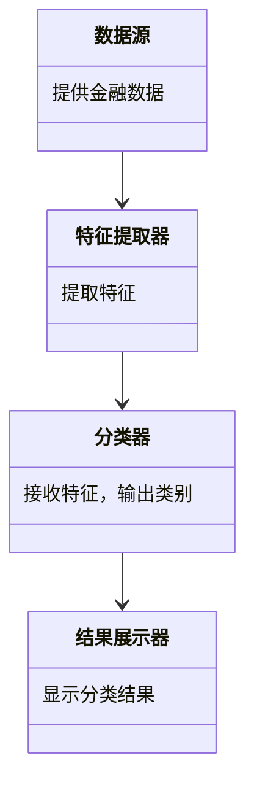

                 


# 《金融高频交易信号检测与分类》

## 关键词：高频交易, 信号检测, 信号分类, 机器学习, 深度学习, 金融数据

## 摘要：  
本文系统地探讨了金融高频交易中的信号检测与分类问题，从理论基础到实际应用进行了全面分析。首先介绍了高频交易的基本概念和信号检测的重要性，随后深入分析了金融数据的特征提取和预处理方法。接着，详细讲解了基于统计、机器学习和深度学习的多种信号检测与分类算法，并通过对比分析选择最优算法。最后，结合实际案例，展示了系统设计与实现，并总结了最佳实践和未来研究方向。

---

# 第一部分: 金融高频交易信号检测与分类基础

# 第1章: 高频交易与信号检测概述

## 1.1 高频交易的基本概念  
### 1.1.1 高频交易的定义  
高频交易（High-Frequency Trading, HFT）是指在极短时间内进行的大量金融交易，通常由算法驱动，利用微小的价格波动获利。  

### 1.1.2 高频交易的特点  
- **高速性**：交易决策和执行时间极短（通常在 milliseconds 级别）。  
- **高频率**：短时间内执行大量交易。  
- **自动化**：依赖算法和计算机系统完成交易决策。  

### 1.1.3 高频交易的市场影响  
- **市场流动性**：高频交易提高了市场流动性，但也可能引发市场波动。  
- **交易成本**：高频交易降低了交易成本，但也可能加剧价格波动。  

## 1.2 信号检测在高频交易中的重要性  
### 1.2.1 信号检测的定义  
信号检测是指从金融数据中识别出潜在的交易机会或市场变化的过程。  

### 1.2.2 信号检测在高频交易中的作用  
- **捕捉市场机会**：通过检测信号，交易者可以快速做出决策，抓住短期价格波动。  
- **降低风险**：及时检测到异常信号，有助于规避市场风险。  

### 1.2.3 信号检测的挑战与机遇  
- **挑战**：高频交易数据量大、噪声多，信号检测的准确性和实时性要求高。  
- **机遇**：通过先进的算法和大数据技术，可以提高信号检测的效率和准确性。  

## 1.3 信号分类的意义与方法  
### 1.3.1 信号分类的定义  
信号分类是指将检测到的信号分为不同的类别，以便进行更精细的分析和决策。  

### 1.3.2 信号分类的常见方法  
- **统计分类**：基于概率分布的分类方法，如贝叶斯分类器。  
- **机器学习分类**：使用监督学习算法（如 SVM、随机森林）进行分类。  
- **深度学习分类**：利用神经网络（如 CNN、RNN）进行复杂模式识别。  

### 1.3.3 信号分类的评估指标  
- **准确率**：分类正确的样本比例。  
- **召回率**：检测到的正样本比例。  
- **F1 值**：准确率和召回率的调和平均值。  

## 1.4 本章小结  
本章介绍了高频交易的基本概念、信号检测的重要性以及信号分类的意义。通过对比不同分类方法的优缺点，为后续的算法选择奠定了基础。

---

# 第2章: 金融数据特征分析

## 2.1 金融数据的特征提取  
### 2.1.1 时间序列特征  
- **均值**：价格的平均值。  
- **方差**：价格波动的幅度。  
- **自相关性**：价格序列的相关性。  

### 2.1.2 市场情绪特征  
- **波动性**：市场情绪的剧烈程度。  
- **趋势强度**：价格走势的强度。  
- **市场参与度**：交易量的大小。  

### 2.1.3 技术指标特征  
- **移动平均线（MA）**：价格的平均值。  
- **相对强弱指数（RSI）**：衡量价格超买或超卖状态。  
- **MACD 指标**：移动平均收敛散度指标。  

## 2.2 数据预处理与特征工程  
### 2.2.1 数据清洗  
- **去除缺失值**：处理不完整的数据。  
- **去除异常值**：剔除明显偏离正常波动的数据。  

### 2.2.2 特征选择  
- **特征重要性排序**：通过特征重要性评估，选择对分类影响最大的特征。  
- **特征组合**：将多个特征组合成新的特征，提高分类性能。  

### 2.2.3 特征标准化  
- **标准化**：将特征值归一化到同一范围内（如 0-1）。  
- **去均值**：减去特征的均值，使其分布中心在原点。  

## 2.3 金融数据特征的可视化  
### 2.3.1 时间序列的可视化  
- **折线图**：展示价格走势。  
- **柱状图**：展示交易量变化。  

### 2.3.2 技术指标的可视化  
- **RSI 指标图**：展示市场超买或超卖状态。  
- **MACD 指标图**：展示价格趋势的变化。  

### 2.3.3 市场情绪的可视化  
- **情绪指数图**：展示市场情绪的变化趋势。  

## 2.4 本章小结  
本章详细分析了金融数据的特征提取方法，介绍了数据预处理和特征工程的关键步骤，并通过可视化展示了数据的特征表现。

---

# 第3章: 信号检测的核心算法

## 3.1 基于统计的信号检测方法  
### 3.1.1 均值-方差法  
- **均值-方差分析**：通过均值和方差的变化检测信号。  
- **适用场景**：适用于平稳时间序列数据。  

### 3.1.2 马尔可夫链模型  
- **状态转移概率**：通过马尔可夫链的状态转移概率检测信号。  
- **适用场景**：适用于具有状态转移特性的数据。  

### 3.1.3 阈值检测法  
- **阈值设定**：根据历史数据设定阈值，判断数据是否超过阈值。  
- **适用场景**：适用于简单且稳定的数据。  

## 3.2 基于机器学习的信号检测方法  
### 3.2.1 支持向量机（SVM）  
- **SVM 原理**：通过最大化分类间隔进行分类。  
- **适用场景**：适用于非线性可分数据。  

### 3.2.2 线性回归模型  
- **线性回归原理**：通过最小化预测值与实际值的差值进行分类。  
- **适用场景**：适用于线性关系明显的数据。  

### 3.2.3 神经网络模型  
- **神经网络原理**：通过多层神经网络进行非线性分类。  
- **适用场景**：适用于复杂模式的检测。  

## 3.3 基于深度学习的信号检测方法  
### 3.3.1 卷积神经网络（CNN）  
- **CNN 原理**：通过卷积操作提取局部特征。  
- **适用场景**：适用于时间序列数据的模式识别。  

### 3.3.2 循环神经网络（RNN）  
- **RNN 原理**：通过循环结构处理序列数据。  
- **适用场景**：适用于时间依赖性较强的数据。  

### 3.3.3 Transformer 模型  
- **Transformer 原理**：通过自注意力机制捕捉全局特征。  
- **适用场景**：适用于长序列数据的模式识别。  

## 3.4 算法对比与选择  
### 3.4.1 算法性能对比  
- **准确率对比**：不同算法在相同数据集上的准确率。  
- **计算效率对比**：不同算法的计算时间。  

### 3.4.2 算法选择的策略  
- **数据特征**：选择适合数据特征的算法。  
- **计算资源**：考虑算法的计算复杂度。  

### 3.4.3 算法优化的方向  
- **参数调整**：优化算法的超参数。  
- **模型融合**：结合多种算法的优势。  

## 3.5 本章小结  
本章详细介绍了信号检测的核心算法，包括基于统计、机器学习和深度学习的方法，并通过对比分析选择了最优算法。

---

# 第4章: 信号分类的数学模型与实现

## 4.1 信号分类的数学模型  
### 4.1.1 分类问题的数学表达  
- **输入**：特征向量 \( x \in \mathbb{R}^d \)。  
- **输出**：类别标签 \( y \in \{0, 1\} \)。  

### 4.1.2 分类器的损失函数  
- **逻辑回归损失函数**：  
  $$ L(y, \hat{y}) = -y \log(\hat{y}) - (1-y) \log(1-\hat{y}) $$  
- **SVM 损失函数**：  
  $$ L(y, \hat{y}) = \max(0, 1 - y \hat{y}) $$  

### 4.1.3 分类器的优化目标  
- **优化目标**：最小化损失函数。  
- **优化方法**：使用梯度下降或Adam优化器。  

## 4.2 常见分类算法的数学推导  
### 4.2.1 支持向量机（SVM）的数学推导  
- **SVM 的对偶形式**：  
  $$ \min_{\alpha} \frac{1}{2} \sum_{i=1}^n \alpha_i^2 y_i y_j x_i^T x_j - \sum_{i=1}^n \alpha_i y_i b $$  
- **拉格朗日乘子法**：通过拉格朗日乘子求解对偶问题。  

### 4.2.2 神经网络的数学推导  
- **前向传播**：  
  $$ z = Wx + b $$  
  $$ a = \sigma(z) $$  
- **反向传播**：  
  $$ \frac{\partial L}{\partial W} = \frac{\partial L}{\partial a} \cdot \frac{\partial a}{\partial z} \cdot \frac{\partial z}{\partial W} $$  

### 4.2.3 随机森林的数学推导  
- **决策树构建**：通过信息增益或基尼指数构建决策树。  
- **随机采样**：通过随机采样生成多棵决策树。  

## 4.3 分类算法的实现与优化  
### 4.3.1 算法实现的步骤  
- **数据预处理**：特征提取和标准化。  
- **模型训练**：使用训练数据训练分类器。  
- **模型评估**：使用测试数据评估模型性能。  

### 4.3.2 算法参数的调优  
- **网格搜索**：通过网格搜索找到最优参数组合。  
- **交叉验证**：通过交叉验证评估模型的泛化能力。  

### 4.3.3 算法性能  
- **准确率**：分类器的准确率。  
- **计算时间**：分类器的训练和预测时间。  

## 4.4 本章小结  
本章详细讲解了信号分类的数学模型，并通过数学推导和代码实现展示了常见分类算法的实现与优化方法。

---

# 第5章: 系统分析与架构设计

## 5.1 问题场景介绍  
- **高频交易场景**：交易者需要快速检测市场信号，做出交易决策。  
- **系统目标**：设计一个高效、准确的信号检测与分类系统。  

## 5.2 系统功能设计  
### 5.2.1 领域模型（Mermaid 类图）  


### 5.2.2 系统架构设计（Mermaid 架构图）  


## 5.3 系统接口设计  
- **数据接口**：与数据源对接，获取实时金融数据。  
- **分类接口**：接收特征向量，返回分类结果。  

## 5.4 系统交互设计（Mermaid 序列图）  
```mermaid
sequenceDiagram
    客户端 -> 数据源：请求数据
    数据源 -> 客户端：返回金融数据
    客户端 -> 特征提取器：提取特征
    特征提取器 -> 分类器：传递特征向量
    分类器 -> 结果展示器：返回分类结果
    结果展示器 -> 客户端：显示结果
```

## 5.5 本章小结  
本章通过系统设计的方法，展示了高频交易信号检测与分类系统的整体架构和交互流程。

---

# 第6章: 项目实战

## 6.1 环境安装  
- **Python 版本**：3.8 或以上。  
- **依赖库安装**：使用 pip 安装 numpy、pandas、scikit-learn、tensorflow 等。  

## 6.2 核心实现代码  
### 6.2.1 数据预处理代码  
```python
import pandas as pd
import numpy as np

# 数据加载
data = pd.read_csv('financial_data.csv')

# 数据清洗
data.dropna(inplace=True)
data = data[~data.isin([np.nan, np.inf, -np.inf]).any(axis=1)]
```

### 6.2.2 特征提取代码  
```python
from sklearn.preprocessing import StandardScaler

# 特征提取
features = data[['open', 'high', 'low', 'close', 'volume']]
scaler = StandardScaler()
features_scaled = scaler.fit_transform(features)
```

### 6.2.3 分类器实现代码  
```python
from sklearn.svm import SVC
from sklearn.metrics import accuracy_score

# 训练模型
model = SVC()
model.fit(features_scaled, labels)

# 模型预测
predicted = model.predict(new_features_scaled)
print(f'准确率: {accuracy_score(labels, predicted)}')
```

## 6.3 案例分析与结果解读  
- **案例分析**：通过实际金融数据，展示分类器的预测结果。  
- **结果解读**：分析分类器的准确率和召回率，评估模型性能。  

## 6.4 本章小结  
本章通过实际项目案例，展示了高频交易信号检测与分类系统的实现过程和结果分析。

---

# 第7章: 最佳实践与未来展望

## 7.1 最佳实践 tips  
### 7.1.1 数据质量  
- 确保数据的完整性和准确性。  
### 7.1.2 特征工程  
- 选择合适的特征，避免过拟合。  

## 7.2 小结  
本章总结了高频交易信号检测与分类系统设计的关键点和注意事项。  

## 7.3 注意事项  
- **计算效率**：优化算法的计算效率，减少交易延迟。  
- **模型维护**：定期更新模型，适应市场变化。  

## 7.4 拓展阅读  
- **相关书籍**：《机器学习实战》、《深度学习入门》。  
- **学术论文**：查阅 IEEE 和 ACM 的相关论文。  

## 7.5 本章小结  
本章通过总结高频交易信号检测与分类系统的最佳实践，展望了未来的研究方向。

---

# 作者：AI天才研究院/AI Genius Institute & 禅与计算机程序设计艺术 /Zen And The Art of Computer Programming

---

通过以上目录结构，我们可以系统地学习和实现金融高频交易信号检测与分类的各个方面，从理论到实践，从算法到系统设计，帮助读者全面掌握相关知识和技术。

