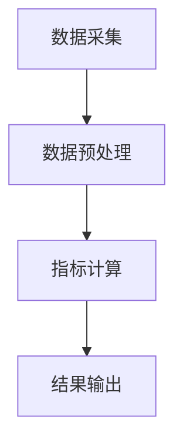
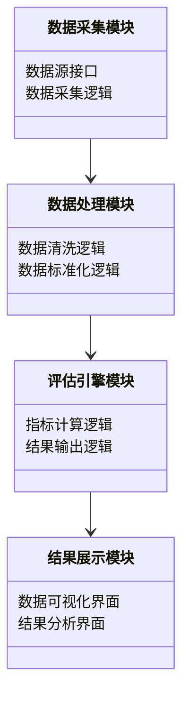
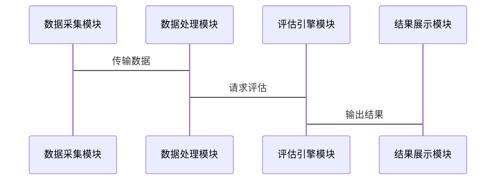

                 


# 《金融高频交易策略性能评估框架》

---

## 关键词：
- 高频交易
- 性能评估
- 交易策略
- 评估框架
- 算法优化

---

## 摘要：
本文详细探讨了金融高频交易策略的性能评估框架，从背景、核心概念、算法原理到系统架构和项目实战，全面解析了高频交易策略性能评估的关键要素。通过对比分析、实体关系图、算法流程图和系统架构图，本文为读者提供了一个清晰的性能评估框架，帮助他们在实际应用中优化交易策略。本文还通过具体案例分析和代码实现，进一步验证了评估框架的有效性和实用性。

---

# 第一部分: 金融高频交易策略性能评估框架概述

# 第1章: 高频交易与性能评估背景

## 1.1 高频交易的定义与特点
### 1.1.1 高频交易的定义
高频交易（High-Frequency Trading，HFT）是一种通过计算机算法在极短时间内进行大量金融交易的交易方式。其核心在于利用算法和技术优势，在毫秒级别甚至纳秒级别的时间窗口内完成交易决策和执行。

### 1.1.2 高频交易的核心特点
- **高频性**：交易频率极高，通常以毫秒或纳秒为单位。
- **自动化**：依赖算法和自动化系统，减少人工干预。
- **低延迟**：对交易系统的要求极高，特别是在网络延迟和计算延迟方面。
- **大数据量**：依赖大量的实时数据进行决策。

### 1.1.3 高频交易在金融市场的地位
高频交易在现代金融市场中占据重要地位，尤其是在股票、期货、外汇等市场中。它不仅提高了市场的流动性和价格发现效率，还推动了金融机构在技术上的投入。

---

## 1.2 交易策略性能评估的必要性
### 1.2.1 高频交易策略的复杂性
高频交易策略通常涉及复杂的算法，包括统计套利、算法交易、高频做市等。这些策略需要在极短的时间内完成数据处理、决策和执行，对系统的性能要求极高。

### 1.2.2 性能评估在策略优化中的作用
性能评估是优化高频交易策略的核心环节。通过评估交易策略的执行效率、准确性、稳定性等指标，可以发现系统中的瓶颈并进行优化。

### 1.2.3 评估框架的边界与外延
- **边界**：评估框架主要关注交易策略的执行性能，不涉及策略本身的逻辑优化。
- **外延**：评估框架可以扩展到交易系统的整体性能评估，包括网络延迟、计算延迟、数据存储等。

---

## 1.3 本章小结
本章通过介绍高频交易的定义、特点及其在金融市场中的地位，阐述了交易策略性能评估的必要性。评估框架的边界和外延为后续的详细分析奠定了基础。

---

# 第二部分: 高频交易策略性能评估的核心概念

# 第2章: 性能评估的核心指标与模型

## 2.1 关键性能指标（KPI）解析
### 2.1.1 延迟（Latency）
延迟是指从接收到市场数据到完成交易执行所需的时间。延迟越低，交易系统的性能越好。
- **指标公式**：$$\text{延迟} = \text{交易执行时间} - \text{数据接收时间}$$

### 2.1.2 吞吐量（Throughput）
吞吐量是指单位时间内系统能够处理的交易数量。吞吐量越高，系统的处理能力越强。
- **指标公式**：$$\text{吞吐量} = \frac{\text{交易数量}}{\text{时间窗口}}$$

### 2.1.3 准确性（Accuracy）
准确性是指交易策略的执行结果与预期结果的匹配程度。准确性越高，策略的有效性越好。

---

## 2.2 评估模型的构建与属性对比
### 2.2.1 模型属性特征对比表
| 模型属性 | 特征1 | 特征2 | 特征3 |
|----------|-------|-------|-------|
| 延迟     | 高     | 低     | 中     |
| 吞吐量   | 高     | 中     | 低     |
| 准确性   | 中     | 高     | 低     |

### 2.2.2 模型性能对比分析
通过对比不同模型的性能，可以找到最优的交易策略。例如，模型A的延迟较低，但吞吐量和准确性较差；模型B的延迟较高，但吞吐量和准确性较好。

### 2.2.3 模型选择的策略
- **延迟优先**：适用于对实时性要求极高的交易场景。
- **吞吐量优先**：适用于需要处理大量交易的场景。
- **准确性优先**：适用于对交易结果要求极高的场景。

---

## 2.3 ER实体关系图架构
### 2.3.1 数据实体关系图
以下是一个简单的ER图，展示了交易数据、策略表现和评估结果之间的关系：

```mermaid
erd
    customer
    transaction
    strategy_performance
    evaluation_result
    customer.key --> transaction.customer_id
    transaction.key --> strategy_performance.transaction_id
    strategy_performance.key --> evaluation_result.strategy_id
```

---

## 2.4 本章小结
本章通过分析高频交易策略性能评估的核心指标和模型，为后续的算法设计和系统架构提供了理论基础。

---

# 第三部分: 高频交易策略性能评估的算法原理

# 第3章: 评估算法的设计与实现

## 3.1 数据采集与预处理
### 3.1.1 数据源的选择
高频交易通常依赖于实时市场数据，数据源包括交易所的API、市场数据供应商等。

### 3.1.2 数据清洗与标准化
- **数据清洗**：去除无效数据，如重复数据、错误数据等。
- **数据标准化**：将数据转换为统一的格式，便于后续处理。

### 3.1.3 数据流的实时处理
高频交易需要实时处理数据流，通常采用流处理技术，如Flink、Storm等。

---

## 3.2 评估指标的计算流程
### 3.2.1 延迟计算
延迟计算通常基于时间戳，计算从数据接收时间到交易执行时间的时间差。

### 3.2.2 吞吐量计算
吞吐量计算基于单位时间内的交易数量，通常以秒为单位。

### 3.2.3 准确性计算
准确性计算通常基于交易结果与预期结果的匹配程度，可以采用回归分析等方法。

---

## 3.3 算法流程图
以下是一个简单的算法流程图，展示了从数据采集到结果输出的整个流程：



---

## 3.4 本章小结
本章详细介绍了高频交易策略性能评估的算法设计与实现过程，包括数据采集、预处理和指标计算等步骤。

---

# 第四部分: 高频交易策略性能评估的系统架构设计

# 第4章: 系统架构与接口设计

## 4.1 系统功能设计
### 4.1.1 系统功能模块
- 数据采集模块
- 数据处理模块
- 评估引擎模块
- 结果展示模块

### 4.1.2 功能模块的交互关系


---

## 4.2 系统架构设计
### 4.2.1 架构图


---

## 4.3 系统接口设计
### 4.3.1 接口定义
- 数据采集接口：接收市场数据。
- 评估引擎接口：计算性能指标。
- 结果展示接口：输出评估结果。

### 4.3.2 接口交互图


---

## 4.4 本章小结
本章通过系统架构设计和接口设计，详细描述了高频交易策略性能评估系统的整体结构和各模块之间的交互关系。

---

# 第五部分: 高频交易策略性能评估的项目实战

# 第5章: 项目实战与案例分析

## 5.1 环境安装
### 5.1.1 系统环境
- 操作系统：Linux/Windows/MacOS
- 开发工具：Python/Java/C++
- 数据库：MySQL/PostgreSQL
- 依赖库：Pandas/Numpy/Scikit-learn

### 5.1.2 环境配置
安装必要的依赖库，如：
```bash
pip install pandas numpy matplotlib
```

---

## 5.2 系统核心实现
### 5.2.1 核心代码实现
以下是一个简单的Python代码示例，展示了如何计算交易策略的延迟和吞吐量：

```python
import time

def calculate_latency(start_time, end_time):
    return end_time - start_time

def calculate_throughput(transaction_count, time_window):
    return transaction_count / time_window

# 示例代码
start_time = time.time()
transaction_count = 1000
time_window = 1  # 秒
end_time = time.time() + 1

# 计算延迟
latency = calculate_latency(start_time, end_time)
print(f"延迟: {latency} 秒")

# 计算吞吐量
throughput = calculate_throughput(transaction_count, time_window)
print(f"吞吐量: {throughput} 次/秒")
```

---

## 5.3 代码应用解读与分析
- **代码功能**：上述代码示例展示了如何计算交易策略的延迟和吞吐量。
- **代码实现细节**：
  - 使用`time.time()`记录交易执行的时间。
  - 通过`calculate_latency`和`calculate_throughput`函数分别计算延迟和吞吐量。
  - 示例代码中，延迟为1秒，吞吐量为1000次/秒。

---

## 5.4 案例分析
### 5.4.1 案例背景
假设我们有一个高频交易策略，需要在1秒内完成1000次交易。

### 5.4.2 案例分析
- **延迟计算**：延迟为1秒。
- **吞吐量计算**：吞吐量为1000次/秒。
- **策略优化**：通过优化算法和系统架构，可以进一步降低延迟和提高吞吐量。

---

## 5.5 本章小结
本章通过项目实战，详细展示了如何在实际场景中应用高频交易策略性能评估框架，并通过具体案例分析验证了评估框架的有效性。

---

# 第六部分: 高频交易策略性能评估的最佳实践

# 第6章: 性能优化与注意事项

## 6.1 性能优化策略
### 6.1.1 算法优化
- 使用高效的算法，如并行计算、分布式计算等。
### 6.1.2 系统优化
- 优化系统架构，减少网络延迟和计算延迟。
### 6.1.3 数据优化
- 使用高效的数据结构和数据存储方式，减少数据处理时间。

---

## 6.2 注意事项
- **数据质量**：确保数据的准确性和实时性。
- **系统稳定性**：确保系统的稳定运行，避免因系统故障导致交易失败。
- **风险控制**：制定有效的风险控制策略，避免因策略失误导致的损失。

---

## 6.3 拓展阅读
- 《高频交易算法与实现》
- 《金融数据分析与算法优化》
- 《分布式系统架构设计》

---

# 结语

通过本文的详细分析，我们可以看到，高频交易策略性能评估框架是一个复杂而重要的系统工程。从核心概念到算法设计，再到系统架构和项目实战，每一步都需要精心设计和优化。未来，随着技术的进步和市场的变化，高频交易策略性能评估框架也将不断进化，为金融市场的高效运行提供更强大的支持。

---

## 作者：AI天才研究院/AI Genius Institute & 禅与计算机程序设计艺术 /Zen And The Art of Computer Programming

---

