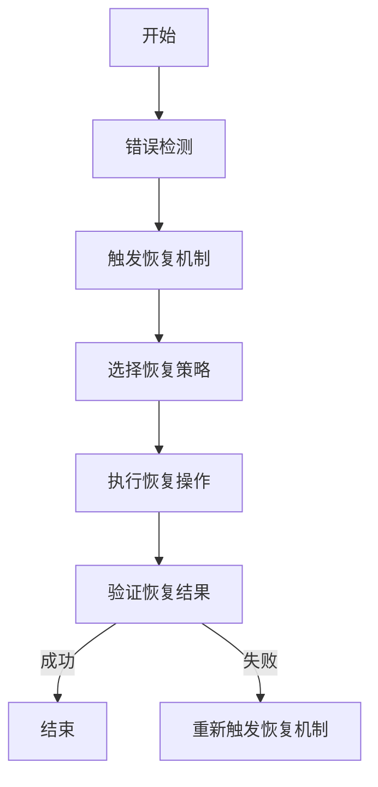
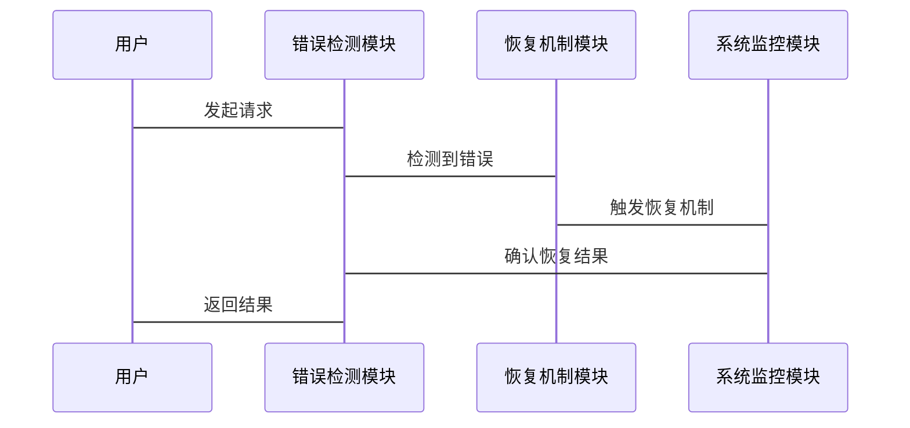

                 


## 第4章: 错误恢复算法

### 4.1 错误恢复算法原理
#### 4.1.1 基于状态机的恢复策略
#### 4.1.2 基于回溯算法的恢复机制
#### 4.1.3 基于启发式方法的恢复策略

### 4.2 错误恢复算法流程图


## 第5章: 鲁棒性设计与算法优化

### 5.1 鲁棒性设计原理
#### 5.1.1 系统容错设计
#### 5.1.2 系统冗余设计
#### 5.1.3 自适应恢复机制

### 5.2 算法优化策略
#### 5.2.1 错误检测算法的优化
#### 5.2.2 错误恢复算法的优化
#### 5.2.3 系统架构的优化

### 5.3 错误处理与恢复的数学模型
#### 5.3.1 错误检测概率模型
$$ P(error) = \frac{1}{N} $$
#### 5.3.2 错误恢复成功的概率模型
$$ P(recovery) = \frac{K}{M} $$
#### 5.3.3 鲁棒性评估模型
$$ R = \frac{S}{T} $$

## 第三部分: 错误处理与恢复的系统分析与架构设计

## 第6章: 系统分析与架构设计

### 6.1 系统分析
#### 6.1.1 问题场景描述
#### 6.1.2 系统功能设计
#### 6.1.3 系统架构设计

### 6.2 系统架构设计图


### 6.3 系统接口设计
#### 6.3.1 错误检测接口
#### 6.3.2 恢复机制接口
#### 6.3.3 系统监控接口

### 6.4 系统交互设计


## 第7章: 项目实战

### 7.1 环境安装与配置
#### 7.1.1 系统环境要求
#### 7.1.2 工具安装与配置

### 7.2 系统核心功能实现
#### 7.2.1 错误检测模块实现
```python
def detect_error(data):
    # 错误检测算法实现
    pass
```
#### 7.2.2 恢复机制模块实现
```python
def recover(error_type):
    # 恢复机制实现
    pass
```

### 7.3 代码解读与分析
#### 7.3.1 错误检测模块解读
#### 7.3.2 恢复机制模块解读
#### 7.3.3 系统监控模块解读

### 7.4 案例分析与详细剖析
#### 7.4.1 案例背景介绍
#### 7.4.2 案例实现过程
#### 7.4.3 案例结果分析

### 7.5 项目小结
#### 7.5.1 项目总结
#### 7.5.2 经验与教训
#### 7.5.3 改进方向

## 第四部分: 最佳实践与小结

## 第8章: 最佳实践

### 8.1 优化建议
#### 8.1.1 错误日志的重要性
#### 8.1.2 监控工具的选择与使用
#### 8.1.3 团队协作的重要性

### 8.2 问题解决技巧
#### 8.2.1 错误定位的技巧
#### 8.2.2 错误恢复的策略选择
#### 8.2.3 鲁棒性设计的注意事项

## 第9章: 小结与展望

### 9.1 全书总结
#### 9.1.1 核心内容回顾
#### 9.1.2 关键点总结

### 9.2 未来展望
#### 9.2.1 技术发展趋势
#### 9.2.2 研究方向建议

### 9.3 注意事项
#### 9.3.1 误用错误处理的风险
#### 9.3.2 鲁棒性设计的误区
#### 9.3.3 系统维护的重要性

## 第五部分: 拓展阅读与参考资料

## 第10章: 拓展阅读

### 10.1 相关书籍推荐
#### 10.1.1 经典书籍
#### 10.1.2 最新著作

### 10.2 技术博客与文章
#### 10.2.1 专业博客推荐
#### 10.2.2 技术文章精选

## 第11章: 参考资料与工具

### 11.1 开发工具推荐
#### 11.1.1 IDE推荐
#### 11.1.2 代码审查工具
#### 11.1.3 监控工具推荐

### 11.2 数据集与资源
#### 11.2.1 错误处理数据集
#### 11.2.2 恢复机制资源
#### 11.2.3 开源项目推荐

---

# 作者：AI天才研究院/AI Genius Institute & 禅与计算机程序设计艺术 /Zen And The Art of Computer Programming

---

以上是《错误处理与恢复：提高AI Agent的鲁棒性》一书的详细目录大纲，按照章节和小节逐步展开，涵盖了从基础概念到实际应用的各个方面。每个章节都包含必要的技术细节和实践内容，确保读者能够系统地掌握错误处理与恢复的核心原理和实际应用技巧。

