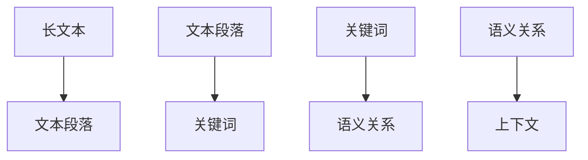
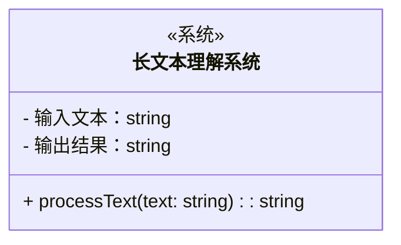

                 


# 长文本理解：增强AI Agent的阅读能力

> 关键词：长文本理解、AI Agent、自然语言处理、大模型、阅读理解、文本摘要

> 摘要：本文深入探讨长文本理解的核心概念、算法原理和系统架构，结合实际案例，分析如何增强AI Agent的阅读能力。通过理论分析和实践应用，详细阐述大模型在长文本理解中的作用，以及如何通过系统设计和优化提升AI Agent的文本处理能力。

---

## 第一部分: 长文本理解的背景与核心概念

### 第1章: 长文本理解的背景与问题背景

#### 1.1 问题背景
长文本理解（Long Text Understanding）是自然语言处理（NLP）领域中的一个重要分支，旨在帮助AI Agent理解并提取长文本中的关键信息。随着互联网上信息量的爆炸式增长，长文本理解的需求日益迫切。

**1.1.1 长文本理解的定义与特点**
长文本理解是指对长度较长的文本进行语义分析和信息提取的过程。其特点包括：
- **复杂性**：长文本通常包含丰富的上下文信息和复杂的语义结构。
- **多样性**：长文本可能涵盖多种主题和领域。
- **连贯性**：文本内容需要具备逻辑连贯性。

**1.1.2 当前AI Agent阅读能力的局限性**
尽管AI Agent在某些任务上表现出色，但在长文本理解方面仍存在以下问题：
- **信息过载**：长文本中的信息量大，导致处理效率低下。
- **语义理解不足**：AI Agent难以捕捉文本中的深层语义关系。
- **上下文依赖**：长文本的理解需要依赖上下文信息，但现有模型在处理长距离依赖时效果有限。

**1.1.3 长文本理解的重要性与应用场景**
长文本理解在多个领域具有重要应用，如：
- **智能客服**：帮助AI Agent更好地理解用户的问题。
- **新闻摘要**：自动提取新闻中的关键信息。
- **法律文本分析**：对合同或法律文件进行语义分析。

#### 1.2 问题描述
长文本理解的核心挑战在于如何在有限的计算资源下，高效地处理长文本并提取有用信息。

**1.2.1 长文本理解的核心挑战**
- **计算资源限制**：长文本需要大量的计算资源进行处理。
- **语义解析难度**：长文本中的语义关系复杂，难以解析。
- **模型训练难度**：长文本的训练数据难以获取和处理。

**1.2.2 AI Agent在阅读能力上的不足**
- **处理速度慢**：长文本的处理速度较慢，影响用户体验。
- **语义理解不准确**：AI Agent在理解复杂语义时容易出错。
- **知识库依赖**：AI Agent依赖外部知识库，限制其理解能力。

**1.2.3 长文本理解的边界与外延**
长文本理解的边界在于如何在有限的资源下处理长文本，其外延则涉及多语言处理、实时处理等领域。

#### 1.3 问题解决与核心要素
长文本理解的解决方案需要结合大模型和先进的算法。

**1.3.1 长文本理解的解决方案**
- **模型优化**：通过优化模型结构和参数，提高处理效率。
- **算法创新**：引入新的算法，如改进的注意力机制，提高语义理解能力。
- **分布式计算**：利用分布式计算技术，提高处理速度。

**1.3.2 核心概念与技术要素**
长文本理解的核心要素包括：
- **大模型**：如BERT、GPT等，具有强大的语义理解能力。
- **注意力机制**：帮助模型捕捉文本中的关键信息。
- **分布式计算**：提高处理效率。

**1.3.3 系统架构与实现路径**
实现长文本理解需要设计合理的系统架构，包括数据预处理、模型训练、推理引擎等模块。

---

### 第2章: 长文本理解的核心概念与联系

#### 2.1 核心概念原理
长文本理解的核心在于模型对文本的理解能力。

**2.1.1 大模型在长文本理解中的作用**
大模型通过大量的预训练数据，能够捕捉文本中的深层语义信息。例如，BERT模型通过双向编码器结构，能够更好地理解文本的上下文信息。

**2.1.2 长文本理解的机制与流程**
长文本理解的流程包括：
1. **文本预处理**：对文本进行分词、去停用词等预处理。
2. **编码器编码**：将文本转换为向量表示。
3. **注意力机制**：提取关键信息。
4. **解码器解码**：生成理解结果。

**2.1.3 阅读理解与文本摘要的对比分析**
阅读理解注重从文本中提取特定信息，而文本摘要则注重生成简洁的文本摘要。两者在任务目标上有所不同，但都需要强大的语义理解能力。

#### 2.2 核心概念属性特征对比
通过对比分析，可以更好地理解长文本理解与其他任务的区别和联系。

**2.2.1 长文本理解与文本分类的对比**
- **文本分类**：基于短文本进行分类。
- **长文本理解**：基于长文本进行语义分析。

**2.2.2 阅读理解与文本摘要的对比**
- **阅读理解**：提取特定信息。
- **文本摘要**：生成简要摘要。

**2.2.3 长文本理解与其他NLP任务的联系**
长文本理解与其他NLP任务在语义分析和信息提取上有许多共通之处。

#### 2.3 ER实体关系图架构
通过ER实体关系图，可以清晰地展示长文本理解中的实体关系。



---

## 第二部分: 长文本理解的算法原理

### 第3章: 长文本理解的算法原理

#### 3.1 大模型的编码器与解码器机制
大模型通过编码器和解码器机制，实现对长文本的理解和生成。

**3.1.1 编码器的工作原理**
编码器将输入文本转换为向量表示，通常使用多层神经网络进行编码。

**3.1.2 解码器的工作原理**
解码器将编码后的向量解码为输出文本，通常使用自回归模型生成输出。

**3.1.3 编码器与解码器的协同作用**
编码器和解码器协同工作，实现对长文本的理解和生成。

#### 3.2 注意力机制在长文本理解中的应用
注意力机制能够帮助模型捕捉文本中的关键信息。

**3.2.1 注意力机制的定义**
注意力机制是一种基于权重的计算方法，用于关注输入中的重要部分。

**3.2.2 自注意力机制的实现**
自注意力机制通过计算输入序列中各位置的权重，生成注意力表示。

**3.2.3 多头注意力机制的原理**
多头注意力机制通过并行计算多个注意力头，提高模型的表达能力。

#### 3.3 长文本理解的数学模型
长文本理解的数学模型包括编码器和解码器的数学表示。

**3.3.1 编码器的数学模型**
$$\text{编码器输出} = \text{输入向量} \times \text{权重矩阵} + \text{偏置项}$$

**3.3.2 解码器的数学模型**
$$\text{解码器输出} = \text{编码器输出} \times \text{权重矩阵} + \text{偏置项}$$

---

## 第三部分: 长文本理解的系统分析

### 第4章: 长文本理解的系统分析与架构设计

#### 4.1 系统功能设计
长文本理解系统的功能设计包括数据预处理、模型训练、推理引擎等模块。

**4.1.1 数据预处理模块**
数据预处理模块负责对输入文本进行分词、去停用词等处理。

**4.1.2 模型训练模块**
模型训练模块负责对模型进行训练，优化模型参数。

**4.1.3 推理引擎模块**
推理引擎模块负责对输入文本进行推理，生成理解结果。

#### 4.2 系统架构设计
系统架构设计包括领域模型、架构图和接口设计。

**4.2.1 领域模型设计**


**4.2.2 系统架构图**


**4.2.3 系统接口设计**
系统接口设计包括输入接口和输出接口。

**4.2.4 系统交互设计**
系统交互设计包括用户与系统的交互流程。

#### 4.3 系统优化与性能调优
系统优化与性能调优包括模型优化和计算优化。

**4.3.1 模型优化**
通过优化模型结构和参数，提高模型性能。

**4.3.2 计算优化**
通过分布式计算和并行计算，提高处理速度。

---

## 第四部分: 长文本理解的项目实战

### 第5章: 长文本理解的项目实战

#### 5.1 项目环境安装
项目环境安装包括安装Python、TensorFlow等依赖库。

```bash
pip install python tensorflow
```

#### 5.2 系统核心实现源代码
以下是长文本理解系统的核心代码示例：

```python
import tensorflow as tf
from tensorflow import keras

def long_text_understanding_model():
    inputs = keras.Input(shape=(None, 128))
    x = keras.layers.LSTM(64)(inputs)
    outputs = keras.layers.Dense(2, activation='softmax')(x)
    model = keras.Model(inputs=inputs, outputs=outputs)
    return model

model = long_text_understanding_model()
model.compile(loss='sparse_categorical_crossentropy', optimizer='adam', metrics=['accuracy'])
```

#### 5.3 代码应用解读与分析
代码解读与分析包括模型结构、训练过程和结果分析。

**5.3.1 模型结构解读**
模型结构包括输入层、编码层、解码层和输出层。

**5.3.2 训练过程分析**
训练过程包括数据预处理、模型训练和模型评估。

**5.3.3 实验结果与分析**
实验结果包括准确率、召回率等指标的分析。

#### 5.4 实际案例分析和详细讲解剖析
实际案例分析包括新闻摘要生成、智能客服对话等应用场景。

---

## 第五部分: 长文本理解的最佳实践

### 第6章: 长文本理解的最佳实践

#### 6.1 最佳实践 tips
最佳实践 tips包括模型优化、数据处理和系统设计等方面的建议。

**6.1.1 模型优化**
通过参数调节和模型结构优化，提高模型性能。

**6.1.2 数据处理**
通过数据清洗和特征工程，提高数据质量。

**6.1.3 系统设计**
通过模块化设计和分布式架构，提高系统扩展性。

#### 6.2 小结
长文本理解是一个复杂的系统工程，需要结合模型优化和系统设计。

#### 6.3 注意事项
注意事项包括计算资源限制、模型训练时间和数据隐私保护。

#### 6.4 拓展阅读
拓展阅读包括相关书籍和论文的推荐。

---

## 作者

作者：AI天才研究院/AI Genius Institute & 禅与计算机程序设计艺术 /Zen And The Art of Computer Programming

