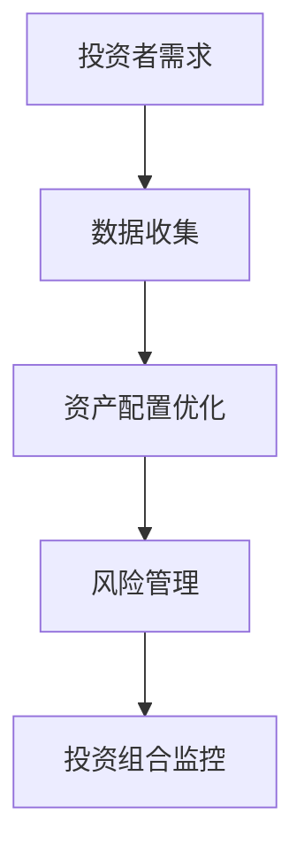

                 


# 长期投资策略：为什么在市场动荡时期仍然重要

## 关键词：长期投资，市场波动，风险管理，资产配置，复利效应

## 摘要：本文探讨了在市场动荡时期，长期投资策略的重要性。通过分析长期投资的核心概念、策略、风险管理及实际案例，揭示了长期投资在复利效应和资产配置下的优势，帮助投资者在市场波动中实现稳健收益。

---

## 第一部分: 长期投资策略的背景与重要性

### 第1章: 长期投资策略的背景介绍

#### 1.1 市场波动的背景与挑战
##### 1.1.1 什么是市场波动
市场波动是指金融市场价格在短时间内频繁变化的现象，通常由投资者情绪、经济数据和市场新闻等因素引发。

##### 1.1.2 市场波动对投资者的影响
市场波动可能导致投资者的短期收益波动，但长期来看，波动为价值投资者提供了买入机会。

##### 1.1.3 长期投资在市场波动中的作用
长期投资通过分散投资和复利效应，帮助投资者在波动中实现稳健收益。

#### 1.2 长期投资的基本概念
##### 1.2.1 长期投资的定义
长期投资是指投资者将资金投入某个资产或项目，持有时间超过一年，以获得资本增值或收益。

##### 1.2.2 长期投资与短期投资的区别
长期投资注重资产的长期增值，而短期投资关注短期价格波动和收益。

##### 1.2.3 长期投资的目标与意义
目标是实现财富的长期增值，意义在于通过复利效应和分散投资降低风险。

#### 1.3 长期投资的核心要素
##### 1.3.1 投资目标的设定
明确投资目标，如财富增值、保值或收入。

##### 1.3.2 风险承受能力的评估
评估自身对风险的承受能力，选择适合的投资策略。

##### 1.3.3 投资期限的选择
根据目标选择合适的投资期限，长期投资适合有较长资金闲置时间的投资者。

---

## 第二部分: 长期投资策略的核心概念与联系

### 第2章: 长期投资策略的核心概念与联系

#### 2.1 复利效应的原理
##### 2.1.1 复利的基本概念
复利是指投资收益再投资产生的收益，类似于滚雪球效应。

##### 2.1.2 复利与投资回报的关系
复利使投资收益呈指数增长，长期投资中复利效应显著。

##### 2.1.3 复利在长期投资中的应用
通过定期定额投资，利用复利效应最大化收益。

#### 2.2 资产配置的重要性
##### 2.2.1 资产配置的定义
资产配置是指将资金分配到不同资产类别，如股票、债券、房地产等，以分散风险。

##### 2.2.2 不同资产类别在长期投资中的作用
股票提供高增长潜力，债券提供稳定收益，房地产提供资产保值。

##### 2.2.3 资产配置与风险控制的关系
合理的资产配置可以降低整体投资组合的风险，提高收益的稳定性。

#### 2.3 风险管理的核心原则
##### 2.3.1 风险管理的定义
风险管理是指识别、评估和应对投资中的风险。

##### 2.3.2 风险与收益的平衡
高风险投资可能带来高收益，但长期投资应注重风险控制。

##### 2.3.3 长期投资中的风险管理策略
分散投资、定期调整资产配置、设置止损点。

---

## 第三部分: 长期投资策略的算法原理

### 第3章: 基于复利的长期投资模型

#### 3.1 复利计算公式
##### 3.1.1 单利与复利的比较
单利仅计算本金的利息，复利计算本金及利息的总和。

##### 3.1.2 复利的数学公式
$$ A = P(1 + r/n)^{nt} $$
其中，A为终值，P为本金，r为年利率，n为每年的复利次数，t为时间。

##### 3.1.3 复利在投资中的应用实例
以1000元投资，年利率10%，10年后的金额为：
$$ A = 1000(1 + 0.10)^{10} \approx 2593.74 $$

### 第4章: 资产配置的优化算法

#### 4.1 资产配置的数学模型
##### 4.1.1 投资组合的期望收益公式
$$ E(R_p) = \sum w_i E(R_i) $$
其中，$w_i$为资产i的权重，$E(R_i)$为资产i的期望收益。

##### 4.1.2 投资组合的风险度量公式
$$ \sigma_p^2 = \sum w_i^2 \sigma_i^2 + 2\sum_{i<j} w_i w_j \sigma_i \sigma_j \rho_{ij} $$
其中，$\sigma_i$为资产i的波动率，$\rho_{ij}$为资产i和j的相关系数。

##### 4.1.3 资产配置的优化公式
使用均值-方差优化模型，找到在给定风险下的最大收益组合。

### 第5章: 长期投资策略的系统分析与架构设计

#### 5.1 投资者需求分析
##### 5.1.1 投资者的目标与风险偏好
确定投资者的投资目标和风险承受能力。

##### 5.1.2 投资者的资金规模与流动性需求
评估投资者的可用资金和流动性需求。

##### 5.1.3 投资者的知识水平与经验
根据投资者的知识和经验推荐合适的投资策略。

#### 5.2 投资策略的系统架构
##### 5.2.1 系统功能模块划分
- 数据收集与处理
- 资产配置优化
- 风险管理
- 投资组合监控

##### 5.2.2 系统的输入输出设计
- 输入：市场数据、投资者需求
- 输出：优化后的投资组合、风险评估报告

##### 5.2.3 系统的流程图设计


### 第6章: 长期投资策略的项目实战

#### 6.1 环境安装与配置
##### 6.1.1 投资分析工具的安装
安装并配置Python、Pandas、Matplotlib等工具。

##### 6.1.2 数据源的选择与获取
选择可靠的金融数据源，如Yahoo Finance或Quandl。

##### 6.1.3 数据库的建立与维护
建立数据库存储历史数据和实时数据。

#### 6.2 核心投资策略的实现
##### 6.2.1 资产配置的实现代码
```python
import pandas as pd
import numpy as np

def portfolio_optimization(returns, weights):
    # 计算投资组合的期望收益
    expected_return = np.dot(returns.mean(), weights)
    # 计算投资组合的风险
    covariance_matrix = returns.cov()
    portfolio_variance = np.dot(weights.T, np.dot(covariance_matrix, weights))
    return expected_return, portfolio_variance
```

##### 6.2.2 风险管理的实现代码
```python
def risk_management策略：
    # 示例：止损策略
    prices = pd.read_csv('stock_prices.csv')
    stop_loss = 0.9 * prices['Close'].iloc[-1]
    if prices['Close'].iloc[-1] < stop_loss:
        return '卖出'
    else:
        return '持有'
```

##### 6.2.3 投资组合优化的实现代码
```python
import cvxopt

def optimize_portfolio(returns):
    # 使用凸优化求解最小方差组合
    n = returns.shape[1]
    Sigma = returns.cov().values
    ones = cvxopt.matrix(1.0, n, 1)
    # 最小方差优化
    sol = cvxopt.solvers.cvxopt.SOLVER('QP', ... )
    # 返回最优权重
    return sol.x
```

#### 6.3 实际案例分析
##### 6.3.1 案例介绍
以某投资者为例，设定投资目标为5年，期望年收益率8%，风险承受能力中等。

##### 6.3.2 数据分析与处理
分析过去5年各资产类别的收益率和波动率。

##### 6.3.3 投资策略的制定与实施
配置60%股票、30%债券、10%现金，定期再平衡。

#### 6.4 投资组合监控与调整
定期评估投资组合表现，根据市场变化调整配置。

---

## 第四部分: 长期投资策略的拓展与应用

### 第7章: 市场波动中的长期投资机会

#### 7.1 市场周期与投资机会
##### 7.1.1 经济周期对投资的影响
在衰退期寻找价值股，在复苏期投资成长股。

##### 7.1.2 逆向投资策略的应用
在市场恐慌时买入低估资产，长期持有。

#### 7.2 全球经济趋势与投资机会
##### 7.2.1 全球化与多元化投资
通过全球化配置降低风险，捕捉不同市场的增长机会。

##### 7.2.2 新兴市场与成熟市场的比较
新兴市场增长潜力大，成熟市场稳定性强。

#### 7.3 长期投资中的风险管理
##### 7.3.1 识别市场风险
通过波动率、市盈率等指标识别市场风险。

##### 7.3.2 构建防御性投资组合
配置债券、黄金等避险资产，平衡风险。

---

## 第五部分: 总结与展望

### 第8章: 长期投资策略的重要性和未来展望

#### 8.1 长期投资的重要总结
长期投资通过复利效应和资产配置，帮助投资者实现稳健收益。

#### 8.2 长期投资的未来展望
随着金融市场的全球化和技术的进步，长期投资策略将更加多样化和智能化。

#### 8.3 投资建议与注意事项
##### 8.3.1 投资建议
根据自身需求选择合适策略，坚持长期投资，定期调整组合。

##### 8.3.2 注意事项
避免短期波动影响决策，保持纪律性和耐心。

---

## 作者：AI天才研究院/AI Genius Institute & 禅与计算机程序设计艺术 /Zen And The Art of Computer Programming

