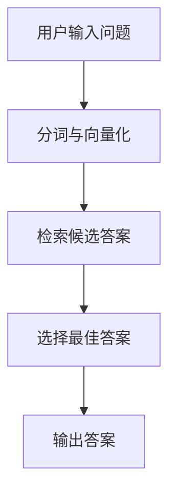
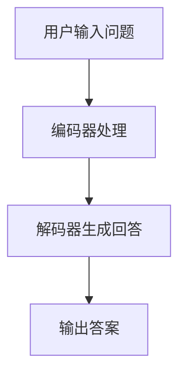
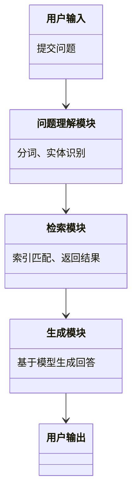
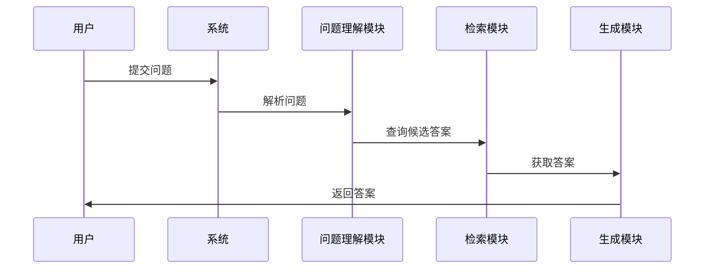

                 


# 问答系统实现：打造高效的信息检索助手

## 关键词：问答系统，信息检索，自然语言处理，知识图谱，算法原理

## 摘要：  
问答系统是自然语言处理领域的重要应用，旨在通过计算机技术实现人类与机器之间的高效信息交互。本文从问答系统的概念出发，详细探讨其实现原理，包括信息检索、自然语言理解、知识图谱构建等核心技术，并结合实际案例分析，帮助读者全面掌握问答系统的开发与优化方法。

---

# 第一部分：问答系统概述

## 第1章：问答系统的基本概念

### 1.1 问题背景与问题描述  
问答系统（Question Answering System，QAS）是一种能够理解和回答用户提问的计算机系统。随着自然语言处理技术的发展，问答系统在教育、医疗、客服等领域得到了广泛应用。其核心问题在于如何将用户的问题转化为计算机可处理的形式，并从中提取有用的信息。

### 1.2 问答系统的定义与特点  
问答系统是一种通过分析用户输入的问题，从大规模文档或知识库中找到最相关答案的技术。其特点包括：  
1. **理解能力**：能够解析自然语言的问题，识别关键词和意图。  
2. **信息检索能力**：基于大规模数据快速定位答案。  
3. **生成能力**：能够生成符合语境的答案。  

### 1.3 问答系统的边界与外延  
问答系统不仅关注“是什么”、“为什么”、“怎么做”的问题，还涉及多轮对话、上下文理解等复杂场景。其外延包括对话系统、知识图谱构建等领域。

---

## 第2章：问答系统的分类与应用场景

### 2.1 问答系统的分类  
问答系统主要分为两类：  
1. **基于检索的问答系统**：依赖预存的知识库或文档，通过检索技术找到最匹配的答案。  
2. **基于生成的问答系统**：利用自然语言生成技术（如Transformer模型）生成答案，不依赖固定的知识库。  

### 2.2 问答系统的应用场景  
1. **智能客服**：通过自动回答用户问题，提升客户体验。  
2. **教育辅助**：为学生提供学习指导和问题解答。  
3. **医疗咨询**：辅助医生和患者进行信息查询和诊断建议。  

### 2.3 核心问题  
问答系统的核心问题包括：  
1. 如何高效地理解用户问题？  
2. 如何快速找到或生成准确的答案？  
3. 如何处理多轮对话中的上下文信息？

---

# 第二部分：问答系统的核心概念与联系

## 第3章：问答系统的核心概念原理

### 3.1 信息检索原理  
信息检索是问答系统的关键步骤，常用技术包括：  
1. **向量空间模型**：将文本转化为向量，计算相似度。  
2. **BM25算法**：基于统计的检索算法，考虑关键词频率和位置信息。  

### 3.2 自然语言处理原理  
自然语言处理（NLP）技术帮助系统理解用户的问题，包括分词、句法分析、语义理解等步骤。

### 3.3 知识图谱与推理机制  
知识图谱通过构建实体关系图，帮助系统进行推理和关联分析。

---

## 第4章：核心概念属性特征对比

### 4.1 信息检索算法对比  
| 算法名称 | 基本原理 | 优缺点 |  
|----------|----------|--------|  
| 向量空间模型 | 基于词袋模型计算文本相似度 | 简单但对语义理解不足 |  
| BM25 | 基于关键词频率和位置 | 更精准但依赖索引 |  

### 4.2 自然语言处理模型对比  
| 模型名称 | 基本原理 | 优缺点 |  
|----------|----------|--------|  
| Seq2Seq | 基于编码器-解码器结构 | 易生成不合理答案 |  
| Transformer | 基于自注意力机制 | 更准确且高效 |  

---

## 第5章：ER实体关系图架构

### 5.1 实体识别与关系抽取  
通过NLP技术识别文本中的实体（如人名、地名）及其关系（如“属于”、“位于”）。  

### 5.2 实体关系图构建  
将实体及其关系可视化为图结构，便于后续推理和分析。  

### 5.3 实体关系图的应用  
在问答系统中，实体关系图可用于关联问题和答案，提升回答的准确性。

---

# 第三部分：问答系统算法原理

## 第6章：基于检索的问答系统算法

### 6.1 向量空间模型  
计算查询与文档的余弦相似度，公式为：  
$$ \text{相似度} = \frac{\vec{q} \cdot \vec{d}}{|\vec{q}| |\vec{d}|} $$  

### 6.2 BM25算法  
BM25是一种基于关键词频率的检索算法，公式为：  
$$ \text{BM25} = \frac{\text{freq} \times \text{idf}}{\text{freq} + k(1 - \text{freq}/\text{avglen})} $$  

---

## 第7章：基于生成的问答系统算法

### 7.1 Seq2Seq模型  
Seq2Seq模型通过编码器将问题转化为向量，解码器生成回答。  

### 7.2 Transformer模型  
Transformer模型通过自注意力机制捕捉问题中的语义关系，生成更准确的回答。

---

## 第8章：算法流程图

### 8.1 基于检索的问答系统流程图  


### 8.2 基于生成的问答系统流程图  


---

# 第四部分：系统分析与架构设计

## 第9章：问题场景介绍

### 9.1 系统功能设计  
问答系统包括问题理解、信息检索、答案生成三个模块。  

### 9.2 系统架构设计  


---

## 第10章：系统接口设计

### 10.1 系统接口  
1. 提交问题接口：`POST /question`  
2. 获取答案接口：`GET /answer`

---

## 第11章：系统交互流程图



---

# 第五部分：项目实战

## 第12章：环境安装与系统实现

### 12.1 环境安装  
1. 安装Python和相关库（如numpy、transformers）。  
2. 下载预训练模型（如BERT）。  

### 12.2 核心代码实现  
```python
from transformers import pipeline

qa_pipeline = pipeline("question-answering", model="bert-base-cased")

def answer_question(question, context):
    return qa_pipeline(question=question, context=context)
```

---

## 第13章：案例分析与解读

### 13.1 实际案例  
用户输入问题：“什么是人工智能？”  
系统返回答案：“人工智能（AI）是模拟人类智能的计算机系统。”

---

# 第六部分：最佳实践与总结

## 第14章：最佳实践

### 14.1 技术选型建议  
1. 根据需求选择检索或生成模型。  
2. 结合知识图谱提升回答的准确性。  

### 14.2 开发注意事项  
1. 数据预处理是关键。  
2. 调参和优化不可忽视。  

---

## 第15章：小结与展望

问答系统是一项复杂的工程，涉及多方面的技术。未来，随着大语言模型的发展，问答系统将更加智能化和个性化。

---

## 作者：AI天才研究院 & 禅与计算机程序设计艺术

---

通过本文，读者可以系统地了解问答系统的实现原理，并掌握实际开发中的关键技巧。希望本文能为相关领域的开发者提供有价值的参考。

