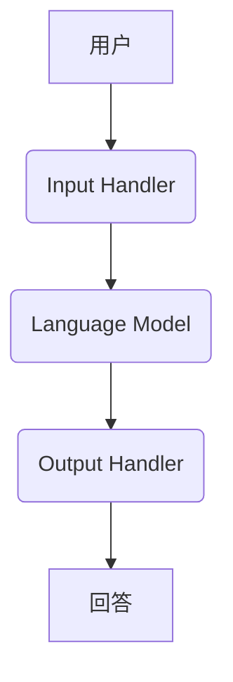

                 


# 问答系统：构建基于LLM的智能问答Agent

> 关键词：问答系统，LLM，大语言模型，智能问答，自然语言处理

> 摘要：本文详细探讨了基于大语言模型（LLM）的智能问答系统构建，从基础概念到高级算法，从系统架构到项目实战，系统地介绍了如何设计和实现一个高效的问答系统。

---

## 第一部分: 问答系统概述

### 第1章: 问答系统概述

#### 1.1 问答系统的定义与分类

##### 1.1.1 问答系统的定义
问答系统（Question Answering System，QAS）是一种能够理解和回答用户提出的问题的人工智能系统。它通过自然语言处理技术，将用户的问题转化为计算机可以理解的形式，并利用知识库或模型生成回答。

##### 1.1.2 问答系统的分类
问答系统可以根据多种标准进行分类：
- **基于规则的问答系统**：依赖预定义的规则和模板，适用于特定领域的简单问题。
- **基于检索的问答系统**：从文档中检索相关段落或句子作为答案。
- **基于生成的问答系统**：利用生成模型（如LLM）生成回答。
- **混合型问答系统**：结合检索和生成两种方法。

##### 1.1.3 问答系统的应用场景
问答系统广泛应用于各个领域：
- **客服系统**：解决用户的常见问题。
- **教育辅助**：为学生提供学习支持。
- **医疗咨询**：提供医疗建议和信息。
- **智能助手**：如Siri、Alexa等。

#### 1.2 问答系统的发展历程

##### 1.2.1 早期问答系统的发展
早期的问答系统主要基于规则和模板，能够处理简单的查询，但受限于知识库的规模和复杂性，难以应对复杂的自然语言问题。

##### 1.2.2 基于规则的问答系统
基于规则的问答系统通过预定义的语法规则和模板来理解和回答问题，适用于特定场景，但缺乏灵活性和扩展性。

##### 1.2.3 基于深度学习的问答系统
随着深度学习的兴起，问答系统进入了一个新的发展阶段，模型能够通过大量数据学习语言的结构和语义，从而生成更自然的回答。

#### 1.3 问答系统的挑战与未来方向

##### 1.3.1 问答系统的挑战
- **歧义性**：同一个问题可能有多种解释，系统需要理解上下文。
- **知识覆盖**：系统依赖的知识库可能无法覆盖所有领域。
- **准确性和可解释性**：模型的输出需要准确且可解释。

##### 1.3.2 问答系统的未来发展方向
- **多语言支持**：支持多种语言，覆盖更广泛的用户群体。
- **多轮对话**：实现更自然的交互，理解上下文。
- **可解释性**：提高模型的透明度，帮助用户理解回答的依据。

---

### 第2章: 基于LLM的问答系统

#### 2.1 大语言模型（LLM）概述

##### 2.1.1 LLM的定义
大语言模型（Large Language Model，LLM）是一种基于深度学习的自然语言处理模型，通过大量数据训练，能够理解和生成人类语言。

##### 2.1.2 LLM的核心技术
- **预训练**：通过无监督学习，模型在大量文本数据上进行预训练，学习语言的结构和语义。
- **微调**：在特定任务上进行有监督微调，提升模型在特定领域的性能。
- **生成机制**：利用解码器生成自然语言文本。

##### 2.1.3 LLM与问答系统的结合
LLM通过生成文本的能力，为问答系统提供了强大的生成能力，能够处理复杂的问题，并生成连贯且自然的回答。

#### 2.2 基于LLM的问答系统原理

##### 2.2.1 LLM的输入输出机制
- **输入**：用户提出的问题，如“什么是人工智能？”。
- **输出**：模型生成的回答，如“人工智能是模拟人类智能的计算机系统。”

##### 2.2.2 基于LLM的问答系统流程
1. **问题理解**：系统将用户的自然语言问题转化为计算机可以处理的形式。
2. **上下文分析**：分析问题的上下文，理解潜在含义。
3. **生成回答**：基于LLM生成回答，并返回给用户。

##### 2.2.3 LLM在问答系统中的优势
- **强大的生成能力**：能够生成自然流畅的回答。
- **灵活性**：适用于多种场景和领域。
- **可扩展性**：通过微调，模型可以适应特定领域的需求。

---

### 第3章: 问答系统的算法原理

#### 3.1 基于LLM的问答系统算法

##### 3.1.1 LLM的训练过程
1. **数据预处理**：清洗和标注数据，构建训练集。
2. **模型训练**：使用深度学习模型（如Transformer）进行预训练。
3. **微调**：在特定任务上进行有监督微调，优化模型性能。

##### 3.1.2 LLM的推理过程
1. **编码器**：将输入问题转化为向量表示。
2. **解码器**：根据编码器输出，生成回答文本。

##### 3.1.3 基于LLM的问答系统算法实现
- **输入处理**：将用户问题转化为模型输入格式。
- **模型推理**：调用LLM生成回答。
- **输出处理**：将模型输出转化为用户可理解的形式。

#### 3.2 问答系统的数学模型

##### 3.2.1 语言模型的数学表示
- **概率模型**：语言模型计算每个词出现的概率，如 $P(w_1, w_2, ..., w_n)$。
- **条件概率**：语言模型基于条件概率公式，$P(w_i|w_{i-1}, ..., w_1)$。

##### 3.2.2 基于LLM的问答系统数学模型
- **编码器-解码器结构**：编码器将输入问题转化为向量表示，解码器基于向量生成回答。

##### 3.2.3 数学公式与模型优化
- **损失函数**：交叉熵损失函数用于模型优化，如 $-\sum_{i=1}^{n} \log P(w_i|x)$。
- **优化方法**：使用梯度下降等方法优化模型参数。

---

### 第4章: 问答系统的系统架构

#### 4.1 问答系统架构设计

##### 4.1.1 系统模块划分
- **输入处理模块**：接收用户问题并进行预处理。
- **模型调用模块**：调用LLM生成回答。
- **输出处理模块**：将模型输出转化为用户可理解的形式。

##### 4.1.2 模块之间的关系
- **输入处理模块**与**模型调用模块**交互，传递处理后的数据。
- **模型调用模块**与**输出处理模块**交互，传递生成的回答。

##### 4.1.3 系统架构图（Mermaid）



#### 4.2 系统功能设计

##### 4.2.1 功能模块介绍
- **输入处理模块**：解析用户输入，处理噪声数据。
- **模型调用模块**：调用LLM生成回答。
- **输出处理模块**：格式化回答，便于用户理解。

##### 4.2.2 功能模块实现
- **输入处理**：使用正则表达式提取关键信息。
- **模型调用**：通过API调用LLM生成回答。
- **输出处理**：将回答格式化为自然语言文本。

##### 4.2.3 功能模块测试
- **单元测试**：测试各模块的独立功能。
- **集成测试**：测试模块之间的交互和整体流程。

---

### 第5章: 问答系统的项目实战

#### 5.1 项目环境搭建

##### 5.1.1 开发环境配置
- **操作系统**：建议使用Linux或macOS。
- **编程语言**：Python 3.8+。
- **开发工具**：建议使用PyCharm或VS Code。

##### 5.1.2 依赖库安装
- **Python库**：如Transformers库用于调用LLM。
- **命令**：`pip install transformers`

##### 5.1.3 开发工具选择
- **代码编辑器**：推荐PyCharm或VS Code。
- **版本控制**：使用Git进行代码管理。

#### 5.2 问答系统核心代码实现

##### 5.2.1 模型加载与初始化
```python
from transformers import AutoModelForQuestionAnswering, AutoTokenizer

model_name = "bert-large-uncased-whole-word-masks"
model = AutoModelForQuestionAnswering.from_pretrained(model_name)
tokenizer = AutoTokenizer.from_pretrained(model_name)
```

##### 5.2.2 问答系统交互界面设计
```python
def answer_question(question):
    inputs = tokenizer.encode_plus(question, max_length=512, truncation=True, padding='max_length', return_tensors='pt')
    with torch.no_grad():
        outputs = model(**inputs)
    start_scores = outputs.start_logits
    end_scores = outputs.end_logits
    start_index = torch.argmax(start_scores)
    end_index = torch.argmax(end_scores)
    answer = tokenizer.decode(inputs['input_ids'][0][start_index:end_index+1])
    return answer
```

##### 5.2.3 系统功能实现
- **问题输入**：用户输入问题。
- **模型调用**：调用LLM生成回答。
- **结果输出**：返回生成的回答。

#### 5.3 项目测试与优化

##### 5.3.1 功能测试
- **测试用例**：设计多个测试用例，覆盖不同场景。
- **测试方法**：手动测试和自动化测试结合。

##### 5.3.2 性能优化
- **模型选择**：选择适合任务的模型，如较小的模型可能更快。
- **优化技术**：如批处理、缓存优化等。

##### 5.3.3 系统稳定性测试
- **压力测试**：测试系统在高负载下的表现。
- **错误处理**：处理可能出现的异常情况，如网络错误。

---

### 第6章: 基于LLM的问答系统进阶

#### 6.1 模型可解释性

##### 6.1.1 模型可解释性的定义
模型可解释性是指模型的输出能够被人类理解，用户能够理解模型如何生成回答。

##### 6.1.2 提高模型可解释性的方法
- **可视化分析**：通过可视化工具展示模型的内部结构。
- **特征重要性分析**：分析哪些特征对模型的输出影响较大。

#### 6.2 多轮对话设计

##### 6.2.1 多轮对话的定义
多轮对话是指系统能够理解上下文，进行连续的对话交互。

##### 6.2.2 多轮对话的实现
- **上下文管理**：维护对话历史，理解上下文。
- **对话策略**：根据上下文生成合适的回答。

#### 6.3 性能优化

##### 6.3.1 模型优化
- **模型压缩**：减少模型的大小，提升推理速度。
- **量化技术**：将模型参数进行量化，减少存储和计算开销。

##### 6.3.2 系统优化
- **并行计算**：利用多线程或分布式计算提升性能。
- **缓存优化**：优化数据访问模式，减少内存开销。

---

### 第7章: 总结与展望

#### 7.1 总结
本文详细探讨了基于LLM的智能问答系统构建，从基础概念到系统架构，再到项目实战，系统地介绍了如何设计和实现一个高效的问答系统。

#### 7.2 展望
随着LLM技术的不断发展，问答系统将更加智能化和个性化。未来的研究方向包括模型的可解释性、多轮对话能力以及更高效的模型优化方法。

---

## 作者

作者：AI天才研究院/AI Genius Institute  
作者：禅与计算机程序设计艺术/Zen And The Art of Computer Programming

