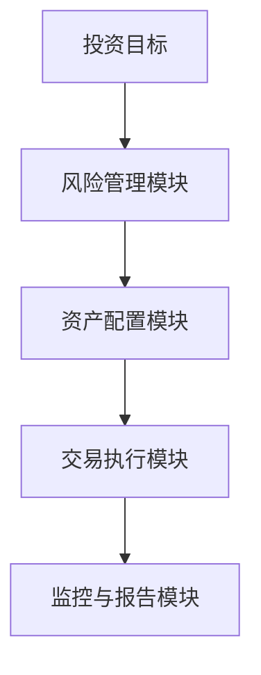
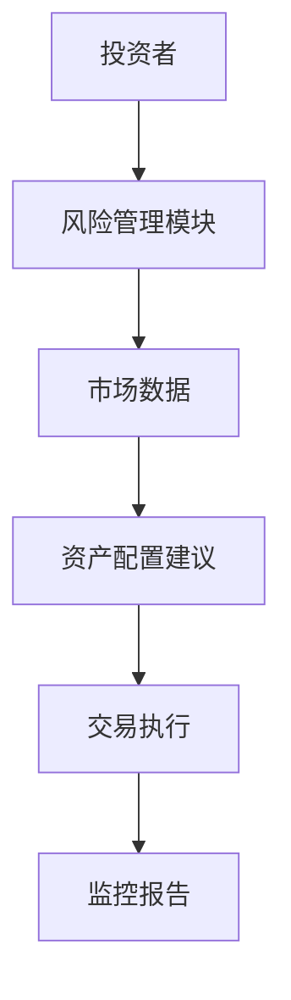

                 


# 防御性投资策略：在不确定时期保护资本

---

## 关键词：
防御性投资、风险管理、资产保护、投资组合、风险控制

---

## 摘要：
在金融市场波动加剧的当下，防御性投资策略成为投资者保护资本的重要手段。本文详细解析防御性投资的核心概念、策略分类、数学模型、系统架构及实际案例，为投资者提供在不确定时期保护资本的有效方法。

---

## 第一部分：防御性投资策略的背景与核心概念

### 第1章：防御性投资策略概述

#### 1.1 防御性投资的定义与背景

##### 1.1.1 防御性投资的定义
防御性投资是一种注重风险管理的投资策略，旨在通过降低投资组合的风险来保护资本免受重大损失。它强调稳健性而非高收益，适合在市场不确定性增加时使用。

##### 1.1.2 防御性投资的背景与重要性
近年来，全球经济波动加剧，传统投资策略在极端市场条件下表现不佳。防御性投资的兴起源于投资者对资产保护的需求增加，尤其是在2008年全球金融危机后，防御性投资策略逐渐被更多人重视。

##### 1.1.3 防御性投资与进攻性投资的区别
- **目标**：防御性投资注重资本保护，而进攻性投资追求高收益。
- **风险承受**：防御性投资风险承受能力较低，进攻性投资风险承受能力较高。
- **时间框架**：防御性投资适合短期至中期保护，进攻性投资适合长期增长。

---

#### 1.2 防御性投资的核心原则

##### 1.2.1 风险管理的重要性
风险管理是防御性投资的核心，通过识别、评估和控制风险，降低投资组合的波动性。

##### 1.2.2 资产保护机制
- **分散投资**：通过投资不同资产类别、行业和地理区域，降低特定资产的风险。
- **安全资产配置**：配置国债、黄金等低风险资产，确保在市场下跌时提供保护。

##### 1.2.3 防御性投资的长期视角
防御性投资并非消极保守，而是通过稳健配置在长期实现资本增值，同时抵御短期市场波动。

---

#### 1.3 防御性投资的历史与发展

##### 1.3.1 防御性投资的历史演变
防御性投资理念可追溯至20世纪30年代，本杰明·格雷厄姆提出的价值投资理论为其奠定了基础。

##### 1.3.2 不同经济周期中的防御性投资策略
- **经济衰退**：增加现金储备，投资国债等安全资产。
- **经济复苏**：适度配置股票、房地产等资产，抓住反弹机会。

##### 1.3.3 现代防御性投资的发展趋势
随着金融工具的创新，防御性投资逐渐引入更多对冲工具，如期权、期货等，提升风险管理能力。

---

## 第二部分：防御性投资策略的核心概念与原理

### 第2章：防御性投资的原理与机制

#### 2.1 风险管理的核心作用

##### 2.1.1 风险识别与评估
- **风险来源**：市场风险、流动性风险、信用风险等。
- **评估方法**：通过历史数据分析和情景分析评估潜在风险。

##### 2.1.2 风险分散与对冲
- **分散投资**：通过投资多元化资产降低非系统性风险。
- **对冲策略**：利用衍生工具对冲市场波动风险。

##### 2.1.3 风险承受能力的评估
根据投资者的风险承受能力和财务状况，制定个性化风险管理计划。

---

#### 2.2 资产保护机制的构建

##### 2.2.1 资产配置的多样性
- **资产类别**：股票、债券、现金、黄金等。
- **行业分布**：分散投资于不同行业，降低行业风险。

##### 2.2.2 安全资产的选择与配置
- **国债**：提供稳定的收益，降低投资组合的波动性。
- **黄金**：作为避险资产，在通货膨胀或市场危机时提供保护。

##### 2.2.3 非安全资产的风险控制
- **股票选择**：选择低波动性、高分红的股票。
- **债券选择**：投资高评级债券，降低违约风险。

---

#### 2.3 防御性投资的数学模型

##### 2.3.1 风险-收益平衡模型
- **夏普比率**：衡量投资组合的超额收益相对于其风险的表现。
  $$ \text{夏普比率} = \frac{R_p - R_f}{\sigma_p} $$
  其中，\( R_p \) 为投资组合的收益，\( R_f \) 为无风险利率，\( \sigma_p \) 为投资组合的波动性。

##### 2.3.2 马科维茨的有效前沿理论
马科维茨的有效前沿理论通过优化投资组合的收益与风险，找到最优资产配置。

##### 2.3.3 风险调整后的收益计算
通过调整收益数据，反映不同风险水平下的实际表现。

---

## 第三部分：防御性投资策略的分类与选择

### 第3章：防御性投资策略的分类

#### 3.1 价值投资策略

##### 3.1.1 价值投资的定义与特点
- **定义**：寻找市场价格低于内在价值的股票进行投资。
- **特点**：注重长期价值，耐心等待市场回归。

##### 3.1.2 价值投资的核心原则
- **安全边际**：购买价格低于内在价值，确保足够的安全空间。
- **长期视角**：忽略短期市场波动，关注企业长期价值。

##### 3.1.3 价值投资的实施步骤
1. 识别具有强大基本面的企业。
2. 计算内在价值，确定安全边际。
3. 长期持有，分散投资。

---

#### 3.2 逆向投资策略

##### 3.2.1 逆向投资的定义与特点
- **定义**：在市场恐慌时买入，在市场狂热时卖出。
- **特点**：反向操作，利用市场情绪的非理性。

##### 3.2.2 逆向投资的优势与风险
- **优势**：在市场底部买入，获得超额收益。
- **风险**：需要精准判断市场情绪，避免误判导致重大损失。

##### 3.2.3 逆向投资的实施要点
1. 识别市场非理性阶段。
2. 分析企业 fundamentals，避免因市场情绪误判企业价值。
3. 结合价值投资，确保安全边际。

---

#### 3.3 避险投资策略

##### 3.3.1 避险投资的定义与特点
- **定义**：通过衍生工具对冲市场风险，降低投资组合的波动性。
- **特点**：使用期货、期权等工具，实现风险对冲。

##### 3.3.2 常见避险工具与策略
- **股指期货**：对冲股票市场的系统性风险。
- **期权**：购买认沽期权，对冲投资组合的下行风险。

##### 3.3.3 避险投资的风险管理
- **工具选择**：根据市场情况选择合适的避险工具。
- **成本控制**：考虑交易成本和机会成本，避免过度对冲。

---

### 第4章：防御性投资策略的选择与优化

#### 4.1 策略选择的框架

##### 4.1.1 投资目标与风险偏好
根据投资者的投资目标和风险承受能力，选择合适的防御性投资策略。

##### 4.1.2 市场环境分析
- **宏观经济分析**：判断经济周期，选择适合的防御性策略。
- **市场流动性**：流动性不足时，选择流动性较高的资产。

##### 4.1.3 资产配置比例
根据投资组合的整体目标，合理分配不同类型防御性策略的权重。

---

#### 4.2 防御性投资策略的优化

##### 4.2.1 动态调整策略
根据市场变化和自身财务状况，定期评估和调整防御性投资策略。

##### 4.2.2 组合优化
使用现代投资组合理论，优化投资组合的风险收益比。

##### 4.2.3 定期再平衡
定期调整投资组合，确保资产配置符合预定策略。

---

## 第四部分：系统分析与架构设计方案

### 第4章：防御性投资系统的架构设计

#### 4.1 系统功能设计

##### 4.1.1 风险管理模块
- **功能**：实时监控市场风险，评估投资组合的风险水平。
- **工具**：使用夏普比率、波动率等指标评估风险。

##### 4.1.2 资产配置模块
- **功能**：根据市场环境和投资目标，推荐最优资产配置方案。
- **工具**：马科维茨有效前沿理论，夏普比率优化。

##### 4.1.3 交易执行模块
- **功能**：根据策略生成交易指令，确保交易执行的效率和安全性。
- **工具**：算法交易系统，低延迟交易执行。

##### 4.1.4 监控与报告模块
- **功能**：实时监控投资组合的表现，生成报告。
- **工具**：数据可视化工具，生成风险收益报告。

---

#### 4.2 系统架构设计

##### 4.2.1 系统架构图


##### 4.2.2 数据流图


---

## 第五部分：项目实战

### 第5章：防御性投资策略的实战应用

#### 5.1 项目介绍
本项目旨在通过防御性投资策略，在2022年全球市场波动中保护投资者的资本。

---

#### 5.2 核心代码实现

##### 5.2.1 风险管理模块代码
```python
import numpy as np

def calculate_sharpe_ratio(returns, risk_free_rate):
    """
    计算夏普比率
    """
    excess_returns = returns - risk_free_rate
    sharpe_ratio = np.mean(excess_returns) / np.std(excess_returns)
    return sharpe_ratio

# 示例数据
returns = np.array([0.05, 0.02, 0.03, 0.01, 0.04])
risk_free_rate = 0.01

print("夏普比率:", calculate_sharpe_ratio(returns, risk_free_rate))
```

##### 5.2.2 资产配置模块代码
```python
import numpy as np

def optimal_portfolio(weights, returns, covariance):
    """
    计算最优投资组合
    """
    n = len(weights)
    returns_vec = np.array(returns).reshape(-1, 1)
    covariance_matrix = np.array(covariance).reshape(-1, 1)
    inv_covariance = np.linalg.inv(covariance_matrix)
    w = inv_covariance.dot(weights)
    w = w / np.sum(w)
    return w

# 示例数据
weights = np.array([1, 1, 1])
returns = [0.05, 0.03, 0.04]
covariance = np.array([[0.02, 0, 0], [0, 0.03, 0], [0, 0, 0.02]])

print("最优权重:", optimal_portfolio(weights, returns, covariance))
```

---

#### 5.3 案例分析

##### 5.3.1 实际案例
2022年，全球经济衰退风险增加，投资者选择防御性投资策略，配置国债、黄金等资产，有效抵御市场下跌。

##### 5.3.2 项目总结
通过防御性投资策略，投资者成功在市场波动中保护资本，实现稳健收益。

---

## 第六部分：最佳实践与小结

### 第6章：防御性投资策略的最佳实践

#### 6.1 小结
防御性投资策略通过注重风险管理，保护资本在不确定时期的稳健增长。其核心在于合理配置资产，选择适合的防御性策略，并动态调整以应对市场变化。

#### 6.2 最佳实践 tips

##### 6.2.1 风险管理
- 定期评估投资组合的风险，保持足够的安全边际。
- 分散投资，避免过度集中。

##### 6.2.2 资产配置
- 根据市场环境和个人风险偏好，动态调整资产配置。
- 保持适度流动性，确保在市场机会出现时能够及时调整。

##### 6.2.3 持续学习
- 关注全球经济和市场变化，及时调整投资策略。
- 学习新的投资工具和方法，提升风险管理能力。

#### 6.3 拓展阅读
- 《投资学基础》
- 《风险管理与对冲策略》
- 《防御性投资实战案例》

---

## 作者：AI天才研究院/AI Genius Institute & 禅与计算机程序设计艺术 /Zen And The Art of Computer Programming

---

通过以上详细分析，防御性投资策略在保护资本方面具有重要作用。投资者应根据自身情况选择合适的策略，并通过持续学习和实践优化投资组合，实现稳健收益。

