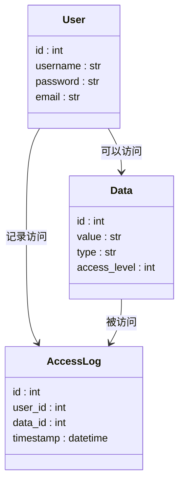
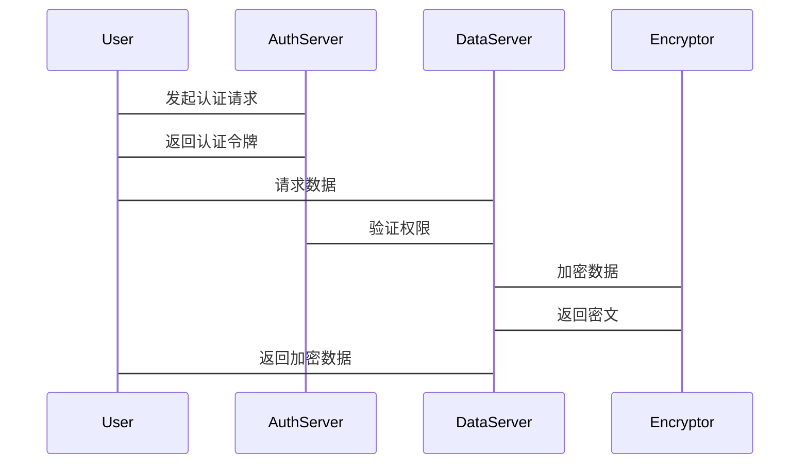

                 


# 隐私保护：确保用户数据安全

## 关键词：数据隐私, 用户隐私, 数据安全, 加密技术, 隐私保护, 数据脱敏, 访问控制

## 摘要：  
随着数字化时代的快速发展，用户数据的安全性变得尤为重要。隐私保护不仅是法律要求，更是企业对用户信任的承诺。本文将从隐私保护的核心概念、算法原理、系统架构设计、项目实战到最佳实践等方面，全面探讨如何确保用户数据安全。通过详细分析数据分类、加密技术、访问控制等关键点，结合实际案例，为读者提供系统化的隐私保护解决方案。

---

## 第一部分: 隐私保护概述

### 第1章: 隐私保护的核心概念

#### 1.1 隐私保护的背景与问题背景

##### 1.1.1 什么是隐私  
隐私是指个人或组织对其信息的自主控制权，确保这些信息不被未经授权的第三方访问、使用或披露。在数字化时代，隐私保护不仅是个人权利的体现，也是企业合规经营的重要前提。

##### 1.1.2 隐私保护的重要性  
随着互联网的普及，用户数据被广泛收集和使用。一旦数据泄露，可能引发身份盗用、金融诈骗、信息滥用等问题，对个人和企业造成巨大损失。因此，隐私保护是保障用户信任和企业声誉的关键。

##### 1.1.3 当前隐私保护面临的挑战  
- 数据量激增，复杂性增加  
- 黑客攻击手段不断进化  
- 数据跨境流动的法律合规问题  
- 用户隐私意识的差异  

#### 1.2 隐私保护的核心概念与定义

##### 1.2.1 数据隐私  
数据隐私是指对数据的访问、使用和披露进行限制，确保只有授权主体才能访问敏感信息。

##### 1.2.2 用户隐私  
用户隐私是用户在使用服务过程中提供的个人信息，如姓名、地址、电话号码等，这些信息需要得到妥善保护。

##### 1.2.3 数据安全  
数据安全是指通过技术手段和管理措施，保护数据的机密性、完整性和可用性。

#### 1.3 隐私保护的边界与外延

##### 1.3.1 隐私保护的范围  
- 个人隐私：涉及个人用户的敏感信息。  
- 企业隐私：涉及企业的商业机密和内部数据。  
- 公共隐私：涉及公共机构的数据，如政府、医疗机构等。  

##### 1.3.2 隐私保护的法律框架  
- 《通用数据保护条例》（GDPR）：欧盟的严格隐私保护法规。  
- 《加州消费者隐私法》（CCPA）：美国加州的隐私保护法案。  
- 《个人信息保护法》（中国）：中国的个人信息保护法律。  

##### 1.3.3 隐私保护与数据利用的平衡  
隐私保护不应完全限制数据的利用，而应在确保安全的前提下，合理利用数据以创造价值。

#### 1.4 隐私保护的核心要素组成

##### 1.4.1 数据分类与分级  
数据分类是根据数据的敏感性、用途和重要性将数据分为不同的类别。例如：  
- **高敏感数据**：如个人身份证号、银行账户信息。  
- **中敏感数据**：如用户的地址、电话号码。  
- **低敏感数据**：如公开的用户评论、点赞信息。  

##### 1.4.2 数据访问控制  
数据访问控制通过权限管理确保只有授权人员或系统才能访问特定数据。常见的访问控制方法包括：  
- **基于角色的访问控制（RBAC）**：根据用户角色分配权限。  
- **基于属性的访问控制（ABAC）**：根据用户属性（如地理位置、时间）动态调整权限。  

##### 1.4.3 数据加密技术  
数据加密是保护数据安全的核心技术，通过将数据转化为不可读的格式，确保即使数据被泄露，也无法被未经授权的第三方解密。

---

### 第2章: 隐私保护的核心概念与联系

#### 2.1 隐私保护的核心原理

##### 2.1.1 数据加密原理  
数据加密通过数学算法将明文转化为密文，确保数据在传输和存储过程中的安全性。常见的加密算法包括：  
- **对称加密**：如AES算法，加密和解密使用相同的密钥。  
- **非对称加密**：如RSA算法，加密和解密使用不同的公钥和私钥。  

##### 2.1.2 数据脱敏技术  
数据脱敏是通过技术手段将敏感数据转化为不可逆的非敏感数据，例如：  
- 姓名脱敏：将“张三”转化为“***”。  
- 身份证号脱敏：将“123456789012”转化为“123* ****23”。  

##### 2.1.3 数据访问控制机制  
数据访问控制机制通过身份验证、权限管理和日志审计，确保数据只能被授权主体访问和操作。

#### 2.2 隐私保护的核心概念对比

##### 2.2.1 数据分类与分级对比  
| 数据分类 | 数据分级 |  
|----------|----------|  
| 姓名    | 高敏感   |  
| 地址    | 中敏感   |  
| 电话    | 中敏感   |  
| 银行卡号| 高敏感   |  

##### 2.2.2 数据加密与数据脱敏的对比  
| 特性       | 数据加密          | 数据脱敏          |  
|------------|-------------------|-------------------|  
| 目的       | 保护数据机密性    | 隐藏数据敏感性    |  
| 是否可逆   | 可逆（需要密钥）  | 不可逆（单向处理）|  
| 应用场景   | 数据传输、存储    | 数据展示、日志记录|  

##### 2.2.3 数据访问控制与数据生命周期管理的对比  
| 特性         | 数据访问控制       | 数据生命周期管理     |  
|--------------|--------------------|---------------------|  
| 主要目标     | 控制数据访问权限   | 管理数据从生成到销毁的全过程 |  
| 关键技术     | RBAC、ABAC         | 数据分类、分级、销毁 |  

#### 2.3 隐私保护的ER实体关系图

```mermaid
erDiagram
    user {
        id INT
        username VARCHAR
        password VARCHAR
        email VARCHAR
    }
    data {
        id INT
        value VARCHAR
        type VARCHAR
        access_level INT
    }
    access_log {
        id INT
        user_id INT
        data_id INT
        timestamp DATETIME
    }
    user --> data : 可以访问
    user --> access_log : 记录访问
    data --> access_log : 被访问
```

---

## 第3章: 数据加密与隐私保护的数学模型

### 3.1 数据加密算法的数学模型

#### 3.1.1 对称加密算法  
对称加密算法使用相同的密钥进行加密和解密。其数学模型如下：  
$$ C = E(K, P) $$  
$$ P = D(K, C) $$  
其中，$C$ 表示密文，$P$ 表示明文，$K$ 表示密钥，$E$ 表示加密函数，$D$ 表示解密函数。

#### 3.1.2 非对称加密算法  
非对称加密算法使用公钥和私钥进行加密和解密。其数学模型如下：  
$$ C = E(pub\_key, P) $$  
$$ P = D(priv\_key, C) $$  

### 3.2 数据脱敏算法的数学模型

#### 3.2.1 基于哈希的脱敏  
基于哈希的脱敏算法通过哈希函数将敏感数据转化为固定长度的哈希值。数学模型如下：  
$$ H = hash(sensitive\_data) $$  

#### 3.2.2 基于掩码的脱敏  
基于掩码的脱敏算法通过掩盖部分数据实现脱敏。例如：  
$$ masked\_card\_number = substr(card\_number, 0, 4) + "***" + substr(card\_number, 8, 4) $$  

### 3.3 加密算法的实现与对比

#### 3.3.1 对称加密算法的实现  
使用Python的`cryptography`库实现AES加密：

```python
from cryptography.hazmat.primitives.ciphers import (
    Cipher, algorithms, modes
)
from cryptography.hazmat.primitives.asymmetric import padding
from cryptography.hazmat.primitives import hashes
from cryptography.hazmat.backends import default_backend

# 生成密钥
key = b"this is a key"
cipher = Cipher(algorithms.AES(key), modes.ECB(), backend=default_backend())
encryptor = cipher.encryptor()
plaintext = b"hello world"
ciphertext = encryptor.update(plaintext) + encryptor.finalize()
print("加密文本:", ciphertext)
```

#### 3.3.2 非对称加密算法的实现  
使用Python的`cryptography`库实现RSA加密：

```python
# 生成公钥和私钥
key = padding.RSAPrivateKey.generate(
    public_exponent=65537,
    key_size=2048,
    backend=default_backend()
)
private_key = key
public_key = key.public_key()

# 加密
plaintext = b"hello world"
encrypted = public_key.encrypt(
    plaintext,
    padding=padding.RSAPKCS1v15()
)
print("加密文本:", encrypted)
```

#### 3.3.3 数据脱敏算法的实现  
使用Python实现基于哈希的脱敏：

```python
import hashlib

def mask_data(sensitive_data):
    # 生成哈希值
    hash_object = hashlib.sha256(sensitive_data.encode()).hexdigest()
    return hash_object

masked_card_number = mask_data("1234567890123456")
print("脱敏后的卡号:", masked_card_number)
```

---

## 第4章: 系统分析与架构设计

### 4.1 问题场景介绍  
假设我们正在开发一个企业级数据安全系统，需要保护用户数据的安全性，防止数据泄露和未经授权的访问。

### 4.2 系统功能设计

#### 4.2.1 领域模型设计  


#### 4.2.2 系统架构设计  
```mermaid
graph TD
    User --> AuthServer : 发起认证请求
    AuthServer --> DB : 验证用户身份
    User --> DataServer : 请求数据
    DataServer --> AuthServer : 验证权限
    DataServer --> DB : 获取数据
    DataServer --> Encryptor : 加密数据
    Encryptor --> DB : 存储密文
```

#### 4.2.3 系统接口设计  
- 用户认证接口：`/api/authenticate`  
- 数据访问接口：`/api/data/{id}`  
- 数据加密接口：`/api/encrypt`  

### 4.3 系统交互设计  


---

## 第5章: 项目实战

### 5.1 环境安装  
安装必要的Python库：  
```bash
pip install cryptography
pip install mermaid
pip install pydot
```

### 5.2 核心代码实现  

#### 5.2.1 数据加密模块  
```python
from cryptography.hazmat.primitives.ciphers import Cipher, modes
from cryptography.hazmat.primitives.asymmetric import padding
from cryptography.hazmat.primitives import hashes
from cryptography.hazmat.backends import default_backend

def encrypt_data(plaintext):
    key = b"this is a key"
    cipher = Cipher(algorithms.AES(key), modes.ECB(), backend=default_backend())
    encryptor = cipher.encryptor()
    return encryptor.update(plaintext) + encryptor.finalize()

def decrypt_data(ciphertext):
    key = b"this is a key"
    cipher = Cipher(algorithms.AES(key), modes.ECB(), backend=default_backend())
    decryptor = cipher.decryptor()
    return decryptor.update(ciphertext) + decryptor.finalize()
```

#### 5.2.2 数据脱敏模块  
```python
import hashlib

def mask_data(sensitive_data):
    return hashlib.sha256(sensitive_data.encode()).hexdigest()
```

### 5.3 代码应用解读与分析  
通过上述代码实现数据加密和脱敏功能，确保用户数据在存储和传输过程中的安全性。

### 5.4 案例分析  
以用户信息管理系统为例，展示如何通过上述技术实现用户隐私保护。

---

## 第6章: 最佳实践与小结

### 6.1 小结  
隐私保护是数字化时代的核心挑战之一。通过数据分类、加密技术、访问控制等手段，可以有效保障用户数据的安全性。

### 6.2 注意事项  
- 定期更新加密算法和密钥  
- 做好数据备份和恢复准备  
- 提高用户隐私保护意识  

### 6.3 拓展阅读  
- 《数据加密与隐私保护》  
- 《网络安全实战》  
- 《GDPR合规指南》  

---

## 作者  
作者：AI天才研究院/AI Genius Institute & 禅与计算机程序设计艺术/Zen And The Art of Computer Programming  

---

通过以上内容，我们详细探讨了隐私保护的核心概念、算法原理、系统架构设计和项目实战。希望本文能为读者提供系统化的隐私保护解决方案，帮助企业在数字化转型中更好地保护用户数据安全。

