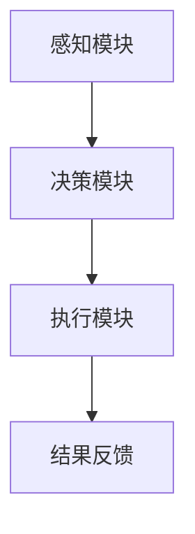

                 


# 零代码平台：快速构建AI Agent原型

## 关键词
零代码平台，AI Agent，快速开发，自动化代码生成，可视化建模，机器学习，自然语言处理

## 摘要
在数字化转型的浪潮中，AI Agent作为智能化决策的核心工具，正变得越来越重要。然而，AI Agent的开发通常需要复杂的编程技能和深厚的技术背景。零代码平台的出现，为快速构建AI Agent原型提供了一种全新的解决方案。本文将详细探讨零代码平台如何通过可视化建模和自动化代码生成，简化AI Agent的开发流程，同时结合实际案例，展示如何在零代码平台上快速实现一个AI Agent原型。

## 引言
随着人工智能技术的快速发展，AI Agent（智能体）在各个行业的应用越来越广泛。AI Agent是一种能够感知环境并自主决策的智能系统，广泛应用于自动驾驶、智能客服、推荐系统等领域。然而，传统AI Agent的开发过程通常需要复杂的编程技能和深厚的技术背景，这限制了其快速开发和普及。

零代码平台的出现，为快速构建AI Agent原型提供了一种全新的解决方案。零代码平台通过可视化建模和自动化代码生成，使得非专业开发者也能轻松构建复杂的AI系统。本文将深入探讨零代码平台的核心机制，分析其在AI Agent开发中的应用，并通过实际案例展示如何快速构建一个AI Agent原型。

## 第1章: 零代码平台的背景与概念

### 1.1 零代码开发的定义与特点
零代码开发是一种通过可视化工具和预设组件，无需编写代码即可快速构建应用程序的方法。其核心特点包括：

- **可视化建模**：通过图形化界面设计应用程序的结构和流程。
- **自动化代码生成**：根据用户的设计自动生成相应的代码。
- **快速迭代**：开发周期短，便于快速修改和优化。
- **低门槛**：适合非专业开发者使用。

### 1.2 AI Agent的基本概念
AI Agent是一种能够感知环境、自主决策并执行任务的智能系统。其核心功能包括：

- **感知**：通过传感器或数据源获取环境信息。
- **决策**：基于感知信息做出决策。
- **执行**：根据决策执行具体操作。

AI Agent可以分为简单反射型、基于模型的反应型、目标驱动型和实用驱动型等多种类型，广泛应用于各个领域。

### 1.3 零代码平台与AI Agent的结合
零代码平台通过提供可视化建模和自动化代码生成，简化了AI Agent的开发流程。其主要优势包括：

- **降低开发门槛**：非专业开发者也能快速构建AI Agent。
- **提高开发效率**：通过自动化代码生成减少开发时间。
- **便于维护**：可视化界面使得系统维护更加简单。

## 第2章: 零代码平台的核心机制

### 2.1 可视化建模
可视化建模是零代码平台的核心机制之一。通过图形化界面，用户可以轻松设计AI Agent的结构和流程。常见的可视化建模工具包括流程图、状态图和数据流图等。

#### 2.1.1 可视化建模的概念与原理
可视化建模通过图形化的方式表示系统的结构和流程，使用户能够直观地理解系统的运行机制。其原理包括：

- **数据流分析**：分析数据在系统中的流动路径。
- **模块划分**：将系统划分为功能模块，明确各模块之间的交互关系。
- **流程优化**：通过可视化建模优化系统的流程，提高效率。

#### 2.1.2 可视化建模在AI Agent中的应用
在AI Agent开发中，可视化建模主要用于设计系统的整体架构和各模块的交互流程。例如，可以通过流程图表示AI Agent的感知、决策和执行过程。



### 2.2 自动化代码生成
自动化代码生成是零代码平台的另一核心机制。通过分析用户的建模结果，自动生成相应的代码。

#### 2.2.1 自动化代码生成的原理
自动化代码生成的原理包括：

- **模型解析**：解析用户的建模结果，提取系统结构和流程信息。
- **代码模板匹配**：根据提取的信息匹配相应的代码模板。
- **代码生成**：自动生成符合需求的代码。

#### 2.2.2 代码生成器的工作流程
代码生成器的工作流程可以分为以下几个步骤：

1. **模型解析**：解析用户的建模结果，提取系统结构和流程信息。
2. **模板匹配**：根据提取的信息匹配相应的代码模板。
3. **代码生成**：自动生成符合需求的代码。
4. **代码优化**：对生成的代码进行优化，提高运行效率。

### 2.3 平台的扩展性与定制化
零代码平台通常具有良好的扩展性和定制化能力，用户可以根据需求对系统进行定制化开发。

#### 2.3.1 可视化组件的扩展
用户可以根据需求添加自定义的可视化组件，丰富系统的功能。

#### 2.3.2 插件机制
通过插件机制，用户可以扩展平台的功能，增加新的模块或功能。

## 第3章: AI Agent的核心算法与实现

### 3.1 自然语言处理
自然语言处理是AI Agent实现人机交互的核心技术之一。常用的自然语言处理算法包括分词、句法分析和情感分析等。

#### 3.1.1 分词算法
分词算法用于将自然语言文本分解成词语或短语。常用算法包括基于统计的分词算法和基于规则的分词算法。

#### 3.1.2 句法分析
句法分析用于分析句子的语法结构，确定词语之间的关系。常用算法包括基于短语结构的句法分析和基于依存句法的句法分析。

#### 3.1.3 情感分析
情感分析用于判断文本中的情感倾向，通常采用机器学习或深度学习算法。

### 3.2 机器学习模型
机器学习模型是AI Agent实现智能决策的核心技术。常用的机器学习模型包括支持向量机、决策树和神经网络等。

#### 3.2.1 支持向量机
支持向量机是一种监督学习算法，适用于分类和回归问题。

#### 3.2.2 决策树
决策树是一种基于树状结构的分类算法，适用于数据特征明显的场景。

#### 3.2.3 神经网络
神经网络是一种模仿人脑结构和功能的深度学习算法，适用于复杂模式识别问题。

## 第4章: AI Agent的系统架构与设计

### 4.1 系统功能设计
AI Agent的系统功能设计包括感知模块、决策模块和执行模块。

#### 4.1.1 感知模块
感知模块用于获取环境信息，通常包括数据采集和数据预处理功能。

#### 4.1.2 决策模块
决策模块用于根据感知信息做出决策，通常采用机器学习模型。

#### 4.1.3 执行模块
执行模块用于根据决策结果执行具体操作，通常包括接口调用和结果反馈功能。

### 4.2 系统架构设计
系统架构设计是AI Agent开发的重要环节，通常采用分层架构。

#### 4.2.1 分层架构
分层架构将系统划分为表示层、业务逻辑层和数据访问层，各层之间通过接口进行交互。

#### 4.2.2 微服务架构
微服务架构将系统划分为多个独立的服务，每个服务负责特定的功能。

### 4.3 系统接口设计
系统接口设计是系统架构设计的重要内容，通常采用RESTful API。

#### 4.3.1 RESTful API
RESTful API是一种基于HTTP协议的API设计风格，具有简洁性和可扩展性。

## 第5章: 项目实战——基于零代码平台构建AI Agent原型

### 5.1 项目背景
本项目旨在通过零代码平台快速构建一个简单的AI Agent原型，展示零代码平台在AI Agent开发中的应用。

### 5.2 项目需求分析
项目需求包括实现一个能够进行简单对话的AI Agent，支持自然语言理解和生成。

### 5.3 项目实施步骤
项目实施步骤包括：

1. **环境搭建**：安装零代码平台和相关工具。
2. **需求分析**：明确项目需求和功能模块。
3. **可视化建模**：设计系统的整体架构和各模块的交互流程。
4. **代码生成**：根据建模结果自动生成代码。
5. **系统测试**：进行功能测试和性能测试。
6. **优化与部署**：优化系统性能并部署上线。

### 5.4 代码实现
以下是项目的核心代码实现：

```python
# 自然语言处理模块
import nltk
from nltk.chat import Chat, reflections

# 定义聊天机器人
chat = Chat([
    (r'(.*)', '你输入了什么？'),
])

# 启动聊天机器人
chat.respond("你好")
```

### 5.5 项目总结
通过本项目，我们成功展示了零代码平台在AI Agent开发中的应用。通过可视化建模和自动化代码生成，我们快速构建了一个简单的AI Agent原型，验证了零代码平台的有效性。

## 第6章: 最佳实践与总结

### 6.1 最佳实践
在零代码平台开发AI Agent时，需要注意以下几点：

- **模块划分**：合理划分功能模块，确保系统结构清晰。
- **数据处理**：确保数据质量和完整性，避免数据错误。
- **性能优化**：优化系统性能，提高运行效率。
- **安全性**：加强系统安全性，防止数据泄露和攻击。

### 6.2 项目总结
通过本文的介绍，我们全面探讨了零代码平台在AI Agent开发中的应用。从核心概念到实际案例，我们展示了如何通过零代码平台快速构建AI Agent原型，验证了其高效性和便捷性。

### 6.3 注意事项
在使用零代码平台开发AI Agent时，需要注意以下几点：

- **功能限制**：零代码平台的功能可能有限，复杂功能需要额外开发。
- **数据隐私**：注意数据隐私和安全，遵守相关法律法规。
- **性能瓶颈**：对于大规模数据和复杂任务，可能会遇到性能瓶颈。

### 6.4 拓展阅读
对于感兴趣的朋友，可以进一步阅读以下资料：

- 《零代码开发：从入门到精通》
- 《AI Agent原理与应用》
- 《机器学习算法详解》

## 结语
零代码平台为快速构建AI Agent原型提供了一种全新的解决方案。通过可视化建模和自动化代码生成，零代码平台简化了AI Agent的开发流程，降低了开发门槛，提高了开发效率。未来，随着技术的不断发展，零代码平台将在AI Agent开发中发挥越来越重要的作用。

## 作者
作者：AI天才研究院 & 禅与计算机程序设计艺术

---

通过本文的详细讲解，我们希望读者能够理解零代码平台在AI Agent开发中的应用，并能够通过实际操作快速构建自己的AI Agent原型。如果读者有任何疑问或建议，欢迎随时与我们联系。

