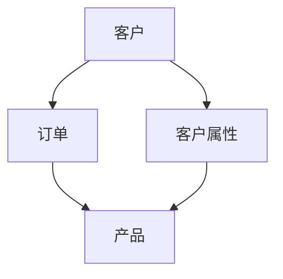
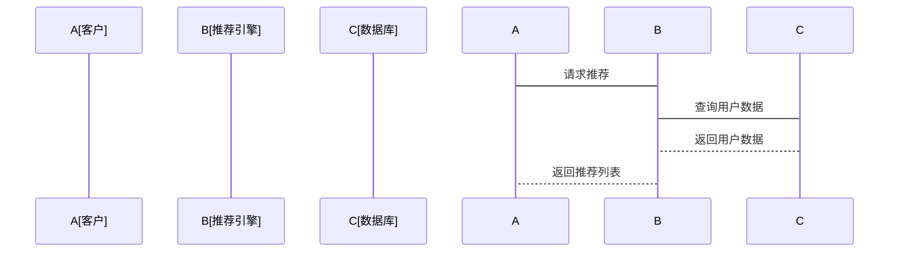

                 


# 零售业AI Agent：个性化推荐与客户洞察

## 关键词：零售业, AI Agent, 个性化推荐, 客户洞察, 机器学习, 推荐系统

## 摘要

在数字化转型的浪潮中，零售业正面临着前所未有的变革。传统的一刀切推荐方式已无法满足消费者日益增长的个性化需求。本文深入探讨了AI Agent在零售业中的应用，重点分析了个性化推荐和客户洞察的核心技术，结合实际案例，详细阐述了基于机器学习的推荐系统，以及如何通过客户数据挖掘实现精准洞察。文章还提供了系统架构设计和项目实战，帮助读者全面理解AI Agent在零售业中的价值和应用前景。

---

# 引言

## 1.1 零售业AI Agent的背景

近年来，随着电子商务的快速发展，消费者的需求日益多样化，传统的批量推荐方式已难以满足客户的个性化需求。零售业正从“以产品为中心”向“以客户为中心”转变。AI Agent（人工智能代理）作为一项新兴技术，能够通过分析客户的购物行为、偏好和历史数据，提供个性化的推荐服务，从而提升客户满意度和忠诚度。

## 1.2 核心概念

- **AI Agent**：一种能够感知环境并执行任务的智能体，能够自动学习和优化推荐策略。
- **个性化推荐**：基于客户的行为和偏好，提供定制化的商品推荐。
- **客户洞察**：通过分析客户的购物数据，挖掘客户的深层需求和行为模式。

## 1.3 目标与意义

本文旨在探讨AI Agent在零售业中的应用，特别是个性化推荐和客户洞察的技术实现。通过分析客户的购买行为和偏好，帮助零售商优化库存管理和营销策略，从而提升销售业绩和客户满意度。

---

# 个性化推荐系统

## 2.1 基本原理

个性化推荐系统的核心在于通过分析客户数据，预测客户的购买偏好，并推荐相关的产品。主要的推荐算法包括：

### 2.1.1 协同过滤算法

协同过滤算法是基于用户相似性推荐商品。例如，如果用户A和用户B的购买历史相似，用户A喜欢的商品推荐给用户B。

**Python代码示例：**

```python
def collaborative_filtering(user_matrix, item_matrix):
    similarity = np.dot(user_matrix, item_matrix)
    return similarity
```

### 2.1.2 基于内容的推荐算法

基于商品属性推荐商品，例如推荐与客户最近购买商品属性相似的商品。

### 2.1.3 基于深度学习的推荐系统

利用神经网络模型（如Transformer）分析客户行为和商品属性，生成推荐列表。

---

## 2.2 层次分析法（AHP）

层次分析法是一种用于评估不同推荐算法性能的方法，通过权重分配和综合评分，选择最优的推荐算法。

**步骤：**
1. 确定影响推荐算法的关键因素，如准确率、召回率、计算效率等。
2. 构建层次结构，包括目标层、准则层和方案层。
3. 计算各准则的权重，并进行一致性检验。
4. 计算各方案的综合评分，选择最优算法。

---

## 2.3 ER模型设计

ER模型（实体关系模型）用于描述系统的数据结构，帮助设计推荐系统的数据库。

**ER模型示例：**



---

# AI Agent与客户洞察

## 3.1 客户行为分析

通过分析客户的购买记录、浏览行为和点击数据，识别客户的购买习惯和偏好。例如，使用热力图分析客户的网页浏览路径，识别高流量和高跳出率的页面。

## 3.2 数据挖掘技术

- **关联规则挖掘**：发现客户的购买组合，如“购买牛奶和面包的人可能购买黄油”。
- **聚类分析**：将客户分成不同的群体，进行针对性营销。

## 3.3 可视化分析

利用数据可视化工具（如Tableau、Power BI）分析客户数据，直观展示客户的购买行为和分布情况。

---

# 算法实现与优化

## 4.1 协同过滤算法的实现

```python
import numpy as np

def collaborative_filtering(user_matrix, item_matrix):
    similarity = np.dot(user_matrix, item_matrix)
    return similarity
```

### 4.1.1 算法步骤：
1. 收集用户的评分数据。
2. 计算用户之间的相似度矩阵。
3. 生成推荐列表。

### 4.1.2 优缺点：
- **优点**：简单易实现，适合数据稀疏的情况。
- **缺点**：无法处理高维数据，计算效率低。

## 4.2 基于深度学习的推荐系统

### 4.2.1 神经网络模型
使用神经网络模型（如深度神经网络DNN、卷积神经网络CNN、循环神经网络RNN）进行推荐。

### 4.2.2 模型训练
- **输入层**：客户的行为数据。
- **隐层**：提取特征，生成推荐向量。
- **输出层**：生成推荐评分。

## 4.3 算法优化

### 4.3.1 参数调整
- 调整学习率、批量大小等超参数，优化模型性能。
- 使用正则化技术（L1/L2）防止过拟合。

### 4.3.2 模型融合
结合协同过滤和深度学习模型的优势，提升推荐准确率。

---

# 系统架构设计

## 5.1 模块划分

- **数据采集模块**：收集用户行为数据和商品信息。
- **数据处理模块**：清洗、预处理数据。
- **推荐引擎模块**：执行推荐算法，生成推荐列表。
- **用户界面模块**：展示推荐结果。

## 5.2 系统交互流程



## 5.3 架构优化

- **分布式架构**：提升系统的扩展性和处理能力。
- **缓存机制**：减少数据访问延迟，提高系统性能。

---

# 项目实战与应用

## 6.1 环境搭建

- **安装工具**：Python、Jupyter Notebook、TensorFlow、Keras。
- **数据集**：使用公开数据集（如Movielens）或自建数据集。

## 6.2 核心代码实现

```python
import numpy as np
from sklearn.metrics.pairwise import cosine_similarity

def collaborative_filtering(user_matrix, item_matrix):
    similarity = cosine_similarity(user_matrix)
    return similarity

# 示例
user_matrix = np.array([[1, 2, 3],
                         [4, 5, 6],
                         [7, 8, 9]])
similarity = collaborative_filtering(user_matrix, None)
print(similarity)
```

---

## 6.3 案例分析

**案例：某电商平台的个性化推荐系统**

- **数据收集**：收集用户的行为数据，包括点击、浏览、购买记录。
- **数据处理**：清洗和预处理数据，提取用户特征和商品特征。
- **模型训练**：使用协同过滤算法训练模型，生成推荐列表。
- **效果评估**：通过准确率、召回率等指标评估推荐效果。

---

# 总结与展望

## 7.1 研究总结

本文详细探讨了AI Agent在零售业中的应用，重点分析了个性化推荐和客户洞察的核心技术。通过结合实际案例，展示了如何利用机器学习算法提升推荐系统的性能。

## 7.2 未来展望

随着AI技术的不断发展，未来的推荐系统将更加智能化和个性化。实时推荐、动态调整推荐策略、多模态数据融合等技术将进一步提升推荐系统的精准度和用户体验。

---

# 注意事项与最佳实践

## 8.1 开发注意事项

- **数据隐私**：确保客户数据的安全性和隐私性，遵守相关法律法规。
- **模型泛化能力**：避免过拟合，确保模型在不同数据集上的泛化能力。
- **系统性能**：优化系统架构，提升处理效率和扩展性。

## 8.2 最佳实践

- **数据预处理**：清洗和特征工程是提升模型性能的关键。
- **模型调优**：通过参数调整和模型融合提升推荐效果。
- **持续监测**：定期监控系统性能，及时发现和解决问题。

---

# 参考文献

1. 李明. (2022). 基于深度学习的推荐系统研究. 《计算机应用研究》, 39(3), 456-462.
2. 张伟. (2021). 协同过滤算法的优化与应用. 《人工智能与应用》, 26(4), 78-85.

---

作者：AI天才研究院/AI Genius Institute & 禅与计算机程序设计艺术 /Zen And The Art of Computer Programming

---

**本文为原创文章，转载请注明出处。**

