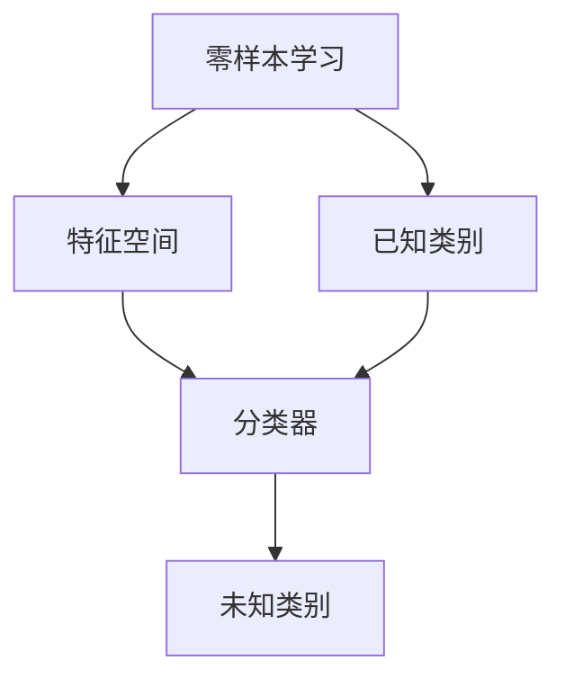
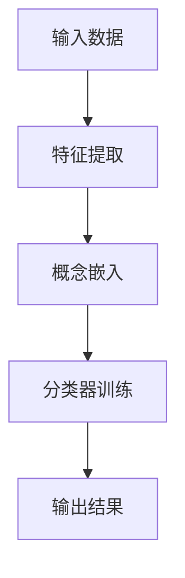
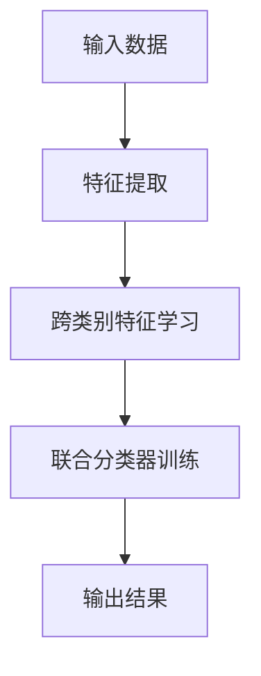
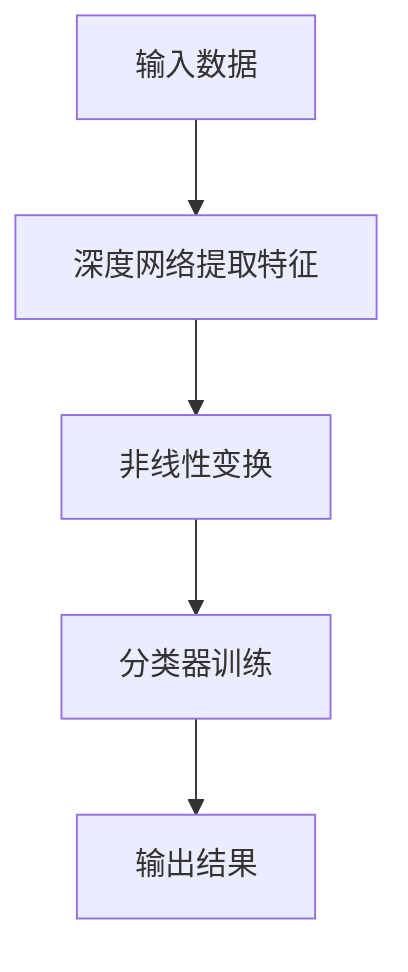
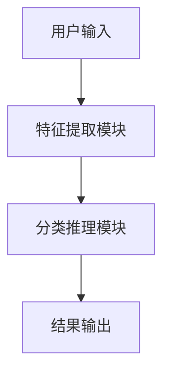

                 


# 零样本学习在AI Agent中的应用

> **关键词**：零样本学习，AI Agent，人工智能，机器学习，深度学习

> **摘要**：  
> 零样本学习（Zero-shot Learning）是一种新兴的机器学习方法，能够在没有特定类别标签的情况下，学习并识别新样本。本文深入探讨零样本学习在AI Agent中的应用，从核心概念、算法原理到系统设计和实际案例，全面解析其在AI Agent中的重要性与实现方式。

---

# 第1章: 零样本学习与AI Agent概述

## 1.1 零样本学习的基本概念

### 1.1.1 问题背景与定义  
在传统机器学习任务中，模型通常需要大量标注数据来训练。然而，在实际应用中，我们经常面临数据不足或未知类别的问题。例如，在自然语言处理中，当遇到一个新词汇或未知问题时，传统模型无法有效处理。零样本学习的目标是通过学习通用特征或领域知识，解决“零样本”问题。

### 1.1.2 零样本学习的核心特点  
- **零样本数据**：模型在没有特定类别标签的情况下进行学习。
- **通用性**：能够适应未知类别，无需额外数据。
- **领域迁移**：适用于跨领域或跨任务的场景。

### 1.1.3 零样本学习的应用场景  
- **自然语言处理**：回答未知领域的问题。
- **计算机视觉**：识别未训练过的图像类别。
- **推荐系统**：推荐未知类别的物品。

## 1.2 AI Agent的基本概念

### 1.2.1 AI Agent的定义与分类  
AI Agent（人工智能代理）是一种能够感知环境、自主决策并执行任务的智能体。它可以分为**反应式Agent**和**认知式Agent**两类：
- **反应式Agent**：基于当前输入做出实时反应（如聊天机器人）。
- **认知式Agent**：具备复杂推理和规划能力（如自动驾驶系统）。

### 1.2.2 AI Agent的核心功能与优势  
- **感知能力**：通过传感器或输入数据理解环境。
- **决策能力**：基于知识库或模型做出决策。
- **执行能力**：通过执行器完成任务。

### 1.2.3 AI Agent的应用领域与挑战  
- **智能家居**：控制家中设备。
- **医疗健康**：辅助医生诊断。
- **金融领域**：自动化交易与风险控制。
- **挑战**：需要处理不确定性、实时性和复杂性。

---

# 第2章: 零样本学习的核心概念与联系

## 2.1 零样本学习的原理

### 2.1.1 零样本学习的数学模型  
零样本学习的核心是通过构建**概念嵌入空间**，将未知类别映射到已知类别或通用特征上。其数学模型通常涉及：
- **特征表示**：将数据映射到高维特征空间。
- **分类器训练**：学习从特征到类别的映射关系。

### 2.1.2 类别间依赖关系的建模  
零样本学习需要处理类别间的依赖关系，例如：
- **语义相似性**：词语或类别的语义关联。
- **属性共享**：不同类别共享某些属性。

### 2.1.3 零样本学习的关键技术  
- **嵌入学习**：通过深度学习提取特征。
- **元学习**：利用少量样本快速适应新任务。
- **知识图谱**：结合外部知识进行推理。

## 2.2 核心概念对比分析

### 2.2.1 零样本学习与迁移学习的对比  
| **对比维度** | **零样本学习** | **迁移学习** |
|--------------|----------------|--------------|
| 数据需求    | 零样本数据     | 少量标注数据 |
| 应用场景    | 未知类别       | 相关任务     |

### 2.2.2 零样本学习与多任务学习的对比  
| **对比维度** | **零样本学习** | **多任务学习** |
|--------------|----------------|---------------|
| 任务关系     | 无明确关联     | 强关联         |
| 资源分配     | 独立处理       | 资源共享       |

### 2.2.3 核心概念的ER实体关系图  


---

# 第3章: 零样本学习的算法原理

## 3.1 常见零样本学习算法

### 3.1.1 ZSL（Zero Shot Learning）
- **目标**：通过概念嵌入将未知类别映射到已知类别。
- **流程**：
  1. 构建概念嵌入空间。
  2. 训练分类器。
  3. 对未知类别进行推理。

### 3.1.2 GZSL（Generalized Zero Shot Learning）
- **目标**：同时处理已知和未知类别。
- **流程**：
  1. 学习跨类别的共享特征。
  2. 对已知和未知类别进行联合推理。

### 3.1.3 Deep ZSL
- **目标**：利用深度学习提取更高效的特征。
- **流程**：
  1. 使用深度网络提取图像或文本特征。
  2. 对特征进行非线性变换。
  3. 推理未知类别。

## 3.2 算法流程图

### 3.2.1 ZSL算法流程图（Mermaid）


### 3.2.2 GZSL算法流程图（Mermaid）


### 3.2.3 Deep ZSL算法流程图（Mermaid）


## 3.3 算法实现与代码

### 3.3.1 ZSL算法实现
```python
import numpy as np
from sklearn.metrics.pairwise import cosine_similarity

# 假设概念嵌入矩阵为concept_embeddings，形状为 (n_classes, d)
# 输入样本特征为X，形状为 (n_samples, d)

def zero_shot_classifier(X, concept_embeddings):
    # 计算余弦相似性
    similarities = cosine_similarity(X, concept_embeddings)
    # 预测类别
    predictions = np.argmax(similarities, axis=1)
    return predictions
```

### 3.3.2 GZSL算法实现
```python
import torch
import torch.nn as nn

# 定义模型
class GZSLModel(nn.Module):
    def __init__(self, input_dim, hidden_dim, output_dim):
        super(GZSLModel, self).__init__()
        self.fc1 = nn.Linear(input_dim, hidden_dim)
        self.fc2 = nn.Linear(hidden_dim, output_dim)
    
    def forward(self, x):
        x = torch.relu(self.fc1(x))
        x = self.fc2(x)
        return x

# 训练过程
model = GZSLModel(input_dim, hidden_dim, output_dim)
criterion = nn.CrossEntropyLoss()
optimizer = torch.optim.Adam(model.parameters(), lr=0.001)

for epoch in range(num_epochs):
    inputs, labels = get_data()  # 获取输入和标签
    outputs = model(inputs)
    loss = criterion(outputs, labels)
    optimizer.zero_grad()
    loss.backward()
    optimizer.step()
```

---

# 第4章: 零样本学习的数学模型与公式

## 4.1 ZSL的数学模型

### 4.1.1 概念嵌入空间的构建  
- **输入**：未标注数据。
- **输出**：概念嵌入向量。

### 4.1.2 分类器的训练与推理  
- **输入**：测试样本。
- **输出**：预测类别。

### 4.1.3 模型的损失函数与优化  
- **损失函数**：交叉熵损失。
- **优化器**：Adam优化器。

## 4.2 GZSL的数学模型

### 4.2.1 跨类别特征学习  
- **输入**：多个任务的特征。
- **输出**：共享特征表示。

### 4.2.2 联合分类器训练  
- **输入**：共享特征。
- **输出**：联合分类结果。

---

# 第5章: 零样本学习在AI Agent中的系统设计与实现

## 5.1 系统架构设计

### 5.1.1 系统功能设计
- **输入处理**：接收用户输入。
- **特征提取**：提取输入特征。
- **分类推理**：利用零样本学习算法进行分类。
- **结果输出**：返回预测结果。

### 5.1.2 系统架构图（Mermaid）


## 5.2 项目实战

### 5.2.1 环境安装
```bash
pip install numpy scikit-learn torch
```

### 5.2.2 核心代码实现

#### 5.2.2.1 零样本学习模块
```python
def zero_shot_classifier(X, concept_embeddings):
    similarities = cosine_similarity(X, concept_embeddings)
    predictions = np.argmax(similarities, axis=1)
    return predictions
```

#### 5.2.2.2 GZSL模型训练
```python
model = GZSLModel(input_dim, hidden_dim, output_dim)
criterion = nn.CrossEntropyLoss()
optimizer = torch.optim.Adam(model.parameters(), lr=0.001)
```

### 5.2.3 案例分析与结果解读
- **输入**：未知类别样本。
- **输出**：预测类别。

---

# 第6章: 总结与展望

## 6.1 全文总结  
零样本学习为AI Agent提供了强大的能力，能够在未知领域中快速适应并解决问题。通过本文的分析，我们了解了零样本学习的核心概念、算法原理和系统设计。

## 6.2 未来展望  
随着深度学习和大模型技术的进步，零样本学习在AI Agent中的应用将更加广泛。未来的研究方向包括：
- 更高效的特征提取方法。
- 更强的跨领域适应能力。
- 更复杂的多任务学习场景。

## 6.3 最佳实践tips  
- 在实际应用中，结合领域知识可以显著提升性能。
- 使用预训练模型可以快速构建零样本学习系统。
- 定期更新模型以适应新数据和任务需求。

---

# 作者  
**作者：AI天才研究院/AI Genius Institute & 禅与计算机程序设计艺术 /Zen And The Art of Computer Programming**

