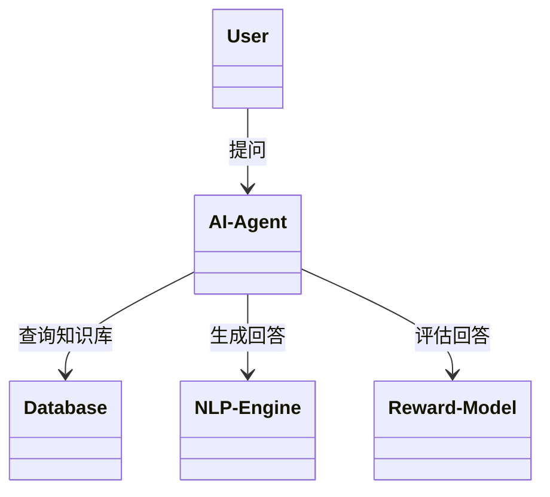
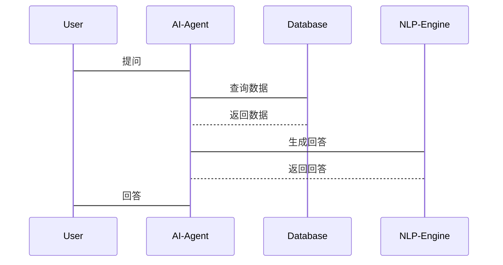

                 


# 预测2025年AI Agent技术的发展方向

## 关键词：AI Agent, 人工智能, 大模型, 强化学习, 多智能体协作, 生成式AI, 个性化服务

## 摘要：AI Agent作为人工智能领域的重要技术，正在迅速发展。本文预测了2025年AI Agent技术的发展方向，包括技术趋势、应用场景、算法创新和伦理挑战。文章详细分析了大模型、强化学习和知识图谱在AI Agent中的应用，并探讨了多智能体协作、个性化服务和边缘计算的结合。此外，文章还讨论了数据隐私和伦理问题，并提出了未来研究的方向。

---

## 第一部分：AI Agent技术的发展背景与核心概念

### 第1章：AI Agent技术的背景与现状

#### 1.1 AI Agent的基本概念
- **1.1.1 什么是AI Agent**
  AI Agent是一种智能实体，能够感知环境并采取行动以实现特定目标。
  
- **1.1.2 AI Agent的核心特点**
  | 特性 | 描述 |
  |------|------|
  | 智能性 | 能够理解、推理和学习 |
  | 反应性 | 及时响应环境变化 |
  | 目标导向 | 行为基于明确的目标 |

- **1.1.3 AI Agent与传统AI的区别**
  AI Agent不仅执行任务，还能主动适应环境和学习。

#### 1.2 当前AI Agent技术的发展现状
- **1.2.1 国际与国内的发展现状**
  国际上，美国和欧洲在AI Agent研究方面领先，国内则以中国和日本为重点。

- **1.2.2 企业级应用的典型案例**
  如亚马逊的客服智能助手，能够处理复杂客户咨询。

- **1.2.3 学术界的研究进展**
  研究集中在多智能体协作和知识图谱构建。

#### 1.3 AI Agent技术的主要驱动因素
- **1.3.1 大模型技术的突破**
  大模型如GPT-4提升了生成能力。

- **1.3.2 计算能力的提升**
  GPU和TPU的改进加速了AI Agent的发展。

- **1.3.3 数据量的爆炸式增长**
  更多数据支持AI Agent的学习和推理。

#### 1.4 本章小结
AI Agent正快速发展，驱动因素包括大模型、计算能力和数据量的增长。

---

## 第二部分：AI Agent技术的核心概念与技术原理

### 第2章：AI Agent的核心概念与技术原理

#### 2.1 AI Agent的核心技术
- **2.1.1 大模型技术**
  大模型通过大量数据训练，具备强大的生成能力。

- **2.1.2 强化学习**
  通过奖励机制优化决策过程。

- **2.1.3 知识图谱**
  帮助AI Agent理解和组织知识。

#### 2.2 AI Agent与其他技术的关系
- **2.2.1 AI Agent与大模型的关系**
  大模型为AI Agent提供生成能力。

- **2.2.2 AI Agent与强化学习的关系**
  强化学习优化AI Agent的决策过程。

- **2.2.3 AI Agent与知识图谱的关系**
  知识图谱为AI Agent提供结构化知识。

#### 2.3 AI Agent的数学模型与公式
- **2.3.1 大模型的数学模型**
  使用转换模型，如$$P(y|x) = \arg\max_y P(y|x)$$。

- **2.3.2 强化学习的数学模型**
  状态-动作-奖励模型，如$$Q(s,a) = r + \gamma \max_a Q(s',a)$$。

- **2.3.3 知识图谱的数学模型**
  三元组表示，如$$（头，关系，尾）$$。

#### 2.4 本章小结
AI Agent结合大模型、强化学习和知识图谱，具备生成、推理和协作能力。

---

## 第三部分：AI Agent技术的算法原理

### 第3章：AI Agent算法的实现原理

#### 3.1 生成式AI Agent的算法原理
- **3.1.1 基于大模型的生成算法**
  使用GPT类模型生成文本。

- **3.1.2 基于强化学习的生成算法**
  使用策略梯度方法优化生成过程。

- **3.1.3 基于知识图谱的生成算法**
  结合知识图谱生成结构化内容。

#### 3.2 多智能体协作算法
- **3.2.1 多智能体协作的基本原理**
  智能体之间通过通信和协作完成任务。

- **3.2.2 基于大模型的多智能体协作**
  使用大模型进行通信和决策。

- **3.2.3 基于强化学习的多智能体协作**
  通过强化学习优化协作策略。

#### 3.3 本章小结
生成式和协作式算法使AI Agent更加智能和高效。

---

## 第四部分：AI Agent技术的系统分析与架构设计

### 第4章：AI Agent系统的分析与架构设计

#### 4.1 项目场景介绍
- 客服AI Agent帮助处理客户咨询。

#### 4.2 系统功能设计
- **领域模型设计**：使用Mermaid类图展示系统各角色及其关系。



- **系统架构设计**：使用Mermaid架构图展示系统架构。


- **系统接口设计**：使用Mermaid序列图展示交互过程。



#### 4.3 本章小结
系统设计和架构为AI Agent的实现提供了框架。

---

## 第五部分：AI Agent技术的项目实战

### 第5章：AI Agent项目的实战

#### 5.1 环境安装
- 安装Python、TensorFlow、Keras等工具。

#### 5.2 系统核心实现源代码
```python
def generate_response(prompt, model):
    return model.generate(prompt)

def evaluate_response(response, reward_model):
    return reward_model.score(response)
```

#### 5.3 代码应用解读与分析
- 代码实现AI Agent的生成和评估功能。

#### 5.4 实际案例分析和详细讲解剖析
- 案例：AI Agent帮助客户解决技术问题。

#### 5.5 本章小结
项目实战展示了AI Agent的实际应用。

---

## 第六部分：AI Agent技术的未来趋势与挑战

### 第6章：AI Agent技术的未来趋势与挑战

#### 6.1 未来技术趋势
- **多模态AI Agent**：结合视觉、听觉等多种感知方式。

#### 6.2 应用场景扩展
- **智能城市**：优化交通和资源分配。

#### 6.3 技术挑战与解决方案
- **计算资源**：优化算法以减少资源消耗。

#### 6.4 伦理与安全问题
- 确保AI Agent的行为符合伦理规范。

#### 6.5 本章小结
未来，AI Agent将更加智能和广泛应用，但需解决技术与伦理挑战。

---

## 第七部分：总结与展望

### 第7章：总结与展望

#### 7.1 全书总结
AI Agent技术将在未来继续快速发展，应用领域将更加广泛。

#### 7.2 未来的研究方向
- 更高效的大模型优化。
- 多智能体协作的优化。
- 数据隐私保护。

#### 7.3 本章小结
AI Agent技术的未来发展充满潜力，但也面临挑战。

---

## 作者：AI天才研究院/AI Genius Institute & 禅与计算机程序设计艺术 /Zen And The Art of Computer Programming

---

通过以上思考过程，我们可以清晰地看到AI Agent技术的发展方向和未来潜力。2025年，AI Agent将在各个领域发挥更大的作用，但仍需克服技术与伦理上的挑战。

