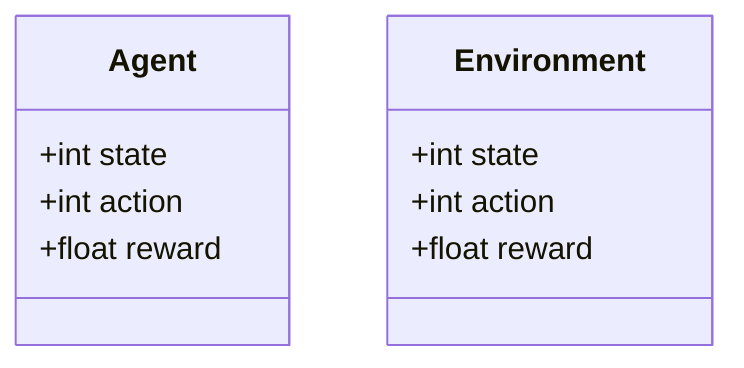
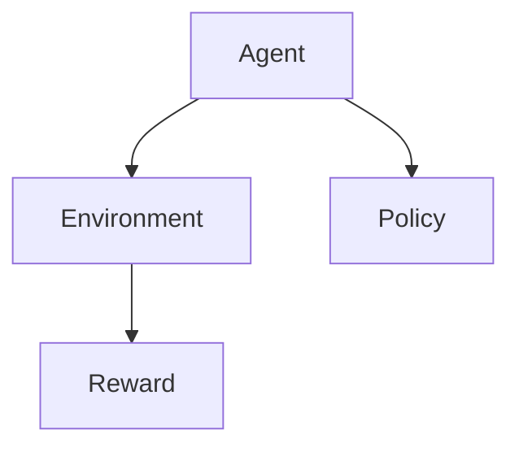
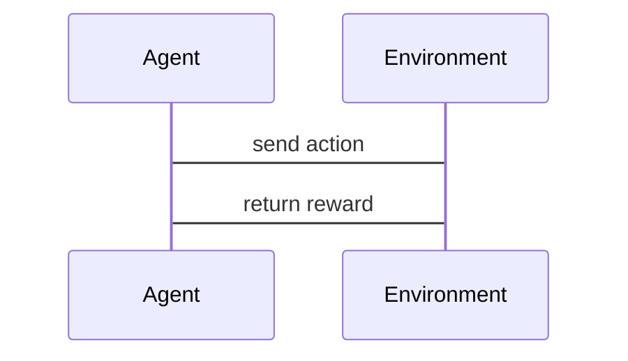

                 


# 领域特定AI Agent的开发策略

> 关键词：领域特定AI Agent、AI Agent开发、强化学习、生成模型、系统架构设计

> 摘要：本文详细探讨了领域特定AI Agent的开发策略，从概念、算法、系统架构到实际项目，结合具体案例分析，为开发者提供全面的指导。

---

# 第1章: 领域特定AI Agent的背景与概念

## 1.1 AI Agent的基本概念

### 1.1.1 AI Agent的定义与特点

AI Agent（智能体）是指能够感知环境并采取行动以实现目标的智能系统。领域特定AI Agent专注于特定领域，具有高度的针对性和优化能力。

- **定义**：AI Agent通过传感器接收信息，利用计算能力处理数据，并通过执行器采取行动。
- **特点**：领域特定AI Agent在特定场景下表现卓越，如医疗诊断、金融交易等领域。

### 1.1.2 领域特定AI Agent的必要性

- **问题背景**：通用AI Agent在特定复杂场景中效果有限，难以满足专业需求。
- **问题描述**：领域专家需要AI系统具备专业领域的知识和处理能力。
- **问题解决**：通过领域特定AI Agent，结合专业知识和算法，提升效率和准确性。

### 1.1.3 领域特定AI Agent与通用AI Agent的区别

| 特性             | 领域特定AI Agent                | 通用AI Agent                 |
|------------------|---------------------------------|------------------------------|
| 应用范围         | 特定领域，如医疗、金融          | 多领域，灵活性高              |
| 知识库           | 领域知识库                      | 广泛知识库                    |
| 处理能力         | 高，针对领域问题优化            | 中等，适应性广                |
| 开发复杂度       | 高，需要领域知识               | 较低，通用性强                |

## 1.2 领域特定AI Agent的背景介绍

### 1.2.1 问题背景与问题描述

AI Agent在特定领域应用中面临挑战，如医疗诊断中的复杂病例需要专业知识支持。领域特定AI Agent通过结合专业知识，提升处理效率和准确性。

### 1.2.2 领域特定AI Agent的核心要素

- **领域知识库**：存储特定领域的知识和数据。
- **专用算法**：针对领域问题优化的算法。
- **高效接口**：与领域系统无缝集成的接口。

### 1.2.3 领域特定AI Agent的边界与外延

- **边界**：特定领域，如医疗诊断系统。
- **外延**：扩展到相关领域，如医疗管理系统。

## 1.3 领域特定AI Agent的核心概念

### 1.3.1 核心概念原理

领域特定AI Agent结合领域知识和AI技术，通过强化学习和生成模型提升处理能力。

### 1.3.2 核心概念属性特征对比表格

| 属性             | 领域特定AI Agent                | 通用AI Agent                 |
|------------------|---------------------------------|------------------------------|
| 专业性           | 高                             | 低                           |
| 知识库           | 领域知识库                      | 广泛知识库                    |
| 效率             | 高，针对领域问题优化            | 中等，适应性广                |

### 1.3.3 ER实体关系图架构

```mermaid
erd
    Hospital {
        ID
        Name
    }
    Doctor {
        ID
        Name
        Specialty
    }
    Patient {
        ID
        Name
        Diagnosis
    }
    Appointment {
        ID
        DoctorID
        PatientID
        Date
    }
```

---

# 第2章: 领域特定AI Agent的核心算法原理

## 2.1 强化学习算法

### 2.1.1 强化学习的基本原理

强化学习通过智能体与环境互动，通过试错学习，最大化累积奖励。

### 2.1.2 马尔可夫决策过程（MDP）

MDP定义为五元组：(S, A, P, R, γ)，其中S是状态空间，A是动作空间，P是转移概率，R是奖励函数，γ是折扣因子。

### 2.1.3 Q-learning算法的数学模型

$$ Q(s, a) = r + \gamma \max_{a'} Q(s', a') $$

### 2.1.4 算法实现

```python
def q_learning(env, num_episodes=1000):
    Q = defaultdict(lambda: np.zeros(env.action_space.n))
    for episode in range(num_episodes):
        state = env.reset()
        while True:
            action = np.argmax(Q[state])
            next_state, reward, done, _ = env.step(action)
            Q[state][action] += reward + np.max(Q[next_state])
            if done:
                break
```

## 2.2 生成模型

### 2.2.1 变量自回归（VAE）模型

VAE通过均值和方差编码数据，生成新的样本。

### 2.2.2 最大似然估计（MLE）的数学模型

$$ \mathcal{L}(\theta) = -\mathbb{E}_{x,z}[ \log p_\theta(x|z) ] $$

## 2.3 算法实现

### 2.3.1 强化学习算法的Python代码实现

```python
import numpy as np
from collections import defaultdict

def q_learning(env, num_episodes=1000):
    Q = defaultdict(lambda: np.zeros(env.action_space.n))
    for episode in range(num_episodes):
        state = env.reset()
        while True:
            action = np.argmax(Q[state])
            next_state, reward, done, _ = env.step(action)
            Q[state][action] += reward + np.max(Q[next_state])
            if done:
                break
    return Q
```

---

# 第3章: 领域特定AI Agent的系统架构设计

## 3.1 系统功能设计

### 3.1.1 领域模型设计



### 3.1.2 系统架构设计



## 3.2 系统接口设计

### 3.2.1 接口描述

- **输入接口**：接收领域数据和用户指令。
- **输出接口**：返回处理结果和反馈信息。

### 3.2.2 系统交互



---

# 第4章: 领域特定AI Agent的项目实战

## 4.1 环境配置

### 4.1.1 系统环境

- **操作系统**：Linux或Windows
- **开发工具**：Python、TensorFlow、Keras

### 4.1.2 依赖管理

使用`requirements.txt`管理依赖：

```text
numpy==1.23.0
pandas==1.3.5
tensorflow==2.10.0
```

## 4.2 核心代码实现

### 4.2.1 强化学习实现

```python
import numpy as np
from collections import defaultdict

def q_learning(env, num_episodes=1000):
    Q = defaultdict(lambda: np.zeros(env.action_space.n))
    for episode in range(num_episodes):
        state = env.reset()
        while True:
            action = np.argmax(Q[state])
            next_state, reward, done, _ = env.step(action)
            Q[state][action] += reward + np.max(Q[next_state])
            if done:
                break
    return Q
```

### 4.2.2 生成模型实现

```python
import tensorflow as tf
from tensorflow.keras import layers

def vae_model(input_shape):
    input_layer = layers.Input(shape=input_shape)
    encoder = layers.Dense(20, activation='relu')(input_layer)
    mu = layers.Dense(10, activation='linear')(encoder)
    log_var = layers.Dense(10, activation='linear')(encoder)
    z = layers.Dense(10, activation='linear')(mu + tf.exp(0.5*log_var))
    decoder = layers.Dense(20, activation='relu')(z)
    output_layer = layers.Dense(input_shape[0], activation='sigmoid')(decoder)
    return Model(inputs=input_layer, outputs=output_layer)
```

## 4.3 案例分析

### 4.3.1 医疗诊断案例

AI Agent帮助诊断疾病，通过强化学习优化诊断流程，生成模型辅助生成诊断报告。

### 4.3.2 项目总结

- **优势**：提高诊断准确性，减少误诊率。
- **挑战**：领域知识的深度和数据质量。

---

# 第5章: 领域特定AI Agent的最佳实践

## 5.1 开发注意事项

- **数据质量**：确保数据准确性和完整性。
- **模型优化**：定期更新模型，适应领域变化。

## 5.2 小结

领域特定AI Agent通过结合专业知识和AI技术，显著提升处理效率和准确性。

## 5.3 注意事项

- **数据隐私**：确保数据安全和隐私保护。
- **系统维护**：定期更新模型和系统。

## 5.4 拓展阅读

- 推荐书籍：《深度学习》（Deep Learning）、《强化学习》（Reinforcement Learning）

---

# 作者：AI天才研究院/AI Genius Institute & 禅与计算机程序设计艺术 /Zen And The Art of Computer Programming

---

**本文由AI天才研究院撰写，转载请注明出处。**

