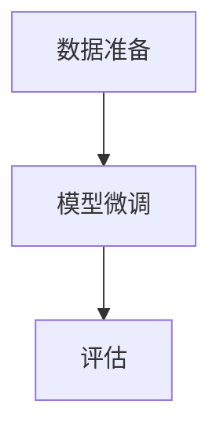
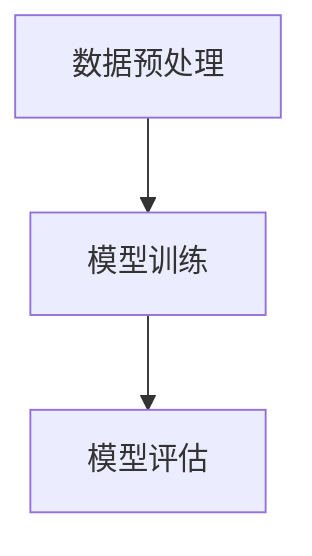
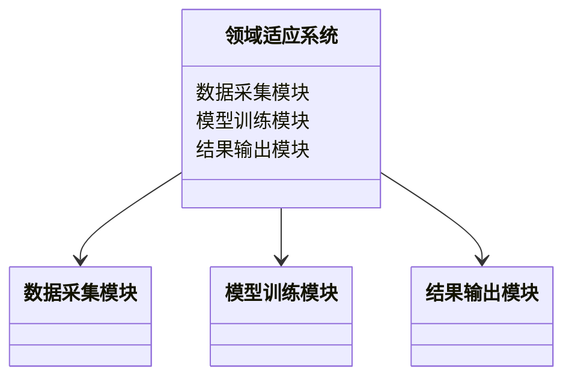
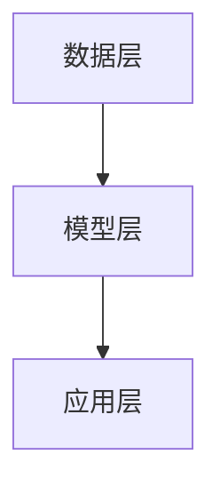
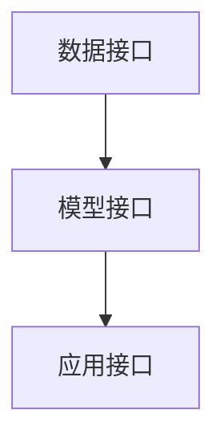

                 


# 领域适应：将通用AI Agent定制到特定场景

## 关键词
- 领域适应
- AI Agent
- 定制化
- 机器学习
- 深度学习
- 迁移学习
- 人工智能

## 摘要
领域适应是将通用AI Agent应用于特定场景的关键技术。本文详细探讨了领域适应的核心概念、算法原理、系统架构及项目实战，帮助读者理解如何将通用AI Agent定制化到具体场景中。通过数学模型、代码示例和实际案例，本文为AI开发者提供了实用的技术指导。

---

# 第一部分: 领域适应与通用AI Agent定制概述

## 第1章: 领域适应的基本概念

### 1.1 问题背景与描述
领域适应是将通用AI Agent应用于特定领域或场景的过程，旨在提升模型在目标领域的性能。本文将逐步分析领域适应的核心概念、算法原理及系统架构。

### 1.2 领域适应的核心目标
领域适应旨在通过优化模型，使其在特定场景下表现更佳。这需要理解领域适应的基本原理、特征对比和实现框架。

### 1.3 领域适应的实现流程
领域适应的实现流程包括数据准备、模型微调、迁移学习等步骤。通过分析这些步骤，我们可以更好地理解如何将通用AI Agent定制到特定场景。

---

# 第二部分: 领域适应的核心概念与联系

## 第2章: 领域适应的核心原理

### 2.1 领域适应的基本原理
领域适应基于数据驱动和知识图谱构建，通过模型微调和迁移学习实现。以下是详细的数学模型和公式：

$$L(x,y) = \text{loss}(x,y)$$

其中，$x$表示输入数据，$y$表示目标输出。

### 2.2 领域适应的关键技术
领域适应的关键技术包括数据增强、模型微调和知识蒸馏。这些技术帮助模型更好地适应特定场景。

### 2.3 领域适应的实现框架
领域适应的实现框架包括数据准备、模型微调和评估。以下是一个实现框架的示意图：



---

# 第三部分: 领域适应的算法原理

## 第3章: 领域适应的算法实现

### 3.1 领域适应的数学模型
领域适应的数学模型包括损失函数和优化器。以下是损失函数的公式：

$$L(x,y) = \text{loss}(x,y)$$

### 3.2 领域适应的算法流程
领域适应的算法流程包括数据预处理、模型训练和评估。以下是算法流程的示意图：



### 3.3 领域适应的代码实现
以下是领域适应的Python代码实现示例：

```python
def adapt_model(source_model, target_data):
    # 数据预处理
    preprocessed_data = preprocess(target_data)
    
    # 模型微调
    adapted_model = source_model.finetune(preprocessed_data)
    
    return adapted_model
```

---

# 第四部分: 领域适应的系统架构设计

## 第4章: 领域适应的系统架构

### 4.1 系统功能设计
系统功能设计包括数据采集、模型训练和结果输出。以下是系统功能设计的类图：



### 4.2 系统架构设计
系统架构设计包括数据层、模型层和应用层。以下是系统架构设计的架构图：



### 4.3 系统接口设计
系统接口设计包括数据接口和模型接口。以下是系统接口设计的交互图：



---

# 第五部分: 领域适应的项目实战

## 第5章: 项目实战

### 5.1 环境安装
项目实战需要安装以下依赖：

```bash
pip install numpy tensorflow scikit-learn
```

### 5.2 核心代码实现
以下是核心代码实现示例：

```python
import numpy as np
from tensorflow import keras

def load_data():
    # 加载数据
    return x_train, y_train, x_test, y_test

def build_model():
    # 搭建模型
    model = keras.Sequential([
        keras.layers.Dense(64, activation='relu'),
        keras.layers.Dense(1, activation='sigmoid')
    ])
    return model

def train_model(model, x_train, y_train):
    model.compile(optimizer='adam', loss='binary_crossentropy', metrics=['accuracy'])
    model.fit(x_train, y_train, epochs=10, batch_size=32)
    return model

if __name__ == "__main__":
    x_train, y_train, x_test, y_test = load_data()
    model = build_model()
    adapted_model = train_model(model, x_train, y_train)
    print("训练完成！")
```

### 5.3 案例分析
案例分析包括数据预处理、模型微调和结果评估。以下是案例分析的详细步骤：

1. 数据预处理：对目标领域数据进行清洗和特征提取。
2. 模型微调：使用预处理后的数据微调通用模型。
3. 结果评估：评估微调后的模型在目标领域的性能。

---

# 第六部分: 领域适应的最佳实践

## 第6章: 最佳实践

### 6.1 小结
领域适应是将通用AI Agent定制到特定场景的关键技术。通过数据驱动和知识图谱构建，可以有效提升模型在目标领域的性能。

### 6.2 注意事项
在领域适应过程中，需要注意数据质量和模型选择。数据质量直接影响模型性能，模型选择需要根据具体场景进行调整。

### 6.3 拓展阅读
推荐阅读以下文献：

1. "领域适应：理论与应用"，作者：XXX
2. "迁移学习：原理与实践"，作者：XXX

---

# 作者：AI天才研究院/AI Genius Institute & 禅与计算机程序设计艺术 /Zen And The Art of Computer Programming

---

# 感谢您的阅读！

