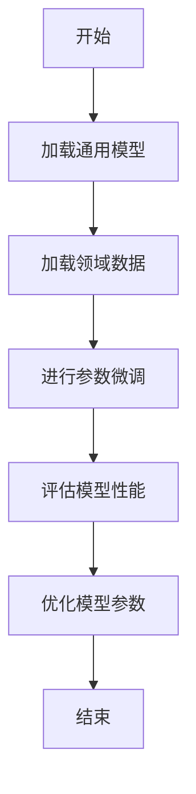
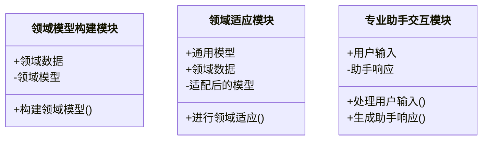
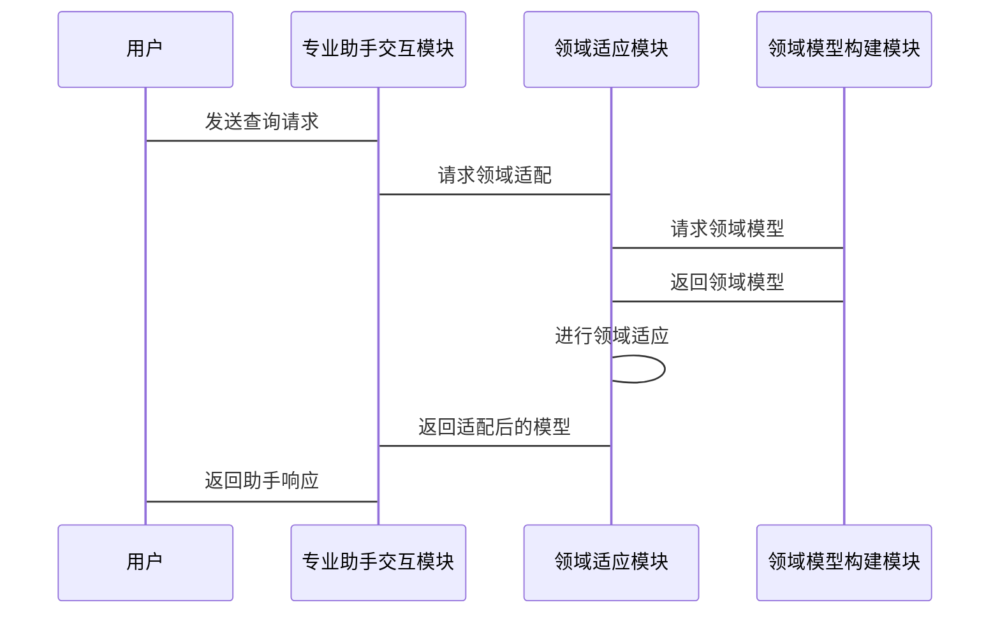

                 


# 领域适应：将通用AI Agent转化为专业助手

> 关键词：领域适应，AI Agent，专业助手，系统架构，算法原理，项目实战

> 摘要：本文系统地探讨了如何将通用AI Agent转化为专业助手的过程，涵盖了领域适应的基本概念、核心算法原理、系统架构设计、项目实战以及最佳实践等方面。通过详细的理论分析和实际案例，本文为读者提供了一套完整的解决方案，帮助他们将通用AI Agent转化为适用于特定领域的专业助手。

---

## 第1章: 领域适应的基本概念

### 1.1 领域适应的定义与背景
#### 1.1.1 什么是领域适应
- 领域适应是指将通用AI Agent的能力应用于特定领域，使其能够更好地理解和解决该领域的问题。
- 领域适应的核心是通过调整模型和算法，使其适应特定领域的数据和任务。

#### 1.1.2 领域适应的背景与意义
- 随着AI技术的发展，通用AI Agent在多个领域展现出强大的能力，但其在特定领域的应用仍需进一步优化。
- 领域适应能够提升AI Agent的性能和准确性，使其更好地服务于特定领域的需求。

#### 1.1.3 领域适应的核心问题
- 领域适应的核心问题是如何将通用模型转换为适用于特定领域的模型，同时保持其通用性。

---

## 第2章: 领域适应的核心概念

### 2.1 领域模型的构建
#### 2.1.1 领域模型的定义
- 领域模型是描述特定领域知识和关系的数学模型，用于指导AI Agent在该领域的行为和决策。

#### 2.1.2 领域模型的构建方法
- 数据驱动方法：基于领域数据构建模型。
- 知识驱动方法：基于领域知识构建模型。
- 混合驱动方法：结合数据和知识构建模型。

#### 2.1.3 领域模型的表示方式
- 图结构表示：使用图论中的节点和边表示领域知识。
- 概率图模型：使用贝叶斯网络等概率模型表示领域知识。

### 2.2 领域适应的机制
#### 2.2.1 领域转换的基本原理
- 领域转换是通过调整模型参数或架构，使其适应特定领域的过程。

#### 2.2.2 领域适应的关键技术
- 参数微调：对模型参数进行小幅度调整，使其适应特定领域。
- 架构适配：根据领域需求调整模型的架构。
- 数据增强：通过生成特定领域数据增强模型的适应性。

#### 2.2.3 领域适应的实现步骤
1. 数据预处理：收集和整理特定领域的数据。
2. 模型选择：选择适合的通用AI Agent模型。
3. 领域适应：通过参数微调或架构调整使模型适应特定领域。
4. 评估与优化：评估模型在特定领域的表现并进行优化。

---

## 第3章: 领域适应的算法原理

### 3.1 领域适应的数学模型
#### 3.1.1 领域适应的公式推导
- 假设我们有一个通用模型$f(x)$，其在领域$A$和领域$B$上的损失函数分别为$L_A$和$L_B$。
- 领域适应的目标是最小化$L_A$和$L_B$之间的差异，即：
  $$ \arg\min_{f} (L_A + L_B) $$

#### 3.1.2 领域适应的数学表达
- 使用对抗训练的思想，领域适应可以通过以下公式实现：
  $$ \min_{f} \max_{g} (L_A + L_B) $$

#### 3.1.3 领域适应的优化方法
- 使用梯度下降法对模型参数进行优化。
- 引入领域适应损失，平衡不同领域的损失。

### 3.2 领域适应的算法实现
#### 3.2.1 领域适应算法的流程图


#### 3.2.2 领域适应算法的代码实现
```python
def领域适应(通用模型, 领域数据):
    for epoch in range(epochs):
        模型参数 = 模型参数 - 学习率 * 梯度
    return 优化后的模型
```

#### 3.2.3 领域适应算法的性能分析
- 时间复杂度：主要取决于数据量和模型规模。
- 空间复杂度：主要取决于存储需求和模型参数数量。

---

## 第4章: 领域适应的系统架构

### 4.1 系统功能设计
#### 4.1.1 领域模型构建模块
- 功能：根据领域数据构建领域模型。
- 输入：领域数据。
- 输出：领域模型。

#### 4.1.2 领域适应模块
- 功能：将通用模型转换为适用于特定领域的模型。
- 输入：通用模型、领域数据。
- 输出：领域适配后的模型。

#### 4.1.3 专业助手交互模块
- 功能：提供人机交互界面，供用户与专业助手进行交互。
- 输入：用户输入。
- 输出：助手的响应。

### 4.2 系统架构设计
#### 4.2.1 系统架构的类图


#### 4.2.2 系统架构的序列图


---

## 第5章: 领域适应的项目实战

### 5.1 项目环境安装
#### 5.1.1 开发环境的配置
- 操作系统：Windows/Mac/Linux
- 开发工具：PyCharm/VS Code

#### 5.1.2 依赖库的安装
- 安装Python和相关库：
  ```bash
  pip install numpy matplotlib tensorflow
  ```

#### 5.1.3 开发工具的使用
- 使用Jupyter Notebook进行快速开发和调试。

### 5.2 核心代码实现
#### 5.2.1 领域模型的构建代码
```python
import numpy as np

def构建领域模型(数据):
    模型 = 神经网络模型()
    模型.fit(数据)
    return 模型
```

#### 5.2.2 领域适应算法的实现代码
```python
def进行领域适应(通用模型, 领域数据):
    模型 = 通用模型.copy()
    模型.fit(领域数据, epochs=100)
    return 模型
```

#### 5.2.3 专业助手交互界面的代码
```python
def助手交互():
    while True:
        用户输入 = input("请输入查询：")
        响应 = 模型预测(用户输入)
        print("助手响应：", 响应)
```

### 5.3 案例分析
- 案例：将通用AI Agent转化为医疗领域的专业助手。
- 步骤：
  1. 收集医疗领域的数据。
  2. 构建医疗领域的模型。
  3. 对通用模型进行医疗领域的适应性调整。
  4. 实现交互界面，供医生和患者使用。

### 5.4 项目总结
- 成功将通用AI Agent转化为专业助手的关键在于领域模型的构建和领域适应算法的实现。
- 项目实战验证了理论的可行性，为后续研究提供了参考。

---

## 第6章: 领域适应的最佳实践

### 6.1 领域适应的注意事项
#### 6.1.1 领域适应的常见问题
- 数据不足：领域数据量小导致模型适应效果差。
- 过度拟合：在特定领域数据上过度拟合，影响通用性。

#### 6.1.2 领域适应的优化技巧
- 数据增强：通过生成数据增加领域数据量。
- 跨领域迁移：结合多个领域的数据进行迁移学习。

#### 6.1.3 领域适应的性能调优
- 调整学习率和批量大小。
- 使用早停法防止过拟合。

### 6.2 领域适应的拓展阅读
#### 6.2.1 领域适应的最新研究
- 最新论文：《领域适应的前沿研究》。

#### 6.2.2 领域适应的未来趋势
- 结合强化学习和生成对抗网络的领域适应方法。

#### 6.2.3 领域适应的行业应用
- 医疗、金融、教育等多个领域的应用案例。

---

## 第7章: 领域适应的总结与展望

### 7.1 领域适应的核心总结
- 领域适应是将通用AI Agent转化为专业助手的关键技术。
- 领域模型的构建和算法的实现是领域适应的核心。

### 7.2 领域适应的未来展望
- 随着AI技术的不断发展，领域适应将在更多领域得到应用。
- 预期领域适应将更加智能化和自动化。

---

作者：AI天才研究院/AI Genius Institute & 禅与计算机程序设计艺术 /Zen And The Art of Computer Programming

