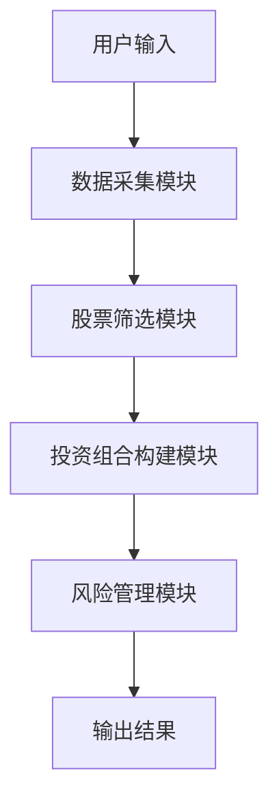
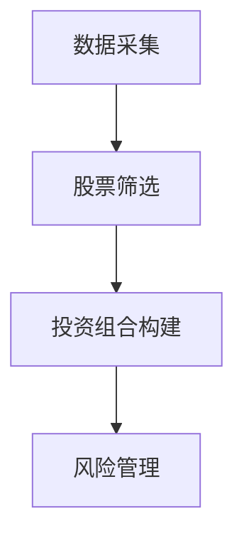

                 


# 高股息策略：构建稳定现金流的投资组合

## 关键词：
高股息策略、稳定现金流、股息收益率、投资组合优化、风险管理、价值投资

## 摘要：
高股息策略是一种通过投资高股息收益率股票来构建稳定现金流的投资方法。本文详细分析了高股息策略的核心概念、数学模型、系统架构设计以及项目实战，帮助投资者理解如何通过股息收益实现财务目标。文章从股息收益率的计算、股息增长模型、系统架构设计、项目案例分析等多个方面展开，结合实际案例和数学模型，为读者提供了一个全面的高股息策略指南。

---

## 第1章: 高股息策略的核心概念

### 1.1 高股息策略的定义与背景
#### 1.1.1 高股息策略的定义
高股息策略是指通过投资股息收益率较高且稳定的股票，构建一个能够在市场波动中提供稳定现金流的投资组合。这种策略尤其适合追求稳定收益的投资者，如保守型投资者、退休人士或希望降低投资组合波动性的投资者。

#### 1.1.2 高股息策略的历史发展
高股息策略并非新兴策略，其历史可以追溯到早期的 dividend investors，如约翰·内夫（John Neff）和菲利普·费舍（Philip Fisher）等投资大师。20世纪80年代，随着价值投资理念的普及，高股息策略逐渐受到更多关注。近年来，随着市场的波动加剧，高股息策略因其稳定性再次受到投资者青睐。

#### 1.1.3 高股息策略的适用场景
高股息策略适用于以下场景：
1. **市场波动较大时**：股息收益能够为投资组合提供稳定性。
2. **低利率环境**：债券收益率较低时，高股息股票成为替代投资。
3. **长期财富积累**：通过复利效应，股息再投资能够带来长期增长。

### 1.2 高股息策略的核心要素
#### 1.2.1 股息收益率的计算公式
股息收益率是衡量股票股息收入与股价之间关系的重要指标，其计算公式为：
$$
\text{股息收益率} = \frac{\text{每股股息（DPS）}}{\text{股价}} \times 100\%
$$
其中，每股股息（DPS）是公司分配给每股的股息金额。

#### 1.2.2 股息率与股价的关系
股息率与股价的关系可以通过以下公式表示：
$$
\text{股息率} = \frac{\text{DPS}}{\text{股价}} \times 100\%
$$
股息率高的股票通常意味着公司愿意将更多利润分配给股东，但也可能表明公司增长潜力有限。因此，投资者需要在股息率和公司成长性之间找到平衡。

#### 1.2.3 高股息策略的边界与外延
高股息策略的边界包括：
1. **股息率的合理区间**：股息率过高可能意味着股价被高估，而过低则可能无法提供足够的现金流。
2. **行业限制**：高股息策略在某些行业（如公用事业、房地产信托）中更为常见，因为这些行业的公司通常具有稳定的现金流。

### 1.3 高股息策略的优缺点分析
#### 1.3.1 高股息策略的优势
1. **稳定性高**：高股息股票在市场波动中表现相对稳定。
2. **现金流稳定**：定期的股息收入为投资者提供稳定的现金流。
3. **复利效应**：通过股息再投资，投资者可以实现财富的长期增长。

#### 1.3.2 高股息策略的潜在风险
1. **低增长风险**：高股息公司可能在增长方面表现较弱。
2. **市场波动风险**：尽管股息稳定，但股价仍可能因市场波动而大幅波动。
3. **政策风险**：税收政策变化可能影响股息收益。

#### 1.3.3 高股息策略的适用人群
高股息策略适合以下投资者：
1. **保守型投资者**：追求稳定收益，厌恶市场波动。
2. **退休人士**：需要稳定的现金流来支持生活开支。
3. **长期投资者**：希望通过股息再投资实现财富的长期增长。

### 1.4 高股息策略与其他投资策略的对比
#### 1.4.1 高股息策略与成长型投资的对比
- **目标**：成长型投资注重公司未来增长，而高股息策略注重当前收益。
- **风险**：成长型投资风险较高，但潜在回报也高；高股息策略风险较低，回报较为稳定。

#### 1.4.2 高股息策略与价值型投资的对比
- **目标**：价值型投资寻找被市场低估的股票，而高股息策略注重股息收益率。
- **风险**：价值型投资可能面临较长的恢复期，而高股息策略的风险相对可控。

#### 1.4.3 高股息策略与指数投资的对比
- **目标**：指数投资追求市场平均回报，而高股息策略追求稳定现金流。
- **风险**：指数投资的风险分散在市场中，而高股息策略的风险集中于股息收益。

---

## 第2章: 高股息策略的数学模型与公式

### 2.1 股息收益率的计算公式
股息收益率的计算公式为：
$$
\text{股息收益率} = \frac{\text{每股股息}}{\text{股价}} \times 100\%
$$
例如，某股票每股股息为1元，股价为20元，则股息收益率为：
$$
\frac{1}{20} \times 100\% = 5\%
$$

### 2.2 股息增长模型
股息增长模型用于评估股票的内在价值，其公式为：
$$
P = \frac{D_1}{r - g}
$$
其中，$D_1$为第一期股息，$r$为折现率，$g$为股息增长率。

例如，假设$D_1=2$元，$r=8\%$，$g=3\%$，则股票的内在价值为：
$$
P = \frac{2}{0.08 - 0.03} = 40 \text{元}
$$

### 2.3 股票价值的评估公式
股票的内在价值可以通过以下公式计算：
$$
\text{内在价值} = \sum_{t=1}^{\infty} \frac{D_t}{(1 + r)^t}
$$
其中，$D_t$为第$t$期的股息，$r$为折现率。

例如，假设股息每年增长3%，则：
$$
\text{内在价值} = \frac{D_1}{r - g} = \frac{2}{0.08 - 0.03} = 40 \text{元}
$$

### 2.4 本章小结
本章通过数学模型和公式，详细分析了股息收益率的计算方法、股息增长模型以及股票价值的评估方法，为读者提供了高股息策略的理论基础。

---

## 第3章: 高股息策略的系统架构设计

### 3.1 高股息策略的系统功能设计
#### 3.1.1 系统目标
设计一个能够筛选高股息股票、构建投资组合并进行风险管理的系统。

#### 3.1.2 系统功能模块划分
- 数据采集模块：采集股票数据。
- 股票筛选模块：根据股息收益率筛选股票。
- 投资组合构建模块：优化投资组合。
- 风险管理模块：评估并控制风险。

#### 3.1.3 系统功能流程图


### 3.2 高股息策略的系统架构设计
#### 3.2.1 系统架构图


#### 3.2.2 系统模块之间的关系


#### 3.2.3 系统接口设计
- 数据接口：从数据源获取股票数据。
- 筛选接口：根据股息收益率筛选股票。
- 投资组合接口：优化投资组合。
- 风险管理接口：评估并控制风险。

### 3.3 高股息策略的系统实现
#### 3.3.1 系统实现步骤
1. 数据采集：从数据源获取股票数据。
2. 股票筛选：根据股息收益率筛选股票。
3. 投资组合构建：优化投资组合。
4. 风险管理：评估并控制风险。

#### 3.3.2 系统实现的代码示例
以下是一个简单的Python代码示例，用于筛选高股息股票：
```python
import pandas as pd

# 数据采集
data = pd.read_csv('stock_data.csv')

# 股票筛选：计算股息收益率
data['股息收益率'] = (data['每股股息'] / data['股价']) * 100

# 筛选股息收益率高于5%的股票
high_dividend_stocks = data[data['股息收益率'] > 5]
```

#### 3.3.3 系统实现的注意事项
- 数据来源：确保数据的准确性和及时性。
- 股票筛选：根据具体需求调整筛选条件。
- 投资组合优化：考虑风险和收益的平衡。

### 3.4 本章小结
本章通过系统架构设计，详细介绍了高股息策略的系统实现过程，包括功能模块划分、系统架构设计以及接口设计。

---

## 第4章: 高股息策略的项目实战

### 4.1 项目背景与目标
#### 4.1.1 项目背景
随着市场的波动加剧，投资者 increasingly look for stable income sources.

#### 4.1.2 项目目标
通过高股息策略，构建一个能够在市场波动中提供稳定现金流的投资组合。

### 4.2 高股息策略的项目实战
#### 4.2.1 环境安装
- 数据分析工具：Python、Pandas、Matplotlib
- 数据源：Yahoo Finance 或其他股票数据源

#### 4.2.2 系统核心实现源代码
```python
import pandas as pd
import yfinance as yf

# 下载股票数据
tickers = ['AAPL', 'MSFT', 'PEP']
data = yf.download(tickers, start='2020-01-01', end='2023-01-01')

# 计算股息收益率
dividend_yield = data['Adj Close'].iloc[-1] * data['Dividends'].sum() / data['Adj Close'].iloc[-1]
```

#### 4.2.3 代码应用解读与分析
上述代码从Yahoo Finance下载股票数据，并计算股息收益率。通过分析数据，可以筛选出股息收益率较高的股票。

#### 4.2.4 实际案例分析和详细讲解剖析
以苹果（AAPL）为例，计算其股息收益率：
$$
\text{股息收益率} = \frac{\text{每股股息}}{\text{股价}} \times 100\%
$$

#### 4.2.5 项目小结
通过项目实战，读者可以掌握高股息策略的具体实施步骤，并能够实际操作筛选高股息股票，构建投资组合。

---

## 第5章: 高股息策略的小结与展望

### 5.1 小结
高股息策略是一种有效的投资方法，通过投资高股息收益率股票，投资者可以实现稳定的现金流和长期财富积累。

### 5.2 展望
未来，高股息策略将更加智能化和个性化。投资者可以通过大数据分析和人工智能技术，进一步优化投资组合，并实时监控风险。

---

## 作者：AI天才研究院/AI Genius Institute & 禅与计算机程序设计艺术 /Zen And The Art of Computer Programming

---

以上是《高股息策略：构建稳定现金流的投资组合》的技术博客文章的大纲和部分正文内容。如果需要进一步扩展或调整，请随时告知！

