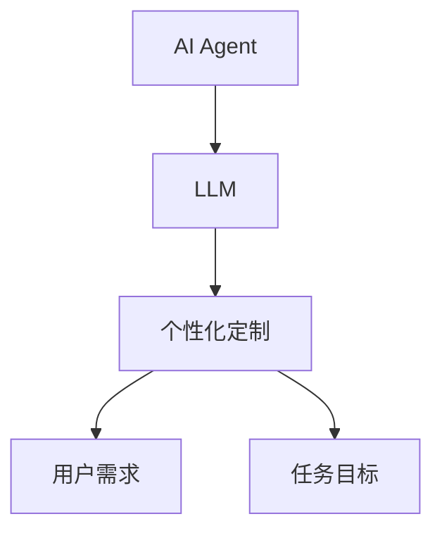
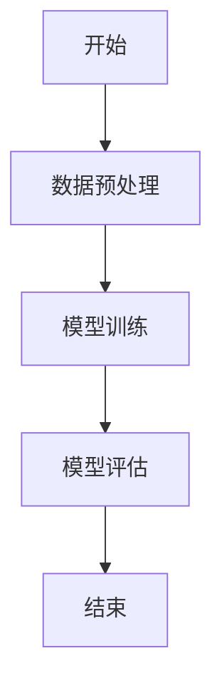

                 


# AI Agent 的个性化定制：调教 LLM 以适应不同用户

> 关键词：AI Agent, LLM, 个性化定制, 自然语言处理, 机器学习, 人工智能

> 摘要：本文深入探讨了AI Agent的个性化定制方法，通过调教大语言模型（LLM）以适应不同用户需求。文章从AI Agent和LLM的基本概念出发，分析了个性化定制的必要性，详细讲解了调教LLM的核心算法原理，并通过系统设计和实战案例展示了如何实现个性化的AI Agent。最后，本文总结了个性化定制的关键点，并提出了未来研究方向。

---

## 第一部分: AI Agent 的个性化定制基础

### 第1章: AI Agent 与 LLM 的基本概念

#### 1.1 AI Agent 的定义与特点

- **1.1.1 AI Agent 的定义**  
  AI Agent（人工智能代理）是指能够感知环境、自主决策并执行任务的智能实体。它可以是一个软件程序，也可以是一个物理设备，通过与用户或环境交互，完成特定目标。

- **1.1.2 AI Agent 的核心特点**  
  - **自主性**：能够自主决策，无需外部干预。  
  - **反应性**：能够实时感知环境并做出响应。  
  - **目标导向**：所有行为都围绕特定目标展开。  
  - **学习能力**：通过与环境交互不断优化自身行为。

- **1.1.3 AI Agent 的应用场景**  
  - 智能助手（如Siri、Alexa）  
  - 自动驾驶系统  
  - 个性化推荐系统  
  - 智能客服

#### 1.2 大语言模型（LLM）的基本原理

- **1.2.1 LLM 的基本概念**  
  LLM（Large Language Model）是基于深度学习的自然语言处理模型，通过大量数据训练，能够理解和生成人类语言。

- **1.2.2 LLM 的训练过程**  
  - 预训练：使用海量文本数据进行无监督学习，学习语言的结构和语义。  
  - 微调：在特定任务上进行有监督训练，优化模型性能。

- **1.2.3 LLM 的输出机制**  
  - 基于概率的生成机制，输出最可能的文本序列。  
  - 支持多种任务，如文本生成、问答、翻译等。

#### 1.3 个性化定制的必要性

- **1.3.1 用户需求的多样性**  
  不同用户对AI Agent的需求不同，例如企业用户需要数据分析能力，个人用户可能需要生活助手功能。

- **1.3.2 LLM 的通用性与个性化之间的矛盾**  
  LLM是通用模型，难以直接满足特定用户的需求，需要通过个性化定制来弥补这一缺陷。

- **1.3.3 个性化定制的目标与意义**  
  - 根据用户需求调整模型输出。  
  - 提高用户体验和任务完成效率。  
  - 增强模型的实用性和商业价值。

#### 1.4 本章小结

本章介绍了AI Agent和LLM的基本概念，并分析了个性化定制的必要性。通过理解这些基础概念，读者可以更好地理解后续的调教方法。

---

## 第2章: AI Agent 个性化定制的核心概念与联系

### 2.1 核心概念原理

- **2.1.1 AI Agent 的核心要素**  
  - 知识库：存储任务相关的信息和数据。  
  - 行为策略：决定如何执行任务的规则。  
  - 交互接口：与用户或环境交互的通道。

- **2.1.2 LLM 的调教机制**  
  - 微调：在特定数据集上进行再训练。  
  - 前缀调制：通过添加任务指令调整模型输出。  
  - 适配器调制：通过插入轻量级适配器优化模型输出。

- **2.1.3 个性化定制的实现路径**  
  - 数据驱动：通过特定数据训练模型。  
  - 策略驱动：通过行为策略调整模型输出。  
  - 交互驱动：通过用户反馈优化模型性能。

### 2.2 核心概念属性对比

| 属性       | AI Agent                          | LLM                            | 个性化定制                  |
|------------|------------------------------------|----------------------------------|-----------------------------|
| 输入        | 多样化输入，包括文本、图像等      | 文本输入                        | 根据用户需求调整输入        |
| 输出        | 多样化输出，包括文本、动作等      | 文本输出                        | 根据用户需求调整输出        |
| 适应性      | 强调任务适应性                    | 强调语言适应性                  | 强调用户需求适应性          |
| 学习能力    | 强化学习能力                     | 基于概率的生成能力              | 通过反馈优化学习能力        |

### 2.3 ER 实体关系图



### 2.4 本章小结

本章分析了AI Agent、LLM和个性化定制的核心概念，并通过属性对比和实体关系图展示了它们之间的联系。

---

## 第3章: 调教 LLM 的算法原理

### 3.1 算法原理概述

- **3.1.1 微调（Fine-tuning）的原理**  
  在特定任务数据上进行微调，调整模型参数以适应个性化需求。

- **3.1.2 前缀调制（Prefix Tuning）的原理**  
  在输入文本前添加任务指令，指导模型生成符合需求的输出。

- **3.1.3 适配器调制（Adapter Tuning）的原理**  
  在模型中插入轻量级适配器，通过适配器参数调整模型输出。

### 3.2 算法实现流程

- **3.2.1 数据预处理**  
  - 数据清洗：去除无关数据。  
  - 数据增强：增加多样性。  
  - 数据标注：标注特定任务标签。

- **3.2.2 模型训练**  
  - 确定训练目标和损失函数。  
  - 设置超参数，如学习率、批次大小。  
  - 进行微调或适配器调制训练。

- **3.2.3 模型评估**  
  - 使用验证集评估模型性能。  
  - 计算指标，如准确率、F1分数。  
  - 根据评估结果调整训练策略。

### 3.3 算法实现的 Mermaid 流程图



### 3.4 算法实现的 Python 源代码

```python
def fine_tune_model(model, tokenizer, train_dataset, val_dataset, num_epochs=3):
    # 数据加载器
    train_loader = DataLoader(train_dataset, batch_size=32, shuffle=True)
    val_loader = DataLoader(val_dataset, batch_size=32, shuffle=False)
    
    # 训练循环
    for epoch in range(num_epochs):
        model.train()
        for batch in train_loader:
            inputs = batch['input_ids'].to(device)
            labels = batch['labels'].to(device)
            outputs = model(inputs, labels)
            loss = outputs.loss
            loss.backward()
            optimizer.step()
            scheduler.step()
            
        # 验证循环
        model.eval()
        total_val_loss = 0
        for batch in val_loader:
            inputs = batch['input_ids'].to(device)
            labels = batch['labels'].to(device)
            with torch.no_grad():
                outputs = model(inputs, labels)
            total_val_loss += outputs.loss.item()
    
    return model
```

---

## 第4章: 系统分析与架构设计

### 4.1 项目背景

- **目标**：构建一个个性化的AI Agent系统。  
- **用户**：企业用户和个人用户。  
- **需求**：提供定制化的问答、推荐和任务执行功能。

### 4.2 系统功能设计

- **领域模型**  
  ```mermaid
  classDiagram
  class User {
    - id
    - preferences
    - history
  }
  class LLM {
    - model
    - tokenizer
  }
  class AI-Agent {
    - knowledge_base
    - behavior_policy
    - interaction_interface
  }
  User --> AI-Agent
  AI-Agent --> LLM
  ```

- **系统架构设计**  
  ```mermaid
  architecture
  client --> API Gateway --> Service Layer --> Database
  ```

- **系统接口设计**  
  - 用户输入接口：REST API。  
  - 模型调用接口：微服务接口。

- **系统交互设计**  
  ```mermaid
  sequenceDiagram
  User -> API Gateway: 发送请求
  API Gateway -> Service Layer: 转发请求
  Service Layer -> LLM: 调用模型
  LLM --> Service Layer: 返回结果
  Service Layer -> API Gateway: 返回结果
  API Gateway -> User: 返回结果
  ```

---

## 第5章: 项目实战

### 5.1 环境安装

- **Python**：3.8+  
- **PyTorch**：2.0+  
- **Hugging Face Transformers**：4.20+

### 5.2 核心代码实现

```python
from transformers import AutoTokenizer, AutoModelForCausalLM
import torch

class AI-Agent:
    def __init__(self, model_name, device="cuda"):
        self.tokenizer = AutoTokenizer.from_pretrained(model_name)
        self.model = AutoModelForCausalLM.from_pretrained(model_name).to(device)
        self.device = device
    
    def customize(self, task_prompt):
        self.task_prompt = task_prompt
    
    def generate(self, input_text):
        inputs = self.tokenizer(input_text + self.task_prompt, return_tensors="pt").to(self.device)
        outputs = self.model.generate(inputs.input_ids, max_length=50)
        return self.tokenizer.decode(outputs[0], skip_special_tokens=True)
```

### 5.3 案例分析

- **案例1**：个性化问答系统  
  - 用户输入：股票分析。  
  - 系统输出：生成股票分析报告。

- **案例2**：个性化推荐系统  
  - 用户输入：推荐电影。  
  - 系统输出：根据用户偏好推荐电影。

### 5.4 项目小结

通过实战项目，我们展示了如何通过代码实现个性化的AI Agent，并通过案例分析验证了其可行性。

---

## 第6章: 高级主题

### 6.1 多模态能力的增强

- **多模态输入**：支持图像、音频等多种输入形式。  
- **多模态输出**：生成文本、图像等多种形式的输出。

### 6.2 伦理与安全问题

- **隐私保护**：确保用户数据的安全。  
- **内容安全**：防止生成有害内容。

### 6.3 性能优化

- **模型压缩**：降低模型体积。  
- **推理优化**：提高推理速度。

---

## 第7章: 总结与展望

### 7.1 本章总结

本文从AI Agent和LLM的基本概念出发，详细讲解了个性化定制的核心算法和系统设计，并通过实战案例展示了实现方法。

### 7.2 未来展望

- **多模态能力**：进一步增强模型的多模态处理能力。  
- **伦理与安全**：加强隐私保护和内容安全。  
- **性能优化**：提升模型的推理效率。

---

## 作者：AI天才研究院 & 禅与计算机程序设计艺术

---

以上是完整的技术博客文章的目录和内容框架，涵盖了从基础到高级的各个方面，帮助读者全面理解AI Agent的个性化定制方法。

