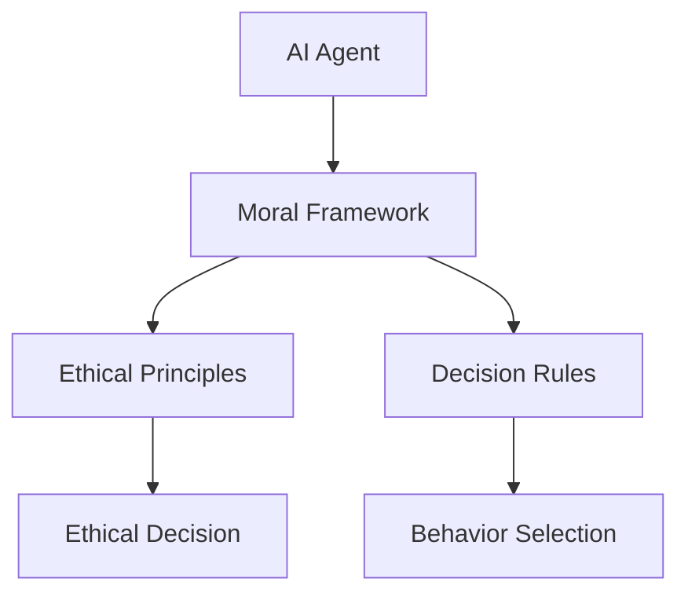
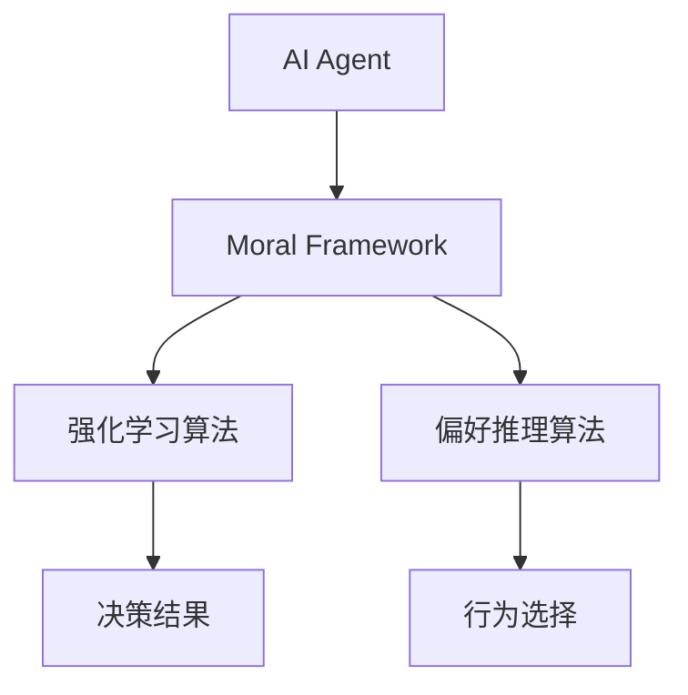

                 


# AI Agent 的伦理决策：在 LLM 中植入道德框架

> 关键词：AI Agent，伦理决策，道德框架，LLM，强化学习，偏好推理

> 摘要：本文深入探讨了在AI Agent中植入道德框架的重要性及其技术实现。从伦理决策的背景与挑战出发，详细分析了道德框架的构建与应用，并结合LLM的技术特点，阐述了在大语言模型中植入伦理决策机制的实现路径。通过系统架构设计、项目实战和案例分析，本文为AI Agent的伦理决策提供了全面的技术指导与实践参考。

---

# 第一部分: AI Agent 的伦理决策基础

## 第1章: AI Agent 与伦理决策概述

### 1.1 AI Agent 的定义与核心概念

AI Agent（人工智能代理）是指能够感知环境、自主决策并执行任务的智能实体。它具备以下核心特征：
- **自主性**：能够独立做出决策，无需外部干预。
- **反应性**：能够根据环境变化实时调整行为。
- **目标导向**：基于目标驱动行动，追求最优结果。

伦理决策是AI Agent在复杂环境中做出选择时需要考虑的道德标准和价值准则。它不仅涉及技术实现，还涉及社会、法律和伦理等多个层面。

### 1.2 伦理决策的重要性

在AI Agent的设计中，伦理决策的重要性体现在以下几个方面：
- **社会接受度**：伦理决策能力是用户信任AI Agent的基础。
- **风险控制**：在医疗、金融等领域，伦理决策能够有效降低潜在风险。
- **法律合规**：符合相关法律法规，避免法律纠纷。

### 1.3 AI Agent 伦理决策的背景与挑战

随着AI技术的快速发展，伦理决策在AI Agent中的应用逐渐成为研究热点。然而，这一过程也面临诸多挑战：
- **复杂性**：伦理问题往往涉及多方面的利益权衡，难以量化。
- **不确定性**：AI Agent在动态环境中做出决策时，可能面临信息不全的问题。
- **文化差异**：不同文化背景下的伦理标准存在差异，如何统一处理是一个难题。

---

# 第二部分: 道德框架的构建与分析

## 第2章: 道德框架的核心概念

### 2.1 道德框架的定义与结构

道德框架是一种用于指导AI Agent做出伦理决策的规则体系。它通常包括以下核心要素：
- **伦理原则**：如诚实、公正、不伤害等。
- **决策规则**：具体的行为准则和优先级排序。
- **权衡机制**：在冲突情况下，如何权衡不同原则的优先级。

道德框架的层次结构如下：
1. **原则层**：定义基本的伦理原则。
2. **规则层**：将原则转化为具体的决策规则。
3. **执行层**：在实际场景中应用规则，做出具体决策。

### 2.2 道德框架的属性特征对比

以下是对几种常见道德框架的属性对比：

| 属性       | 基于义务论的框架 | 基于后果论的框架 | 基于美德论的框架 |
|------------|------------------|------------------|------------------|
| 核心原则    | 义务与责任       | 最大化利益       | 品德与德性       |
| 决策方式    | 基于规则         | 基于结果         | 基于情境         |
| 适用场景    | 法律与责任       | 经济与效率       | 个人与社会       |

### 2.3 道德框架的ER实体关系图



---

# 第三部分: LLM 中的伦理决策机制

## 第3章: LLM 的伦理决策算法原理

### 3.1 基于强化学习的伦理决策算法

#### 3.1.1 强化学习的基本原理

强化学习是一种通过试错机制来优化决策策略的算法。其核心在于通过与环境的交互，不断更新策略以最大化累积奖励。

#### 3.1.2 强化学习在伦理决策中的应用

在伦理决策中，强化学习可以用于训练AI Agent在不同情境下选择最优行为。例如，在医疗诊断场景中，AI Agent需要在多个治疗方案中选择最优解。

#### 3.1.3 算法的数学模型

强化学习的目标是最大化累积奖励 $R$，其数学模型可以表示为：
$$ Q(s, a) = r + \gamma \max_{a'} Q(s', a') $$
其中，$s$ 表示当前状态，$a$ 表示当前动作，$r$ 表示即时奖励，$\gamma$ 表示折扣因子。

### 3.2 基于偏好推理的伦理决策算法

#### 3.2.1 偏好推理的基本原理

偏好推理是一种基于用户或系统自身偏好的决策方法。它通过分析偏好信息，生成符合期望的决策。

#### 3.2.2 偏好推理在伦理决策中的应用

在金融投资领域，AI Agent可以根据投资者的偏好，推荐符合其风险承受能力的最优投资组合。

#### 3.2.3

---

# 第四部分: 系统架构与实现

## 第4章: 系统架构设计

### 4.1 问题场景介绍

以医疗诊断为例，AI Agent需要在有限的医疗资源下，为患者选择最优的治疗方案。

### 4.2 系统功能设计

系统功能包括：
- **伦理框架配置**：允许用户自定义伦理决策的规则和优先级。
- **决策计算**：基于强化学习和偏好推理算法，生成最优决策。
- **结果解释**：提供决策的解释和依据，增强用户信任。

### 4.3 系统架构设计



### 4.4 系统接口设计

系统接口包括：
- **输入接口**：接收环境信息和用户偏好。
- **输出接口**：输出决策结果和解释信息。

---

# 第五部分: 项目实战

## 第5章: 项目实战与案例分析

### 5.1 环境安装

安装必要的开发环境，如Python、TensorFlow等。

### 5.2 核心代码实现

```python
def ethical_decision-making(moral_frame, state):
    # 基于强化学习的决策算法
    reward = calculate_reward(moral_frame, state)
    action = choose_action(reward)
    return action
```

### 5.3 案例分析

以自动驾驶为例，AI Agent需要在紧急情况下做出决策，如避免撞车但可能造成较小伤害。

---

# 第六部分: 总结与展望

## 第6章: 总结与展望

### 6.1 总结

本文详细探讨了在AI Agent中植入道德框架的必要性与实现路径。通过构建道德框架、设计强化学习算法、实现系统架构，我们能够有效提升AI Agent的伦理决策能力。

### 6.2 未来展望

未来的研究可以进一步探索动态道德框架的构建，以及如何在多文化背景下实现伦理决策的普适性。

---

作者：AI天才研究院/AI Genius Institute & 禅与计算机程序设计艺术 /Zen And The Art of Computer Programming

