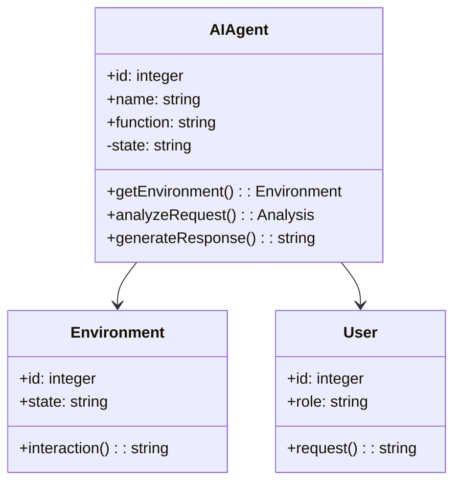
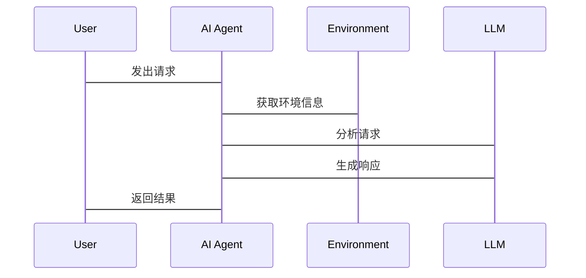

                 


# AI Agent 的伦理约束：LLM 的安全性与道德性设计

---

## 关键词
AI Agent, LLM, 伦理约束, 安全性设计, 道德性设计, 大型语言模型, 人工智能伦理

---

## 摘要
本文深入探讨AI Agent在实际应用中的伦理约束问题，重点分析了大型语言模型（LLM）在安全性与道德性设计中的关键挑战与解决方案。文章从AI Agent的基本概念、核心要素与伦理约束入手，逐步展开对LLM的安全性设计原理、系统架构、项目实战以及最佳实践的详细分析。通过结合理论与实践，本文旨在为AI Agent的开发者和研究者提供一份全面的伦理与安全设计指南，帮助他们在实际应用中避免潜在的伦理风险，确保技术的健康发展。

---

## 第一部分: AI Agent 的伦理约束与 LLM 安全性概述

### 第1章: AI Agent 的基本概念与问题背景

#### 1.1 AI Agent 的基本概念
AI Agent（人工智能代理）是一种能够感知环境、自主决策并执行任务的智能实体。它可以是一个软件程序、机器人或任何能够与环境交互的智能系统。AI Agent的核心特征包括自主性、反应性、目标导向性和社交能力。

##### 1.1.1 AI Agent 的定义与特点
- **自主性**：AI Agent能够自主决策，无需外部干预。
- **反应性**：能够实时感知环境并做出响应。
- **目标导向性**：基于目标驱动行为。
- **社交能力**：能够与其他Agent或人类进行交互。

##### 1.1.2 AI Agent 的分类与应用场景
AI Agent可以分为简单反射型、基于模型的反射型、目标驱动型和效用驱动型。其应用场景包括智能助手、自动驾驶、智能客服和智能家居等。

##### 1.1.3 AI Agent 的核心要素与组成结构
AI Agent的核心要素包括感知、推理、决策和执行。其组成结构通常包括传感器、知识库、推理引擎和执行器。

#### 1.2 问题背景与挑战
AI Agent的应用带来了许多伦理和安全问题，例如偏见、隐私泄露、滥用风险和责任归属等。

##### 1.2.1 AI Agent 的发展现状与趋势
AI Agent技术快速发展，但其应用中的伦理和安全问题逐渐暴露。

##### 1.2.2 当前 AI Agent 应用中的伦理问题
- 数据偏见
- 隐私泄露
- 滥用风险
- 责任归属

##### 1.2.3 LLM 在 AI Agent 中的安全性与道德性问题
LLM（大型语言模型）作为AI Agent的核心技术，面临生成有害内容、信息不准确、模型滥用等问题。

#### 1.3 本章小结
本章介绍了AI Agent的基本概念、分类与应用场景，并分析了当前AI Agent应用中的伦理与安全问题，特别是LLM技术带来的挑战。

---

## 第二部分: AI Agent 与 LLM 的核心概念与联系

### 第2章: AI Agent 的核心要素与伦理约束

#### 2.1 AI Agent 的核心概念与属性
AI Agent的核心概念包括自主性、目标导向性和社交能力。其属性特征可以通过对比分析得出。

##### 2.1.1 AI Agent 的核心概念对比
| 概念       | 描述                                         |
|------------|----------------------------------------------|
| 自主性      | 系统能够自主决策                             |
| 反应性      | 系统能够实时感知并响应环境                   |
| 目标导向性  | 系统行为基于明确的目标                       |
| 社交能力    | 系统能够与其他实体进行交互                 |

##### 2.1.2 AI Agent 的 ER 实体关系图
```mermaid
er
    %% ER图
    entity(AI Agent) {
        id
        name
        type
        function
    }
    entity(环境) {
        id
        state
        interaction
    }
    entity(用户) {
        id
        role
        request
    }
    AI Agent -- 关联 --> 环境
    AI Agent -- 关联 --> 用户
```

#### 2.2 LLM 在 AI Agent 中的角色与作用
LLM作为AI Agent的核心技术，负责处理自然语言理解和生成，直接影响AI Agent的伦理性和安全性。

##### 2.2.1 LLM 与 AI Agent 的关系
LLM为AI Agent提供语言理解和生成能力，是其实现智能化交互的关键。

##### 2.2.2 LLM 在 AI Agent 中的核心功能
- 自然语言理解
- 内容生成
- 上下文推理

##### 2.2.3 LLM 对 AI Agent 伦理约束的影响
LLM可能引入偏见、错误信息，需通过伦理设计加以约束。

#### 2.3 本章小结
本章分析了AI Agent的核心概念与属性，并探讨了LLM在AI Agent中的角色与作用，强调了伦理约束的重要性。

---

## 第三部分: LLM 的安全性与道德性设计原理

### 第3章: LLM 的安全性设计原理

#### 3.1 LLM 的训练机制与安全性
LLM的训练过程涉及大量数据，可能存在数据偏见和隐私泄露风险。

##### 3.1.1 LLM 的训练过程与安全风险
- 数据清洗：去除有害内容和偏见数据。
- 模型训练：使用安全的训练策略。
- 模型评估：检测潜在的安全风险。

##### 3.1.2 数据安全与隐私保护
- 数据匿名化处理
- 数据访问控制
- 数据加密传输

##### 3.1.3 模型安全的数学模型与公式
模型安全可以通过以下公式表示：
$$
\text{模型安全} = 1 - \text{模型风险}$$

#### 3.2 LLM 的推理机制与安全性
推理过程需要确保生成内容的安全性和准确性。

##### 3.2.1 基于LLM的推理机制
- 上下文理解
- 生成策略
- 后处理

##### 3.2.2 推理过程中的安全控制
- 输出过滤
- 内容审核
- 用户反馈机制

#### 3.3 本章小结
本章详细讲解了LLM的安全性设计原理，包括训练和推理过程中的安全控制策略。

---

## 第四部分: 系统分析与架构设计方案

### 第4章: AI Agent 的系统架构与设计

#### 4.1 问题场景介绍
AI Agent需要在复杂环境中实现安全性和道德性目标。

##### 4.1.1 系统功能设计
- 感知环境
- 分析需求
- 制定计划
- 执行任务

##### 4.1.2 领域模型类图


##### 4.1.3 系统架构设计


#### 4.2 交互流程设计
##### 4.2.1 交互流程图


#### 4.3 本章小结
本章详细介绍了AI Agent的系统架构与设计，包括功能设计、类图和交互流程图。

---

## 第五部分: 项目实战

### 第5章: 项目实战与案例分析

#### 5.1 项目环境与安装
- 安装Python和相关库（如Hugging Face库）
- 安装依赖：pip install transformers

#### 5.2 系统核心实现源代码
```python
from transformers import AutoModelForSeq2SeqLM, AutoTokenizer

class AIAgent:
    def __init__(self, model_name):
        self.model = AutoModelForSeq2SeqLM.from_pretrained(model_name)
        self.tokenizer = AutoTokenizer.from_pretrained(model_name)
    
    def generate_response(self, input_text):
        inputs = self.tokenizer(input_text, return_tensors="np")
        outputs = self.model.generate(inputs.input_ids, max_length=100)
        response = self.tokenizer.decode(outputs[0], skip_special_tokens=True)
        return response
```

#### 5.3 代码应用解读与分析
- 初始化模型：加载预训练模型和分词器。
- 生成响应：将输入文本转换为模型可接受的格式，生成响应并解码。

#### 5.4 案例分析
以智能客服为例，分析AI Agent如何在实际场景中应用，确保生成的响应符合伦理约束。

#### 5.5 本章小结
本章通过实战项目，详细讲解了AI Agent的核心实现和应用案例。

---

## 第六部分: 最佳实践与小结

### 第6章: 最佳实践与总结

#### 6.1 最佳实践
- 定期模型评估和更新
- 引入伦理审查机制
- 提供用户反馈渠道

#### 6.2 小结
本文全面分析了AI Agent的伦理约束与LLM的安全性设计，强调了伦理与安全的重要性，为实际应用提供了指导。

#### 6.3 注意事项
- 避免模型滥用
- 保护用户隐私
- 定期更新模型

#### 6.4 拓展阅读
推荐相关书籍和论文，供读者深入研究。

---

## 作者信息

作者：AI天才研究院（AI Genius Institute） & 禅与计算机程序设计艺术（Zen And The Art of Computer Programming）

---

这篇文章系统性地探讨了AI Agent的伦理约束与LLM的安全性设计，从理论到实践，为读者提供了全面的指导。

