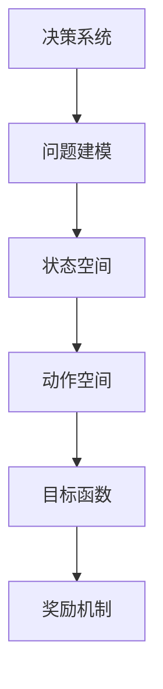
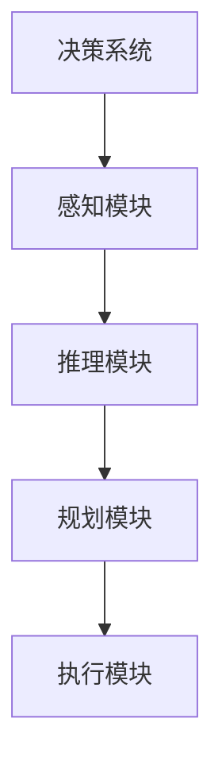
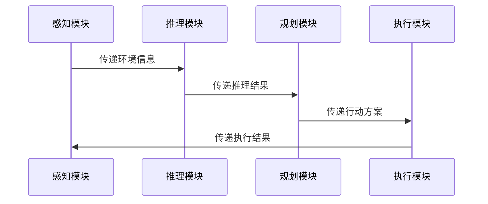

                 


# AI Agent 的决策系统：基于 LLM 的推理与规划

> 关键词：AI Agent，决策系统，大语言模型，LLM，推理，规划

> 摘要：本文深入探讨了AI Agent的决策系统，特别是基于大语言模型（LLM）的推理与规划。文章从AI Agent的基本概念出发，分析了决策系统的原理、基于LLM的推理算法、系统架构设计、项目实战以及优化与扩展。通过详细的技术分析和实际案例，本文为读者提供了全面理解AI Agent决策系统的方法。

---

# 第1章: AI Agent 的基本概念

## 1.1 AI Agent 的定义与类型

### 1.1.1 AI Agent 的基本定义

AI Agent（人工智能代理）是一种能够感知环境并采取行动以实现目标的智能实体。它可以是一个软件程序、一个机器人，或者任何能够执行智能任务的实体。AI Agent的核心目标是通过感知和行动来优化其目标的实现。

### 1.1.2 AI Agent 的主要类型

AI Agent可以分为以下几类：

1. **简单反射型Agent**：基于当前状态执行预定义的反应式行为。
2. **基于模型的反射型Agent**：利用内部模型和规划来选择行动。
3. **目标驱动型Agent**：基于目标驱动的规划和推理。
4. **效用驱动型Agent**：基于效用函数进行决策优化。

### 1.1.3 AI Agent 与传统 AI 的区别

与传统AI不同，AI Agent强调自主性、反应性和目标导向性。传统AI通常专注于特定任务，而AI Agent则具备动态环境中的自主决策能力。

## 1.2 决策系统的核心概念

### 1.2.1 决策系统的定义

决策系统是指能够根据输入信息和目标，通过推理和规划生成行动方案的系统。它是AI Agent的核心部分，负责处理复杂问题的解决方案。

### 1.2.2 决策系统的组成部分

决策系统主要包括以下部分：

1. **感知模块**：获取环境信息。
2. **推理模块**：分析信息，生成可能的行动方案。
3. **规划模块**：选择最优行动方案。
4. **执行模块**：执行选定的行动。

### 1.2.3 决策系统的分类

根据决策方式的不同，决策系统可以分为：

1. **基于规则的决策系统**：依赖预定义的规则进行决策。
2. **基于模型的决策系统**：利用数学模型进行推理和优化。
3. **基于数据驱动的决策系统**：依赖历史数据进行学习和预测。

## 1.3 基于 LLM 的推理与规划

### 1.3.1 大语言模型的定义与特点

大语言模型（LLM）是一种基于深度学习的自然语言处理模型，具有以下特点：

1. **强大的上下文理解能力**。
2. **多任务通用性**。
3. **可解释性较低**。

### 1.3.2 LLM 在推理与规划中的应用

LLM可以通过文本生成、问答系统和对话系统等方式支持推理与规划。例如，LLM可以根据上下文生成合理的行动方案。

### 1.3.3 LLM 与传统决策系统的优势对比

LLM的优势在于其强大的语言理解和生成能力，能够处理复杂的文本信息。然而，与传统决策系统相比，LLM在逻辑推理和目标导向方面仍有不足。

## 1.4 本章小结

本章介绍了AI Agent的基本概念、类型以及决策系统的核心概念。特别地，讨论了基于LLM的推理与规划的特点和优势。

---

# 第2章: 决策系统的核心概念与联系

## 2.1 决策系统的原理

### 2.1.1 问题建模

问题建模是决策系统的核心步骤。通过建立数学模型，可以将实际问题转化为计算机可处理的形式。例如，可以用马尔可夫决策过程（MDP）来建模决策问题。

### 2.1.2 状态空间与动作空间

状态空间是指系统所有可能的状态集合，动作空间是指系统所有可能的行动集合。状态和行动构成了决策系统的输入和输出。

### 2.1.3 目标函数与奖励机制

目标函数是决策系统的优化目标，奖励机制是衡量行动优劣的标准。通过最大化奖励，可以优化决策系统的性能。

## 2.2 推理与规划的核心算法

### 2.2.1 基于规则的推理

基于规则的推理是一种简单但有效的推理方法。它通过预定义的规则来生成推理结果。例如，专家系统就是一种基于规则的推理系统。

### 2.2.2 基于逻辑的推理

基于逻辑的推理通过逻辑推理规则来生成推理结果。例如，一阶逻辑推理可以用于复杂的推理任务。

### 2.2.3 基于概率的推理

基于概率的推理通过概率模型来处理不确定性。例如，贝叶斯网络可以用于概率推理。

## 2.3 系统架构与实体关系图

### 2.3.1 实体关系图

以下是决策系统的实体关系图：



---

# 第3章: 基于 LLM 的推理算法原理

## 3.1 大语言模型的数学模型

### 3.1.1 Transformer 模型的结构

Transformer模型由编码器和解码器组成。编码器将输入序列编码为向量，解码器根据编码向量生成输出序列。

### 3.1.2 注意力机制

注意力机制通过计算输入序列中每个位置的重要性，提高了模型的上下文理解能力。

### 3.1.3 生成式模型

生成式模型通过解码器生成输出序列，可以用于文本生成和对话系统。

## 3.2 基于 LLM 的推理算法

### 3.2.1 基于LLM的生成式推理

生成式推理通过生成文本来模拟推理过程。例如，可以将问题输入到LLM中，生成可能的解决方案。

### 3.2.2 基于LLM的检索式推理

检索式推理通过检索预存的知识库来生成推理结果。例如，可以使用LLM进行问答系统。

### 3.2.3 基于LLM的混合式推理

混合式推理结合了生成式和检索式推理，可以根据具体任务选择合适的方法。

## 3.3 推理算法的优缺点

### 3.3.1 基于LLM的生成式推理

优点：生成能力强，可以处理复杂问题。

缺点：可解释性较低，推理精度有限。

### 3.3.2 基于规则的推理

优点：可解释性强，推理精度高。

缺点：灵活性差，难以处理复杂问题。

---

# 第4章: 系统架构与设计

## 4.1 系统架构设计

### 4.1.1 模块划分

决策系统可以划分为感知模块、推理模块、规划模块和执行模块。

### 4.1.2 功能设计

每个模块的功能需要明确。例如，感知模块负责获取环境信息，推理模块负责分析信息，规划模块负责生成行动方案，执行模块负责执行行动。

### 4.1.3 架构图

以下是决策系统的架构图：



## 4.2 接口与交互设计

### 4.2.1 接口设计

决策系统需要与外部系统进行交互，需要定义清晰的接口。例如，感知模块需要与传感器交互，执行模块需要与执行器交互。

### 4.2.2 交互流程

以下是交互流程的示意图：



---

# 第5章: 项目实战

## 5.1 环境安装

### 5.1.1 安装Python

需要安装Python 3.8及以上版本。

### 5.1.2 安装依赖库

安装必要的依赖库，例如TensorFlow、PyTorch、Hugging Face的库等。

## 5.2 系统核心实现

### 5.2.1 感知模块

感知模块负责获取环境信息，可以使用传感器或者API接口。

### 5.2.2 推理模块

推理模块负责分析环境信息，可以使用基于规则的推理或者基于模型的推理。

### 5.2.3 规划模块

规划模块负责生成行动方案，可以使用强化学习或者动态规划。

### 5.2.4 执行模块

执行模块负责执行行动，可以驱动机器人或者调用API。

## 5.3 代码实现

以下是一个简单的决策系统代码示例：

```python
class DecisionSystem:
    def __init__(self):
        self.sensor = Sensor()
        self.reasoner = Reasoner()
        self.planner = Planner()
        self.executor = Executor()

    def make_decision(self):
        # 获取环境信息
        state = self.sensor.get_state()
        # 推理
        reasoning = self.reasoner.reason(state)
        # 规划
        plan = self.planner.plan(reasoning)
        # 执行
        action = self.executor.execute(plan)
        return action
```

## 5.4 实际案例分析

### 5.4.1 案例背景

假设我们有一个智能客服系统，需要处理客户的咨询请求。

### 5.4.2 系统实现

通过感知模块获取客户的咨询内容，推理模块分析客户的需求，规划模块生成回复内容，执行模块返回回复给客户。

### 5.4.3 代码解读

代码实现了从感知到执行的整个流程，展示了决策系统的实际应用。

## 5.5 本章小结

本章通过实际案例展示了决策系统的实现过程，从环境安装到系统实现，再到代码解读，为读者提供了实践指导。

---

# 第6章: 优化与扩展

## 6.1 性能优化

### 6.1.1 算法优化

通过改进算法结构，可以提高决策系统的效率。

### 6.1.2 并行计算

利用并行计算技术，可以加速决策系统的运行。

## 6.2 可解释性优化

### 6.2.1 可视化工具

通过可视化工具，可以更好地理解决策系统的运行过程。

### 6.2.2 解释性模型

选择具有较高可解释性的模型，可以提高决策系统的透明度。

## 6.3 多智能体协作

### 6.3.1 多智能体系统

在多智能体系统中，多个AI Agent需要协作完成任务。

### 6.3.2 协作算法

需要设计高效的协作算法，以提高系统的整体性能。

## 6.4 前沿技术

### 6.4.1 增量学习

通过增量学习，可以提高系统的适应性。

### 6.4.2 跨模态推理

通过跨模态推理，可以处理不同类型的信息。

## 6.5 本章小结

本章讨论了决策系统的优化与扩展，包括性能优化、可解释性优化、多智能体协作以及前沿技术。

---

# 第7章: 总结与展望

## 7.1 全文总结

本文系统地介绍了AI Agent的决策系统，特别是基于LLM的推理与规划。通过理论分析和实际案例，展示了决策系统的实现过程。

## 7.2 未来展望

未来，随着AI技术的发展，决策系统将更加智能化和个性化。同时，如何提高系统的可解释性和安全性，将是研究的重要方向。

---

# 作者

作者：AI天才研究院/AI Genius Institute & 禅与计算机程序设计艺术 /Zen And The Art of Computer Programming

---

通过以上结构，文章详细探讨了AI Agent决策系统的各个方面，从基本概念到实际应用，再到优化与扩展，为读者提供了全面的知识体系。

