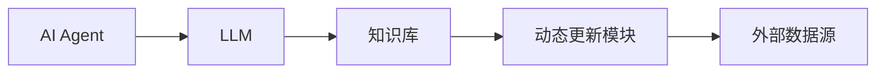
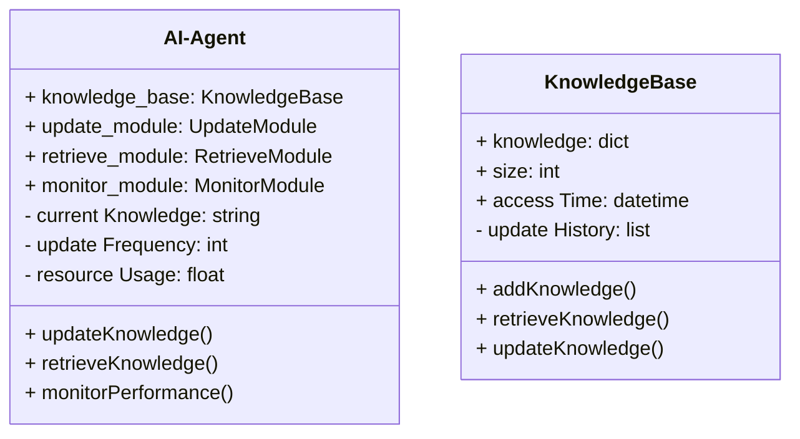
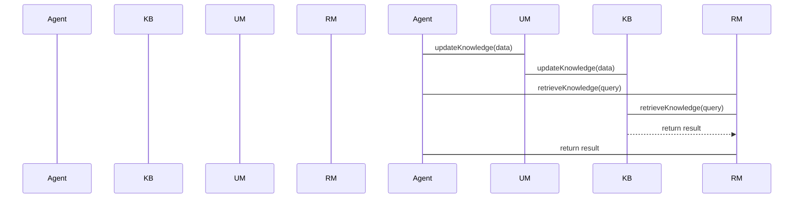

                 


# AI Agent 的动态知识更新：保持 LLM 知识的实时性

## 关键词：AI Agent，LLM，动态知识更新，实时性，增量学习，知识蒸馏

## 摘要：  
本文详细探讨了AI Agent在动态知识更新中的关键作用，分析了如何保持大型语言模型（LLM）的知识实时性。通过背景介绍、核心概念、算法原理、系统架构设计以及项目实战，本文为读者提供了全面而深入的视角，展示了如何通过增量学习、在线更新算法和知识蒸馏等技术实现动态知识更新。文章还结合实际案例，总结了最佳实践和未来发展方向，帮助读者更好地理解和应用AI Agent的动态知识更新技术。

---

# 第一部分: AI Agent 的动态知识更新概述

## 第1章: AI Agent 的动态知识更新背景

### 1.1 问题背景与描述

#### 1.1.1 AI Agent 的概念与定义  
AI Agent（人工智能代理）是指在计算机系统中能够感知环境、自主决策并执行任务的智能实体。它可以是一个软件程序，也可以是一个复杂的系统，通过与环境交互来实现特定目标。AI Agent的核心能力在于其能够根据实时信息做出决策，并通过执行动作来影响环境。

#### 1.1.2 LLM 的知识更新需求  
大型语言模型（LLM）如GPT系列、PaLM等，虽然在生成文本、理解和处理自然语言方面表现出色，但其知识通常是基于训练数据的静态表示。随着信息的不断变化和新增，LLM的知识可能过时或无法适应新场景。因此，动态知识更新成为保持LLM实时性的关键。

#### 1.1.3 动态知识更新的必要性  
动态知识更新的必要性主要体现在以下三个方面：  
1. **实时性需求**：在快速变化的环境中，AI Agent需要实时获取最新信息以做出准确决策。  
2. **适应性要求**：AI Agent需要能够适应新任务和新场景，动态知识更新是其实现适应性的基础。  
3. **高效性要求**：动态知识更新需要在不影响模型性能的前提下，高效地更新知识。

---

### 1.2 问题解决与边界

#### 1.2.1 知识更新的核心问题  
动态知识更新的核心问题是如何在不完全重新训练模型的情况下，高效地更新模型的知识。具体来说，这包括以下三个关键问题：  
1. **增量学习**：如何在已有知识的基础上，快速吸收新的知识。  
2. **在线更新**：如何在实时数据流中，持续更新模型的知识。  
3. **知识表示**：如何高效地表示和存储知识，以便快速更新和检索。

#### 1.2.2 动态知识更新的边界与外延  
动态知识更新的边界包括以下内容：  
1. **数据来源**：知识更新的数据来源可以是外部数据库、实时流数据或用户输入。  
2. **更新频率**：根据应用场景，知识更新的频率可以是实时、周期性或按需。  
3. **更新范围**：知识更新可以是局部更新（仅更新部分知识）或全局更新（更新整个知识库）。  

#### 1.2.3 AI Agent 与 LLM 的关系  
AI Agent与LLM的关系可以用以下几点来概括：  
1. **AI Agent 是载体**：AI Agent是承载LLM的主体，负责与环境交互并执行任务。  
2. **LLM 是核心**：LLM是AI Agent的核心，负责理解和生成文本、进行推理和决策。  
3. **动态知识更新是桥梁**：动态知识更新技术是连接AI Agent与LLM的桥梁，确保LLM的知识始终保持最新。

---

## 第2章: AI Agent 的核心概念与联系

### 2.1 核心概念原理

#### 2.1.1 AI Agent 的知识表示  
AI Agent的知识表示通常采用符号逻辑、概率图模型或向量表示等方法。动态知识更新需要在这些表示方法的基础上，进行高效的更新和管理。

#### 2.1.2 LLM 的知识存储与检索  
LLM的知识通常存储在大规模的神经网络中，动态知识更新需要通过调整神经网络的参数来实现。知识的检索可以通过关键词匹配、向量相似度计算等方式进行。

#### 2.1.3 动态知识更新的机制  
动态知识更新的机制包括以下三个步骤：  
1. **知识获取**：通过数据流或用户输入获取新知识。  
2. **知识处理**：对新知识进行清洗、解析和转换，使其适合模型的输入格式。  
3. **知识整合**：将新知识整合到已有知识库中，并更新模型的参数。

---

### 2.2 核心概念属性对比

#### 2.2.1 AI Agent 与传统知识库的对比  
| 属性       | AI Agent                 | 传统知识库           |  
|------------|--------------------------|----------------------|  
| 知识表示     | 神经网络表示             | 符号逻辑或向量表示   |  
| 更新方式     | 动态更新                 | 静态更新或周期性更新 |  
| 交互能力     | 能够与环境交互           | 无法主动交互         |  

#### 2.2.2 LLM 的知识更新效率  
| 更新方式     | 增量学习                 | 全量学习             |  
|------------|--------------------------|----------------------|  
| 更新时间     | 短时间                   | 长时间               |  
| 资源消耗     | 较低                     | 较高                 |  

#### 2.2.3 动态知识更新的实时性要求  
| 场景         | 实时更新                 | 非实时更新           |  
|------------|--------------------------|----------------------|  
| 适用领域     | 金融、医疗、实时监控     | 教育、历史研究       |  
| 更新频率     | 高频                     | 低频                 |  

---

### 2.3 实体关系图



---

# 第二部分: 动态知识更新的算法原理

## 第3章: 增量学习算法

### 3.1 增量学习的基本原理

#### 3.1.1 知识更新的增量模型  
增量学习的模型通常采用基于神经网络的架构，如BERT、GPT等。通过在已有模型的基础上，逐步添加新数据进行微调，实现知识的增量更新。

#### 3.1.2 梯度更新方法  
增量学习的核心在于通过梯度更新来优化模型参数。具体公式如下：

$$\theta_{t+1} = \theta_t + \eta (y_t - \hat{y}_t)$$

其中，$\theta_t$ 表示当前模型参数，$\eta$ 是学习率，$y_t$ 是真实标签，$\hat{y}_t$ 是模型预测值。

#### 3.1.3 参数更新策略  
增量学习的参数更新策略包括以下几种：  
1. **随机梯度下降（SGD）**：逐个样本更新参数。  
2. **小批量梯度下降（SGDM）**：以小批量数据更新参数。  
3. **Adam 优化器**：结合动量和自适应学习率的优化方法。

---

### 3.2 在线更新算法

#### 3.2.1 在线学习的数学模型  
在线学习的数学模型如下：

$$\theta_{t+1} = \theta_t + \eta_t (y_t - \hat{y}_t)$$

其中，$\eta_t$ 是动态学习率，通常随时间递减。

#### 3.2.2 实时更新的优化方法  
在线更新的优化方法包括：  
1. **动量优化**：通过引入动量项加速收敛。  
2. **自适应学习率**：根据梯度的大小动态调整学习率。  
3. **遗忘策略**：对于过时的数据，采用遗忘机制减少其影响。

#### 3.2.3 稳定性与收敛性分析  
在线更新算法的稳定性与收敛性分析需要考虑以下因素：  
1. **学习率的衰减**：学习率过大会导致模型不稳定，过小会收敛速度慢。  
2. **数据分布的变化**：数据分布的变化会影响模型的收敛性和稳定性。  
3. **模型容量**：模型容量越大，越容易捕捉新知识，但也会增加过拟合的风险。

---

## 第4章: 知识蒸馏与迁移

### 4.1 知识蒸馏的原理

#### 4.1.1 知识蒸馏的定义  
知识蒸馏是一种通过教师模型（Teacher）指导学生模型（Student）学习知识的技术。教师模型通常是一个预训练的大模型，学生模型是一个较小的模型，通过蒸馏过程将教师模型的知识迁移到学生模型中。

#### 4.1.2 蒸馏过程中的损失函数  
知识蒸馏的损失函数通常包括两类项：  
1. **KL散度损失**：衡量学生模型和教师模型的概率分布差异。  
2. **分类损失**：衡量学生模型对真实标签的预测准确性。  

具体公式如下：

$$L = \alpha L_{CE} + (1-\alpha) L_{KL}$$

其中，$\alpha$ 是平衡系数，$L_{CE}$ 是交叉熵损失，$L_{KL}$ 是KL散度损失。

#### 4.1.3 蒸馏算法的实现步骤  
1. **预训练教师模型**：在大规模数据上预训练教师模型。  
2. **初始化学生模型**：使用与教师模型相同或相似的架构初始化学生模型。  
3. **蒸馏训练**：通过优化损失函数，逐步更新学生模型的参数，使其概率分布接近教师模型。  

---

### 4.2 知识迁移的实现

#### 4.2.1 迁移学习的框架  
知识迁移的框架包括以下步骤：  
1. **任务分析**：分析目标任务的特点和需求。  
2. **特征提取**：提取源任务和目标任务的特征，寻找共通的特征。  
3. **知识迁移**：通过调整模型参数或引入新的特征，实现知识的迁移。  

#### 4.2.2 迁移过程中的特征提取  
特征提取可以通过自注意力机制、卷积神经网络等方式实现。提取的特征需要具有领域通用性和任务相关性。

#### 4.2.3 迁移效果的评估指标  
迁移效果的评估指标包括：  
1. **准确率**：模型在目标任务上的分类准确率。  
2. **F1分数**：模型的精确率和召回率的调和平均数。  
3. **迁移成本**：模型迁移所需的时间和计算资源。  

---

# 第三部分: 系统分析与架构设计

## 第5章: 系统功能设计

### 5.1 系统功能模块

#### 5.1.1 动态知识更新模块  
动态知识更新模块负责接收新知识，清洗、解析和整合新知识，并更新模型的参数。  

#### 5.1.2 知识检索模块  
知识检索模块负责根据输入的查询，快速检索知识库中的相关信息。  

#### 5.1.3 实时监控模块  
实时监控模块负责监控系统的运行状态，包括模型性能、更新频率、资源消耗等。  

---

### 5.2 系统架构设计

#### 5.2.1 系统功能模块的类图  


---

### 5.3 系统接口设计

#### 5.3.1 API 接口  
1. **updateKnowledge(data)**：接收新知识数据，更新知识库。  
2. **retrieveKnowledge(query)**：根据查询词检索知识。  
3. **monitorPerformance()**：返回系统性能指标。  

#### 5.3.2 交互流程  
1. **知识获取**：用户或系统生成新知识数据，调用`updateKnowledge(data)`接口。  
2. **知识处理**：动态知识更新模块清洗、解析和整合新知识。  
3. **知识检索**：用户发送查询请求，调用`retrieveKnowledge(query)`接口。  
4. **知识返回**：知识检索模块返回相关结果。  

---

### 5.4 交互流程图



---

## 第6章: 项目实战

### 6.1 环境安装

#### 6.1.1 Python 环境配置  
需要安装以下库：  
- `transformers`：用于加载和训练LLM。  
- `mermaid`：用于绘制流程图。  
- `torch`：用于深度学习模型的训练。  

安装命令：  
```bash
pip install transformers mermaid torch
```

#### 6.1.2 代码实现  

### 6.2 核心代码实现

#### 6.2.1 动态知识更新模块  
```python
import torch
from transformers import AutoTokenizer, AutoModelForCausalLM

class DynamicKnowledgeUpdater:
    def __init__(self, model_name):
        self.tokenizer = AutoTokenizer.from_pretrained(model_name)
        self.model = AutoModelForCausalLM.from_pretrained(model_name)
        self.model.to('cuda')
        
    def update_knowledge(self, new_data):
        # 清洗数据
        cleaned_data = self.clean_data(new_data)
        # 整合知识
        updated_model = self.integrate_knowledge(cleaned_data)
        return updated_model
        
    def clean_data(self, data):
        # 数据清洗逻辑
        pass
        
    def integrate_knowledge(self, data):
        # 知识整合逻辑
        pass
```

#### 6.2.2 知识检索模块  
```python
class KnowledgeRetriever:
    def __init__(self, model_name):
        self.tokenizer = AutoTokenizer.from_pretrained(model_name)
        self.model = AutoModelForCausalLM.from_pretrained(model_name)
        self.model.to('cuda')
        
    def retrieve_knowledge(self, query):
        inputs = self.tokenizer(query, return_tensors='np')
        outputs = self.model.generate(inputs.input_ids)
        return outputs
```

#### 6.2.3 案例分析  
以下是一个简单的案例分析，展示如何使用上述代码实现动态知识更新：  
```python
# 初始化模型
updater = DynamicKnowledgeUpdater("gpt2")
# 更新知识
new_data = "最新的天气预报：今天北京气温为30度。"
updated_model = updater.update_knowledge(new_data)
# 检索知识
retriever = KnowledgeRetriever("gpt2")
result = retriever.retrieve_knowledge("今天北京气温是多少？")
print(result)
```

---

## 第7章: 最佳实践与小结

### 7.1 最佳实践 tips

#### 7.1.1 知识更新频率  
根据具体场景选择合适的知识更新频率，高频更新适用于实时性要求高的场景，低频更新适用于资源有限的场景。  

#### 7.1.2 模型选择  
选择适合动态知识更新的模型，如支持增量学习的模型（如BERT、GPT）。  

#### 7.1.3 资源管理  
合理分配计算资源，避免知识更新过程占用过多资源影响系统性能。  

---

### 7.2 小结

本文详细探讨了AI Agent在动态知识更新中的关键作用，分析了如何保持大型语言模型（LLM）的知识实时性。通过背景介绍、核心概念、算法原理、系统架构设计以及项目实战，本文为读者提供了全面而深入的视角，展示了如何通过增量学习、在线更新算法和知识蒸馏等技术实现动态知识更新。

---

## 作者：AI天才研究院/AI Genius Institute & 禅与计算机程序设计艺术 /Zen And The Art of Computer Programming

