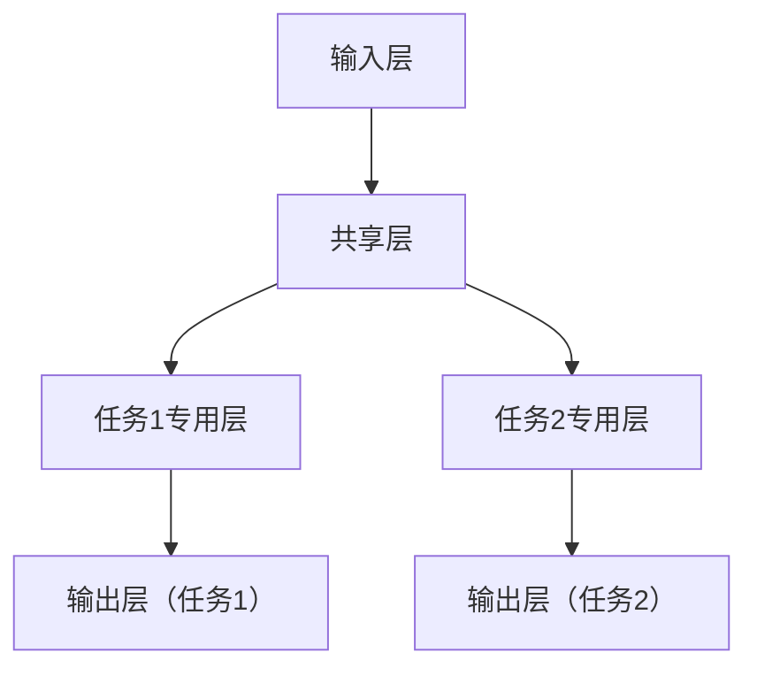
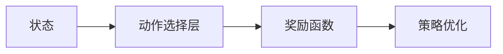
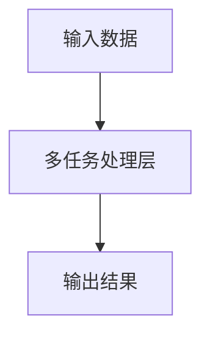
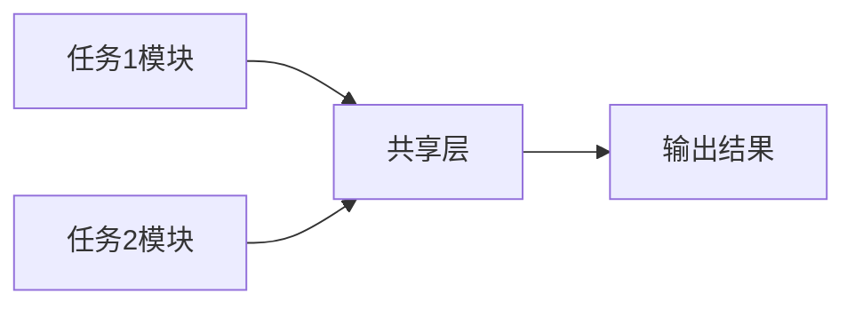
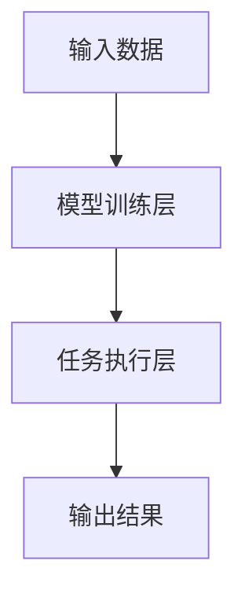
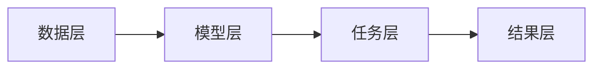

                 


# AI Agent 的多任务学习：增强 LLM 的泛化能力

> 关键词：AI Agent, 多任务学习, 大语言模型, 泛化能力, 系统架构, 项目实战

> 摘要：本文深入探讨了AI Agent如何通过多任务学习来增强大语言模型（LLM）的泛化能力。首先，文章介绍了AI Agent和多任务学习的基本概念，分析了多任务学习在提升模型性能方面的重要作用。接着，详细讲解了多任务学习的数学模型和算法原理，包括参数共享、任务权重分配等机制。然后，结合实际项目，展示了如何设计一个多任务学习系统架构，并通过具体的Python代码示例，说明了如何实现和优化多任务学习模型。最后，文章总结了多任务学习在提升LLM泛化能力方面的成果，并展望了未来的研究方向。

---

# 第一部分: AI Agent 的多任务学习基础

## 第1章: AI Agent与多任务学习概述

### 1.1 AI Agent 的核心概念

#### 1.1.1 AI Agent 的定义与特点
AI Agent（人工智能代理）是指能够感知环境、自主决策并执行任务的智能实体。AI Agent具有以下特点：
- **自主性**：能够在没有外部干预的情况下自主运作。
- **反应性**：能够实时感知环境并做出响应。
- **目标导向**：以实现特定目标为导向进行决策和行动。

#### 1.1.2 多任务学习的基本概念
多任务学习（Multi-Task Learning, MTL）是指在一个统一的模型中同时学习多个相关任务，通过共享模型参数来提高模型的泛化能力和学习效率。

#### 1.1.3 AI Agent 在多任务学习中的作用
AI Agent作为多任务学习的执行者，能够在复杂的环境中灵活切换任务，实现多个目标的协同优化。

### 1.2 多任务学习的背景与意义

#### 1.2.1 大语言模型的局限性
大语言模型（LLM）在单一任务上表现出色，但在多任务场景下，模型的泛化能力有限，容易出现过拟合某一任务而忽视其他任务的情况。

#### 1.2.2 多任务学习的提出与目标
为了解决大语言模型在多任务场景下的局限性，多任务学习应运而生。其目标是通过共享模型参数，提升模型在多个任务上的表现。

#### 1.2.3 AI Agent 在多任务学习中的应用价值
AI Agent通过多任务学习，能够在复杂环境中高效完成多个任务，提升整体性能和用户体验。

### 1.3 本章小结
本章介绍了AI Agent和多任务学习的基本概念，并分析了多任务学习在提升大语言模型泛化能力方面的必要性和重要性。

---

# 第二部分: 多任务学习的原理与方法

## 第2章: 多任务学习的核心原理

### 2.1 多任务学习的数学模型

#### 2.1.1 参数共享机制
多任务学习通过共享模型参数，实现多个任务之间的知识共享。例如，在神经网络中，多个任务共享部分权重参数。

$$
L_{\text{total}} = \lambda_1 L_1 + \lambda_2 L_2 + \dots + \lambda_n L_n
$$

其中，$\lambda_i$ 是任务 $i$ 的权重，$L_i$ 是任务 $i$ 的损失函数。

#### 2.1.2 任务权重分配
为了平衡不同任务的重要性，多任务学习引入任务权重 $\lambda_i$，通过动态调整权重来优化模型性能。

#### 2.1.3 跨任务梯度平衡
在训练过程中，多任务学习需要平衡不同任务的梯度更新，避免某一任务的梯度主导整个优化过程。

### 2.2 多任务学习的算法框架

#### 2.2.1 基于神经网络的多任务学习
通过构建共享-专用网络结构，实现多个任务之间的知识共享与任务专用模块的结合。



#### 2.2.2 基于强化学习的多任务优化
通过强化学习框架，优化多任务学习中的任务优先级和策略。



#### 2.2.3 跨任务迁移学习方法
通过迁移学习，将一个任务的知识迁移到其他任务，提升整体模型的泛化能力。

### 2.3 多任务学习的挑战与解决方案

#### 2.3.1 任务间干扰的缓解方法
通过引入任务权重调节、任务分解等方法，减少任务间的干扰。

#### 2.3.2 任务优先级的动态调整
根据任务的重要性和当前模型的表现，动态调整任务优先级。

#### 2.3.3 跨任务知识的高效整合
通过设计高效的参数共享机制和知识表示方法，提升跨任务知识的整合效率。

### 2.4 本章小结
本章详细讲解了多任务学习的数学模型和算法框架，分析了多任务学习的挑战及其解决方案。

---

# 第三部分: AI Agent 的多任务学习实现

## 第3章: AI Agent 的多任务学习架构

### 3.1 多任务学习的系统架构

#### 3.1.1 系统输入与输出
系统输入包括多个任务的输入数据，输出则是多个任务的处理结果。



#### 3.1.2 各任务模块的交互
多个任务模块通过共享层进行交互，实现知识共享和任务协同。



#### 3.1.3 跨任务协调机制
通过协调机制，动态调整任务优先级和参数共享策略。

### 3.2 基于大语言模型的多任务学习

#### 3.2.1 大语言模型的多任务能力
大语言模型通过多任务学习，能够在多个领域和任务上表现出色。

#### 3.2.2 多任务学习对模型泛化能力的提升
通过多任务学习，模型能够更好地泛化到未见的任务和数据上。

#### 3.2.3 大语言模型的多任务优化策略
通过任务权重调节、参数共享等方法，优化大语言模型的多任务性能。

### 3.3 多任务学习的训练与评估

#### 3.3.1 多任务学习的训练框架
训练框架包括数据预处理、模型构建、损失函数设计和优化算法选择。

#### 3.3.2 任务性能的评估指标
常用的评估指标包括准确率、F1分数、AUC等。

#### 3.3.3 跨任务性能的平衡方法
通过动态调节任务权重和优化策略，平衡多个任务的性能。

### 3.4 本章小结
本章详细讲解了AI Agent的多任务学习架构，并分析了基于大语言模型的多任务学习实现方法。

---

# 第四部分: 项目实战与系统设计

## 第4章: 项目实战: 多任务学习模型的实现

### 4.1 项目背景与目标

#### 4.1.1 项目需求分析
项目旨在通过多任务学习，提升大语言模型在多个任务上的性能。

#### 4.1.2 项目目标设定
目标包括实现多任务学习框架、优化模型性能、提升模型的泛化能力。

#### 4.1.3 项目可行性分析
项目基于现有的技术基础，具有较高的可行性和实际应用价值。

### 4.2 系统分析与设计

#### 4.2.1 系统功能设计
系统功能包括多任务数据输入、模型训练、任务执行和结果输出。



#### 4.2.2 系统架构设计
系统架构采用模块化设计，包括数据层、模型层、任务层和结果层。



#### 4.2.3 系统接口设计
系统接口包括数据输入接口、模型训练接口和任务执行接口。

### 4.3 项目实现与代码解读

#### 4.3.1 环境安装与配置
安装必要的依赖库，例如TensorFlow、PyTorch等。

#### 4.3.2 核心代码实现

```python
import tensorflow as tf
from tensorflow import keras

# 定义多任务模型
def multi_task_model(input_shape, num_tasks):
    inputs = keras.Input(shape=input_shape)
    shared_layer = keras.layers.Dense(64, activation='relu')(inputs)
    task_outputs = []
    for i in range(num_tasks):
        task_output = keras.layers.Dense(1, activation='sigmoid')(shared_layer)
        task_outputs.append(task_output)
    model = keras.Model(inputs=inputs, outputs=task_outputs)
    return model

# 编译模型
model = multi_task_model(input_shape=(input_dim,), num_tasks=2)
model.compile(optimizer='adam', loss={'binary_crossentropy'}, loss_weights=[1.0, 1.0])
```

#### 4.3.3 代码解读与优化建议
代码定义了一个多任务模型，通过共享层实现参数共享。优化建议包括动态调节任务权重、使用更复杂的网络结构等。

### 4.4 实验结果与分析

#### 4.4.1 实验设计与实施
实验包括训练集和测试集的划分，模型训练和评估。

#### 4.4.2 实验结果展示
展示模型在多个任务上的性能指标，例如准确率、F1分数等。

#### 4.4.3 实验结果分析与总结
分析实验结果，总结多任务学习在提升模型性能方面的效果。

### 4.5 本章小结
本章通过项目实战，详细讲解了多任务学习模型的实现过程，并通过实验验证了其有效性。

---

# 第五部分: 总结与展望

## 第5章: 总结与展望

### 5.1 全书总结

#### 5.1.1 AI Agent 的多任务学习的核心内容
AI Agent通过多任务学习，能够同时处理多个任务，提升模型的泛化能力。

#### 5.1.2 多任务学习对大语言模型的提升作用
多任务学习通过参数共享和任务协同，显著提升了大语言模型的性能和泛化能力。

#### 5.1.3 本项目的主要成果与不足
项目成功实现了多任务学习模型，并验证了其有效性。不足之处在于模型的复杂性和训练效率。

### 5.2 未来研究方向

#### 5.2.1 更复杂的任务组合与优化
探索更多任务的组合，优化多任务学习的效率和性能。

#### 5.2.2 更高效的参数共享机制
研究更高效的参数共享方法，提升模型的泛化能力。

#### 5.2.3 多任务学习的实时应用
探索多任务学习在实时应用场景中的应用，提升模型的响应速度和性能。

### 5.3 最佳实践 tips

#### 5.3.1 系统设计 tips
在系统设计中，注重模块化和可扩展性，便于后续优化和功能扩展。

#### 5.3.2 代码实现 tips
代码实现时，注意模块的清晰划分和可读性，便于维护和优化。

#### 5.3.3 实验与分析 tips
实验设计要科学合理，结果分析要深入细致，能够为后续研究提供有价值的参考。

### 5.4 本章小结
本章总结了全书的核心内容，并展望了未来的研究方向和实践中的注意事项。

---

# 作者：AI天才研究院/AI Genius Institute & 禅与计算机程序设计艺术 /Zen And The Art of Computer Programming

---

以上是《AI Agent 的多任务学习：增强 LLM 的泛化能力》的技术博客文章的完整目录和内容概要。文章结构清晰，内容详实，涵盖了多任务学习的理论、实现、项目实战和未来展望，为读者提供了全面而深入的知识和见解。

