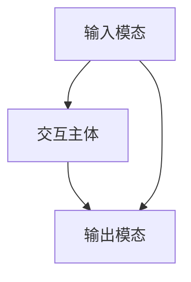
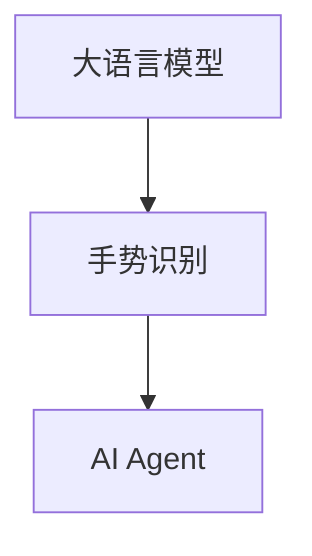
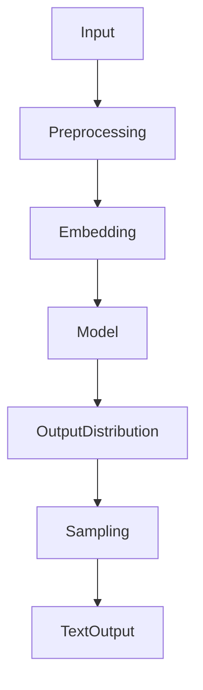
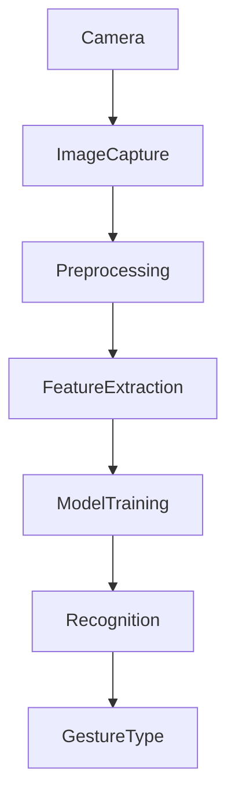
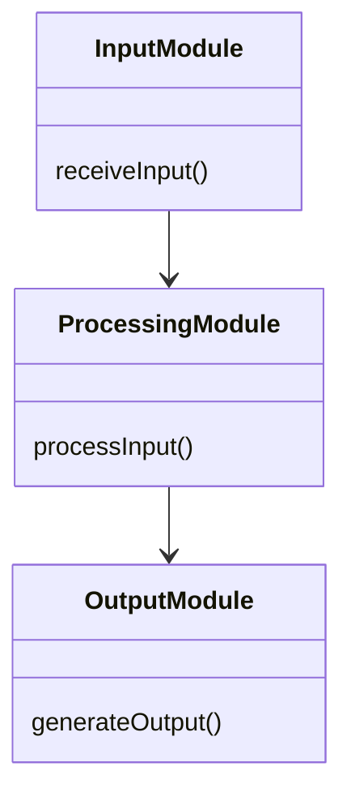
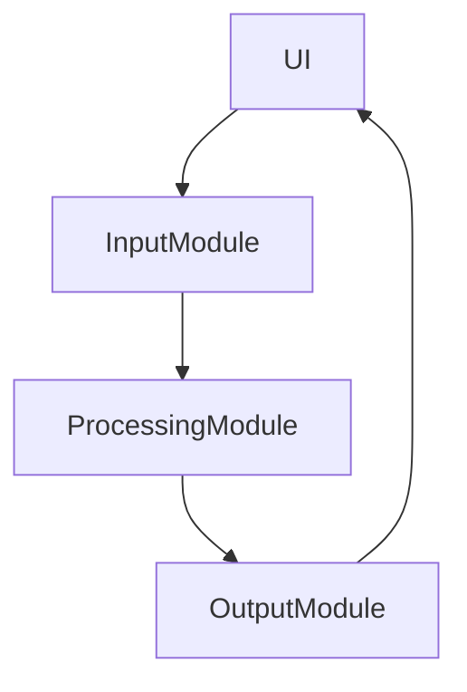
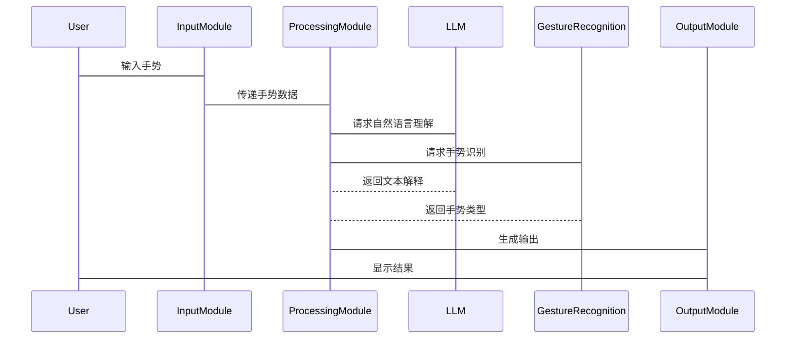

                 


# AI Agent 的多模态交互：整合 LLM 与手势识别

---

## 关键词

- AI Agent
- 多模态交互
- LLM（Large Language Model）
- 手势识别
- 人机交互

---

## 摘要

随着人工智能技术的快速发展，AI Agent（智能体）在多模态交互领域的应用日益广泛。本文深入探讨了如何整合大语言模型（LLM）与手势识别技术，实现更加自然和高效的多模态交互。文章从AI Agent的基本概念出发，分析了多模态交互的需求背景，详细讲解了LLM和手势识别的核心原理及其在AI Agent中的应用。通过系统分析与架构设计，结合实际项目案例，展示了如何将LLM与手势识别技术无缝整合，构建高效、智能的多模态交互系统。本文还提供了数学模型、算法流程图和系统架构图，帮助读者全面理解技术细节。

---

# 第一部分: AI Agent 的多模态交互概述

## 第1章: AI Agent 的基本概念

### 1.1 AI Agent 的定义与特点

#### 1.1.1 什么是AI Agent

AI Agent（人工智能代理）是指能够感知环境、自主决策并执行任务的智能实体。它可以是一个软件程序、机器人或其他智能设备，其核心目标是通过与环境的交互，完成特定的任务或提供服务。

#### 1.1.2 AI Agent 的核心特点

- **自主性**：AI Agent能够自主决策，无需外部干预。
- **反应性**：能够实时感知环境并做出反应。
- **目标导向**：所有行为都围绕实现特定目标展开。
- **学习能力**：通过数据和经验不断优化自身性能。

#### 1.1.3 AI Agent 的分类与应用场景

AI Agent可以分为**简单反射型**、**基于模型的反射型**、**目标驱动型**和**效用驱动型**。其应用场景包括智能助手、自动驾驶、智能客服、机器人助手等。

---

### 1.2 多模态交互的定义与重要性

#### 1.2.1 多模态交互的定义

多模态交互是指通过多种感官渠道（如视觉、听觉、触觉等）进行信息交换的方式。与传统的单一模态交互（如文本输入或语音命令）相比，多模态交互能够提供更丰富、更自然的交互体验。

#### 1.2.2 多模态交互的优势

- **提升用户体验**：通过结合多种交互方式，用户可以更自然地与系统互动。
- **增强系统理解能力**：多模态信息的融合能够帮助系统更准确地理解用户意图。
- **提高交互效率**：通过多种方式的结合，用户可以更快地完成任务。

#### 1.2.3 多模态交互在AI Agent中的作用

AI Agent通过整合多模态交互技术，能够更好地理解用户需求，提供更智能的服务。例如，结合语音识别和手势识别，AI Agent可以更准确地识别用户的意图。

---

## 第2章: LLM 与手势识别的背景介绍

### 2.1 大语言模型（LLM）的概述

#### 2.1.1 LLM 的基本概念

大语言模型（LLM）是指基于深度学习技术构建的大型语言模型，如GPT系列、BERT系列等。这些模型通过大量的文本数据进行训练，能够生成自然流畅的文本，并理解复杂的语言结构。

#### 2.1.2 LLM 的主要特点

- **强大的语言理解能力**：能够理解和生成多种语言。
- **上下文感知**：能够根据上下文理解语境。
- **可扩展性**：适用于多种任务，如文本生成、问答系统、机器翻译等。

#### 2.1.3 LLM 在AI Agent中的应用

LLM在AI Agent中的应用主要体现在自然语言处理方面。例如，用户可以通过文本或语音输入指令，LLM能够理解并生成相应的回应。

---

### 2.2 手势识别技术的概述

#### 2.2.1 手势识别的基本概念

手势识别是指通过摄像头或传感器捕捉用户的手势动作，并将其转换为计算机能够理解的指令。常见的手势识别技术包括基于图像处理和基于深度学习的方法。

#### 2.2.2 手势识别的主要技术

- **图像处理技术**：如边缘检测、背景分割等。
- **深度学习技术**：如卷积神经网络（CNN）、三维卷积网络等。
- **实时跟踪技术**：如骨架追踪、关节追踪等。

#### 2.2.3 手势识别在AI Agent中的应用

手势识别在AI Agent中的应用主要体现在增强交互体验方面。例如，用户可以通过手势控制AI Agent执行特定任务，如选择菜单项、调整屏幕亮度等。

---

## 第3章: AI Agent 的多模态交互需求分析

### 3.1 多模态交互的需求背景

#### 3.1.1 当前交互技术的局限性

- **单一模态交互的局限性**：仅依赖文本或语音输入，用户体验单一。
- **缺乏直观性**：用户难以通过单一模态表达复杂意图。

#### 3.1.2 多模态交互的需求驱动

- **提升用户体验**：通过多种交互方式，提供更丰富的互动体验。
- **增强系统理解能力**：多模态信息的融合能够帮助系统更准确地理解用户需求。

#### 3.1.3 LLM 与手势识别的整合需求

- **提升交互效率**：通过结合LLM的自然语言处理能力和手势识别的直观性，用户可以更高效地完成任务。
- **增强系统智能性**：多模态信息的融合能够帮助系统更好地理解用户意图，提供更智能的服务。

---

# 第二部分: AI Agent 的核心概念与联系

## 第4章: 多模态交互的核心概念

### 4.1 多模态交互的概念结构

#### 4.1.1 多模态交互的组成要素

- **输入模态**：如语音、文本、手势等。
- **输出模态**：如文本、语音、图像等。
- **交互主体**：用户和AI Agent。
- **交互环境**：如物理环境、虚拟环境等。

#### 4.1.2 各要素之间的关系

通过Mermaid流程图展示多模态交互的概念结构：



---

### 4.2 LLM 与手势识别的实体关系

#### 4.2.1 实体关系图

通过Mermaid图展示LLM与手势识别的实体关系：



---

## 第5章: 多模态交互的算法原理

### 5.1 LLM 的算法流程

#### 5.1.1 输入处理

- **文本预处理**：如分词、去停用词等。
- **向量表示**：将文本转换为向量表示，如词嵌入。

#### 5.1.2 模型推理

- **前向传播**：模型根据输入向量进行计算，生成输出向量。
- **概率计算**：通过模型计算每个可能输出的概率分布。

#### 5.1.3 输出生成

- **采样**：根据概率分布生成最终的输出文本。

通过Mermaid流程图展示LLM的算法流程：



---

### 5.2 手势识别的算法流程

#### 5.2.1 数据采集

- **图像采集**：通过摄像头捕捉用户的手势动作。
- **数据预处理**：如去噪、归一化等。

#### 5.2.2 数据处理

- **特征提取**：如提取手部关键点、骨骼信息等。
- **模型训练**：通过深度学习模型训练手势识别模型。

#### 5.2.3 模型训练与识别

- **特征匹配**：将输入特征与训练好的模型进行匹配，识别手势类型。

通过Mermaid流程图展示手势识别的算法流程：



---

## 第6章: 多模态交互的数学模型与公式

### 6.1 LLM 的数学模型

#### 6.1.1 概率计算公式

$$ P(y|x) = \frac{P(x|y)P(y)}{P(x)} $$

其中，$y$ 表示输出，$x$ 表示输入。

#### 6.1.2 模型训练的损失函数

$$ \mathcal{L} = -\sum_{i=1}^{n} \log P(y_i|x_i) $$

---

### 6.2 手势识别的数学模型

#### 6.2.1 手势分类的损失函数

$$ \mathcal{L} = \frac{1}{N} \sum_{i=1}^{N} \text{CrossEntropy}(y_i, \hat{y}_i) $$

其中，$N$ 表示样本数量，$y_i$ 表示真实标签，$\hat{y}_i$ 表示预测概率。

---

# 第三部分: 系统分析与架构设计

## 第7章: 系统分析与架构设计

### 7.1 问题场景介绍

用户希望构建一个支持多模态交互的AI Agent系统，整合LLM和手势识别技术，实现自然、高效的交互体验。

---

### 7.2 项目介绍

#### 7.2.1 项目目标

- 整合LLM和手势识别技术，实现多模态交互。
- 提供丰富的交互方式，提升用户体验。

---

### 7.3 系统功能设计

#### 7.3.1 功能模块

- **输入模块**：支持文本、语音、手势等多种输入方式。
- **处理模块**：整合LLM和手势识别模型，进行信息处理。
- **输出模块**：支持多种输出方式，如文本、语音、图像等。

#### 7.3.2 领域模型（Mermaid类图）



---

### 7.4 系统架构设计

#### 7.4.1 系统架构图



---

### 7.5 系统接口设计

- **输入接口**：支持多种输入方式，如文本输入框、语音输入、手势输入。
- **输出接口**：支持多种输出方式，如文本显示、语音播放、图像显示。

---

### 7.6 系统交互设计（Mermaid序列图）



---

# 第四部分: 项目实战

## 第8章: 项目实战

### 8.1 环境安装

- **Python**：安装最新版本的Python。
- **深度学习框架**：如TensorFlow或PyTorch。
- **手势识别库**：如OpenCV、MediaPipe。
- **LLM模型**：如GPT-3、BERT。

---

### 8.2 系统核心实现

#### 8.2.1 输入模块实现

```python
import cv2

def capture_gesture():
    cap = cv2.VideoCapture(0)
    while True:
        ret, frame = cap.read()
        # 手势识别代码
        cv2.imshow('Gesture Recognition', frame)
        if cv2.waitKey(1) & 0xFF == ord('q'):
            break
    cap.release()
    cv2.destroyAllWindows()
```

#### 8.2.2 处理模块实现

```python
def process_input(gesture):
    # 调用LLM进行自然语言理解
    response = llm.generate_response(gesture)
    return response
```

#### 8.2.3 输出模块实现

```python
def display_output(response):
    print(response)
    # 可以添加语音输出或其他形式的输出
```

---

### 8.3 代码应用解读与分析

- **输入模块**：通过摄像头捕获用户的手势，并进行预处理。
- **处理模块**：将手势数据传递给LLM进行自然语言理解，并生成相应的回应。
- **输出模块**：将生成的文本输出给用户。

---

### 8.4 实际案例分析

假设用户做出“挥手”的手势，系统识别后，调用LLM生成“你好！有什么可以帮助你的吗？”的回应，并通过文本或语音输出给用户。

---

## 第9章: 项目小结

通过本项目的实现，我们成功地将LLM与手势识别技术整合，构建了一个支持多模态交互的AI Agent系统。系统的实现展示了多模态交互的优势，为未来的智能交互系统提供了参考。

---

# 第五部分: 最佳实践、小结与注意事项

## 第10章: 最佳实践

### 10.1 小结

整合LLM与手势识别技术，能够显著提升AI Agent的交互能力。通过多模态交互，用户可以更自然地与系统互动，系统也能够更准确地理解用户需求。

### 10.2 注意事项

- **数据质量**：确保输入数据的质量，避免噪声干扰。
- **模型优化**：定期优化LLM和手势识别模型，提升系统的准确性和响应速度。
- **用户体验**：设计直观的用户界面，确保用户能够轻松上手。

### 10.3 拓展阅读

- **推荐书籍**：《深度学习》、《自然语言处理实战》。
- **推荐论文**：《多模态交互的研究进展》、《基于深度学习的手势识别技术》。

---

# 作者

作者：AI天才研究院/AI Genius Institute & 禅与计算机程序设计艺术/Zen And The Art of Computer Programming

---

# 结语

通过本文的详细讲解，读者可以深入了解AI Agent的多模态交互技术，并掌握整合LLM与手势识别的具体方法。希望本文能够为相关领域的研究和实践提供有价值的参考。

