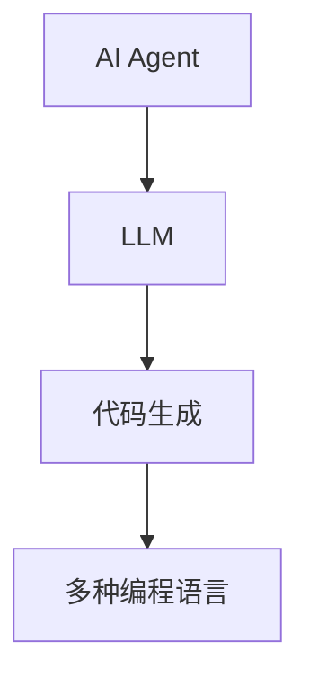
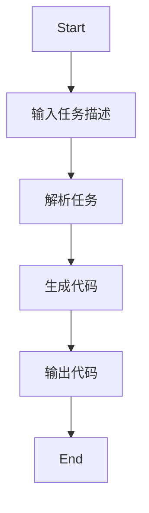
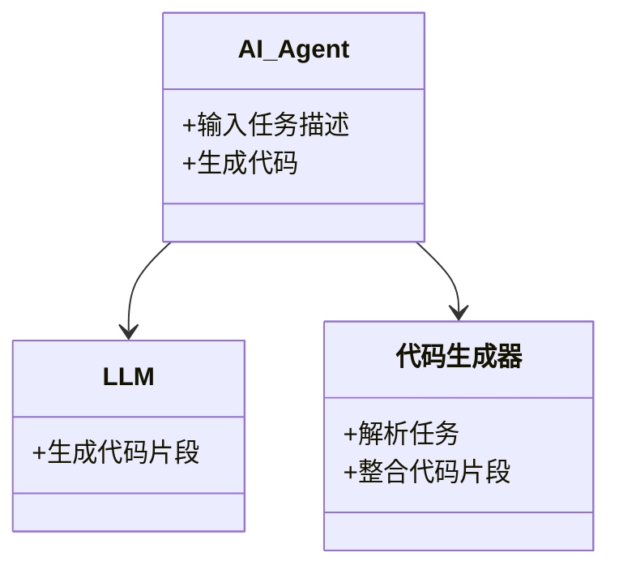
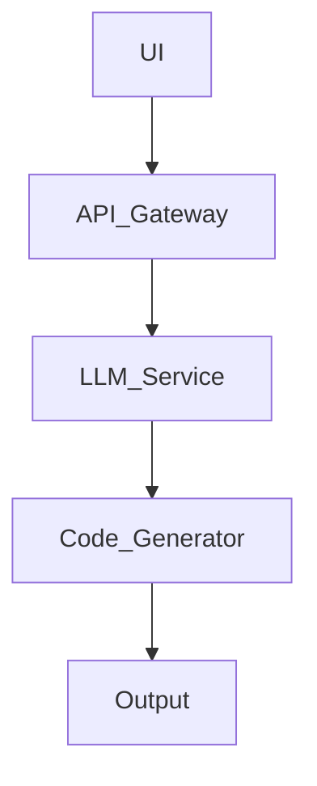
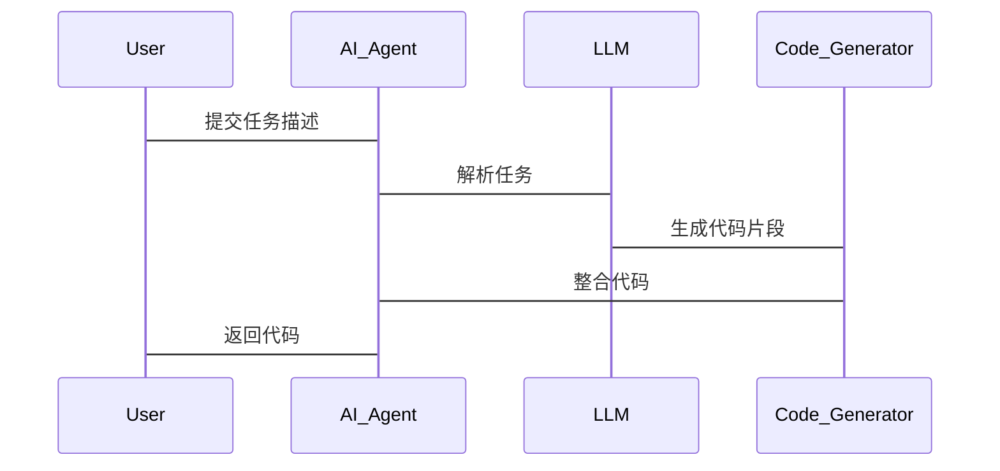

                 


# AI Agent 的多语言代码生成：LLM 在跨语言开发中的应用

## 关键词：AI Agent, 多语言代码生成, 大语言模型, 跨语言开发, 代码生成, AI技术

## 摘要：  
随着人工智能技术的快速发展，AI Agent 在多语言代码生成中的应用日益广泛。本文深入探讨了大语言模型（LLM）在跨语言开发中的核心作用，分析了AI Agent 如何通过LLM 实现多语言代码生成的关键技术与应用场景。文章从背景介绍、核心概念、算法原理、系统架构到项目实战，全面解析了AI Agent 在多语言代码生成中的实现与应用，并提供了详细的代码示例和系统设计图。通过本文的阐述，读者可以全面了解AI Agent 的多语言代码生成技术及其在实际项目中的应用价值。

---

## 第一部分: AI Agent 的多语言代码生成背景与概念

### 第1章: AI Agent 的多语言代码生成概述

#### 1.1 多语言代码生成的背景与意义
- **1.1.1 从单语言到多语言代码生成的演进**  
  随着软件开发的复杂性不断提高，跨语言开发的需求日益增长。传统的单语言代码生成工具逐渐暴露出局限性，而多语言代码生成技术为解决这一问题提供了新的思路。  
- **1.1.2 大语言模型在代码生成中的作用**  
  大语言模型（LLM）凭借其强大的自然语言理解和生成能力，成为多语言代码生成的核心技术。LLM 可以通过文本输入生成多种编程语言的代码，显著提升了开发效率。  
- **1.1.3 跨语言开发的应用场景与挑战**  
  在跨国团队协作、跨平台开发和分布式系统中，多语言代码生成技术能够显著降低开发成本，提高开发效率。然而，跨语言开发也面临模型适配、代码质量控制等挑战。

#### 1.2 AI Agent 的定义与特点
- **1.2.1 AI Agent 的定义**  
  AI Agent 是一种智能代理系统，能够根据输入的任务描述自动生成相应的代码。  
- **1.2.2 AI Agent 的核心特点**  
  - **智能性**：能够理解任务需求并生成符合要求的代码。  
  - **多语言支持**：支持多种编程语言的代码生成。  
  - **自适应性**：能够根据上下文调整生成策略。  
- **1.2.3 AI Agent 与传统代码生成工具的区别**  
  AI Agent 不仅能够生成代码，还能根据任务需求进行推理和决策，具有更强的智能性。

#### 1.3 大语言模型（LLM）在代码生成中的应用
- **1.3.1 LLM 的基本原理**  
  LLM 通过大规模的预训练数据，学习了编程语言的语法、语义和上下文关系，能够在给定输入的情况下生成相应的代码。  
- **1.3.2 LLM 在代码生成中的优势**  
  - **高效性**：LLM 可以快速生成代码，减少了开发时间。  
  - **准确性**：通过预训练，LLM 能够生成高质量的代码。  
  - **灵活性**：支持多种编程语言和开发场景。  
- **1.3.3 LLM 在跨语言开发中的潜力**  
  LLM 可以通过多语言模型结构，实现多种编程语言的代码生成，为跨语言开发提供了新的可能性。

---

## 第二部分: AI Agent 的核心概念与联系

### 第2章: AI Agent 的核心概念与联系

#### 2.1 核心概念原理
- **2.1.1 大语言模型的生成机制**  
  LLM 通过解码器结构生成代码，基于上下文信息逐步生成代码片段。  
- **2.1.2 AI Agent 的任务分解与执行**  
  AI Agent 将任务分解为多个子任务，分别生成相应的代码片段，并进行整合。

#### 2.2 核心概念对比表
| 对比维度       | LLM 代码生成       | 传统代码生成工具       |
|----------------|--------------------|-------------------------|
| 支持语言         | 多语言             | 单一语言               |
| 灵活性           | 高                 | 低                     |
| 智能性           | 强                 | 弱                     |
| 开发效率         | 高                 | 中                     |

#### 2.3 ER 实体关系图


---

## 第三部分: AI Agent 的算法原理

### 第3章: AI Agent 的算法原理

#### 3.1 算法原理流程图


#### 3.2 核心算法实现
```python
def generate_code(task_description, target_language):
    # 解析任务描述
    parsed_task = parse(task_description)
    # 根据任务生成代码
    generated_code = llm_generate_code(parsed_task, target_language)
    return generated_code
```

#### 3.3 数学模型与公式
- 概率公式：  
  $$ P(code | task) = \prod_{i=1}^{n} P(word_i | task, word_{i-1}) $$  
- 损失函数：  
  $$ L = -\sum_{i=1}^{n} \log P(word_i | task, word_{i-1}) $$  

---

## 第四部分: AI Agent 的系统分析与架构设计

### 第4章: AI Agent 的系统架构设计

#### 4.1 项目背景与目标
- 开发一个支持多语言代码生成的AI Agent，提升跨语言开发效率。

#### 4.2 系统功能设计


#### 4.3 系统架构设计


#### 4.4 系统接口设计
- 输入接口：接受任务描述和目标语言。  
- 输出接口：返回生成的代码。

#### 4.5 系统交互流程


---

## 第五部分: AI Agent 的项目实战

### 第5章: AI Agent 的项目实战

#### 5.1 环境安装
- Python 3.8+
- 必要的库：`transformers`, `mermaid`, `numpy`

#### 5.2 核心代码实现
```python
from transformers import pipeline

def generate_code(task_description, target_language):
    # 初始化 LLM
    llm = pipeline("text-generation", model="gpt2")
    # 生成代码
    generated = llm(task_description, max_length=100)
    return generated[0]['generated_text']
```

#### 5.3 代码应用解读与分析
- 输入任务描述：例如，生成一个Python函数。  
- 生成代码：LLM 生成 Python 函数代码。  
- 输出代码：返回生成的代码。

#### 5.4 实际案例分析
- 任务描述：生成一个计算阶乘的函数。  
- 生成代码：  
  ```python
  def factorial(n):
      if n == 0:
          return 1
      return n * factorial(n-1)
  ```

#### 5.5 项目小结
- 通过项目实战，验证了 AI Agent 在多语言代码生成中的有效性。  
- 提供了详细的代码实现和系统设计，为后续开发提供了参考。

---

## 第六部分: AI Agent 的最佳实践与总结

### 第6章: AI Agent 的最佳实践

#### 6.1 最佳实践 tips
- 选择合适的 LLM 模型。  
- 定期优化代码生成策略。  
- 处理代码错误时，结合上下文进行调整。

#### 6.2 小结
- AI Agent 的多语言代码生成技术为跨语言开发提供了新的可能性。  
- 通过本文的详细解析，读者可以全面掌握 AI Agent 的实现原理和应用场景。

#### 6.3 注意事项
- 注意代码生成的质量控制。  
- 处理多语言时，需考虑语法差异。  
- 保持对新技术的敏感性。

#### 6.4 拓展阅读
- 《Large Language Models in AI》  
- 《Generative Models for Code》

---

## 作者：AI天才研究院/AI Genius Institute & 禅与计算机程序设计艺术 /Zen And The Art of Computer Programming

