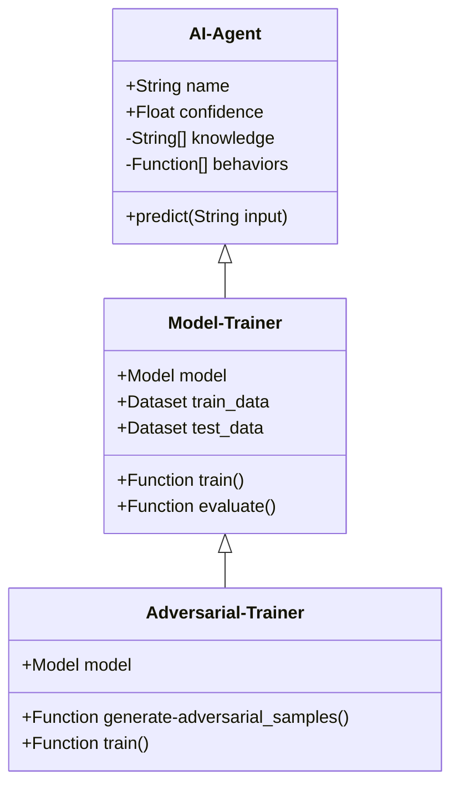
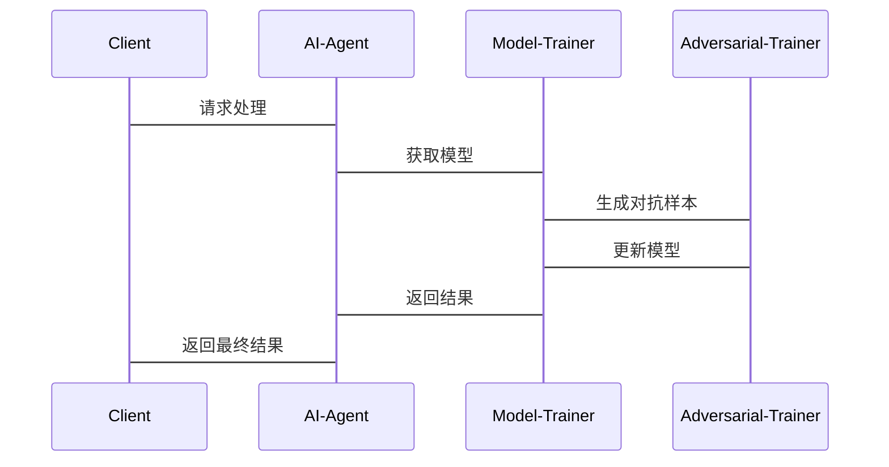

                 


# AI Agent 的对抗性测试：提高 LLM 的鲁棒性

> 关键词：AI Agent，对抗性测试，LLM，鲁棒性，机器学习，深度学习

> 摘要：本文深入探讨了AI Agent的对抗性测试，旨在提高大型语言模型（LLM）的鲁棒性。通过分析对抗性测试的核心概念、算法原理、系统架构及实际应用，本文为读者提供了全面的视角，帮助他们理解如何通过对抗性测试提升AI Agent的安全性和可靠性。

---

# 第一部分: 背景与概念

## 第1章: 对抗性测试的基本概念

### 1.1 对抗性测试的定义与背景

#### 1.1.1 什么是对抗性测试
对抗性测试是一种通过故意引入干扰或对抗性输入来评估和提升AI系统鲁棒性的方法。它模拟了恶意攻击者试图破坏系统的行为，帮助开发者发现系统中的潜在漏洞。

#### 1.1.2 对抗性测试的背景与意义
随着AI技术的广泛应用，提升AI系统的安全性变得至关重要。对抗性测试通过对模型进行攻击性输入，揭示其在极端情况下的表现，从而增强模型的鲁棒性。

#### 1.1.3 对抗性测试的核心问题
对抗性测试的核心问题在于如何生成有效的对抗样本，并通过这些样本测试模型的鲁棒性。这需要理解模型的弱点，并设计针对性的测试策略。

### 1.2 AI Agent 的鲁棒性问题

#### 1.2.1 AI Agent 的定义与特点
AI Agent是一种智能实体，能够感知环境并采取行动以实现特定目标。其特点包括自主性、反应性、社会性和学习能力。

#### 1.2.2 鲁棒性在 AI Agent 中的重要性
鲁棒性是指AI Agent在面对异常输入或环境变化时仍能正常工作的能力。对抗性测试通过模拟极端情况，评估并提升AI Agent的鲁棒性。

#### 1.2.3 对抗性测试如何提升 AI Agent 的鲁棒性
通过对抗性测试，AI Agent能够在模拟的恶意攻击中发现并修复潜在漏洞，从而增强其在真实环境中的表现。

### 1.3 本章小结

---

# 第二部分: 对抗性测试的核心概念与联系

## 第2章: 对抗性测试的核心原理

### 2.1 对抗样本的生成原理

#### 2.1.1 对抗样本的定义
对抗样本是指通过微小扰动生成的输入样本，导致模型输出错误的结果。这些样本通常用于测试模型的鲁棒性。

#### 2.1.2 对抗样本的生成方法
对抗样本的生成方法包括基于梯度的攻击（如FGSM）和无梯度攻击（如黑盒攻击）。这些方法通过优化目标函数生成对抗样本。

#### 2.1.3 对抗样本的攻击向量
攻击向量包括输入空间、模型参数和训练数据。通过分析这些向量，可以设计有效的对抗样本生成策略。

### 2.2 对抗性测试与传统测试的对比

#### 2.2.1 传统测试方法的局限性
传统测试方法依赖于预定义的测试用例，难以覆盖所有可能的输入情况。对抗性测试通过生成对抗样本，弥补了这一不足。

#### 2.2.2 对抗性测试的优势与特点
对抗性测试能够主动发现模型的潜在漏洞，提供更全面的测试结果。其特点包括动态性、针对性和高效性。

#### 2.2.3 对抗性测试与模型鲁棒性的关系
对抗性测试通过揭示模型的弱点，直接推动模型鲁棒性的提升。两者相辅相成，共同促进AI系统的安全性。

### 2.3 对抗训练与对抗性测试的关系

#### 2.3.1 对抗训练的定义
对抗训练是一种通过同时训练生成器和判别器来提升模型鲁棒性的方法。生成器生成对抗样本，判别器识别这些样本。

#### 2.3.2 对抗训练在模型鲁棒性中的作用
对抗训练通过生成对抗样本，增强模型的识别能力，提升其在面对攻击时的防御能力。

#### 2.3.3 对抗训练与对抗性测试的区别与联系
对抗训练是一种预防性措施，而对抗性测试是一种验证手段。两者在方法上有相似之处，但目标不同。

## 第3章: 对抗性测试的核心概念对比

### 3.1 对抗性测试与模型攻击的对比

#### 3.1.1 模型攻击的定义与分类
模型攻击是指通过恶意输入影响模型输出的行为。根据目标，可分为黑盒攻击和白盒攻击。

#### 3.1.2 对抗性测试与模型攻击的关系
对抗性测试通过模拟攻击行为，揭示模型的弱点。两者在本质上相似，但对抗性测试更具防御性。

#### 3.1.3 对抗性测试在防御中的作用
对抗性测试通过发现模型的漏洞，帮助开发者提升模型的鲁棒性，增强其防御能力。

### 3.2 对抗性测试与其他测试方法的对比

#### 3.2.1 黑盒测试与白盒测试的对比
黑盒测试基于输入输出行为，而白盒测试基于内部结构。对抗性测试结合了两者的优势，提供更全面的测试。

#### 3.2.2 对抗性测试的独特性
对抗性测试通过生成对抗样本，模拟极端情况，揭示模型的潜在缺陷。

#### 3.2.3 对抗性测试在实际应用中的优势
对抗性测试能够主动发现模型漏洞，提升其在实际应用中的表现。

---

# 第三部分: 算法原理与实现

## 第3章: 对抗性测试的算法原理

### 3.1 基于梯度的对抗样本生成算法

#### 3.1.1 FGSM算法的原理
FGSM算法通过计算损失函数的梯度，生成对抗样本。其公式为：
$$ x' = x + \epsilon \cdot \text{sign}(\nabla_{x} J(x, y)) $$
其中，$\epsilon$ 是扰动幅度，$\nabla_{x} J(x, y)$ 是损失函数对输入的梯度。

#### 3.1.2 PGD算法的实现
PGD算法是一种更强大的对抗样本生成方法，通过多次迭代优化目标函数：
$$ x_{t+1} = x_t + \alpha \cdot \text{sign}(\nabla_{x} J(x_t, y)) $$

#### 3.1.3 对比分析
FGSM适用于单步优化，而PGD适用于多步优化。PGD生成的对抗样本通常更具破坏性。

### 3.2 对抗性测试的数学模型

#### 3.2.1 对抗样本生成的目标函数
$$ \min_{x'} J(x', y) $$
其中，$x'$ 是对抗样本，$y$ 是目标标签。

#### 3.2.2 对抗训练的目标函数
$$ \min_{\theta} \max_{x'} J(x', y; \theta) $$
其中，$\theta$ 是模型参数，$x'$ 是对抗样本。

---

# 第四部分: 系统分析与架构设计

## 第4章: 对抗性测试的系统架构

### 4.1 系统功能设计

#### 4.1.1 领域模型设计
通过Mermaid类图展示系统中各个实体及其关系。



#### 4.1.2 系统架构设计
通过Mermaid架构图展示系统的整体架构。


### 4.2 系统接口设计

#### 4.2.1 对抗样本生成接口
API接口用于生成对抗样本，输入为原始样本，输出为对抗样本。

#### 4.2.2 模型训练接口
API接口用于训练模型，输入为训练数据和对抗样本，输出为训练好的模型。

### 4.3 交互流程设计

#### 4.3.1 对抗性测试流程
通过Mermaid序列图展示测试流程。



---

# 第五部分: 项目实战与应用

## 第5章: 对抗性测试的项目实战

### 5.1 环境安装与配置

#### 5.1.1 安装必要的库
安装TensorFlow、Keras和numpy等库：
```bash
pip install tensorflow keras numpy
```

#### 5.1.2 配置开发环境
配置Jupyter Notebook或PyCharm作为开发环境。

### 5.2 对抗样本生成器实现

#### 5.2.1 Python代码实现
实现一个简单的对抗样本生成器，基于FGSM算法。

```python
import numpy as np
import tensorflow as tf
from tensorflow.keras.models import Model
from tensorflow.keras.layers import Dense, Input

# 定义模型
input_layer = Input(shape=(10,))
dense_layer = Dense(5, activation='relu')(input_layer)
output_layer = Dense(2, activation='sigmoid')(dense_layer)
model = Model(inputs=input_layer, outputs=output_layer)
model.compile(loss='binary_crossentropy', optimizer='adam')

# 定义损失函数
loss_fn = tf.keras.losses.BinaryCrossentropy()

# 生成对抗样本
def generate_adversarial_samples(x, y, epsilon=0.1):
    with tf.GradientTape() as tape:
        y_pred = model(x)
        loss = loss_fn(y, y_pred)
    gradient = tape.gradient(loss, x)
    adversarial_x = x - epsilon * gradient
    return adversarial_x

# 示例使用
x = np.random.randn(1, 10)
y = np.array([[1, 0]])
adversarial_x = generate_adversarial_samples(x, y)
print(adversarial_x)
```

#### 5.2.2 代码解读
上述代码定义了一个简单的神经网络模型，并实现了基于FGSM算法的对抗样本生成器。通过计算损失函数的梯度，生成对抗样本，从而测试模型的鲁棒性。

### 5.3 实际案例分析

#### 5.3.1 对抗样本对模型的影响
通过实验，对抗样本可能导致模型输出错误的结果，揭示模型的弱点。

#### 5.3.2 提升模型鲁棒性的策略
通过对抗训练，模型可以更好地识别对抗样本，提升其鲁棒性。

### 5.4 项目小结

---

# 第六部分: 最佳实践与总结

## 第6章: 最佳实践与注意事项

### 6.1 对抗性测试的最佳实践

#### 6.1.1 测试数据的质量
确保测试数据的多样性和代表性，以覆盖更多潜在的对抗样本。

#### 6.1.2 模型的鲁棒性训练
通过对抗训练，增强模型的鲁棒性，减少对抗样本的影响。

#### 6.1.3 团队协作的重要性
对抗性测试需要跨团队合作，包括数据科学家、软件工程师和安全专家。

### 6.2 对抗性测试的注意事项

#### 6.2.1 对抗样本的局限性
对抗样本可能无法覆盖所有可能的攻击向量，测试结果具有局限性。

#### 6.2.2 模型的泛化能力
过度依赖对抗训练可能导致模型泛化能力下降，影响其在实际应用中的表现。

#### 6.2.3 持续优化
对抗性测试是一个持续的过程，需要不断更新测试策略和模型。

### 6.3 本章小结

---

# 第七部分: 拓展阅读与深入学习

## 第7章: 拓展阅读

### 7.1 推荐书籍

#### 7.1.1 《对抗性攻击与防御：人工智能的安全挑战》
作者：李明
简介：本书系统介绍了对抗性攻击的基本原理、防御策略和实际应用。

#### 7.1.2 《深度学习中的对抗训练》
作者：张伟
简介：本书详细讲解了对抗训练的原理和应用，提供了丰富的代码示例。

### 7.2 推荐论文

#### 7.2.1 "AdvGAN: Adversarial Training for Improving Model Robustness"
作者：Zhang et al.
简介：本文提出了一种基于生成对抗网络的对抗训练方法，显著提升了模型的鲁棒性。

#### 7.2.2 "The Limitations of Deep Learning in Adversarial Settings"
作者：Goodfellow et al.
简介：本文分析了深度学习模型在对抗性环境中的局限性，并提出了改进建议。

---

# 结语

通过本文的深入探讨，我们了解了AI Agent的对抗性测试的重要性和实现方法。对抗性测试不仅是提升模型鲁棒性的关键手段，也是保障AI系统安全性的必要工具。未来，随着技术的不断发展，对抗性测试将在更多领域发挥重要作用。

---

# 作者

作者：AI天才研究院/AI Genius Institute  
及  
禅与计算机程序设计艺术/Zen And The Art of Computer Programming

