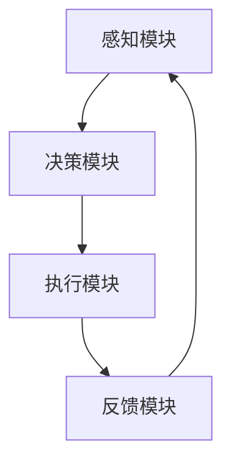
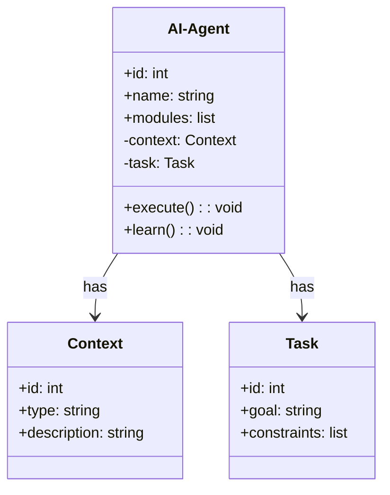
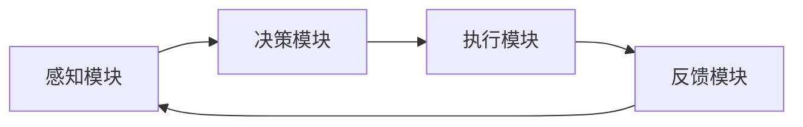
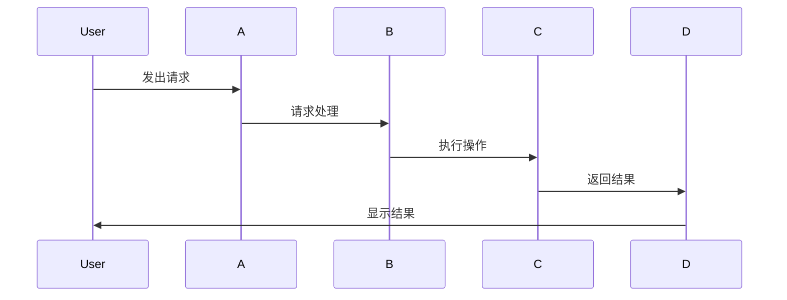

                 


# AI Agent 的情境学习：增强 LLM 的场景适应性

> 关键词：AI Agent、情境学习、LLM、场景适应性、增强学习、强化学习、算法原理

> 摘要：本文探讨了AI Agent通过情境学习如何提升大型语言模型（LLM）的场景适应性，详细分析了情境学习的核心概念、算法原理、系统架构，并通过实际案例展示了其在增强LLM性能中的应用。本文旨在为技术从业者提供深入的理论和实践指导，帮助他们更好地理解和应用AI Agent的情境学习技术。

---

## 第1章: AI Agent与情境学习概述

### 1.1 AI Agent的基本概念
AI Agent（人工智能代理）是指能够感知环境、执行任务并做出决策的智能实体。AI Agent可以分为简单反射型、基于模型的反射型、目标驱动型和效用驱动型等类型。AI Agent的核心功能包括感知、推理、规划和执行。

#### 1.1.1 AI Agent的定义与分类
- **定义**：AI Agent是一个能够通过感知环境、理解任务目标并采取行动来实现目标的智能实体。
- **分类**：
  1. 简单反射型：基于当前感知直接做出反应，如聊天机器人。
  2. 基于模型的反射型：通过内部模型预测结果并做出决策。
  3. 目标驱动型：以特定目标为导向，如自动驾驶系统。
  4. 效用驱动型：以最大化效用函数为目标，如经济决策模型。

#### 1.1.2 情境学习的定义与特点
- **定义**：情境学习是指AI Agent通过在特定场景中与环境互动，学习任务完成的策略和方法。
- **特点**：
  - 动态性：环境和任务目标可能随时变化。
  - 实用性：通过实际操作优化决策过程。
  - 智能性：结合上下文信息进行推理和决策。

#### 1.1.3 AI Agent与情境学习的关系
AI Agent是情境学习的主体，通过情境学习提升其在不同场景中的适应性和执行能力。情境学习为AI Agent提供了与环境互动的机会，使其能够不断优化自身的决策算法。

---

### 1.2 LLM的场景适应性问题
大型语言模型（LLM）在自然语言处理任务中表现出色，但在实际应用场景中仍面临诸多挑战。

#### 1.2.1 LLM的基本原理与局限性
- **基本原理**：LLM通过大量数据训练，利用深度神经网络进行模式识别和生成。
- **局限性**：
  - **语境理解不足**：LLM难以准确理解上下文中的隐含信息。
  - **任务执行能力有限**：LLM在复杂任务中的执行能力受限，需要结合外部知识和工具。
  - **动态环境适应性差**：LLM难以快速适应新场景和任务变化。

#### 1.2.2 场景适应性的重要性
场景适应性是指AI系统在不同环境下能够灵活调整策略，完成任务的能力。对于LLM而言，提升场景适应性可以显著增强其在实际应用中的效果和用户满意度。

#### 1.2.3 AI Agent在场景适应性中的作用
AI Agent作为LLM的增强模块，通过情境学习优化LLM的决策过程，使其能够更好地适应不同场景的需求。

---

## 第2章: 情境学习的核心概念与原理

### 2.1 情境学习的理论基础
情境学习的理论基础包括认知科学、机器学习和强化学习等领域。

#### 2.1.1 基于情境的学习模型
- **情境表示**：将环境中的信息转化为可处理的表示形式。
- **任务模型**：定义任务目标、约束条件和可能的动作空间。
- **学习策略**：选择和优化动作以实现目标。

#### 2.1.2 情境学习的特征与优势
- **特征**：
  - 环境感知：能够感知并理解当前环境。
  - 任务导向：以完成特定任务为目标。
  - 自适应性：能够根据反馈调整策略。
- **优势**：
  - 提高决策的准确性和效率。
  - 增强系统在复杂场景中的适应性。

#### 2.1.3 ER实体关系图架构
以下是一个简单的ER实体关系图，展示了AI Agent、情境和任务之间的关系：

```mermaid
erd
  entity(AI Agent) {
    [ID]
    [名称]
    [功能模块]
  }
  entity(情境) {
    [ID]
    [类型]
    [描述]
  }
  entity(任务) {
    [ID]
    [目标]
    [约束]
  }
  AI Agent --* 情境: 参与
  AI Agent --* 任务: 执行
  情境 --* 任务: 提供
```

---

### 2.2 AI Agent的情境学习框架
AI Agent的情境学习框架包括感知、决策、执行和反馈四个阶段。

#### 2.2.1 框架的组成与功能
- **感知**：收集环境中的信息。
- **决策**：基于感知信息制定行动方案。
- **执行**：根据决策结果采取行动。
- **反馈**：根据执行结果调整决策策略。

#### 2.2.2 框架的核心要素与关系
- **核心要素**：
  - 感知模块：负责信息的收集和处理。
  - 决策模块：负责策略的制定和优化。
  - 执行模块：负责具体操作的执行。
  - 反馈机制：负责根据结果调整策略。
- **关系**：各模块协同工作，形成闭环。

#### 2.2.3 框架的实现步骤与流程
1. **初始化**：定义任务目标和初始策略。
2. **感知**：收集环境信息。
3. **决策**：基于当前状态制定行动方案。
4. **执行**：根据决策结果采取行动。
5. **反馈**：根据执行结果调整策略。
6. **循环**：重复上述步骤，优化策略。

---

## 第3章: AI Agent的情境学习算法原理

### 3.1 情境学习算法的数学模型
情境学习算法通常涉及概率模型和优化方法。

#### 3.1.1 情境表示的数学模型
情境可以表示为状态空间中的一个向量，例如：

$$
s = (s_1, s_2, \ldots, s_n)
$$

其中，$s_i$ 表示情境中的某一特征。

#### 3.1.2 状态转移的概率模型
状态转移可以用马尔可夫链表示，转移概率为：

$$
P(s_{t+1} | s_t, a_t)
$$

其中，$a_t$ 表示在时间 $t$ 的动作。

#### 3.1.3 奖励函数的设计与优化
奖励函数通常设计为：

$$
R(s, a) = r_1 s_1 + r_2 s_2 + \ldots + r_n s_n
$$

其中，$r_i$ 是奖励权重，$s_i$ 是情境特征。

---

### 3.2 基于强化学习的情境学习算法
强化学习是情境学习的重要组成部分。

#### 3.2.1 强化学习的基本原理
强化学习通过最大化累计奖励来优化策略。策略函数可以表示为：

$$
\pi(a | s) = P(\text{选择动作 } a | \text{状态 } s)
$$

#### 3.2.2 情境学习中的策略优化
策略优化可以通过梯度上升法实现：

$$
\theta_{t+1} = \theta_t + \alpha \nabla_{\theta} J(\theta)
$$

其中，$\alpha$ 是学习率，$J(\theta)$ 是目标函数。

#### 3.2.3 算法的收敛性分析
在适当的条件下，强化学习算法可以收敛到最优策略。

---

## 第4章: AI Agent的情境学习系统架构

### 4.1 系统架构设计
系统架构设计包括功能模块划分和模块交互关系。

#### 4.1.1 系统功能模块划分
- 感知模块：负责环境信息的收集和处理。
- 决策模块：负责策略的制定和优化。
- 执行模块：负责具体操作的执行。
- 反馈模块：负责根据执行结果调整策略。

#### 4.1.2 模块之间的交互关系
模块之间的交互关系可以用以下流程图表示：



---

## 第5章: AI Agent的情境学习项目实战

### 5.1 项目环境与工具安装
项目需要以下工具：
- Python 3.8+
- TensorFlow或PyTorch
- Scikit-learn

#### 5.1.1 安装依赖
```bash
pip install numpy pandas scikit-learn matplotlib
```

---

### 5.2 系统功能设计
系统功能设计包括领域模型的类图设计。

#### 5.2.1 领域模型的类图
领域模型的类图可以用以下mermaid图表示：



---

### 5.3 系统架构设计
系统架构设计包括架构图的绘制。

#### 5.3.1 架构图
系统架构图可以用以下mermaid图表示：



---

### 5.4 系统接口与交互设计
系统接口设计包括用户与系统的交互流程。

#### 5.4.1 用户与系统的交互流程
用户与系统的交互流程可以用以下mermaid序列图表示：



---

## 第6章: 最佳实践、小结、注意事项和拓展阅读

### 6.1 最佳实践
- **数据多样性**：确保训练数据的多样性，以提高模型的适应性。
- **持续学习**：通过持续学习优化模型性能。
- **错误处理**：建立完善的错误处理机制，确保系统的健壮性。

### 6.2 小结
本文详细探讨了AI Agent通过情境学习增强LLM场景适应性的方法，涵盖了理论基础、算法原理、系统架构和项目实战等内容。

### 6.3 注意事项
- **数据隐私**：确保数据的隐私性和合规性。
- **系统安全**：加强系统安全防护，防止攻击。

### 6.4 拓展阅读
- **强化学习**：深入学习强化学习的相关理论和算法。
- **分布式系统**：研究分布式系统的设计与优化。

---

## 作者
作者：AI天才研究院/AI Genius Institute  
作者：禅与计算机程序设计艺术/Zen And The Art of Computer Programming  

---

希望这篇文章能够为您提供有价值的信息和启发。如果需要进一步探讨或交流，请随时联系。

