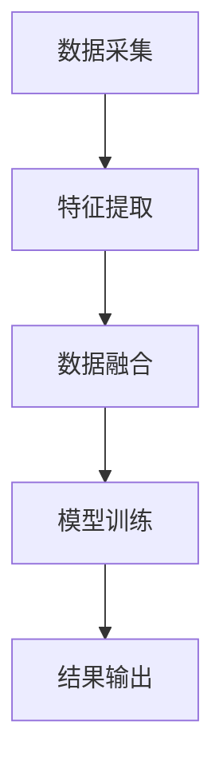
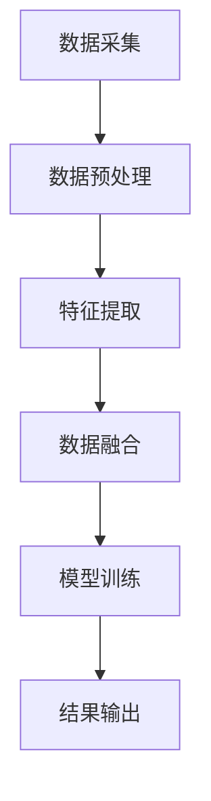
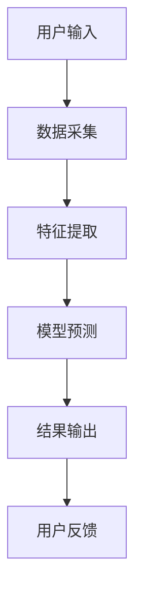

                 


# AI Agent 的情境感知：增强 LLM 的环境适应能力

---

## 关键词：  
AI Agent, 情境感知, 大语言模型, 环境适应能力, 机器学习, 智能系统

---

## 摘要：  
本文探讨了AI Agent 的情境感知能力在增强大语言模型（LLM）环境适应能力中的作用。通过分析情境感知的核心原理、实现方法及其在LLM中的应用，提出了结合情境感知的LLM优化策略。本文从背景介绍、技术原理、系统架构到项目实战，详细阐述了如何通过情境感知提升LLM的环境适应能力，为AI Agent 的未来发展提供了新的思路和方向。

---

# 第1章: AI Agent 与情境感知概述

## 1.1 AI Agent 的基本概念

### 1.1.1 什么是AI Agent  
AI Agent（人工智能代理）是指能够感知环境、自主决策并执行任务的智能实体。它能够通过与环境的交互，实现特定目标，例如问题解决、信息检索、决策支持等。

### 1.1.2 AI Agent 的分类与特点  
AI Agent 可以分为以下几类：  
1. **反应式 Agent**：基于当前感知做出实时反应，适用于动态环境。  
2. **认知式 Agent**：具备推理、规划和学习能力，适用于复杂任务。  
3. **协作式 Agent**：能够与其他 Agent 或人类协同工作，实现共同目标。  

AI Agent 的特点包括：自主性、反应性、目标导向性和环境适应性。

### 1.1.3 情境感知在AI Agent 中的作用  
情境感知是指AI Agent 能够理解当前环境中的上下文信息，并根据这些信息做出更智能的决策。情境感知是AI Agent 实现环境适应能力的核心技术之一。

---

## 1.2 情境感知的定义与应用

### 1.2.1 情境感知的核心概念  
情境感知是指系统能够感知和理解当前环境中的相关信息，并基于这些信息做出适应性调整。它包括数据采集、特征提取和信息融合三个主要步骤。

### 1.2.2 情境感知的主要应用场景  
1. **智能助手**：例如Siri、Alexa等，能够根据用户的上下文提供更精准的服务。  
2. **自动驾驶**：通过感知环境中的交通状况、道路标志等信息，做出实时决策。  
3. **智能客服**：根据用户的问题和历史记录提供个性化服务。  

### 1.2.3 情境感知与AI Agent 的结合  
情境感知能够为AI Agent 提供更丰富的环境信息，帮助其更好地理解用户需求和任务目标，从而提高决策的准确性和效率。

---

## 1.3 LLM 的环境适应能力

### 1.3.1 大语言模型（LLM）的基本原理  
LLM 是一种基于深度学习的自然语言处理模型，能够通过大量数据训练，生成与上下文相关的文本。其核心是通过神经网络对语言进行建模。

### 1.3.2 LLM 的环境适应能力的重要性  
环境适应能力是指模型能够根据不同的环境和任务调整其输出结果。对于AI Agent 来说，增强LLM的环境适应能力能够显著提升其在实际应用中的表现。

### 1.3.3 当前LLM 在环境适应中的挑战  
1. **数据稀疏性**：模型在特定环境中的表现可能受限于训练数据的覆盖范围。  
2. **动态环境**：模型难以实时适应环境中的变化。  
3. **上下文理解**：模型在复杂场景下的上下文理解能力有待提升。  

---

# 第2章: 情境感知技术的核心原理

## 2.1 情境感知的数据来源

### 2.1.1 环境数据的采集方法  
环境数据的采集方法包括：  
1. **传感器数据**：例如摄像头、麦克风等设备采集的物理环境信息。  
2. **日志数据**：用户行为、系统日志等数据。  
3. **上下文信息**：例如时间、地点、用户身份等信息。  

### 2.1.2 用户行为数据的分析  
用户行为数据的分析方法包括：  
1. **行为序列分析**：通过分析用户操作序列，识别用户的意图。  
2. **情感分析**：通过文本挖掘技术分析用户情绪。  
3. **关联规则挖掘**：发现用户行为之间的关联性。  

### 2.1.3 时间与空间信息的整合  
时间与空间信息的整合方法包括：  
1. **时间序列分析**：分析事件发生的时间顺序。  
2. **地理信息系统（GIS）**：结合地理位置信息进行分析。  

---

## 2.2 情境感知的特征提取

### 2.2.1 特征提取的基本原理  
特征提取是指从原始数据中提取具有代表性的特征，以便后续的分析和处理。常用的特征提取方法包括：  
1. **基于统计的方法**：例如TF-IDF。  
2. **基于深度学习的方法**：例如卷积神经网络（CNN）和循环神经网络（RNN）。  

### 2.2.2 常用的特征提取方法  
1. **文本特征提取**：通过词袋模型或词嵌入（如Word2Vec）提取文本特征。  
2. **图像特征提取**：通过CNN提取图像特征。  
3. **行为特征提取**：通过聚类分析提取用户行为特征。  

### 2.2.3 特征选择的优化策略  
特征选择的优化策略包括：  
1. **基于统计的方法**：例如卡方检验。  
2. **基于模型的方法**：例如Lasso回归。  
3. **基于树模型的方法**：例如随机森林。  

---

## 2.3 情境感知的融合方法

### 2.3.1 多模态数据的融合方式  
多模态数据的融合方式包括：  
1. **基于特征的融合**：将不同模态的特征向量进行拼接或加权。  
2. **基于模型的融合**：例如使用注意力机制对不同模态的信息进行加权。  

### 2.3.2 基于概率的融合模型  
基于概率的融合模型包括：  
1. **贝叶斯网络**：通过概率推理融合不同来源的信息。  
2. **马尔可夫链**：通过状态转移模型融合信息。  

### 2.3.3 基于规则的融合方法  
基于规则的融合方法包括：  
1. **逻辑规则**：例如“如果A且B，则C”。  
2. **经验规则**：根据领域知识制定融合规则。  

---

# 第3章: 增强 LLM 的情境感知能力

## 3.1 LLM 的输入增强

### 3.1.1 基于情境信息的输入优化  
通过在输入中加入情境信息，例如时间、地点、用户身份等，可以提高模型的上下文理解能力。  

### 3.1.2 输入增强对模型输出的影响  
输入增强可以通过以下方式影响模型输出：  
1. **提高输出的相关性**：模型能够根据情境信息生成更准确的结果。  
2. **增强输出的可解释性**：模型输出与情境信息相关，更容易被用户理解。  

### 3.1.3 实际案例分析  
例如，在智能客服场景中，输入中加入用户的历史对话记录和当前情绪状态，可以显著提高客服系统的响应质量。

---

## 3.2 LLM 的内部状态管理

### 3.2.1 模型状态的定义与表示  
模型状态的定义与表示包括：  
1. **短期记忆**：模型对最近输入的信息的记忆。  
2. **长期记忆**：模型对历史信息的记忆。  

### 3.2.2 情境感知对模型状态的影响  
情境感知可以通过以下方式影响模型状态：  
1. **动态更新记忆内容**：根据当前情境信息调整记忆内容。  
2. **动态调整注意力权重**：根据情境信息动态调整模型的注意力分配。  

### 3.2.3 状态更新的实现方法  
状态更新的实现方法包括：  
1. **基于RNN的状态更新**：通过循环神经网络实现序列记忆。  
2. **基于Transformer的状态更新**：通过自注意力机制实现全局记忆。  

---

## 3.3 情境感知对 LLM 输出的优化

### 3.3.1 输出结果的可解释性提升  
通过情境感知，模型能够输出更符合实际情境的解释性结果。  

### 3.3.2 输出结果的准确性增强  
情境感知可以通过以下方式增强输出的准确性：  
1. **动态调整生成策略**：根据情境信息调整生成策略。  
2. **多模型融合**：通过融合多个模型的结果提高准确性。  

### 3.3.3 输出结果的实时性优化  
通过优化模型的计算流程和减少不必要的计算步骤，可以提高模型的实时性。

---

# 第4章: 情境感知在AI Agent 中的算法实现

## 4.1 情境感知算法的流程图



---

## 4.2 基于深度学习的情境感知算法

```python
def 感知算法(input_data):
    features = 提取特征(input_data)
    context = 融合特征(features)
    output = 模型预测(context)
    return output
```

---

## 4.3 算法的数学模型与公式

### 4.3.1 情境感知的融合模型

$$ p(y|x) = \sum_{z} p(y|z) p(z|x) $$

其中，$y$ 是输出结果，$x$ 是输入数据，$z$ 是情境信息。

---

# 第5章: 系统分析与架构设计方案

## 5.1 系统功能设计

### 5.1.1 系统功能模块
1. **数据采集模块**：负责采集环境数据。  
2. **特征提取模块**：负责提取数据特征。  
3. **数据融合模块**：负责融合多模态数据。  
4. **模型训练模块**：负责训练和优化模型。  
5. **结果输出模块**：负责生成最终结果。  

### 5.1.2 系统功能流程
1. 数据采集模块采集环境数据。  
2. 特征提取模块提取数据特征。  
3. 数据融合模块融合多模态数据。  
4. 模型训练模块训练和优化模型。  
5. 结果输出模块生成最终结果。  

---

## 5.2 系统架构设计

### 5.2.1 系统架构图



---

## 5.3 系统接口设计

### 5.3.1 输入接口
1. **环境数据接口**：接收传感器数据、用户行为数据等。  
2. **模型输入接口**：接收经过处理的特征数据。  

### 5.3.2 输出接口
1. **模型输出接口**：输出预测结果。  
2. **用户反馈接口**：接收用户的反馈信息。  

---

## 5.4 系统交互设计

### 5.4.1 交互流程图



---

# 第6章: 项目实战

## 6.1 环境安装

### 6.1.1 安装依赖
1. Python 3.8+  
2. PyTorch  
3. Transformers  
4. Mermaid  

---

## 6.2 系统核心实现源代码

### 6.2.1 数据采集模块

```python
import requests

def fetch_data(url):
    response = requests.get(url)
    return response.json()
```

### 6.2.2 特征提取模块

```python
from sklearn.feature_extraction.text import TfidfVectorizer

def extract_features(text):
    vectorizer = TfidfVectorizer()
    features = vectorizer.fit_transform([text])
    return features.toarray()[0]
```

---

## 6.3 代码应用解读与分析

### 6.3.1 数据融合模块

```python
def fuse_features(features1, features2):
    return [f1 + f2 for f1, f2 in zip(features1, features2)]
```

---

## 6.4 实际案例分析

### 6.4.1 应用场景
在智能客服系统中，通过融合用户的历史对话记录和当前情绪状态，可以显著提高客服系统的响应质量。

---

## 6.5 项目小结

通过本项目的实现，我们验证了情境感知在增强LLM环境适应能力中的有效性。通过数据采集、特征提取、数据融合和模型训练的实现，我们可以显著提高模型的输出质量。

---

# 第7章: 总结与展望

## 7.1 总结

本文探讨了AI Agent 的情境感知能力在增强LLM环境适应能力中的作用。通过分析情境感知的核心原理、实现方法及其在LLM中的应用，提出了结合情境感知的LLM优化策略。通过实际案例分析，我们验证了情境感知在提高模型输出质量中的有效性。

---

## 7.2 未来展望

未来，随着AI技术的不断发展，情境感知在AI Agent 中的应用将更加广泛。我们需要进一步研究如何在动态环境下实现更高效的情境感知，同时探索更先进的算法和模型来提升LLM的环境适应能力。

---

# 作者：AI天才研究院/AI Genius Institute & 禅与计算机程序设计艺术 /Zen And The Art of Computer Programming

