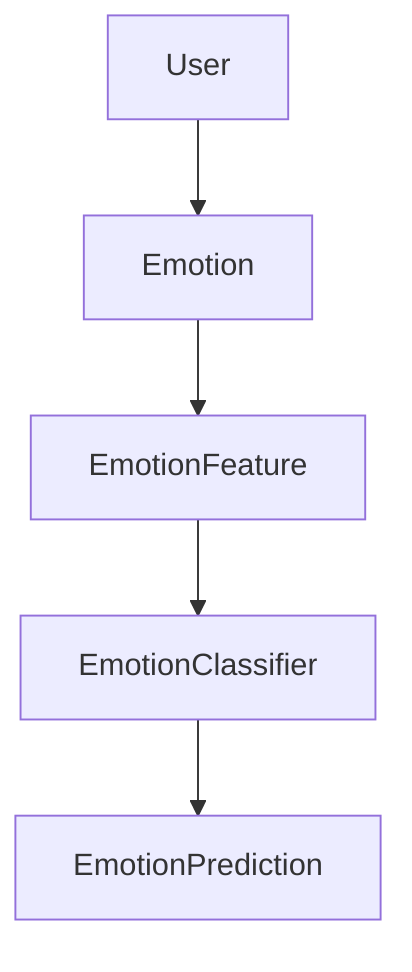
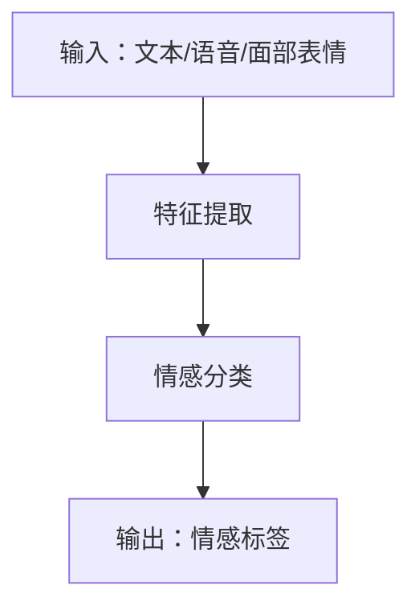
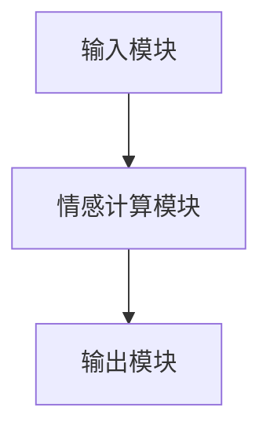

                 


# AI Agent 的情感计算：增强 LLM 的情感交互能力

---

## 关键词：
AI Agent，情感计算，LLM，人机交互，情感增强，自然语言处理，深度学习

---

## 摘要：
本文探讨了AI Agent中的情感计算技术，分析了如何通过情感计算增强大语言模型（LLM）的情感交互能力。文章首先介绍了情感计算的基本概念和核心原理，然后详细讲解了情感计算的算法实现及其在LLM中的应用。接着，通过系统设计和项目实战，展示了如何在实际场景中实现情感计算。最后，本文总结了情感计算在AI Agent中的重要性，并展望了未来的研究方向。

---

## 第1章 情感计算与AI Agent概述

### 1.1 情感计算的背景与问题背景
#### 1.1.1 情感计算的定义与概念
情感计算（Affective Computing）是一种通过计算方法分析、理解、处理和模拟人类情感的技术。它旨在使计算机系统能够感知、识别和响应人类的情感状态。

#### 1.1.2 情感计算在AI Agent中的重要性
AI Agent需要与人类进行自然的交互，情感计算为其提供了理解用户情感的能力。这使得AI Agent能够更好地响应用户的需求，提供更个性化的服务。

#### 1.1.3 情感计算的应用场景与问题描述
- **应用场景**：教育、医疗、客服、社交机器人等领域。
- **问题描述**：传统LLM在情感交互中缺乏情感理解能力，无法有效处理复杂的情感需求。

### 1.2 情感计算的核心概念与技术基础
#### 1.2.1 情感计算的基本原理
- 情感识别：通过文本、语音、面部表情等输入数据，识别用户的情感状态。
- 情感分析：基于识别的情感信息，分析用户的情感倾向。

#### 1.2.2 情感计算的技术基础
- **自然语言处理（NLP）**：用于分析文本中的情感信息。
- **机器学习**：用于训练情感分类模型。
- **深度学习**：用于处理复杂的非结构化情感数据。

#### 1.2.3 情感计算的数学模型概述
情感计算的数学模型通常包括特征提取、分类器设计和情感预测三个部分。

### 1.3 情感计算在AI Agent中的应用价值
#### 1.3.1 提升人机交互的自然性
通过理解用户情感，AI Agent能够生成更自然的回应。

#### 1.3.2 增强用户情感体验
情感计算使用户感受到AI Agent的“情感”，从而提升用户体验。

#### 1.3.3 优化AI Agent的决策能力
情感信息可以帮助AI Agent更准确地理解用户需求，从而做出更合理的决策。

### 1.4 本章小结
本章介绍了情感计算的基本概念、技术基础及其在AI Agent中的应用价值。情感计算是实现智能化人机交互的关键技术，能够显著提升AI Agent的情感交互能力。

---

## 第2章 情感计算的核心概念与联系

### 2.1 情感计算的核心概念
#### 2.1.1 情感计算的定义
情感计算是一种通过计算方法分析和模拟人类情感状态的技术。

#### 2.1.2 情感计算的主要特征
- **实时性**：快速响应用户的情感状态。
- **准确性**：准确识别用户的情感信息。
- **适应性**：根据情感信息调整交互策略。

#### 2.1.3 情感计算与其他相关概念的对比
| 概念      | 定义                                                                 | 特点               |
|-----------|----------------------------------------------------------------------|--------------------|
| 情感计算  | 分析和模拟人类情感状态的技术                                         | 高度依赖情感数据   |
| 传统计算  | 基于逻辑和规则的计算                                               | 不考虑情感因素     |

### 2.2 情感计算的属性特征对比
| 特性       | 情感计算                         | 传统计算                         |
|------------|----------------------------------|-----------------------------------|
| 输入数据   | 文本、语音、面部表情等            | 结构化数据                       |
| 输出结果   | 情感标签（如快乐、悲伤）          | 逻辑结果                         |
| 处理方式   | 非结构化数据处理                 | 结构化数据处理                   |

### 2.3 情感计算的ER实体关系图



该图展示了用户与情感计算系统之间的关系，包括情感特征提取和情感分类器的作用。

---

## 第3章 情感计算的算法原理

### 3.1 情感计算的算法概述
#### 3.1.1 情感计算的主要算法
- **基于规则的算法**：通过预定义规则进行情感分类。
- **基于机器学习的算法**：使用监督学习训练情感分类器。
- **基于深度学习的算法**：利用神经网络处理复杂的情感数据。

#### 3.1.2 情感计算算法的优缺点对比
| 算法类型      | 优点                              | 缺点                              |
|---------------|-----------------------------------|-----------------------------------|
| 基于规则      | 实现简单，可解释性高              | 无法处理复杂情感数据              |
| 基于机器学习  | 可处理复杂数据，性能较高          | 需大量标注数据，计算资源消耗大    |
| 基于深度学习  | 处理能力强，性能优异              | 实现复杂，可解释性低              |

### 3.2 情感计算的数学模型

#### 3.2.1 情感分类的数学模型
情感分类通常采用支持向量机（SVM）或随机森林（Random Forest）等模型。例如，使用SVM进行二分类情感分析的数学模型如下：

$$
\text{SVM目标函数: } \min_{w,b,\xi} \frac{1}{2}||w||^2 + C\sum_{i=1}^n \xi_i
$$

其中，$w$是权重向量，$b$是偏置，$\xi_i$是松弛变量，$C$是惩罚系数。

### 3.3 情感计算的流程图



---

## 第4章 情感计算在LLM中的应用

### 4.1 LLM的结构与情感交互
#### 4.1.1 LLM的内部机制
大语言模型通过多层神经网络处理输入文本，生成输出结果。

#### 4.1.2 情感计算在LLM中的实现
通过在LLM中引入情感计算模块，增强其情感交互能力。

#### 4.1.3 情感增强的LLM案例
使用预训练的情感增强模型，如GPT-3的变体，提升情感交互的准确性。

---

## 第5章 系统设计与实现

### 5.1 系统设计概述
#### 5.1.1 系统架构
- **输入模块**：接收用户输入。
- **情感计算模块**：处理输入数据，生成情感标签。
- **输出模块**：根据情感标签生成响应。

#### 5.1.2 系统架构图



### 5.2 系统实现
#### 5.2.1 环境安装
安装必要的库，如`scikit-learn`、`transformers`等。

#### 5.2.2 核心代码实现
```python
from sklearn.svm import SVC
from sklearn.feature_extraction.text import TfidfVectorizer

# 初始化模型
vectorizer = TfidfVectorizer()
clf = SVC()

# 训练模型
X_train = vectorizer.fit_transform(corpus)
clf.fit(X_train, labels)

# 预测情感
X_test = vectorizer.transform([text])
predicted_emotion = clf.predict(X_test)
```

#### 5.2.3 案例分析
分析一个实际案例，如客服场景中的情感识别。

---

## 第6章 总结与展望

### 6.1 总结
情感计算是实现智能化人机交互的关键技术，能够显著提升AI Agent的情感交互能力。

### 6.2 未来的研究方向
- 深度学习在情感计算中的应用。
- 多模态情感计算的研究。
- 情感计算在边缘计算中的应用。

### 6.3 注意事项
在实际应用中，需要注意数据隐私和模型的可解释性问题。

### 6.4 最佳实践 Tips
- 使用高质量的情感标注数据。
- 结合领域知识优化情感计算模型。

---

## 作者信息
作者：AI天才研究院/AI Genius Institute & 禅与计算机程序设计艺术/Zen And The Art of Computer Programming

---

以上是《AI Agent 的情感计算：增强 LLM 的情感交互能力》的技术博客文章的详细大纲和内容。

