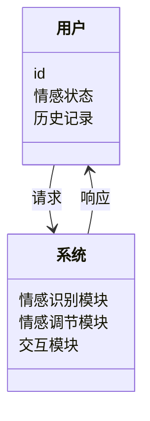
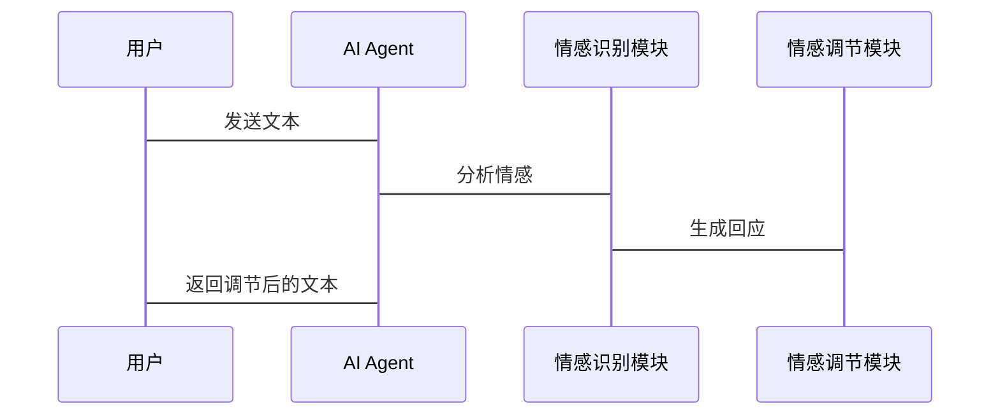

                 


# AI Agent 的情感调节：利用 LLM 进行情绪管理

> 关键词：AI Agent, 情感调节, LLM, 情绪管理, 人机交互, 大语言模型

> 摘要：本文深入探讨了AI Agent 的情感调节方法，重点分析了如何利用大语言模型（LLM）进行情绪管理。文章从背景介绍、核心概念、算法原理、系统架构到项目实战，全面解析了情感调节在AI Agent 中的重要性与实现方法。通过详细的技术分析与案例解读，展示了LLM 在情感调节中的独特优势与应用场景。

---

# 第一部分: AI Agent 的情感调节背景与核心概念

# 第1章: AI Agent 与情感调节概述

## 1.1 情感调节的定义与重要性
### 1.1.1 情感调节的定义
情感调节是指个体通过认知或行为手段，主动改变自己的情绪状态，以适应环境或实现目标的过程。

### 1.1.2 情感调节在人机交互中的作用
在人机交互中，情感调节帮助AI Agent更好地理解用户情绪，从而提供更智能、更个性化的服务。

### 1.1.3 AI Agent 的情感调节目标
AI Agent 的情感调节目标包括：识别用户情绪、调节用户情绪、保持情绪稳定等。

## 1.2 情感调节的背景与问题背景
### 1.2.1 当前人机交互中的情感管理问题
传统的人机交互系统难以理解用户的情感需求，导致用户体验差。

### 1.2.2 AI Agent 在情感调节中的潜力
AI Agent 可以通过学习和推理，主动调节用户情绪，提升交互体验。

### 1.2.3 情感调节的边界与外延
情感调节的边界包括：不干预用户的自主情绪管理、不泄露用户隐私等。

## 1.3 情感调节的核心概念与结构
### 1.3.1 情感调节的核心要素
情感调节的核心要素包括：情绪识别、情绪分析、情绪生成等。

### 1.3.2 情感调节与AI Agent 的关系
情感调节是AI Agent实现智能化交互的重要组成部分。

### 1.3.3 情感调节的实现机制
情感调节的实现机制包括：基于规则的调节、基于模型的调节等。

## 1.4 本章小结
本章介绍了情感调节的定义、重要性以及在AI Agent 中的应用，为后续内容奠定了基础。

---

# 第二部分: LLM 在情感调节中的核心概念与联系

# 第2章: LLM 的情感调节原理

## 2.1 LLM 的基本原理
### 2.1.1 大语言模型的定义与特点
大语言模型（LLM）是一种基于深度学习的自然语言处理模型，具有强大的语义理解和生成能力。

### 2.1.2 LLM 在情感调节中的优势
LLM 的优势包括：语义理解能力强、生成能力好、可扩展性高。

### 2.1.3 LLM 的情感理解能力
LLM 通过训练数据学习情感特征，能够准确识别和分类用户情感。

## 2.2 情感调节的核心概念与联系
### 2.2.1 情感调节的核心概念
情感调节的核心概念包括：情感识别、情感分类、情感生成等。

### 2.2.2 情感调节与LLM 的属性特征对比
```mermaid
| 情感调节 | LLM 情感处理 |
|---------|-------------|
| 情感检测 | 情感分类     |
| 情感分析 | 情感生成     |
| 情感记忆 | 情感反馈     |
```

### 2.2.3 情感调节的 ER 实体关系图
```mermaid
entity 情感状态 {
  id
  情感类型
  情感强度
}
entity 用户输入 {
  id
  输入内容
  情感标签
}
relation 情感状态与用户输入的关系 {
  情感状态 -> 用户输入
}
```

## 2.3 本章小结
本章分析了LLM 在情感调节中的优势与实现机制，为后续算法实现提供了理论基础。

---

# 第三部分: 情感调节的算法原理与数学模型

# 第3章: 情感调节的算法原理

## 3.1 情感调节算法的基本原理
### 3.1.1 情感调节算法的输入与输出
输入：用户文本或语音；输出：情感调节后的文本或语音。

### 3.1.2 情感调节算法的核心步骤
步骤包括：情感识别、情感分析、情感生成。

## 3.2 情感调节算法的实现步骤
### 3.2.1 情感识别
使用LLM 进行情感分类，识别用户当前情绪。

### 3.2.2 情感分析
分析用户情感强度，确定调节方向。

### 3.2.3 情感生成
根据情感分析结果，生成调节性文本或语音。

## 3.3 情感调节算法的数学模型
### 3.3.1 情感分类的数学模型
$$P(y|x) = \text{softmax}(Wx + b)$$

### 3.3.2 情感生成的数学模型
$$P(y|x) = \text{softmax}(Wx + b)$$

## 3.4 本章小结
本章详细讲解了情感调节算法的实现步骤与数学模型，为后续系统设计提供了技术支持。

---

# 第四部分: 系统分析与架构设计方案

# 第4章: 情感调节系统的分析与设计

## 4.1 问题场景介绍
用户与AI Agent 交互过程中，系统需要实时识别并调节用户情绪。

## 4.2 系统功能设计
### 4.2.1 领域模型设计


### 4.2.2 系统架构设计


### 4.2.3 系统接口设计
接口包括：用户输入接口、系统响应接口。

### 4.2.4 系统交互设计


## 4.3 本章小结
本章通过系统设计与架构分析，展示了情感调节系统的实现方案。

---

# 第五部分: 项目实战

# 第5章: 情感调节项目实战

## 5.1 环境安装
安装Python、LLM 模型（如GPT-3）以及相关库。

## 5.2 核心代码实现
### 5.2.1 情感识别代码
```python
def emotional_analysis(text):
    # 使用LLM 进行情感分类
    model = load_model('gpt-3')
    response = model.generate(text)
    return response['label']
```

### 5.2.2 情感生成代码
```python
def emotional_response(user_emotion):
    # 根据用户情感生成调节性文本
    if user_emotion == 'sad':
        return "别担心，一切都会好的。"
    elif user_emotion == 'angry':
        return "请冷静下来，我们一起来解决问题。"
```

## 5.3 代码应用解读与分析
通过具体代码示例，展示了情感调节功能的实现过程。

## 5.4 案例分析
### 5.4.1 案例1
用户输入：“我今天很生气。”
系统识别：生气
系统回应：“请冷静下来，我们一起来解决问题。”

### 5.4.2 案例2
用户输入：“我感到非常难过。”
系统识别：难过
系统回应：“别担心，一切都会好的。”

## 5.5 项目小结
本章通过具体案例分析，展示了情感调节功能的实际应用。

---

# 第六部分: 最佳实践与总结

# 第6章: 最佳实践与总结

## 6.1 最佳实践 tips
- 定期更新模型，提升情感识别准确率。
- 根据用户反馈优化情感调节策略。

## 6.2 小结
情感调节是AI Agent 实现智能化交互的关键技术，本文通过理论分析与实践案例，展示了LLM 在情感调节中的应用。

## 6.3 注意事项
- 保护用户隐私，避免数据泄露。
- 设定合理的情感调节边界，尊重用户自主性。

## 6.4 拓展阅读
推荐阅读相关领域的最新研究论文和书籍，持续关注情感计算与人机交互技术的发展。

---

# 作者：AI天才研究院/AI Genius Institute & 禅与计算机程序设计艺术 /Zen And The Art of Computer Programming

