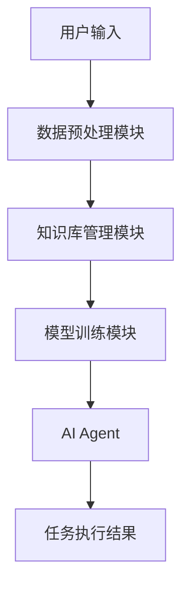

                 


# AI Agent 的持续学习：实现 LLM 的终身学习能力

---

## 关键词

AI Agent, 持续学习, LLM, 终身学习能力, 机器学习, 自适应学习

---

## 摘要

随着人工智能技术的快速发展，AI Agent（智能体）在各个领域的应用越来越广泛。然而，传统的AI Agent在面对动态变化的环境和复杂任务时，往往难以持续适应和学习。为了克服这一挑战，实现AI Agent的持续学习能力，特别是与大型语言模型（LLM）相结合，成为当前研究的热点。本文将从背景介绍、核心概念、算法原理、系统架构设计、项目实战等方面展开讨论，深入剖析AI Agent如何通过持续学习实现LLM的终身学习能力。文章不仅提供了理论支持，还通过具体案例展示了实现方法，为读者提供了全面的技术指导。

---

## 第一部分：背景介绍

### 第1章：AI Agent 的基本概念

#### 1.1 AI Agent 的定义与特点

AI Agent（人工智能智能体）是指在计算机系统中，能够感知环境、自主决策并执行任务的实体。它具有以下特点：

- **自主性**：AI Agent能够在没有外部干预的情况下独立运作。
- **反应性**：能够实时感知环境并做出反应。
- **目标导向性**：通过设定目标来驱动行为。
- **学习能力**：能够通过经验改进自身的性能。

#### 1.2 持续学习的必要性

在动态变化的环境中，AI Agent需要不断学习新知识和技能以适应新的任务和挑战。持续学习是一种能够让模型在新数据上不断优化性能的机制，具有以下优势：

- **适应性**：能够适应新任务和环境的变化。
- **长期稳定性**：通过持续学习，模型性能能够长期保持稳定。
- **泛化能力**：能够在不同领域和任务中表现出色。

#### 1.3 LLM 与持续学习的关系

大型语言模型（LLM）是自然语言处理领域的重要技术，具有强大的文本生成和理解能力。通过持续学习，LLM能够不断更新其知识库，提升其在复杂任务中的表现。AI Agent与LLM的结合，使得AI Agent具备了更强的语言理解和生成能力，从而能够更好地完成各种复杂任务。

---

## 第二部分：核心概念与联系

### 第2章：AI Agent 的持续学习机制

#### 2.1 持续学习的核心原理

持续学习是一种机器学习范式，允许模型在新数据流上不断学习和更新。其核心机制包括：

- **经验重放**：将过去的经验存储在记忆中，并在后续任务中重放这些经验以优化模型。
- **知识蒸馏**：通过教师模型将知识传递给学生模型，从而实现知识的持续更新。

#### 2.2 持续学习与终身学习的对比

| 持续学习                | 终身学习                  |
|-------------------------|---------------------------|
| 数据流形式              | 离散任务或连续任务        |
| 模型更新方式            | 累计学习，逐步优化         |
| 适应性                  | 更强的环境适应能力        |

---

## 第三部分：算法原理

### 第3章：AI Agent 的持续学习算法

#### 3.1 经验重放机制

经验重放是一种通过存储和重放过去的经验来优化模型的算法。其核心步骤如下：

1. **经验存储**：将每个经验（状态、动作、奖励）存储在记忆库中。
2. **经验回放**：随机抽取部分经验进行训练，以减少相关性。
3. **模型更新**：基于抽样的经验更新模型参数。

#### 3.2 知识蒸馏算法

知识蒸馏是一种通过教师模型指导学生模型学习的知识转移技术。其核心步骤如下：

1. **教师模型训练**：在大规模数据上训练教师模型。
2. **学生模型学习**：通过软目标分布进行学习，提取教师模型的知识。
3. **模型优化**：通过蒸馏损失函数优化学生模型。

#### 3.3 算法实现代码示例

```python
import numpy as np
import torch
import torch.nn as nn

# 经验重放实现
class ExperienceReplayMemory:
    def __init__(self, capacity):
        self.capacity = capacity
        self.memory = []
    
    def push(self, transition):
        self.memory.append(transition)
        if len(self.memory) > self.capacity:
            self.memory.pop(0)
    
    def sample(self, batch_size):
        return np.random.choice(self.memory, batch_size)

# 知识蒸馏实现
class TeacherModel(nn.Module):
    def __init__(self):
        super().__init__()
        self.linear = nn.Linear(10, 5)
    
    def forward(self, x):
        return torch.softmax(x, dim=1)

class StudentModel(nn.Module):
    def __init__(self):
        super().__init__()
        self.linear = nn.Linear(10, 5)
    
    def forward(self, x):
        return torch.softmax(x, dim=1)

def distillation_loss(y_pred, y_teacher, alpha=0.5):
    return (1-alpha)*nn.CrossEntropyLoss()(y_pred, y_true) + alpha*nn.KLDivLoss()(y_pred, y_teacher)
```

---

## 第四部分：系统分析与架构设计

### 第4章：基于 LLM 的 AI Agent 系统设计

#### 4.1 系统功能模块设计

- **数据预处理模块**：负责对输入数据进行清洗和转换。
- **模型训练模块**：基于持续学习算法训练AI Agent。
- **知识库管理模块**：存储和管理模型的知识库。
- **任务执行模块**：根据任务需求执行相应的操作。

#### 4.2 系统架构设计



---

## 第五部分：项目实战

### 第5章：实现一个具备持续学习能力的 AI Agent

#### 5.1 环境安装

```bash
pip install numpy torch matplotlib
```

#### 5.2 核心代码实现

```python
import torch
import torch.nn as nn
import torch.optim as optim

class AIAgent(nn.Module):
    def __init__(self, input_size, hidden_size, output_size):
        super().__init__()
        self.fc1 = nn.Linear(input_size, hidden_size)
        self.fc2 = nn.Linear(hidden_size, output_size)
    
    def forward(self, x):
        x = torch.relu(self.fc1(x))
        x = self.fc2(x)
        return x

def train(agent, optimizer, criterion, data_loader):
    for epoch in range(num_epochs):
        for inputs, labels in data_loader:
            outputs = agent(inputs)
            loss = criterion(outputs, labels)
            loss.backward()
            optimizer.step()
            optimizer.zero_grad()
```

#### 5.3 代码解读与分析

- **AIAgent 类**：定义了一个简单的前馈神经网络模型。
- **train 函数**：实现了模型的训练过程，包括前向传播、计算损失、反向传播和优化。

---

## 第六部分：总结与展望

### 第6章：总结与展望

#### 6.1 总结

本文详细探讨了AI Agent的持续学习能力，特别是与大型语言模型结合的实现方法。通过理论分析和实际案例，展示了如何通过经验重放和知识蒸馏等算法实现AI Agent的持续学习。

#### 6.2 展望

未来的研究方向包括更高效的持续学习算法、多任务学习的应用以及更强大的知识蒸馏技术。这些研究将推动AI Agent在更多领域中的应用。

---

## 作者

作者：AI天才研究院/AI Genius Institute & 禅与计算机程序设计艺术 /Zen And The Art of Computer Programming

---

通过以上内容，读者可以全面了解AI Agent的持续学习能力及其在LLM中的应用。文章不仅提供了理论支持，还通过代码示例和系统设计展示了实现方法，为读者提供了全面的技术指导。

