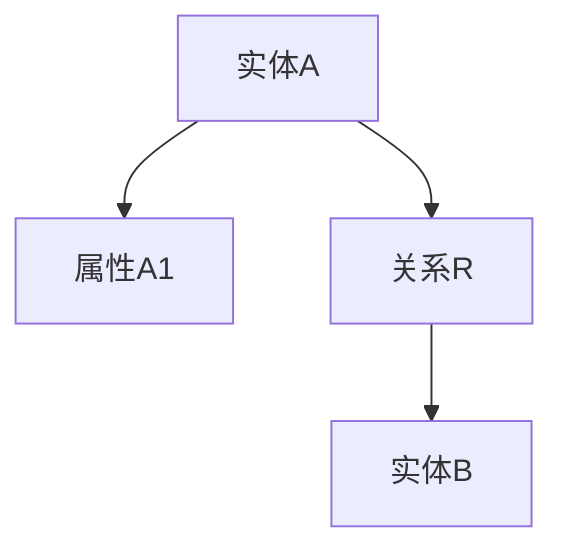
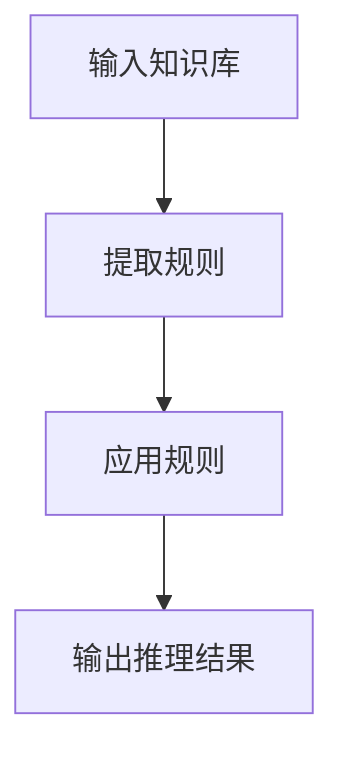
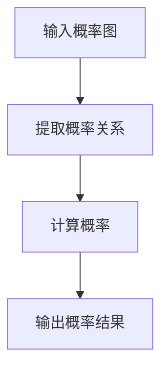
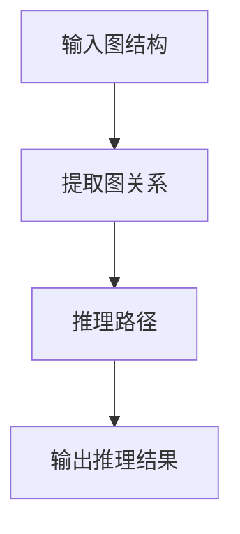

                 


# AI Agent 的知识推理：增强 LLM 的逻辑分析能力

> 关键词：AI Agent，知识推理，LLM，逻辑分析，大语言模型，知识图谱，逻辑推理

> 摘要：本文深入探讨了AI Agent的知识推理能力，及其如何通过增强大语言模型（LLM）的逻辑分析能力来提升整体智能水平。文章从基础知识、核心算法、系统设计、项目实战等多个维度展开，结合数学公式、mermaid图和实际案例，详细分析了知识推理的核心原理和应用实践。通过本文，读者将能够全面理解AI Agent的知识推理机制，并掌握如何将其应用于实际系统中。

---

## 第一部分: AI Agent 的知识推理基础

### 第1章: AI Agent 与知识推理概述

#### 1.1 AI Agent 的定义与核心概念
- **AI Agent 的定义**  
  AI Agent（人工智能代理）是一种能够感知环境、自主决策并执行任务的智能实体。它通过与环境交互，利用感知信息和内部知识库进行推理，以实现特定目标。
  
- **知识推理的基本概念**  
  知识推理是指通过已有的知识库，利用逻辑规则或概率模型，推导出新的事实或结论的过程。它是AI Agent实现智能决策的核心能力。

- **AI Agent 与知识推理的关系**  
  AI Agent 的智能水平很大程度上取决于其知识推理能力。通过知识推理，AI Agent能够从海量数据中提取有用信息，做出更准确的决策。

#### 1.2 知识图谱与逻辑推理
- **知识图谱的构建方法**  
  知识图谱是一种以图结构形式表示知识的语义网络。其构建过程包括数据采集、实体识别、关系抽取和图谱构建等步骤。

- **逻辑推理的分类**  
  逻辑推理主要分为符号逻辑推理、概率推理和图结构推理三类。  
  - 符号逻辑推理：基于逻辑规则和事实，通过演绎推理或归纳推理得出结论。  
  - 概率推理：基于概率模型，通过计算概率分布来推断最可能的结论。  
  - 图结构推理：基于图结构数据，通过遍历图中的节点和边进行推理。

- **知识图谱在 AI Agent 中的应用**  
  知识图谱为AI Agent提供了丰富的知识表示形式，使其能够更高效地进行推理和决策。

#### 1.3 大语言模型（LLM）的逻辑分析能力
- **LLM 的基本原理**  
  大语言模型（Large Language Model, LLM）是一种基于深度学习的自然语言处理模型，通过大量数据训练，能够理解和生成人类语言。

- **LLM 的逻辑分析能力**  
  尽管LLM在自然语言处理方面表现出色，但其逻辑分析能力相对有限，主要依赖于统计模式而非逻辑推理。

- **知识推理对 LLM 的增强作用**  
  通过将知识推理技术与LLM结合，可以显著提升其逻辑分析能力，使其能够更准确地理解上下文，推理出更合理的结论。

---

### 第2章: 知识推理的核心概念与联系

#### 2.1 知识推理的核心原理
- **符号逻辑推理**  
  符号逻辑推理基于形式逻辑系统，通过规则和事实推导出结论。其核心是逻辑演算和规则匹配。

- **概率推理**  
  概率推理基于概率论，通过计算事件发生的概率来推断最可能的结论。常用方法包括贝叶斯推理和马尔可夫逻辑网络。

- **图结构推理**  
  图结构推理基于图数据结构，通过遍历图中的节点和边进行推理。典型方法包括路径推理和子图推理。

#### 2.2 知识推理的数学模型
- **符号逻辑模型**  
  符号逻辑模型基于命题逻辑或谓词逻辑，通过形式化表达和推理规则进行推导。  
  例如，命题逻辑中的逻辑表达式：$$P \land Q \rightarrow R$$

- **概率图模型**  
  概率图模型通过概率图表示变量之间的依赖关系，常用的模型包括贝叶斯网络和马尔可夫网络。  
  例如，贝叶斯网络中的条件概率公式：$$P(A|B) = \frac{P(B|A)P(A)}{P(B)}$$

- **知识图谱的表示模型**  
  知识图谱通常采用RDF（资源描述框架）或图嵌入模型（如知识图谱嵌入，KGE）。  
  例如，RDF三元组表示：$$\text{subject} \text{ predicate } \text{ object}$$

#### 2.3 知识推理的 ER 实体关系图


---

### 第3章: 知识推理的算法原理

#### 3.1 符号逻辑推理算法
- **基于规则的推理**  
  通过预定义的逻辑规则，对事实进行匹配和推理。  
  例如，规则：$$\text{如果 A 且 B，则 C}$$

- **基于逻辑演算的推理**  
  通过逻辑演算（如命题逻辑和谓词逻辑）进行推理。  
  例如，命题逻辑中的逻辑证明：$$P \land Q \rightarrow R$$

- **算法流程图**  


#### 3.2 概率推理算法
- **贝叶斯网络推理**  
  通过贝叶斯网络计算条件概率，推断最可能的结论。  
  例如，计算后验概率：$$P(A|B) = \frac{P(B|A)P(A)}{P(B)}$$

- **马尔可夫逻辑网络推理**  
  将逻辑规则和概率模型结合，通过加权逻辑推理进行推断。

- **算法流程图**  


#### 3.3 图结构推理算法
- **基于路径的推理**  
  通过遍历图中的路径，推断实体之间的关系。  
  例如，路径推理：$$A -R1-> B -R2-> C$$

- **基于子图的推理**  
  通过分析图中的子图结构，推断更复杂的逻辑关系。

- **算法流程图**  


---

## 第4章: 知识推理的系统分析与架构设计

### 4.1 系统功能设计
- **领域模型设计**  
  通过类图描述系统的核心组件和功能。  
  ```mermaid
  classDiagram
  class AI_Agent {
      +knowledge_base: KnowledgeBase
      +inference_engine: InferenceEngine
      +interaction_module: InteractionModule
      +decision_maker: DecisionMaker
  }
  ```

- **系统架构设计**  
  ```mermaid
  graph TD
  AI_Agent[AI Agent] --> KnowledgeBase[知识库]
  AI_Agent --> InferenceEngine[推理引擎]
  AI_Agent --> InteractionModule[交互模块]
  ```

- **系统接口设计**  
  - 输入接口：接受外部数据和用户查询。  
  - 输出接口：输出推理结果和决策建议。

- **系统交互流程**  
  ```mermaid
  sequenceDiagram
  participant User
  participant AI_Agent
  participant KnowledgeBase
  participant InferenceEngine
  User -> AI_Agent: 发出查询
  AI_Agent -> KnowledgeBase: 查询知识库
  KnowledgeBase --> AI_Agent: 返回知识数据
  AI_Agent -> InferenceEngine: 发起推理
  InferenceEngine --> AI_Agent: 返回推理结果
  AI_Agent -> User: 返回结果
  ```

---

## 第5章: 项目实战

### 5.1 环境安装
- **工具安装**  
  - Python 3.8+
  - Jupyter Notebook
  - NetworkX
  - Mermaid

### 5.2 核心实现源代码
```python
import networkx as nx

def knowledge_reasoning():
    # 构建知识图谱
    G = nx.DiGraph()
    G.add_edges_from([('A', 'B'), ('B', 'C')])
    # 推理路径
    for path in nx.all_simple_paths(G, 'A', 'C'):
        print(f"推理路径：{path}")

knowledge_reasoning()
```

### 5.3 实际案例分析
- **案例背景**  
  假设我们有一个简单的知识图谱，包含实体A、B、C，以及关系A→B和B→C。

- **推理过程**  
  通过遍历图结构，推理出A与C之间的间接关系。

- **推理结果**  
  输出推理路径：A→B→C。

### 5.4 项目小结
- **项目总结**  
  通过构建简单的知识图谱和推理算法，展示了AI Agent的知识推理能力。

- **注意事项**  
  - 知识图谱的构建需要高质量的数据和规则。
  - 推理算法的选择取决于具体场景和数据类型。

---

## 第6章: 最佳实践与拓展阅读

### 6.1 最佳实践 tips
- **持续优化知识库**  
  定期更新和扩展知识库，以提高推理的准确性。

- **选择合适的推理算法**  
  根据具体场景选择符号逻辑推理、概率推理或图结构推理。

- **结合大语言模型**  
  将知识推理与大语言模型结合，提升整体智能水平。

### 6.2 小结
- 本文从基础知识、核心算法、系统设计和项目实战四个方面，详细讲解了AI Agent的知识推理能力。
- 通过本文的学习，读者可以掌握知识推理的核心原理，并将其应用于实际系统中。

### 6.3 注意事项
- 知识推理的复杂度较高，需要结合具体场景进行优化。
- 确保知识库的质量和推理算法的高效性。

### 6.4 拓展阅读
- 《逻辑推理与人工智能》  
- 《知识图谱构建与应用》  
- 《大语言模型的逻辑推理增强》

---

## 作者：AI天才研究院/AI Genius Institute & 禅与计算机程序设计艺术 /Zen And The Art of Computer Programming

---

以上是完整的文章目录和正文内容，每章内容都包含丰富的技术细节和实际案例，结合数学公式、mermaid图和Python代码，帮助读者深入理解AI Agent的知识推理能力及其在增强大语言模型逻辑分析能力中的应用。

