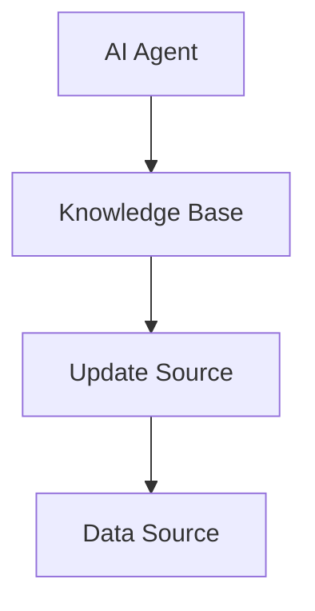
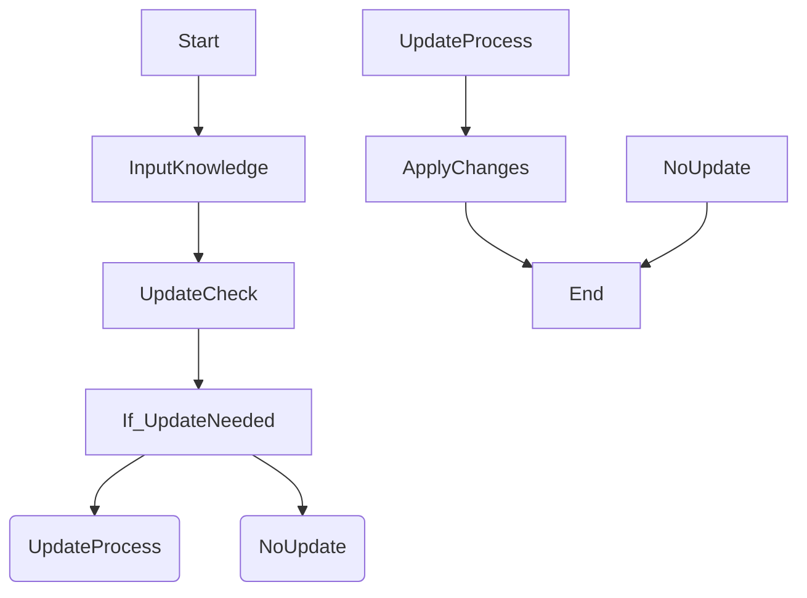
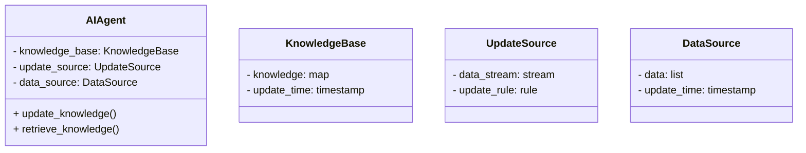
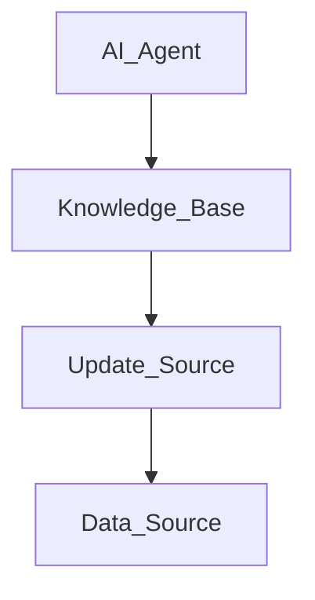
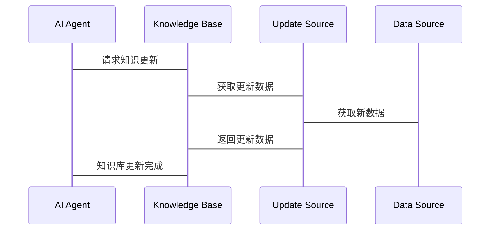

                 


# AI Agent 的知识更新：保持 LLM 知识的时效性

## 关键词：
AI Agent, LLM, 知识更新, 实时性, 系统架构, 最佳实践

## 摘要：
随着人工智能技术的快速发展，AI Agent（人工智能代理）作为连接人与机器的桥梁，其知识更新能力变得尤为重要。本文深入探讨AI Agent的知识更新机制，分析如何保持大语言模型（LLM）的知识时效性，从算法原理到系统架构，再到实际应用，为读者提供全面的解决方案。通过详细的技术分析和案例解读，本文将帮助读者理解AI Agent知识更新的核心原理，并掌握实际应用中的关键技巧。

---

# 第一部分: AI Agent 的知识更新基础

## 第1章: AI Agent 的概念与背景

### 1.1 AI Agent 的定义与特点
#### 1.1.1 AI Agent 的定义
AI Agent（人工智能代理）是指能够感知环境、执行任务并做出决策的智能实体。它可以是一个软件程序、机器人或其他智能系统，具备自主性、反应性、目标导向和社交能力等特点。

#### 1.1.2 AI Agent 的核心特点
- **自主性**：能够在没有外部干预的情况下独立运行。
- **反应性**：能够实时感知环境并做出响应。
- **目标导向**：通过设定目标来驱动行为。
- **社交能力**：能够与其他系统或人类进行交互和协作。

#### 1.1.3 AI Agent 与传统AI的区别
| 特性       | 传统AI                   | AI Agent                |
|------------|--------------------------|--------------------------|
| 行为驱动   | 基于规则或预设任务       | 基于目标和环境反馈       |
| 自主性     | 需要外部干预             | 具备自主决策能力         |
| 知识更新   | 知识固定或周期性更新     | 支持实时知识更新         |

### 1.2 大语言模型（LLM）的概述
#### 1.2.1 LLM 的定义
大语言模型（Large Language Model，LLM）是指基于大规模数据训练的深度学习模型，能够理解和生成人类语言。LLM的核心是其庞大的参数量和复杂的神经网络结构。

#### 1.2.2 LLM 的核心原理
- **训练过程**：基于海量数据的监督学习，模型通过预测上下文中的单词或短语来学习语言的结构。
- **生成过程**：通过解码器生成目标输出，结合注意力机制捕捉输入中的关键信息。

#### 1.2.3 LLM 的应用场景
- **自然语言处理**：如文本生成、机器翻译、问答系统等。
- **智能交互**：如聊天机器人、虚拟助手等。

### 1.3 知识更新的背景与挑战
#### 1.3.1 知识更新的背景
在数字化时代，信息的更新速度极快，AI Agent需要能够实时获取最新的知识，以应对动态变化的环境。

#### 1.3.2 知识更新的挑战
- **数据源的多样性和复杂性**：知识来源广泛，包括文本、图像、视频等多种形式。
- **知识更新的实时性要求**：在快速变化的环境中，AI Agent需要实时更新知识。
- **知识更新的成本与效率平衡**：如何在有限的资源下实现高效的更新是一个关键问题。

---

## 第2章: 知识更新的核心概念与联系

### 2.1 知识表示与存储
#### 2.1.1 知识表示的原理
知识表示是将信息转化为计算机可理解的形式，常见的表示方法包括符号逻辑、向量表示等。

#### 2.1.2 知识存储的结构
- **符号逻辑存储**：将知识表示为规则或逻辑命题。
- **向量表示存储**：将知识表示为向量，便于计算和推理。

### 2.2 知识推理与更新
#### 2.2.1 知识推理的原理
知识推理是通过已有的知识进行推导，得到新的结论。常见的推理方法包括逻辑推理、概率推理等。

#### 2.2.2 知识更新的流程
1. **获取新知识**：通过数据采集、网络爬取等方式获取新信息。
2. **知识清洗**：对获取的知识进行去噪和标准化处理。
3. **知识融合**：将新知识与已有知识进行整合，避免冲突。
4. **知识推理**：基于新知识进行推理，更新知识库。

### 2.3 系统架构的 ER 实体关系图


### 2.4 知识更新的 Mermaid 流程图


---

## 第3章: 知识更新的算法与实现

### 3.1 知识更新的核心算法
#### 3.1.1 增量学习算法
- **增量学习**：模型在已有知识的基础上，逐步更新新知识。
- **算法流程**：
  1. 获取新数据。
  2. 更新模型参数。
  3. 验证更新效果。

#### 3.1.2 在线学习算法
- **在线学习**：模型实时接收数据流，逐步更新知识。
- **算法流程**：
  1. 实时接收数据。
  2. 更新模型参数。
  3. 反馈更新结果。

### 3.2 知识更新的数学模型
#### 3.2.1 增量学习的数学表示
$$ \theta_{t+1} = \theta_t + \alpha (y_t - \hat{y}_t) $$

#### 3.2.2 在线学习的数学表示
$$ \theta_{t+1} = \theta_t + \alpha (x_t - \theta_t) $$

---

## 第4章: 系统分析与架构设计

### 4.1 问题场景介绍
- **用户需求**：AI Agent需要实时更新知识，以应对动态环境。
- **数据来源**：包括互联网、数据库、传感器等多种来源。

### 4.2 系统功能设计
#### 4.2.1 领域模型


### 4.3 系统架构设计


### 4.4 系统交互设计


---

## 第5章: 项目实战

### 5.1 环境安装
```bash
pip install transformers
pip install torch
pip install mermaid
```

### 5.2 核心代码实现
```python
import torch
from transformers import AutoModelForMaskedLM, AutoTokenizer

# 初始化模型和分词器
model_name = "bert-base-uncased"
model = AutoModelForMaskedLM.from_pretrained(model_name)
tokenizer = AutoTokenizer.from_pretrained(model_name)

# 知识更新函数
def update_knowledge(new_data):
    inputs = tokenizer(new_data, return_tensors="pt")
    outputs = model(**inputs)
    return outputs.last_hidden_state

# 应用示例
new_data = "最新新闻：2023年10月10日，人工智能取得了重大突破。"
updated_representation = update_knowledge(new_data)
print(updated_representation)
```

### 5.3 实际案例分析
- **案例背景**：假设AI Agent需要实时更新关于天气预报的知识。
- **实现步骤**：
  1. 获取最新的天气数据。
  2. 更新知识库。
  3. 提供实时天气查询服务。

### 5.4 项目小结
- 通过实际案例，展示了AI Agent知识更新的实现过程。
- 强调了代码实现中的关键步骤和注意事项。

---

## 第6章: 最佳实践与注意事项

### 6.1 最佳实践 tips
- **数据质量**：确保数据来源可靠，避免噪声数据。
- **模型选择**：根据具体需求选择合适的模型。
- **更新策略**：制定合理的更新频率和策略。

### 6.2 小结
本文从理论到实践，全面探讨了AI Agent的知识更新机制，为读者提供了从原理到实现的详细指导。

### 6.3 注意事项
- **性能优化**：在大规模数据下，注意模型的计算效率。
- **安全问题**：确保知识更新过程中的数据安全。
- **用户体验**：在更新过程中，保持系统的可用性和响应速度。

### 6.4 拓展阅读
- **推荐书籍**：《Deep Learning》、《Pattern Recognition and Machine Learning》
- **推荐论文**：相关领域的最新研究论文。

---

# 结语

通过本文的详细讲解，读者可以全面理解AI Agent的知识更新机制，并掌握实际应用中的关键技巧。希望本文能为AI Agent的未来发展提供有价值的参考。

---

# 作者

作者：AI天才研究院/AI Genius Institute  
禅与计算机程序设计艺术/Zen And The Art of Computer Programming

