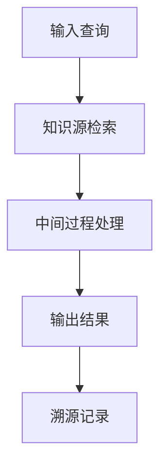
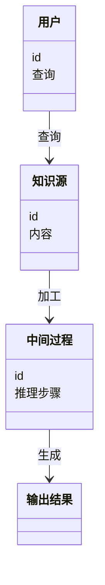
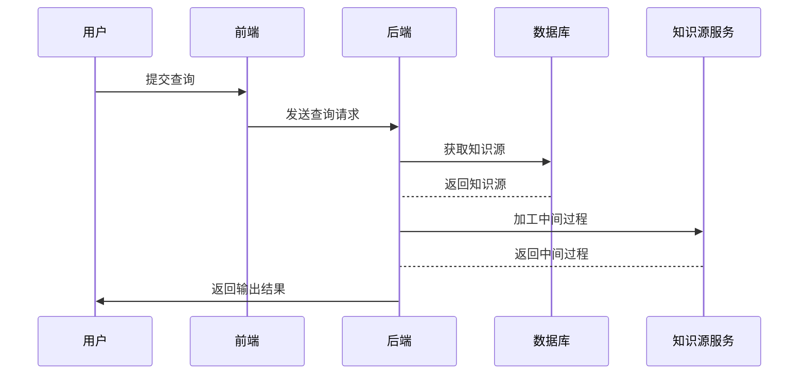

                 


# AI Agent 的知识溯源：提高 LLM 输出的可追溯性

## 关键词：AI Agent, LLM, 知识溯源, 可追溯性, 自然语言处理, 系统架构设计, 项目实战

## 摘要

随着大语言模型（LLM）的广泛应用，其输出的可追溯性问题日益重要。本文深入探讨了AI Agent在知识溯源中的作用，分析了知识溯源的核心概念、算法原理、系统架构设计，并通过实际案例展示了如何在项目中实现知识的可追溯性。文章结构清晰，从理论到实践，帮助读者全面理解并应用知识溯源技术。

---

# 第一部分: AI Agent与知识溯源的背景

## 第1章: AI Agent与知识溯源的背景

### 1.1 AI Agent的核心概念

#### 1.1.1 AI Agent的定义
AI Agent（人工智能代理）是指能够感知环境、自主决策并执行任务的智能实体。它可以基于规则、基于模型或混合型，广泛应用于智能助手、推荐系统等领域。

#### 1.1.2 AI Agent的主要类型
- **基于规则的AI Agent**：通过预定义的规则进行决策，适用于简单任务。
- **基于模型的AI Agent**：利用机器学习模型进行复杂决策，适用于动态环境。
- **混合型AI Agent**：结合规则和模型，适用于复杂场景。

#### 1.1.3 AI Agent的应用场景
- 智能助手（如Siri、Alexa）
- 自动交易系统
- 智能客服

### 1.2 LLM的输出问题与知识溯源的重要性

#### 1.2.1 LLM的输出问题概述
LLM在生成内容时，可能存在输出不可追溯的问题，导致结果难以验证。例如，在法律咨询中，输出的依据不明确，可能导致法律纠纷。

#### 1.2.2 知识溯源的必要性
- 提高LLM输出的可信度
- 便于验证和审计
- 适用于高风险领域（如医疗、法律）

#### 1.2.3 提高LLM输出可追溯性的意义
通过知识溯源，用户可以了解LLM输出的依据，增强对结果的信任，并在出现问题时追溯原因。

### 1.3 本章小结
本章介绍了AI Agent和LLM的基本概念，强调了知识溯源的重要性，为后续内容奠定了基础。

---

# 第二部分: 知识溯源的核心概念与联系

## 第2章: 知识溯源的核心原理

### 2.1 知识溯源的定义与属性

#### 2.1.1 知识溯源的定义
知识溯源是指追踪LLM输出的知识来源和中间推理过程，确保输出的可追溯性。

#### 2.1.2 知识溯源的核心属性对比
| 属性         | 描述                                                                 |
|--------------|----------------------------------------------------------------------|
| 精确性       | 追溯结果的准确性                                                       |
| 实时性       | 追溯过程的及时性                                                       |
| 可扩展性     | 追踪范围的灵活性                                                       |

### 2.2 知识溯源的实体关系

```mermaid
entity {
  用户
  知识源
  中间过程
  输出结果
}
关系 {
  用户 -> 知识源: 查询
  知识源 -> 中间过程: 加工
  中间过程 -> 输出结果: 生成
}
```

### 2.3 本章小结
本章通过对比分析和实体关系图，详细阐述了知识溯源的核心概念，为后续算法实现奠定了基础。

---

# 第三部分: 知识溯源的算法原理

## 第3章: 知识溯源算法的实现原理

### 3.1 算法概述

#### 3.1.1 算法的输入与输出
- **输入**：用户查询、知识源列表
- **输出**：输出结果及溯源记录

#### 3.1.2 算法的基本流程


### 3.2 算法的数学模型

#### 3.2.1 知识源选择的数学模型
$$ P(source | query) = \frac{P(query | source) \cdot P(source)}{P(query)} $$

#### 3.2.2 中间过程推理的数学模型
$$ P(intermediate | source) = \sum_{k} P(intermediate | source, k) \cdot P(k) $$

### 3.3 算法实现的Python代码示例

```python
def traceable_llm(query, sources):
    for source in sources:
        # 检索知识源
        knowledge = source.query(query)
        # 加工中间过程
        intermediate = process(knowledge)
        # 生成输出结果
        result = generate(intermediate)
        # 记录溯源信息
        record_source(query, result, source)
    return result

# 示例使用
sources = [source1, source2, source3]
result = traceable_llm(query, sources)
```

### 3.4 本章小结
本章通过数学模型和代码示例，详细讲解了知识溯源算法的实现原理，为系统设计提供了理论基础。

---

# 第四部分: 系统分析与架构设计

## 第4章: 系统分析与架构设计方案

### 4.1 问题场景介绍
知识溯源系统适用于企业知识管理、智能客服等领域，帮助用户验证输出结果的依据。

### 4.2 系统功能设计

#### 4.2.1 领域模型


### 4.3 系统架构设计


### 4.4 接口设计与交互流程



### 4.5 本章小结
本章通过系统架构设计和交互流程图，详细展示了知识溯源系统的实现方式。

---

# 第五部分: 项目实战

## 第5章: 项目实战

### 5.1 环境安装
- **工具**：Python 3.8+
- **库**：pandas、numpy、requests

### 5.2 核心代码实现

```python
import requests

def get_knowledge(query):
    # 请求知识源
    response = requests.get(f"http://knowledge_source/{query}")
    return response.json()

def process_intermediate(knowledge):
    # 加工中间过程
    return {"steps": knowledge["steps"]}

def generate_output(intermediate):
    # 生成输出结果
    return intermediate["steps"][-1]

def traceable_llm(query):
    knowledge = get_knowledge(query)
    intermediate = process_intermediate(knowledge)
    result = generate_output(intermediate)
    return result

# 示例运行
query = "如何治疗高血压"
result = traceable_llm(query)
print(result)
```

### 5.3 案例分析

#### 案例：医疗咨询
- **查询**：如何治疗高血压
- **知识源**：医学数据库
- **中间过程**：检索相关治疗方案，分析适合患者的具体情况。
- **输出结果**：推荐的治疗方案。
- **溯源记录**：记录知识源和中间推理步骤。

### 5.4 本章小结
本章通过实际代码和案例分析，展示了知识溯源技术在项目中的具体应用。

---

# 第六部分: 最佳实践与总结

## 第6章: 最佳实践与总结

### 6.1 小结
本文系统地探讨了AI Agent在知识溯源中的应用，从理论到实践，全面分析了知识溯源的重要性、实现方法和系统设计。

### 6.2 注意事项
- **性能优化**：在大规模数据下，需优化知识源检索和中间过程处理的效率。
- **数据隐私**：确保知识源和中间过程的数据隐私和安全。
- **用户体验**：在展示溯源结果时，需简化信息，避免信息过载。

### 6.3 拓展阅读
- 《自然语言处理入门》
- 《深度学习导论》
- 《系统架构设计实践》

### 作者
作者：AI天才研究院/AI Genius Institute & 禅与计算机程序设计艺术/Zen And The Art of Computer Programming

---

这篇文章通过详细的结构和丰富的案例，全面阐述了AI Agent在知识溯源中的应用，帮助读者理解并掌握相关技术。

