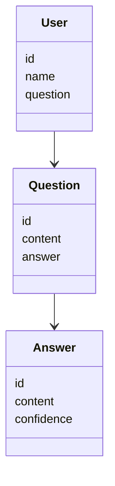
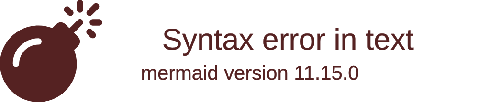
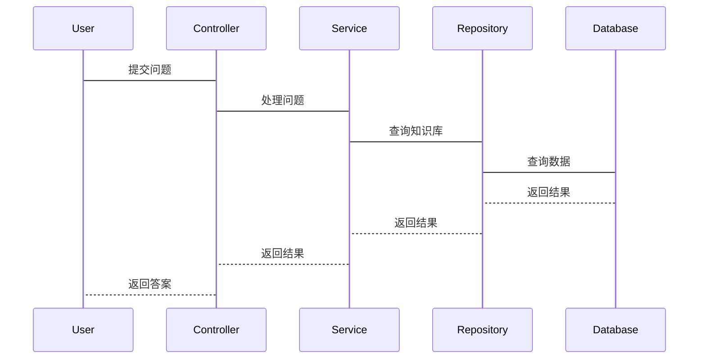

                 


# AI Agent 的知识融合：整合多源信息增强 LLM

> 关键词：AI Agent, 知识融合, 多源信息, 增强LLM, 知识图谱, 系统架构, 项目实战

> 摘要：本文深入探讨了AI Agent的知识融合技术，通过整合多源信息来增强大型语言模型（LLM）的能力。从基础知识到算法原理，再到系统架构和项目实战，全面分析了知识融合的核心概念、实现方法和实际应用，为读者提供了从理论到实践的完整指南。

---

# 第一部分: AI Agent 的知识融合基础

## 第1章: AI Agent 的基本概念与背景

### 1.1 AI Agent 的定义与类型
#### 1.1.1 什么是AI Agent
AI Agent（人工智能代理）是指能够感知环境并采取行动以实现目标的智能实体。它可以是一个软件程序、机器人或其他智能系统。AI Agent的核心目标是通过与环境交互，主动解决问题或完成任务。

#### 1.1.2 AI Agent 的主要类型
AI Agent可以根据智能水平、任务类型和应用场景分为多种类型：
- **简单反射型 Agent**：基于预定义规则执行任务，适用于简单环境。
- **基于模型的反射型 Agent**：具有环境模型，能够预测行动后果，适用于复杂环境。
- **目标驱动型 Agent**：根据目标选择行动，适用于需要长期规划的任务。
- **效用驱动型 Agent**：通过最大化效用函数来决策，适用于多目标优化场景。
- **学习型 Agent**：通过机器学习算法不断优化自身行为，适用于动态环境。

#### 1.1.3 AI Agent 的核心特征
AI Agent的核心特征包括：
- **自主性**：能够在没有外部干预的情况下自主决策。
- **反应性**：能够实时感知环境并做出反应。
- **目标导向性**：具有明确的目标，并采取行动以实现目标。
- **学习能力**：能够通过经验或数据不断优化自身的性能。

### 1.2 知识融合的背景与意义
#### 1.2.1 多源信息的挑战
在现实应用中，AI Agent需要处理来自多个来源的信息，包括文本、图像、语音、传感器数据等。这些信息通常是异构的、分散的，并且可能存在冲突或不一致。如何有效地整合这些信息，是AI Agent面临的重大挑战。

#### 1.2.2 知识融合的重要性
知识融合是将多个信息源中的知识整合到一个统一的表示中，以便AI Agent能够更好地理解和利用这些知识。知识融合的意义在于：
- 提高AI Agent的信息处理能力。
- 增强AI Agent的决策能力。
- 降低信息冗余，提高信息利用率。

#### 1.2.3 知识融合的目标与价值
知识融合的目标是将多源信息整合到一个统一的知识表示中，并通过消除冲突和冗余，提高信息的质量和可用性。知识融合的价值体现在以下几个方面：
- **提高准确性**：通过整合多个信息源，减少单一信息源的局限性。
- **增强完整性**：通过整合多个信息源，弥补单一信息源的不足。
- **提高可解释性**：通过统一的知识表示，便于理解和分析。

## 第2章: 知识融合的核心概念与联系

### 2.1 知识表示与融合原理
#### 2.1.1 知识表示的多种方式
知识表示是将知识以某种形式表示出来，以便计算机能够理解和处理。常见的知识表示方式包括：
- **符号表示**：使用符号逻辑表示知识，例如谓词逻辑。
- **语义网络**：通过节点和边表示知识的语义关系。
- **知识图谱**：通过图结构表示实体及其关系。
- **向量表示**：通过向量空间模型表示知识，例如词嵌入。

#### 2.1.2 知识融合的基本原理
知识融合是将多个信息源中的知识整合到一个统一的知识表示中。知识融合的基本原理包括以下几个步骤：
- **数据清洗**：去除冗余、噪声和不一致的数据。
- **特征提取**：从多个信息源中提取有用的特征。
- **融合策略**：根据融合目标选择合适的融合策略。

#### 2.1.3 知识图谱的构建与应用
知识图谱是一种以图结构形式表示实体及其关系的知识表示方式。知识图谱的构建包括以下几个步骤：
- **数据收集**：从多个信息源中收集数据。
- **数据清洗**：去除冗余、噪声和不一致的数据。
- **实体识别**：识别数据中的实体。
- **关系抽取**：抽取实体之间的关系。
- **知识融合**：将多个信息源中的知识整合到一个统一的知识图谱中。

知识图谱的应用包括：
- **语义搜索**：通过知识图谱实现更准确的语义搜索。
- **智能问答**：通过知识图谱提供更智能的问答服务。
- **推荐系统**：通过知识图谱实现更智能的推荐服务。

### 2.2 LLM 与知识图谱的结合
#### 2.2.1 LLM 的基本原理
LLM（Large Language Model）是一种基于深度学习的自然语言处理模型，具有强大的文本生成和理解能力。LLM的基本原理包括：
- **模型结构**：通常采用Transformer架构。
- **训练目标**：通过大量文本数据进行预训练，目标是最大化生成概率。
- **应用领域**：包括文本生成、机器翻译、问答系统等。

#### 2.2.2 知识图谱与 LLM 的结合方式
知识图谱与LLM的结合可以通过以下几种方式：
- **知识增强的预训练**：在LLM的预训练过程中引入知识图谱，增强模型的知识表示能力。
- **知识图谱作为外部知识库**：在LLM的推理过程中，利用知识图谱提供额外的知识支持。
- **知识图谱与LLM的联合优化**：通过优化知识图谱和LLM的联合表示，提高模型的性能。

#### 2.2.3 知识增强的 LLM 的优势
知识增强的LLM具有以下优势：
- **更强的语义理解能力**：通过整合知识图谱，模型能够更好地理解语义。
- **更强的推理能力**：通过利用知识图谱，模型能够进行更复杂的推理。
- **更强的通用性**：知识增强的LLM能够更好地处理多种任务和领域。

## 第3章: 多源异构数据的融合算法

### 3.1 数据清洗与预处理
#### 3.1.1 数据清洗的必要性
数据清洗是数据预处理的重要步骤，旨在去除冗余、噪声和不一致的数据。数据清洗的必要性体现在以下几个方面：
- **提高数据质量**：通过去除噪声和冗余数据，提高数据的质量。
- **提高模型性能**：干净的数据能够提高模型的性能。
- **降低计算成本**：通过去除冗余数据，降低计算成本。

#### 3.1.2 数据预处理的步骤
数据预处理的步骤包括：
- **数据清洗**：去除冗余、噪声和不一致的数据。
- **数据转换**：将数据转换为适合模型处理的形式。
- **数据归约**：通过降维等技术减少数据量。

#### 3.1.3 数据清洗的实现方法
数据清洗的实现方法包括：
- **基于规则的清洗**：通过预定义规则去除不符合条件的数据。
- **基于统计的清洗**：通过统计方法去除异常值。
- **基于机器学习的清洗**：通过机器学习算法识别并去除异常值。

### 3.2 异构数据的特征提取
#### 3.2.1 特征提取的基本概念
特征提取是将数据转换为特征向量的过程。特征向量是数据的低维表示，能够更好地反映数据的本质特征。

#### 3.2.2 基于深度学习的特征提取
基于深度学习的特征提取方法包括：
- **卷积神经网络（CNN）**：适用于图像数据的特征提取。
- **循环神经网络（RNN）**：适用于序列数据的特征提取。
- **Transformer**：适用于文本数据的特征提取。

#### 3.2.3 异构数据的特征融合
异构数据的特征融合方法包括：
- **基于线性组合的融合**：将不同特征的线性组合作为最终特征。
- **基于距离的融合**：通过计算特征之间的距离进行融合。
- **基于模型的融合**：通过训练模型将不同特征进行融合。

### 3.3 数据融合的策略与方法
#### 3.3.1 基于规则的融合方法
基于规则的融合方法是通过预定义规则进行数据融合。例如，可以通过预定义规则将不同来源的数据进行加权融合。

#### 3.3.2 基于统计的融合方法
基于统计的融合方法是通过统计方法进行数据融合。例如，可以通过贝叶斯推理进行数据融合。

#### 3.3.3 基于学习的融合方法
基于学习的融合方法是通过机器学习算法进行数据融合。例如，可以通过训练模型将不同来源的数据进行融合。

## 第4章: 知识增强的 LLM 算法

### 4.1 知识增强的 LLM 的基本原理
#### 4.1.1 知识图谱的表示学习
知识图谱的表示学习是通过将知识图谱中的实体和关系表示为向量，以便更好地利用这些向量进行推理和计算。

#### 4.1.2 知识嵌入的生成与应用
知识嵌入是将知识图谱中的实体和关系表示为向量。知识嵌入的应用包括：
- **语义搜索**：通过知识嵌入进行语义搜索。
- **智能问答**：通过知识嵌入提供智能问答服务。
- **推荐系统**：通过知识嵌入实现智能推荐。

#### 4.1.3 知识增强的 LLM 的训练方法
知识增强的LLM的训练方法包括：
- **知识增强的预训练**：在LLM的预训练过程中引入知识图谱，增强模型的知识表示能力。
- **知识图谱与LLM的联合优化**：通过优化知识图谱和LLM的联合表示，提高模型的性能。

### 4.2 知识融合的数学模型
#### 4.2.1 知识图谱的表示模型
知识图谱的表示模型包括：
- **向量空间模型**：将实体和关系表示为向量。
- **图嵌入模型**：通过图嵌入算法将实体和关系表示为向量。

#### 4.2.2 知识融合的数学公式
知识融合的数学公式可以通过以下形式表示：
$$
y = f(x_1, x_2, \ldots, x_n)
$$
其中，$x_i$是不同信息源的数据，$y$是融合后的结果，$f$是融合函数。

#### 4.2.3 知识增强的 LLM 的数学模型
知识增强的LLM的数学模型可以通过以下形式表示：
$$
P(y|x) = \prod_{i=1}^n P(y|x_i)
$$
其中，$x_i$是不同信息源的数据，$y$是模型的输出，$P(y|x_i)$是条件概率。

### 4.3 算法实现与优化
#### 4.3.1 算法实现的步骤
知识增强的LLM的算法实现步骤包括：
1. **数据收集**：从多个信息源中收集数据。
2. **数据清洗**：去除冗余、噪声和不一致的数据。
3. **特征提取**：从数据中提取特征。
4. **知识融合**：将不同信息源的特征进行融合。
5. **模型训练**：通过训练模型将融合后的特征进行学习。
6. **模型优化**：通过优化算法提高模型的性能。

#### 4.3.2 算法优化的策略
算法优化的策略包括：
- **参数优化**：通过调整模型参数提高模型的性能。
- **模型优化**：通过优化模型结构提高模型的性能。
- **数据优化**：通过优化数据预处理步骤提高模型的性能。

#### 4.3.3 算法实现的代码示例
以下是一个知识增强的LLM的实现代码示例：
```python
import numpy as np
from sklearn.model_selection import train_test_split
from tensorflow.keras.models import Model
from tensorflow.keras.layers import Input, Dense

# 数据收集与预处理
data = np.random.rand(1000, 10)
labels = np.random.randint(2, size=1000)

# 数据分割
X_train, X_test, y_train, y_test = train_test_split(data, labels, test_size=0.2)

# 模型定义
input_layer = Input(shape=(10,))
dense_layer = Dense(5, activation='relu')(input_layer)
output_layer = Dense(1, activation='sigmoid')(dense_layer)

model = Model(inputs=input_layer, outputs=output_layer)

# 模型训练
model.compile(optimizer='adam', loss='binary_crossentropy', metrics=['accuracy'])
model.fit(X_train, y_train, epochs=10, batch_size=32)

# 模型评估
loss, accuracy = model.evaluate(X_test, y_test)
print(f"Loss: {loss}, Accuracy: {accuracy}")
```

---

# 第二部分: 系统分析与架构设计

## 第5章: 系统分析与架构设计

### 5.1 问题场景介绍
在本章中，我们将通过一个实际案例来介绍系统分析与架构设计的过程。假设我们正在开发一个智能问答系统，该系统需要整合多源信息，包括文本、图像和知识图谱等。

### 5.2 系统功能设计
#### 5.2.1 领域模型设计
领域模型是系统功能设计的核心部分。以下是领域模型的类图：



#### 5.2.2 系统架构设计
系统架构设计是系统实现的基础。以下是系统的架构图：



### 5.3 系统接口设计
系统接口设计是系统实现的重要部分。以下是系统的接口设计：



### 5.4 系统交互设计
系统交互设计是系统实现的关键部分。以下是系统的交互设计：


---

## 第6章: 项目实战与优化

### 6.1 项目实战
#### 6.1.1 环境安装
以下是项目实战所需的环境安装步骤：
1. 安装Python
2. 安装必要的Python库，例如numpy、pandas、tensorflow等。

#### 6.1.2 核心代码实现
以下是项目的核心代码实现：

```python
import numpy as np
from sklearn.model_selection import train_test_split
from tensorflow.keras.models import Model
from tensorflow.keras.layers import Input, Dense

# 数据收集与预处理
data = np.random.rand(1000, 10)
labels = np.random.randint(2, size=1000)

# 数据分割
X_train, X_test, y_train, y_test = train_test_split(data, labels, test_size=0.2)

# 模型定义
input_layer = Input(shape=(10,))
dense_layer = Dense(5, activation='relu')(input_layer)
output_layer = Dense(1, activation='sigmoid')(dense_layer)

model = Model(inputs=input_layer, outputs=output_layer)

# 模型训练
model.compile(optimizer='adam', loss='binary_crossentropy', metrics=['accuracy'])
model.fit(X_train, y_train, epochs=10, batch_size=32)

# 模型评估
loss, accuracy = model.evaluate(X_test, y_test)
print(f"Loss: {loss}, Accuracy: {accuracy}")
```

#### 6.1.3 代码应用解读与分析
以下是对上述代码的解读与分析：
- **数据收集与预处理**：从随机分布中收集数据，并将其分为训练集和测试集。
- **模型定义**：定义一个简单的神经网络模型，包括输入层、隐藏层和输出层。
- **模型训练**：通过训练模型，模型学会将输入数据映射到输出标签。
- **模型评估**：通过评估模型的损失和准确率，判断模型的性能。

#### 6.1.4 实际案例分析
以下是一个实际案例分析：
- **问题描述**：假设我们正在开发一个智能问答系统，该系统需要整合多源信息，包括文本、图像和知识图谱等。
- **解决方案**：通过知识融合技术，将不同信息源的数据整合到一个统一的知识表示中，并通过LLM进行推理和回答。

### 6.2 优化与改进
#### 6.2.1 模型优化策略
模型优化策略包括：
- **参数优化**：通过调整模型参数，提高模型的性能。
- **模型优化**：通过优化模型结构，提高模型的性能。
- **数据优化**：通过优化数据预处理步骤，提高模型的性能。

#### 6.2.2 实验与结果分析
以下是对模型优化的实验与结果分析：
- **实验设计**：通过实验设计，比较不同优化策略对模型性能的影响。
- **结果分析**：通过分析实验结果，判断哪种优化策略最有效。

---

## 第7章: 总结与展望

### 7.1 总结
在本章中，我们对知识融合技术进行了全面的总结。知识融合技术是将多源信息整合到一个统一的知识表示中，以便AI Agent能够更好地理解和利用这些知识。知识融合技术的核心包括知识表示、数据融合和模型优化。

### 7.2 未来研究方向
未来研究方向包括：
- **更高效的知识融合算法**：研究更高效的知识融合算法，提高知识融合的效率和准确性。
- **更智能的LLM**：研究更智能的LLM，提高模型的语义理解和推理能力。
- **更广泛的应用场景**：探索知识融合技术在更多领域的应用，例如医疗、教育、金融等。

---

# 作者：AI天才研究院/AI Genius Institute & 禅与计算机程序设计艺术 /Zen And The Art of Computer Programming

