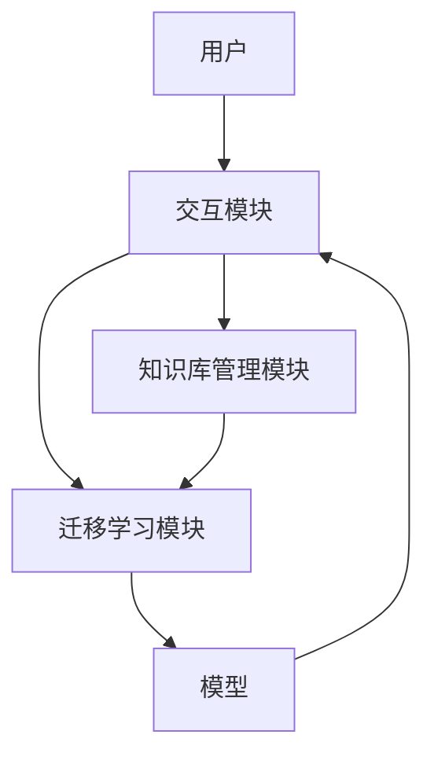

                 


# AI Agent 的知识迁移：跨领域应用 LLM 的能力

---

## 关键词：
AI Agent, 知识迁移, 大语言模型, 跨领域应用, LLM能力, 迁移学习, 人工智能

---

## 摘要：
AI Agent 的知识迁移能力是实现跨领域应用的关键技术，尤其是在大语言模型（LLM）的支持下，AI Agent能够快速适应不同领域的知识和任务。本文从AI Agent 的基本概念出发，深入探讨知识迁移的核心原理、算法实现、系统架构设计以及实际应用场景，通过具体的案例分析和代码实现，展示如何在跨领域中应用 LLM 的能力。文章最后总结了最佳实践和未来发展方向，为读者提供全面的理论和实践指导。

---

## 第一部分：AI Agent 的知识迁移背景与基础

### 第1章：AI Agent 的基本概念与知识迁移的必要性

#### 1.1 AI Agent 的定义与核心能力
AI Agent（人工智能代理）是一种能够感知环境、自主决策并执行任务的智能体。它具备以下核心能力：
- **感知能力**：通过传感器或其他输入方式获取环境信息。
- **推理能力**：基于获取的信息进行逻辑推理和决策。
- **学习能力**：通过经验或数据不断优化自身的知识库和行为策略。
- **交互能力**：与人类或其他系统进行自然语言或特定协议的交互。

#### 1.2 大语言模型（LLM）的基本原理
大语言模型（Large Language Model，LLM）是一种基于深度学习的自然语言处理模型，如GPT系列、BERT系列等。其基本原理包括：
- **预训练**：通过大量通用领域的文本数据进行无监督学习，掌握语言的语义和结构。
- **微调**：在特定领域或任务上进行有监督学习，优化模型在目标领域的表现。
- **推理**：通过生成式或检索式的方式，回答问题或完成任务。

#### 1.3 知识迁移的背景与应用场景
知识迁移是指将某个领域的知识或技能应用到另一个领域的过程。在AI Agent中，知识迁移的背景和应用场景包括：
- **跨领域任务处理**：AI Agent需要在不同领域（如医疗、教育、金融）之间切换任务时，快速适应新的知识。
- **数据稀缺性**：在某些领域中，数据量有限，通过知识迁移可以利用其他领域的数据进行补充。
- **实时适应性**：AI Agent需要在动态变化的环境中，快速调整自身的知识库以应对新的挑战。

---

## 第二部分：AI Agent 知识迁移的核心概念与联系

### 第2章：知识迁移的核心概念与原理

#### 2.1 知识迁移的定义与分类
知识迁移是指将一个领域的知识、经验或技能应用到另一个领域的过程。根据迁移的方向和深度，知识迁移可以分为以下几种类型：
- **正向迁移**：从一个简单领域迁移到复杂领域。
- **逆向迁移**：从复杂领域迁移到简单领域。
- **跨领域迁移**：在完全不同的领域之间进行知识迁移。

#### 2.2 知识迁移与 AI Agent 的关系
AI Agent 的知识迁移能力是其在不同领域中高效完成任务的关键。以下是知识迁移与 AI Agent 的关系：
- **知识表示**：AI Agent 需要将不同领域的知识进行统一表示，以便于迁移。
- **推理与决策**：通过知识迁移，AI Agent 可以在新的领域中快速推理并做出决策。
- **自适应学习**：AI Agent 可以通过知识迁移不断优化自身的模型和策略。

#### 2.3 知识迁移的核心要素
知识迁移的核心要素包括：
- **源领域与目标领域**：源领域是知识迁移的来源，目标领域是知识迁移的目标。
- **知识表示方式**：知识可以通过符号、概率或神经网络等方式表示。
- **迁移策略**：包括特征对齐、参数调整等方法。

#### 2.4 知识迁移与 LLM 的结合
大语言模型（LLM）具备强大的语义理解和生成能力，使其成为实现知识迁移的理想工具。以下是知识迁移与 LLM 的结合方式：
- **多领域微调**：对 LLM 在不同领域上进行微调，使其适应特定任务。
- **跨领域生成**：通过 LLM 的生成能力，实现跨领域的知识表达和应用。

---

## 第三部分：AI Agent 知识迁移的算法原理讲解

### 第3章：知识迁移的算法原理

#### 3.1 迁移学习的定义与核心算法
迁移学习是一种机器学习技术，旨在将从一个领域学到的知识应用到另一个领域。核心算法包括：
- **特征对齐**：通过数据预处理，使源领域和目标领域的特征具有相似性。
- **参数迁移**：将源领域的模型参数迁移到目标领域，并进行微调。

#### 3.2 知识迁移的数学模型与公式
以下是知识迁移的数学模型示例：

假设我们有一个源领域数据集 $D_s = \{(x_s^{(i)}, y_s^{(i)})\}_{i=1}^{n_s}$ 和一个目标领域数据集 $D_t = \{(x_t^{(j)}, y_t^{(j)})\}_{j=1}^{n_t}$。我们的目标是通过迁移学习，使模型在目标领域上表现更好。

$$
\text{迁移学习} = \arg\min_{\theta} \sum_{j=1}^{n_t} \mathcal{L}(f_\theta(x_t^{(j)}, y_t^{(j)})) + \lambda \cdot \text{dis}(f_\theta(x_s^{(i)}), f_\theta(x_t^{(j)}))
$$

其中，$\mathcal{L}$ 是损失函数，$\text{dis}$ 是衡量源领域和目标领域特征相似性的距离函数，$\lambda$ 是调节参数。

---

## 第四部分：AI Agent 知识迁移的系统分析与架构设计

### 第4章：系统架构设计

#### 4.1 系统功能模块设计
系统功能模块包括：
- **知识库管理模块**：负责管理不同领域的知识库。
- **迁移学习模块**：实现知识迁移的核心算法。
- **交互模块**：与用户或其他系统进行交互。

#### 4.2 系统架构图
以下是系统的架构图：



---

## 第五部分：AI Agent 知识迁移的项目实战

### 第5章：项目实战

#### 5.1 环境安装与配置
需要安装以下工具和库：
- Python 3.8+
- PyTorch 或 TensorFlow
- Hugging Face Transformers

#### 5.2 核心代码实现
以下是实现知识迁移的核心代码示例：

```python
from transformers import AutoModelForMaskedLM, AutoTokenizer
import torch

# 加载预训练模型
model = AutoModelForMaskedLM.from_pretrained('bert-base-uncased')
tokenizer = AutoTokenizer.from_pretrained('bert-base-uncased')

# 定义迁移学习函数
def transfer_learning(source_dataset, target_dataset):
    # 对目标数据集进行微调
    model.train()
    optimizer = torch.optim.Adam(model.parameters(), lr=1e-5)
    
    for batch in target_dataset:
        inputs, labels = batch
        outputs = model(inputs)
        loss = outputs.loss
        loss.backward()
        optimizer.step()
        
    return model

# 应用知识迁移
trained_model = transfer_learning(source_dataset, target_dataset)
```

#### 5.3 实际案例分析
以医疗领域的疾病诊断为例，AI Agent 可以通过知识迁移，将医学知识应用到疾病诊断中。

---

## 第六部分：总结与展望

### 第6章：总结与展望

#### 6.1 最佳实践 tips
- **数据预处理**：确保源领域和目标领域的数据质量。
- **模型选择**：根据任务需求选择合适的模型和算法。
- **持续优化**：定期更新知识库和模型参数。

#### 6.2 小结
知识迁移是 AI Agent 跨领域应用的核心技术，通过大语言模型（LLM）的支持，AI Agent 可以实现高效的知识迁移和任务处理。

#### 6.3 注意事项
- 确保数据隐私和安全。
- 定期监控模型性能。
- 及时更新知识库。

#### 6.4 拓展阅读
- 研究最新的迁移学习算法。
- 探索多模态知识迁移的可能。

---

## 作者：AI天才研究院 & 禅与计算机程序设计艺术

---

**本文内容仅为个人观点，不代表任何机构或组织的立场。**

