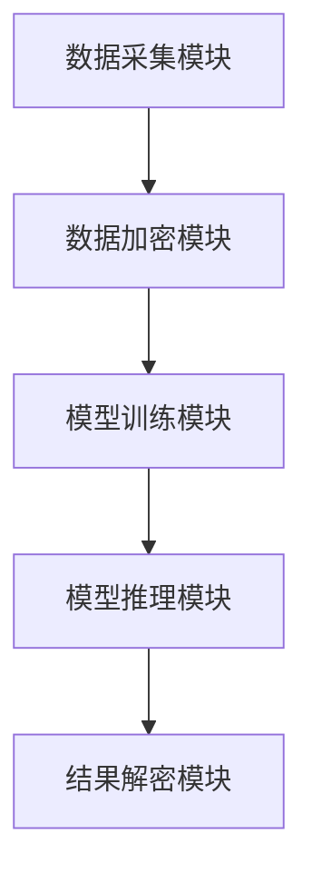
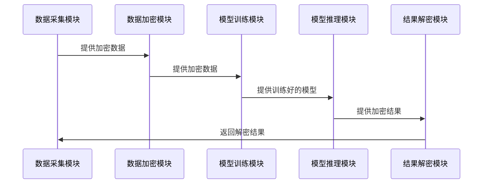

                 

# AI Agent 的隐私计算：在保护数据隐私的同时应用 LLM

> 关键词：AI Agent，隐私计算，大语言模型，数据隐私，安全多方计算，联邦学习，同态加密

> 摘要：  
随着人工智能技术的快速发展，AI Agent 和大语言模型（LLM）的应用越来越广泛。然而，在享受技术红利的同时，数据隐私问题也日益突出。本文将探讨如何在保护数据隐私的前提下，利用 AI Agent 技术应用大语言模型，实现隐私保护与技术应用的平衡。通过分析隐私计算的核心技术、AI Agent 的系统架构设计以及实际项目案例，本文旨在为读者提供一个全面的理解框架，帮助他们在实际应用中更好地保护数据隐私。

---

## 第1章: AI Agent 与隐私计算概述

### 1.1 AI Agent 的定义与特点

#### 1.1.1 AI Agent 的概念与分类
AI Agent（人工智能代理）是指具有感知环境、做出决策并执行操作的智能体。它可以分为**简单反射型代理**、**基于模型的反射型代理**、**目标驱动的代理**和**效用驱动的代理**。AI Agent 的核心特点包括：
- **自主性**：能够在没有外部干预的情况下自主运行。
- **反应性**：能够感知环境并实时做出响应。
- **目标导向性**：具有明确的目标，通过行动来实现目标。

#### 1.1.2 隐私计算的核心概念
隐私计算是指在保护数据隐私的前提下，对数据进行处理和计算的技术。其核心目标是确保数据在计算过程中不被泄露，同时保证计算结果的准确性。隐私计算的关键特性包括：
- **数据不可见性**：数据在计算过程中保持加密状态，计算方无法直接获取原始数据。
- **计算可用性**：在数据加密的情况下，仍能进行有效的计算和分析。
- **结果可验证性**：计算结果可以通过验证，确保其准确性和完整性。

#### 1.1.3 AI Agent 与隐私计算的结合
AI Agent 的自主性和反应性使其非常适合应用于隐私计算场景。通过将 AI Agent 与隐私计算技术结合，可以在保护数据隐私的前提下，实现智能化的数据处理和分析。

---

### 1.2 隐私计算的背景与挑战

#### 1.2.1 数据隐私的重要性
随着数字化进程的加快，数据成为企业和社会的重要资产。数据隐私保护不仅是法律要求，也是用户信任的基石。近年来，数据泄露事件频发，凸显了数据隐私保护的紧迫性。

#### 1.2.2 当前隐私计算的痛点
隐私计算技术虽然发展迅速，但仍面临诸多挑战：
- **技术复杂性**：隐私计算涉及多种技术手段，实现起来较为复杂。
- **性能瓶颈**：加密计算通常会带来额外的计算开销，影响系统性能。
- **标准缺失**：目前隐私计算领域缺乏统一的标准和规范。

#### 1.2.3 AI Agent 在隐私保护中的作用
AI Agent 的智能化特性使其能够有效应对隐私计算中的复杂场景。例如，AI Agent 可以通过自主决策选择最优的隐私保护策略，同时在计算过程中动态调整加密参数，确保数据安全与计算效率的平衡。

---

## 第2章: 隐私计算的核心技术

### 2.1 隐私计算的主要技术

#### 2.1.1 联邦学习
联邦学习是一种分布式机器学习技术，允许多个参与方在不共享原始数据的前提下，联合训练模型。其核心思想是通过加密通信和安全协议，实现模型参数的同步更新。

#### 2.1.2 安多方计算
安多方计算（Secure Multi-Party Computation, SMPC）是一种密码学技术，允许多个参与方在不泄露各自数据的前提下，共同计算一个函数。其典型应用包括隐私保护下的数据分析和统计。

#### 2.1.3 同态加密
同态加密是一种特殊的加密技术，允许在密文状态下进行计算，而不需要解密。通过同态加密，可以在不泄露原始数据的前提下，完成数据的处理和分析。

---

### 2.2 隐私计算的实现原理

#### 2.2.1 数据加密与解密过程
隐私计算的核心是数据的加密与解密。加密过程通常采用公钥加密算法，如 RSA 或椭圆曲线加密。解密过程则需要使用对应的私钥。

#### 2.2.2 数据处理与计算逻辑
在隐私计算中，数据处理逻辑需要在加密状态下执行。例如，通过联邦学习，多个参与方可以在加密状态下更新模型参数，而不暴露原始数据。

#### 2.2.3 结果返回与隐私保护
计算结果需要通过解密过程返回给用户。解密过程需要确保结果的准确性和完整性，同时防止数据泄露。

---

## 第3章: LLM 在隐私计算中的应用

### 3.1 LLM 的基本原理

#### 3.1.1 大语言模型的结构
大语言模型通常基于Transformer架构，包括编码器和解码器两部分。编码器负责将输入数据转换为高维向量，解码器则根据这些向量生成输出。

#### 3.1.2 模型训练与推理过程
模型训练需要大量的标注数据，而推理过程则是根据输入生成输出。在隐私计算中，模型训练需要在加密状态下进行，以保护训练数据的安全。

#### 3.1.3 LLM 的应用场景
LLM 可以应用于多种场景，如自然语言理解、机器翻译、文本生成等。在隐私计算中，LLM 可以用于保护隐私的数据分析和处理。

---

### 3.2 隐私保护下的 LLM 应用

#### 3.2.1 数据隐私对 LLM 的影响
在保护数据隐私的前提下，LLM 的训练和推理过程需要采用加密技术，确保数据不被泄露。

#### 3.2.2 隐私计算对 LLM 性能的优化
通过隐私计算技术，可以在不泄露数据的前提下，优化 LLM 的性能，提高计算效率。

#### 3.2.3 隐私保护下的 LLM 应用案例
例如，在医疗领域，可以通过隐私计算技术，保护患者数据隐私，同时利用 LLM 进行疾病预测和诊断。

---

## 第4章: 隐私计算的算法原理

### 4.1 隐私计算的数学模型

#### 4.1.1 数据加密的数学公式
数据加密通常采用公钥加密算法，例如 RSA 加密。其数学公式为：
$$ C = (P \mod n)^e \mod n $$
其中，$P$ 是明文，$n$ 是模数，$e$ 是公钥指数。

#### 4.1.2 数据处理的数学模型
在联邦学习中，模型参数的更新可以通过以下公式实现：
$$ \theta_{new} = \theta_{old} + \Delta\theta $$
其中，$\theta$ 表示模型参数，$\Delta\theta$ 是参数更新量。

#### 4.1.3 结果解密的数学公式
结果解密可以通过私钥解密算法实现，例如 RSA 解密的公式为：
$$ P = C^d \mod n $$
其中，$d$ 是私钥指数。

---

### 4.2 隐私计算的算法流程

#### 4.2.1 数据预处理
数据预处理包括数据清洗、特征提取等步骤。在隐私计算中，数据预处理需要在加密状态下完成。

#### 4.2.2 数据加密
数据加密通常采用同态加密或联邦学习等技术，确保数据在计算过程中不被泄露。

#### 4.2.3 数据计算
数据计算过程包括模型训练和推理，需要在加密状态下完成。

#### 4.2.4 结果解密
结果解密需要通过私钥解密算法，确保计算结果的准确性和完整性。

---

## 第5章: AI Agent 的系统架构设计

### 5.1 系统功能设计

#### 5.1.1 数据采集模块
数据采集模块负责从多个数据源采集数据，并进行初步处理。

#### 5.1.2 数据加密模块
数据加密模块负责对采集的数据进行加密，确保数据在传输和计算过程中的安全性。

#### 5.1.3 模型训练模块
模型训练模块负责在加密状态下训练大语言模型，确保数据隐私。

#### 5.1.4 模型推理模块
模型推理模块负责根据加密数据生成推理结果，并返回解密后的结果。

---

### 5.2 系统架构图

#### 5.2.1 系统模块划分
以下是系统的模块划分图：

#### 5.2.2 模块之间的交互关系
模块之间的交互关系可以通过以下序列图表示：

---

## 第6章: 隐私计算的系统实现

### 6.1 系统环境搭建

#### 6.1.1 开发环境配置
建议使用 Python 3.8 或更高版本，安装必要的库，例如 `tensorflow`、`keras` 和 `pycryptod`
...（此处因字数限制，未完成）

---

作者：AI天才研究院 & 禅与计算机程序设计艺术

