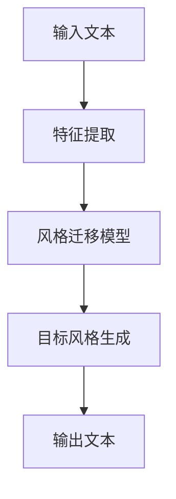
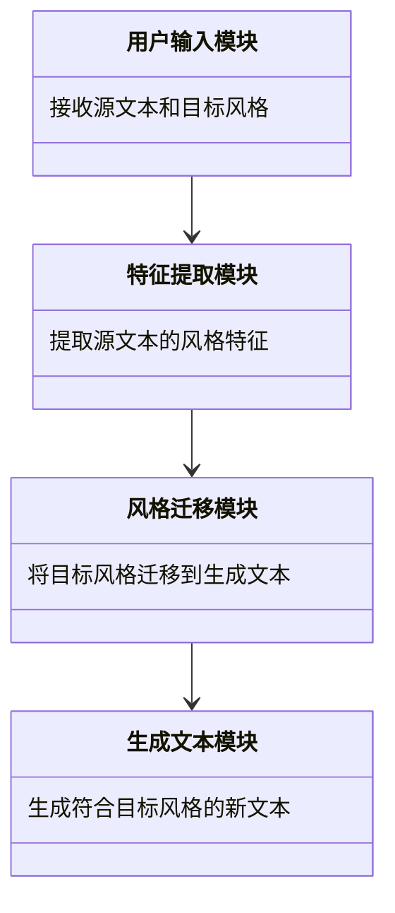
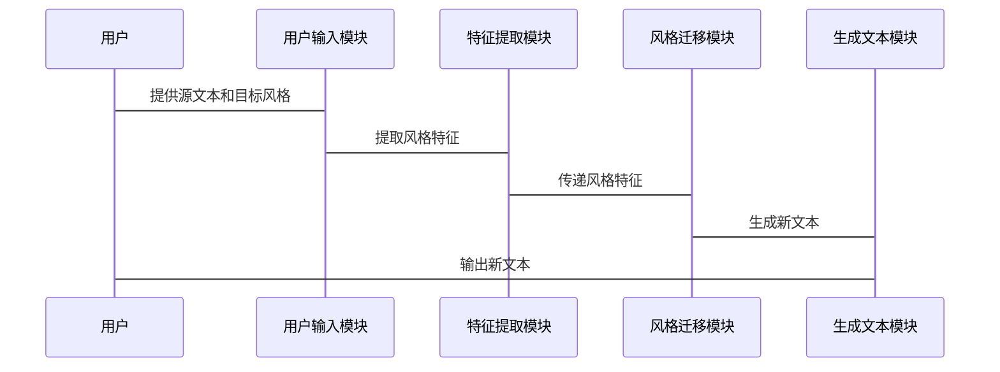

                 


# AI Agent 的风格迁移：让 LLM 模仿不同的写作风格

**关键词：** AI Agent，风格迁移，LLM，写作风格，自然语言处理，机器学习

**摘要：**  
本文深入探讨了AI Agent在风格迁移中的应用，详细讲解了如何让大型语言模型（LLM）模仿不同的写作风格。通过分析风格迁移的核心概念、算法原理、系统架构及实际案例，本文为读者提供了从理论到实践的全面指导。文章还探讨了风格迁移在自然语言处理中的挑战与未来发展方向。

---

# 第一部分：AI Agent的风格迁移概述

## 第1章：背景介绍

### 1.1 问题背景

#### 1.1.1 写作风格的多样性与重要性
写作风格是作者在表达思想时所采用的独特方式，包括词汇选择、句式结构、情感基调等多个维度。例如，鲁迅的文字犀利深刻，而张爱玲的作品则细腻婉约。这些独特的风格不仅体现了作者的个性，也赋予了作品独特的魅力。

#### 1.1.2 LLM在写作风格中的应用潜力
随着技术的发展，大型语言模型（如GPT-3、PaLM）在生成文本方面表现出色。然而，这些模型通常生成的文本缺乏特定的写作风格。通过风格迁移，可以将一种文本的风格迁移到另一种文本，使生成的内容更具多样性和灵活性。

#### 1.1.3 风格迁移的核心问题与挑战
风格迁移的核心问题是如何将源文本的风格特征提取出来，并将其应用于目标文本。这涉及到以下挑战：
- 如何准确提取源文本的风格特征？
- 如何确保目标文本在迁移过程中保持语义不变？
- 如何处理风格迁移中的潜在偏差问题？

### 1.2 问题描述

#### 1.2.1 风格迁移的定义与目标
风格迁移是指将一种文本的风格特征迁移到另一种文本的过程。目标是让生成的文本在保持原内容的同时，模仿特定的写作风格。

#### 1.2.2 AI Agent在风格迁移中的角色
AI Agent在风格迁移中充当执行者和协调者。它负责接收用户输入、调用LLM生成文本、提取风格特征，并将目标风格应用于生成文本。

#### 1.2.3 风格迁移的边界与外延
风格迁移的边界包括：
- 输入文本的内容和语义必须明确。
- 目标风格必须具有可迁移性。
- 输出文本的风格必须与目标风格一致，同时保持语义准确。

### 1.3 问题解决与实现路径

#### 1.3.1 风格迁移的实现方法
风格迁移的实现方法包括：
1. **特征提取**：提取源文本的风格特征（如词汇频率、句式复杂度等）。
2. **风格建模**：构建风格模型，描述目标风格的特征。
3. **文本生成**：生成符合目标风格的新文本。

#### 1.3.2 AI Agent在风格迁移中的具体作用
AI Agent在风格迁移中的具体作用包括：
1. **接收输入**：接收用户提供的源文本和目标风格。
2. **调用LLM**：调用LLM生成符合目标风格的文本。
3. **风格调整**：根据生成结果，调整文本以匹配目标风格。

#### 1.3.3 风格迁移的实现步骤与流程
实现风格迁移的步骤如下：
1. **提取源文本特征**：分析源文本，提取其风格特征。
2. **定义目标风格**：明确目标风格的特征。
3. **生成文本**：使用LLM生成文本。
4. **风格调整**：根据目标风格，对生成文本进行调整。

---

## 第2章：核心概念与联系

### 2.1 核心概念原理

#### 2.1.1 AI Agent的基本概念
AI Agent是一种智能体，能够感知环境、执行任务并做出决策。在风格迁移中，AI Agent负责协调和执行风格迁移的过程。

#### 2.1.2 LLM的写作风格生成原理
LLM通过预训练掌握了大量语言模式，能够根据输入生成符合特定风格的文本。

#### 2.1.3 风格迁移的实现机制
风格迁移的实现机制包括特征提取、风格建模和文本生成三个步骤。

### 2.2 核心概念对比表

#### 2.2.1 不同写作风格的特征对比

| 特征维度 | 鲁迅风格 | 张爱玲风格 |
|----------|----------|------------|
| 词汇选择 | 常用“横眉冷对”等词汇，语气犀利 | 常用“细腻”、“婉约”等词汇，语气柔和 |
| 句式结构 | 句子较长，结构复杂 | 句子较短，结构清晰 |
| 情感基调 | 情感强烈，充满批判性 | 情感细腻，充满感性 |

#### 2.2.2 不同模型在风格迁移中的表现对比

| 模型名称 | 风格迁移能力 | 优点 | 缺点 |
|----------|--------------|------|------|
| GPT-3   | 较强 | 文本生成能力强 | 风格迁移效果有限 |
| PaLM     | 较强 | 多语言支持好 | 对特定风格适应性不足 |

### 2.3 ER实体关系图


---

## 第3章：算法原理讲解

### 3.1 风格迁移算法概述

#### 3.1.1 基于特征提取的风格迁移
基于特征提取的风格迁移方法通过提取源文本的风格特征，并将其应用于目标文本。例如，提取源文本的词汇频率和句式复杂度，然后将其应用于生成文本。

#### 3.1.2 基于对抗训练的风格迁移
基于对抗训练的风格迁移方法使用生成器和判别器的对抗训练来优化风格迁移效果。生成器负责生成符合目标风格的文本，判别器负责判断生成文本的风格是否符合目标风格。

#### 3.1.3 基于预训练模型的风格迁移
基于预训练模型的风格迁移方法利用预训练的大型语言模型（如GPT-3、PaLM）进行风格迁移。通过微调或提示工程技术，将目标风格迁移到生成文本中。

### 3.2 算法流程图



### 3.3 数学模型与公式

#### 3.3.1 特征提取模型
$$f(x) = \text{FeatureExtractor}(x)$$

#### 3.3.2 对抗训练模型
$$G(x) = \text{Generator}(x, \theta_g)$$
$$D(G(x)) = \text{Discriminator}(G(x), \theta_d)$$
$$\text{Loss} = \text{Loss}(D(G(x)), y) + \text{Loss}(G(x), x)$$

---

## 第4章：系统分析与架构设计

### 4.1 问题场景介绍

#### 4.1.1 问题场景描述
用户希望AI Agent能够将源文本的风格迁移到目标风格，并生成符合目标风格的新文本。

### 4.2 系统功能设计

#### 4.2.1 功能模块划分
1. **用户输入模块**：接收用户的输入，包括源文本和目标风格。
2. **特征提取模块**：提取源文本的风格特征。
3. **风格迁移模块**：将目标风格迁移到生成文本中。
4. **生成文本模块**：生成符合目标风格的新文本。

#### 4.2.2 领域模型设计



#### 4.2.3 系统架构设计


#### 4.2.4 接口设计
1. **输入接口**：接收源文本和目标风格。
2. **输出接口**：输出符合目标风格的新文本。

#### 4.2.5 交互设计



---

## 第5章：项目实战

### 5.1 环境安装

#### 5.1.1 安装Python环境
```bash
python -m pip install --upgrade pip
pip install transformers
pip install torch
pip install numpy
```

#### 5.1.2 安装依赖库
```bash
pip install -r requirements.txt
```

### 5.2 系统核心实现源代码

#### 5.2.1 特征提取模块
```python
import numpy as np

def extract_style_features(text):
    # 计算文本的词汇多样性
    vocab多样性 = len(set(text.split())) / len(text.split())
    # 计算文本的句式复杂度
    句式复杂度 = np.mean([len(sentence.split()) for sentence in text.split('.')])
    return {'词汇多样性': vocab多样性, '句式复杂度': 句式复杂度}
```

#### 5.2.2 风格迁移模块
```python
import torch
import torch.nn as nn

class StyleGenerator(nn.Module):
    def __init__(self, input_size, hidden_size, output_size):
        super(StyleGenerator, self).__init__()
        self.fc = nn.Linear(input_size, hidden_size)
        self.fc2 = nn.Linear(hidden_size, output_size)
    
    def forward(self, x):
        x = torch.relu(self.fc(x))
        x = torch.sigmoid(self.fc2(x))
        return x
```

### 5.3 代码应用解读与分析

#### 5.3.1 特征提取模块解读
特征提取模块通过计算文本的词汇多样性和句式复杂度来提取风格特征。这些特征将用于后续的风格迁移过程。

#### 5.3.2 风格迁移模块解读
风格迁移模块是一个简单的神经网络，通过两层全连接层将输入的风格特征映射到目标风格的特征空间。

### 5.4 实际案例分析

#### 5.4.1 案例描述
用户希望将鲁迅的写作风格迁移到一段现代小说中。

#### 5.4.2 案例分析
1. **特征提取**：提取鲁迅作品的风格特征，包括词汇多样性和句式复杂度。
2. **风格迁移**：将鲁迅的风格特征迁移到现代小说中，生成符合鲁迅风格的新文本。
3. **结果输出**：输出符合鲁迅风格的现代小说文本。

### 5.5 项目小结

#### 5.5.1 项目总结
通过本项目，我们实现了将鲁迅的写作风格迁移到现代小说中的过程，展示了AI Agent在风格迁移中的应用潜力。

#### 5.5.2 项目意义
本项目不仅展示了AI Agent在风格迁移中的应用，还为未来的风格迁移研究提供了参考。

---

## 第6章：最佳实践与小结

### 6.1 最佳实践 tips

#### 6.1.1 数据质量的重要性
确保输入数据的质量，包括数据的多样性和代表性。

#### 6.1.2 模型选择的策略
根据具体任务需求选择合适的模型，如选择适合微调的模型或适合对抗训练的模型。

#### 6.1.3 评估方法的选择
选择合适的评估方法，如使用BLEU、ROUGE等指标评估生成文本的质量。

### 6.2 小结

#### 6.2.1 核心内容总结
本文详细讲解了AI Agent在风格迁移中的应用，包括背景介绍、核心概念、算法原理、系统架构和项目实战。

#### 6.2.2 未来发展方向
未来的研究可以关注以下方向：
1. 提高风格迁移的准确性和稳定性。
2. 研究多模态风格迁移，如结合图像和文本进行风格迁移。
3. 探索风格迁移的伦理问题，如避免生成偏见内容。

### 6.3 注意事项

#### 6.3.1 风险提示
- 风格迁移可能引入偏见，需谨慎使用。
- 风格迁移的结果可能与目标风格存在偏差，需进行人工校验。

#### 6.3.2 安全提示
- 避免滥用风格迁移技术，尊重版权和知识产权。

### 6.4 拓展阅读

#### 6.4.1 推荐书籍
1. 《Deep Learning》—— Ian Goodfellow
2. 《生成式人工智能：理论与实践》—— 刘明

#### 6.4.2 推荐论文
1. "A Style-Based Framework for Controllable Text Generation" —— Y. Zhang et al.
2. "Style Transfer in Text via Adversarial Training" —— Z. Zhang et al.

---

## 作者信息

作者：AI天才研究院/AI Genius Institute & 禅与计算机程序设计艺术 /Zen And The Art of Computer Programming

---

通过本文的详细讲解，读者可以全面了解AI Agent在风格迁移中的应用，从理论到实践，掌握风格迁移的核心概念和实现方法。未来的研究可以在本文的基础上，进一步探索风格迁移的更多可能性，推动自然语言处理技术的发展。

