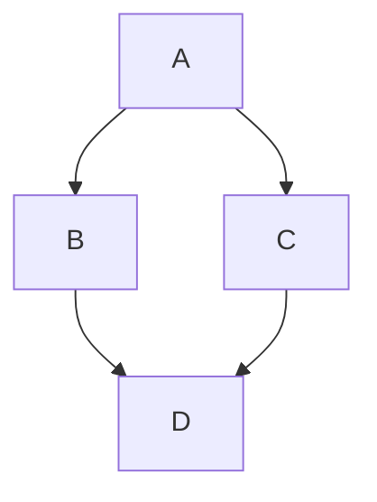
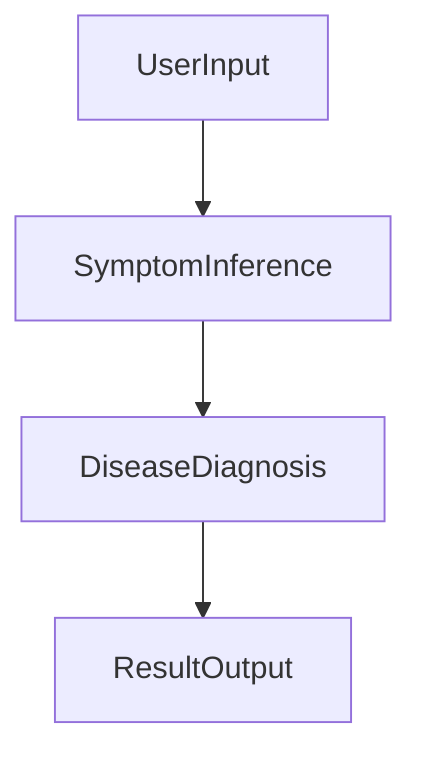
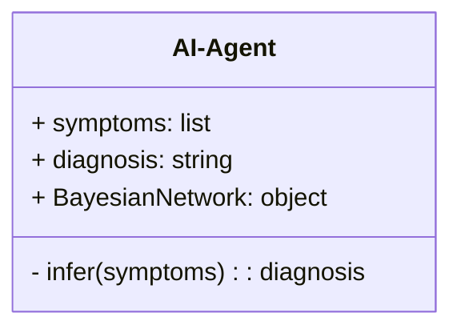
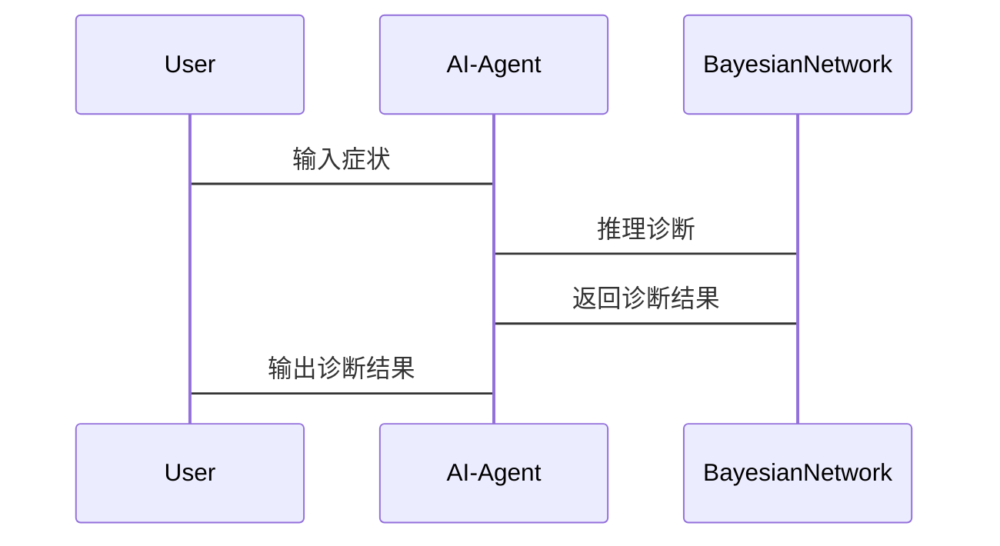

                 


# AI Agent中的不确定性推理与决策

> 关键词：AI Agent，不确定性推理，决策过程，贝叶斯网络，马尔可夫决策过程，模糊逻辑，证据推理

> 摘要：本文系统地探讨了AI Agent中的不确定性推理与决策问题，从基础理论到高级算法，结合实际案例，全面分析了不确定性推理的核心方法及其在AI Agent中的应用。文章内容涵盖概率论、贝叶斯网络、期望效用理论、马尔可夫决策过程、模糊逻辑与证据推理等核心概念，并通过具体项目实战展示了如何将理论应用于实际场景。

---

# 第1章: AI Agent概述

## 1.1 AI Agent的基本概念

AI Agent（智能体）是指能够感知环境、自主决策并采取行动的实体。它具备以下特点：
- **自主性**：能够自主决策，无需外部干预。
- **反应性**：能够感知环境并实时响应。
- **目标导向性**：具备明确的目标，行为以目标为导向。
- **社会性**：能够与其他Agent或人类交互协作。

AI Agent的应用场景广泛，包括自动驾驶、智能助手、机器人控制、金融交易等。

### 不确定性问题的背景

在现实世界中，AI Agent面临的环境通常是动态的、复杂的，并且信息不完全。不确定性是AI Agent必须处理的核心问题之一。例如：
- **信息不完全**：AI Agent无法获得关于环境的全部信息。
- **环境动态**：环境状态可能随时变化。
- **行动结果不确定**：AI Agent的行动可能导致多种结果。

### 不确定性推理的意义

不确定性推理是AI Agent的核心能力之一，它使AI Agent能够在不确定的环境中做出合理的决策。通过不确定性推理，AI Agent可以：
- **降低风险**：在决策过程中考虑多种可能性，减少错误决策的风险。
- **提高适应性**：在动态环境中快速调整策略。
- **增强鲁棒性**：在信息不完全的情况下依然能够稳定运行。

---

## 1.2 不确定性推理的背景与问题

### 不确定性推理的定义与分类

不确定性推理是指在信息不完全或不精确的情况下，通过已知信息推导未知信息的过程。根据推理方法的不同，不确定性推理可以分为以下几类：
1. **概率推理**：基于概率论的方法，如贝叶斯网络。
2. **模糊推理**：基于模糊逻辑的方法，适用于处理模糊性问题。
3. **证据推理**：基于证据理论的方法，如Dempster-Shafer理论。

### 不确定性推理的挑战

不确定性推理面临以下挑战：
- **信息不完备**：如何在信息不全的情况下进行推理？
- **计算复杂性**：不确定性推理通常涉及复杂的计算，如何优化计算效率？
- **模型选择**：如何选择适合特定问题的推理模型？

### 不确定性推理的意义

不确定性推理是AI Agent的核心能力之一，它使AI Agent能够在不确定的环境中做出合理的决策。通过不确定性推理，AI Agent可以：
- **降低风险**：在决策过程中考虑多种可能性，减少错误决策的风险。
- **提高适应性**：在动态环境中快速调整策略。
- **增强鲁棒性**：在信息不完全的情况下依然能够稳定运行。

---

## 1.3 本章小结

本章介绍了AI Agent的基本概念和不确定性推理的重要性和分类。AI Agent需要在动态、复杂的环境中进行推理和决策，不确定性推理是其实现这一目标的核心能力。接下来的章节将详细探讨不确定性推理的具体方法和应用。

---

# 第2章: 不确定性推理的基础

## 2.1 概率论基础

### 2.1.1 概率的基本概念

概率论是不确定性推理的基础之一。概率用于描述事件发生的可能性。概率的基本概念包括：
- **样本空间**：所有可能结果的集合。
- **事件**：样本空间中的一个子集。
- **概率分布**：事件发生的概率。

### 2.1.2 贝叶斯定理与全概率公式

贝叶斯定理用于计算在已知某些条件下，事件发生的概率。公式如下：

$$ P(A|B) = \frac{P(B|A)P(A)}{P(B)} $$

其中：
- $P(A|B)$：在事件B发生的条件下，事件A发生的概率。
- $P(B|A)$：在事件A发生的条件下，事件B发生的概率。
- $P(A)$：事件A发生的先验概率。
- $P(B)$：事件B发生的先验概率。

### 2.1.3 概率分布与随机变量

概率分布描述了随机变量取各个值的概率。常见的概率分布包括：
- **二项分布**：适用于仅有两种可能结果的试验。
- **正态分布**：适用于连续型随机变量，符合钟形曲线。

---

## 2.2 逻辑推理基础

### 2.2.1 命题逻辑与谓词逻辑

命题逻辑是基于命题的逻辑系统，每个命题可以取真或假的值。谓词逻辑则引入了谓词和量词，能够描述更复杂的逻辑关系。

### 2.2.2 不确定性逻辑的扩展

为了处理不确定性，逻辑推理需要扩展。例如：
- **模糊逻辑**：允许命题的真值在0到1之间。
- **概率逻辑**：将概率与逻辑推理结合。

### 2.2.3 逻辑推理与概率推理的结合

逻辑推理和概率推理可以结合使用。例如，可以通过概率逻辑将概率论与逻辑推理结合，形成一种新的推理方法。

---

## 2.3 不确定性度量方法

### 2.3.1 概率度量

概率度量是最常用的不确定性度量方法之一。它通过概率值描述事件发生的可能性。

### 2.3.2 熵与信息论度量

熵是信息论中的一个重要概念，用于描述数据的不确定性。熵的公式为：

$$ H(X) = -\sum_{i=1}^{n} P(x_i) \log P(x_i) $$

其中：
- $H(X)$：随机变量X的熵。
- $P(x_i)$：事件$x_i$发生的概率。

### 2.3.3 模糊度与可信度度量

模糊度和可信度是处理模糊性和不确定性的另一种方法。模糊度用于描述模糊集合的隶属程度，可信度用于描述证据的可靠性。

---

## 2.4 本章小结

本章介绍了不确定性推理的基础，包括概率论、逻辑推理和不确定性度量方法。这些基础理论为后续章节的不确定性推理方法提供了理论支持。接下来的章节将深入探讨具体的不确定性推理方法及其应用。

---

# 第3章: 贝叶斯网络与不确定性推理

## 3.1 贝叶斯网络的基本原理

### 3.1.1 贝叶斯网络的定义与结构

贝叶斯网络是一种有向无环图（DAG），节点表示随机变量，边表示变量之间的依赖关系。例如：



### 3.1.2 贝叶斯网络的构建方法

构建贝叶斯网络的步骤包括：
1. 确定变量。
2. 确定变量之间的依赖关系。
3. 确定每个节点的概率分布。

### 3.1.3 贝叶斯网络的推理算法

贝叶斯网络的推理算法包括：
- **前向推理**：从已知变量推导未知变量。
- **反向推理**：从观测数据推导隐含变量。

---

## 3.2 贝叶斯网络的应用案例

### 3.2.1 医疗诊断中的贝叶斯网络

例如，诊断疾病时，贝叶斯网络可以用于根据症状推导疾病的可能性。

### 3.2.2 贝叶斯网络在金融风险评估中的应用

贝叶斯网络可以用于评估金融投资的风险。

### 3.2.3 贝叶斯网络在自然语言处理中的应用

贝叶斯网络可以用于垃圾邮件分类。

---

## 3.3 本章小结

本章介绍了贝叶斯网络的基本原理及其应用。贝叶斯网络是一种强大的不确定性推理工具，广泛应用于多个领域。接下来的章节将探讨AI Agent中的决策过程。

---

# 第4章: AI Agent中的决策过程

## 4.1 决策的基本概念

### 4.1.1 决策的定义与分类

决策是指在多种选择中做出选择的过程。决策可以分为：
- **确定性决策**：已知所有可能的结果。
- **不确定性决策**：结果不确定。

### 4.1.2 决策过程的步骤与特点

决策过程包括：
1. 确定决策目标。
2. 收集相关信息。
3. 分析备选方案。
4. 选择最优方案。
5. 实施并监控结果。

### 4.1.3 不确定性决策的定义与特点

不确定性决策是指在结果不确定的情况下进行决策。

---

## 4.2 期望效用理论

### 4.2.1 期望效用理论的基本原理

期望效用理论是一种常用的决策方法，公式为：

$$ \text{期望效用} = \sum P(a) U(a) $$

其中：
- $P(a)$：行动$a$的概率。
- $U(a)$：行动$a$的效用。

### 4.2.2 期望效用函数的构建方法

构建期望效用函数需要确定每个行动的效用和概率。

### 4.2.3 期望效用理论的应用案例

例如，在金融投资中，期望效用理论可以用于评估不同投资方案的预期收益。

---

## 4.3 马尔可夫决策过程

### 4.3.1 马尔可夫决策过程的定义与特点

马尔可夫决策过程（MDP）是一种用于描述不确定性决策过程的数学模型。它包括：
- **状态**：环境的状态。
- **动作**：AI Agent可以执行的动作。
- **转移概率**：动作导致状态转移的概率。
- **奖励**：执行动作后获得的奖励。

### 4.3.2 马尔可夫决策过程的数学模型

MDP的数学模型包括状态空间、动作空间、转移模型和奖励函数。

### 4.3.3 马尔可夫决策过程的应用案例

例如，在自动驾驶中，AI Agent可以根据当前状态和环境信息，选择最优的驾驶动作。

---

## 4.4 本章小结

本章介绍了AI Agent中的决策过程，包括期望效用理论和马尔可夫决策过程。这些方法为AI Agent在不确定环境中的决策提供了理论支持。接下来的章节将探讨高级不确定性推理方法。

---

# 第5章: 高级不确定性推理方法

## 5.1 模糊逻辑与不确定性推理

### 5.1.1 模糊逻辑的基本概念

模糊逻辑允许命题的真值在0到1之间，适用于处理模糊性问题。

### 5.1.2 模糊推理的原理与方法

模糊推理的原理是将模糊规则应用于模糊集合，以推导新的模糊集合。

### 5.1.3 模糊逻辑在不确定性推理中的应用

例如，在语言理解中，模糊逻辑可以用于处理自然语言的模糊性。

---

## 5.2 证据推理与 Dempster-Shafer 理论

### 5.2.1 证据推理的定义与特点

证据推理是一种基于证据理论的不确定性推理方法。

### 5.2.2 Dempster-Shafer 理论的基本原理

Dempster-Shafer理论通过基本概率分配描述证据的不确定性。

### 5.2.3 证据推理的应用案例

例如，在安全监控中，证据推理可以用于整合多个传感器的观测结果。

---

## 5.3 本章小结

本章介绍了高级不确定性推理方法，包括模糊逻辑和证据推理。这些方法为处理复杂不确定性问题提供了更强大的工具。接下来的章节将探讨AI Agent的系统设计与实战。

---

# 第6章: AI Agent的系统设计与实战

## 6.1 项目介绍

### 6.1.1 项目背景

本项目旨在开发一个基于贝叶斯网络的医疗诊断AI Agent。

### 6.1.2 项目目标

实现一个能够根据症状诊断疾病的AI Agent。

---

## 6.2 系统功能设计

### 6.2.1 系统功能模块

系统功能模块包括：
1. 用户输入模块。
2. 症状推理模块。
3. 疾病诊断模块。
4. 结果输出模块。

### 6.2.2 系统功能流程图



---

## 6.3 系统架构设计

### 6.3.1 系统架构图



---

## 6.4 系统接口设计

### 6.4.1 系统接口描述

AI Agent需要与用户交互，获取症状信息，并输出诊断结果。

### 6.4.2 接口交互序列图



---

## 6.5 项目实战

### 6.5.1 环境安装

需要安装以下工具：
- Python 3.x
- 贝叶斯网络库（如 `networkx`）

### 6.5.2 核心实现代码

```python
import networkx as nx

class BayesianNetwork:
    def __init__(self, nodes, edges):
        self.graph = nx.DiGraph()
        self.graph.add_nodes_from(nodes)
        self.graph.add_edges_from(edges)

    def infer(self, evidence):
        # 简单的推理实现，仅用于示例
        pass

# 示例用法
nodes = [' Fever', 'Cough', 'SoreThroat']
edges = [('Fever', 'SoreThroat'), ('Cough', 'Fever')]
bn = BayesianNetwork(nodes, edges)
diagnosis = bn.infer({'Fever': True, 'Cough': True})
print(diagnosis)
```

---

## 6.6 本章小结

本章通过一个实际项目展示了AI Agent的系统设计与实现过程。从项目介绍到系统架构设计，再到代码实现，详细阐述了AI Agent的开发流程。通过本章的学习，读者可以掌握AI Agent的实际开发方法。

---

# 第7章: 总结与展望

## 7.1 总结

本文系统地探讨了AI Agent中的不确定性推理与决策问题，从基础理论到高级算法，结合实际案例，全面分析了不确定性推理的核心方法及其在AI Agent中的应用。

## 7.2 展望

未来，随着AI技术的不断发展，不确定性推理与决策将在更多领域得到应用。研究方向包括：
- 更高效的不确定性推理算法。
- 更智能的AI Agent设计。
- 更广泛的应用场景探索。

---

# 作者

作者：AI天才研究院/AI Genius Institute & 禅与计算机程序设计艺术/Zen And The Art of Computer Programming

---

通过以上详细的内容框架，您可以根据需要进一步扩展每个部分的具体内容，添加更多案例、算法实现和图表说明，以完成一篇完整的技术博客文章。

